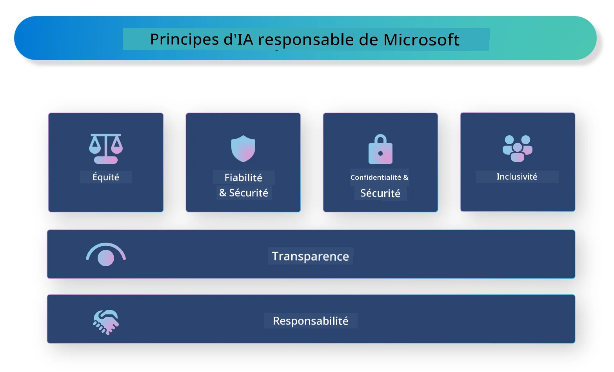

# **Introduction à l’IA Responsable**

[Microsoft Responsible AI](https://www.microsoft.com/ai/responsible-ai?WT.mc_id=aiml-138114-kinfeylo) est une initiative visant à aider les développeurs et les organisations à concevoir des systèmes d’IA transparents, fiables et responsables. Cette initiative offre des conseils et des ressources pour développer des solutions d’IA responsables, en accord avec des principes éthiques tels que la confidentialité, l’équité et la transparence. Nous aborderons également certains défis et bonnes pratiques liés à la création de systèmes d’IA responsables.

## Vue d’ensemble de Microsoft Responsible AI

**Principes éthiques**

Microsoft Responsible AI s’appuie sur un ensemble de principes éthiques, notamment la confidentialité, l’équité, la transparence, la responsabilité et la sécurité. Ces principes visent à garantir que les systèmes d’IA sont développés de manière éthique et responsable.

**IA transparente**

Microsoft Responsible AI met l’accent sur l’importance de la transparence dans les systèmes d’IA. Cela inclut la fourniture d’explications claires sur le fonctionnement des modèles d’IA, ainsi que la garantie que les sources de données et les algorithmes sont accessibles publiquement.

**IA responsable**

[Microsoft Responsible AI](https://www.microsoft.com/ai/responsible-ai?WT.mc_id=aiml-138114-kinfeylo) encourage le développement de systèmes d’IA responsables, capables de fournir des éclairages sur la manière dont les modèles prennent leurs décisions. Cela aide les utilisateurs à comprendre et à faire confiance aux résultats produits par les systèmes d’IA.

**Inclusivité**

Les systèmes d’IA doivent être conçus pour bénéficier à tous. Microsoft vise à créer une IA inclusive qui prend en compte des perspectives diverses et évite les biais ou discriminations.

**Fiabilité et sécurité**

Garantir que les systèmes d’IA sont fiables et sûrs est essentiel. Microsoft se concentre sur la création de modèles robustes, performants de manière constante et évitant les résultats nuisibles.

**Équité dans l’IA**

Microsoft Responsible AI reconnaît que les systèmes d’IA peuvent perpétuer des biais s’ils sont entraînés sur des données ou des algorithmes biaisés. L’initiative fournit des recommandations pour développer des systèmes d’IA équitables, qui ne discriminent pas en fonction de critères tels que la race, le genre ou l’âge.

**Confidentialité et sécurité**

Microsoft Responsible AI souligne l’importance de protéger la vie privée des utilisateurs et la sécurité des données dans les systèmes d’IA. Cela inclut la mise en place d’un chiffrement fort des données et de contrôles d’accès, ainsi que des audits réguliers des systèmes d’IA pour détecter les vulnérabilités.

**Responsabilité et redevabilité**

Microsoft Responsible AI promeut la responsabilité dans le développement et le déploiement de l’IA. Cela implique de s’assurer que les développeurs et les organisations sont conscients des risques potentiels liés aux systèmes d’IA et prennent des mesures pour les atténuer.

## Bonnes pratiques pour construire des systèmes d’IA responsables

**Développer des modèles d’IA avec des jeux de données diversifiés**

Pour éviter les biais dans les systèmes d’IA, il est important d’utiliser des jeux de données variés qui reflètent une diversité de perspectives et d’expériences.

**Utiliser des techniques d’IA explicable**

Les techniques d’IA explicable aident les utilisateurs à comprendre comment les modèles prennent leurs décisions, ce qui peut renforcer la confiance dans le système.

**Auditer régulièrement les systèmes d’IA pour détecter les vulnérabilités**

Des audits réguliers permettent d’identifier les risques et vulnérabilités potentiels qui doivent être corrigés.

**Mettre en place un chiffrement fort des données et des contrôles d’accès**

Le chiffrement des données et les contrôles d’accès contribuent à protéger la confidentialité et la sécurité des utilisateurs dans les systèmes d’IA.

**Respecter les principes éthiques dans le développement de l’IA**

Suivre des principes éthiques tels que l’équité, la transparence et la responsabilité aide à instaurer la confiance dans les systèmes d’IA et garantit qu’ils sont développés de manière responsable.

## Utiliser AI Foundry pour une IA Responsable

[Azure AI Foundry](https://ai.azure.com?WT.mc_id=aiml-138114-kinfeylo) est une plateforme puissante qui permet aux développeurs et aux organisations de créer rapidement des applications intelligentes, innovantes, prêtes pour le marché et responsables. Voici quelques fonctionnalités clés d’Azure AI Foundry :

**APIs et modèles prêts à l’emploi**

Azure AI Foundry propose des APIs et modèles préconstruits et personnalisables, couvrant un large éventail de tâches d’IA, notamment l’IA générative, le traitement du langage naturel pour les conversations, la recherche, la surveillance, la traduction, la reconnaissance vocale, la vision et la prise de décision.

**Prompt Flow**

Le Prompt Flow dans Azure AI Foundry permet de créer des expériences d’IA conversationnelle. Il facilite la conception et la gestion des flux conversationnels, simplifiant ainsi la création de chatbots, assistants virtuels et autres applications interactives.

**Retrieval Augmented Generation (RAG)**

RAG est une technique qui combine des approches basées sur la recherche et sur la génération. Elle améliore la qualité des réponses générées en s’appuyant à la fois sur des connaissances préexistantes (recherche) et sur la génération créative (génération).

**Évaluation et suivi des métriques pour l’IA générative**

Azure AI Foundry offre des outils pour évaluer et surveiller les modèles d’IA générative. Vous pouvez mesurer leurs performances, leur équité et d’autres indicateurs importants pour garantir un déploiement responsable. De plus, si vous avez créé un tableau de bord, vous pouvez utiliser l’interface sans code d’Azure Machine Learning Studio pour personnaliser et générer un Responsible AI Dashboard et une fiche d’évaluation associée basée sur les bibliothèques Python du [Responsible AI Toolbox](https://responsibleaitoolbox.ai/?WT.mc_id=aiml-138114-kinfeylo). Cette fiche permet de partager des informations clés sur l’équité, l’importance des caractéristiques et d’autres aspects liés au déploiement responsable avec des parties prenantes techniques et non techniques.

Pour utiliser AI Foundry dans une démarche d’IA responsable, voici quelques bonnes pratiques à suivre :

**Définir le problème et les objectifs de votre système d’IA**

Avant de commencer le développement, il est important de définir clairement le problème ou l’objectif que votre système d’IA doit résoudre. Cela vous aidera à identifier les données, algorithmes et ressources nécessaires pour construire un modèle efficace.

**Collecter et prétraiter les données pertinentes**

La qualité et la quantité des données utilisées pour entraîner un système d’IA ont un impact majeur sur ses performances. Il est donc essentiel de collecter des données pertinentes, de les nettoyer, de les prétraiter et de s’assurer qu’elles représentent bien la population ou le problème ciblé.

**Choisir une évaluation appropriée**

Il existe plusieurs algorithmes d’évaluation. Il est important de sélectionner celui qui convient le mieux à vos données et à votre problématique.

**Évaluer et interpréter le modèle**

Une fois le modèle construit, il est crucial d’évaluer ses performances avec des métriques adaptées et d’interpréter les résultats de manière transparente. Cela permet d’identifier d’éventuels biais ou limites du modèle et d’apporter les améliorations nécessaires.

**Assurer la transparence et l’explicabilité**

Les systèmes d’IA doivent être transparents et explicables afin que les utilisateurs comprennent leur fonctionnement et la manière dont les décisions sont prises. Cela est particulièrement important pour les applications ayant un impact significatif sur la vie humaine, comme la santé, la finance ou le domaine juridique.

**Surveiller et mettre à jour le modèle**

Les systèmes d’IA doivent être continuellement surveillés et mis à jour pour garantir leur précision et leur efficacité dans le temps. Cela nécessite un entretien régulier, des tests et un réentraînement du modèle.

En conclusion, Microsoft Responsible AI est une initiative qui vise à aider les développeurs et les organisations à concevoir des systèmes d’IA transparents, fiables et responsables. N’oubliez pas que la mise en œuvre d’une IA responsable est essentielle, et Azure AI Foundry facilite cette démarche pour les organisations. En suivant les principes éthiques et les bonnes pratiques, nous pouvons garantir que les systèmes d’IA sont développés et déployés de manière responsable, au bénéfice de la société dans son ensemble.

**Avertissement** :  
Ce document a été traduit à l’aide du service de traduction automatique [Co-op Translator](https://github.com/Azure/co-op-translator). Bien que nous nous efforcions d’assurer l’exactitude, veuillez noter que les traductions automatiques peuvent contenir des erreurs ou des inexactitudes. Le document original dans sa langue d’origine doit être considéré comme la source faisant foi. Pour les informations critiques, une traduction professionnelle réalisée par un humain est recommandée. Nous déclinons toute responsabilité en cas de malentendus ou de mauvaises interprétations résultant de l’utilisation de cette traduction.