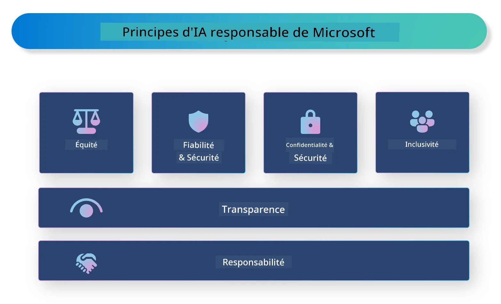

# **Introduction à l’IA responsable**

[Microsoft Responsible AI](https://www.microsoft.com/ai/responsible-ai?WT.mc_id=aiml-138114-kinfeylo) est une initiative visant à aider les développeurs et les organisations à créer des systèmes d’IA qui soient transparents, fiables et responsables. L’initiative fournit des orientations et des ressources pour développer des solutions d’IA responsables qui respectent des principes éthiques tels que la confidentialité, l’équité et la transparence. Nous explorerons également certains des défis et des bonnes pratiques associés à la création de systèmes d’IA responsables.

## Aperçu de Microsoft Responsible AI

**Principes éthiques**

Microsoft Responsible AI est guidé par un ensemble de principes éthiques, tels que la confidentialité, l’équité, la transparence, la responsabilité et la sécurité. Ces principes sont conçus pour garantir que les systèmes d’IA sont développés de manière éthique et responsable.

**IA transparente**

Microsoft Responsible AI met l’accent sur l’importance de la transparence dans les systèmes d’IA. Cela inclut fournir des explications claires sur le fonctionnement des modèles d’IA, ainsi que garantir que les sources de données et les algorithmes sont accessibles au public.

**IA responsable**

[Microsoft Responsible AI](https://www.microsoft.com/ai/responsible-ai?WT.mc_id=aiml-138114-kinfeylo) promeut le développement de systèmes d’IA responsables, capables de fournir des informations sur la manière dont les modèles d’IA prennent leurs décisions. Cela peut aider les utilisateurs à comprendre et à faire confiance aux résultats des systèmes d’IA.

**Inclusion**

Les systèmes d’IA doivent être conçus pour bénéficier à tous. Microsoft vise à créer une IA inclusive qui prend en compte des perspectives diverses et évite les biais ou discriminations.

**Fiabilité et sécurité**

Assurer que les systèmes d’IA sont fiables et sûrs est crucial. Microsoft se concentre sur la création de modèles robustes qui fonctionnent de manière constante et évitent les résultats nuisibles.

**Équité en IA**

Microsoft Responsible AI reconnaît que les systèmes d’IA peuvent perpétuer des biais s’ils sont entraînés sur des données ou des algorithmes biaisés. L’initiative fournit des orientations pour développer des systèmes d’IA équitables qui ne discriminent pas sur des critères tels que la race, le genre ou l’âge.

**Confidentialité et sécurité**

Microsoft Responsible AI souligne l’importance de protéger la confidentialité des utilisateurs et la sécurité des données dans les systèmes d’IA. Cela inclut la mise en œuvre de mesures fortes de chiffrement des données et de contrôles d’accès, ainsi que la réalisation d’audits réguliers des systèmes d’IA pour détecter les vulnérabilités.

**Responsabilité et redevabilité**

Microsoft Responsible AI encourage la responsabilité et la redevabilité dans le développement et le déploiement de l’IA. Cela inclut le fait de s’assurer que les développeurs et les organisations sont conscients des risques potentiels liés aux systèmes d’IA et prennent des mesures pour atténuer ces risques.

## Bonnes pratiques pour construire des systèmes d’IA responsables

**Développer des modèles d’IA utilisant des ensembles de données diversifiés**

Pour éviter les biais dans les systèmes d’IA, il est important d’utiliser des ensembles de données diversifiés qui représentent une large gamme de perspectives et d’expériences.

**Utiliser des techniques d’IA explicable**

Les techniques d’IA explicable peuvent aider les utilisateurs à comprendre comment les modèles d’IA prennent leurs décisions, ce qui peut renforcer la confiance dans le système.

**Auditer régulièrement les systèmes d’IA pour détecter les vulnérabilités**

Des audits réguliers des systèmes d’IA peuvent permettre d’identifier les risques et vulnérabilités potentiels qui doivent être traités.

**Mettre en œuvre un chiffrement fort des données et des contrôles d’accès**

Le chiffrement des données et les contrôles d’accès peuvent aider à protéger la confidentialité et la sécurité des utilisateurs dans les systèmes d’IA.

**Suivre les principes éthiques dans le développement de l’IA**

Respecter des principes éthiques, tels que l’équité, la transparence et la responsabilité, peut aider à instaurer la confiance dans les systèmes d’IA et garantir qu’ils sont développés de manière responsable.

## Utilisation de AI Foundry pour une IA responsable

[Microsoft Foundry](https://ai.azure.com?WT.mc_id=aiml-138114-kinfeylo) est une plateforme puissante permettant aux développeurs et aux organisations de créer rapidement des applications intelligentes, modernes, prêtes pour le marché et responsables. Voici quelques fonctionnalités clés de Microsoft Foundry :

**APIs et modèles prêts à l’emploi**

Microsoft Foundry fournit des APIs et modèles préconstruits et personnalisables. Ils couvrent un large éventail de tâches d’IA, y compris l’IA générative, le traitement du langage naturel pour les conversations, la recherche, la surveillance, la traduction, la parole, la vision et la prise de décision.

**Prompt Flow**

Le prompt flow dans Microsoft Foundry vous permet de créer des expériences d’IA conversationnelle. Il vous permet de concevoir et gérer les flux conversationnels, facilitant ainsi la création de chatbots, assistants virtuels et autres applications interactives.

**Retrieval Augmented Generation (RAG)**

RAG est une technique qui combine des approches basées sur la recherche et la génération. Elle améliore la qualité des réponses générées en s’appuyant à la fois sur des connaissances préexistantes (recherche) et sur la génération créative (génération).

**Évaluation et suivi des métriques pour l’IA générative**

Microsoft Foundry propose des outils pour évaluer et suivre les modèles d’IA générative. Vous pouvez évaluer leur performance, leur équité et d’autres métriques importantes pour garantir un déploiement responsable. De plus, si vous avez créé un tableau de bord, vous pouvez utiliser l’interface sans code dans Azure Machine Learning Studio pour personnaliser et générer un Responsible AI Dashboard ainsi qu’une fiche synthétique associée basée sur les bibliothèques Python du [Responsible AI Toolbox](https://responsibleaitoolbox.ai/?WT.mc_id=aiml-138114-kinfeylo). Cette fiche synthétique vous aide à partager des informations clés relatives à l’équité, l’importance des caractéristiques et d’autres considérations de déploiement responsable avec des parties prenantes techniques et non techniques.

Pour utiliser AI Foundry avec une IA responsable, vous pouvez suivre ces bonnes pratiques :

**Définir le problème et les objectifs de votre système IA**

Avant de commencer le processus de développement, il est important de définir clairement le problème ou l’objectif que votre système IA vise à résoudre. Cela vous aidera à identifier les données, algorithmes et ressources nécessaires pour construire un modèle efficace.

**Recueillir et prétraiter des données pertinentes**

La qualité et la quantité de données utilisées pour entraîner un système IA peuvent avoir un impact significatif sur sa performance. Il est donc important de collecter des données pertinentes, de les nettoyer, de les prétraiter et de s’assurer qu’elles représentent bien la population ou le problème que vous essayez de résoudre.

**Choisir une évaluation appropriée**

Il existe différents algorithmes d’évaluation. Il est important de choisir l’algorithme le plus approprié selon vos données et votre problème.

**Évaluer et interpréter le modèle**

Une fois que vous avez construit un modèle d’IA, il est important d’évaluer sa performance en utilisant des métriques appropriées et d’interpréter les résultats de manière transparente. Cela vous aidera à identifier les biais ou limites du modèle et à effectuer les améliorations nécessaires.

**Assurer la transparence et l’explicabilité**

Les systèmes d’IA doivent être transparents et explicables afin que les utilisateurs puissent comprendre leur fonctionnement et la manière dont les décisions sont prises. Ceci est particulièrement important pour les applications ayant un impact significatif sur la vie humaine, telles que la santé, la finance et les systèmes juridiques.

**Surveiller et mettre à jour le modèle**

Les systèmes d’IA doivent faire l’objet d’une surveillance continue et être mis à jour afin de garantir qu’ils restent précis et efficaces au fil du temps. Cela nécessite une maintenance, des tests et un réentraînement réguliers du modèle.

En conclusion, Microsoft Responsible AI est une initiative visant à aider les développeurs et les organisations à créer des systèmes d’IA transparents, fiables et responsables. Souvenez-vous que la mise en œuvre d’une IA responsable est cruciale, et Microsoft Foundry vise à la rendre pratique pour les organisations. En suivant les principes éthiques et les bonnes pratiques, nous pouvons garantir que les systèmes d’IA sont développés et déployés de manière responsable, au bénéfice de la société dans son ensemble.

---

<!-- CO-OP TRANSLATOR DISCLAIMER START -->
**Avertissement** :  
Ce document a été traduit à l'aide du service de traduction automatisée [Co-op Translator](https://github.com/Azure/co-op-translator). Bien que nous nous efforçons d'assurer l'exactitude, veuillez noter que les traductions automatiques peuvent contenir des erreurs ou des inexactitudes. Le document original dans sa langue d'origine doit être considéré comme la source faisant autorité. Pour des informations critiques, une traduction professionnelle réalisée par un humain est recommandée. Nous ne sommes pas responsables des malentendus ou des mauvaises interprétations résultant de l'utilisation de cette traduction.
<!-- CO-OP TRANSLATOR DISCLAIMER END -->