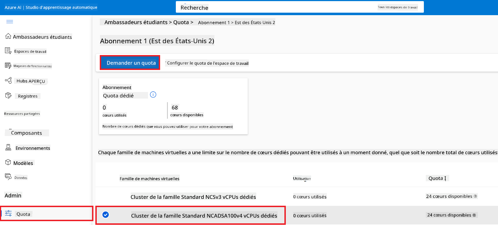
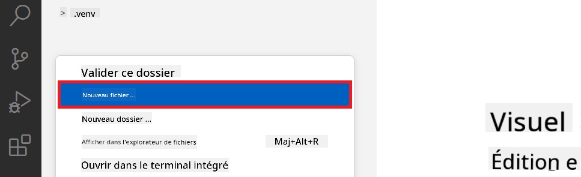
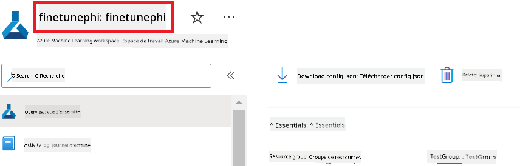
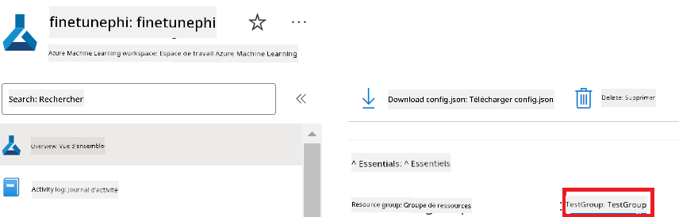
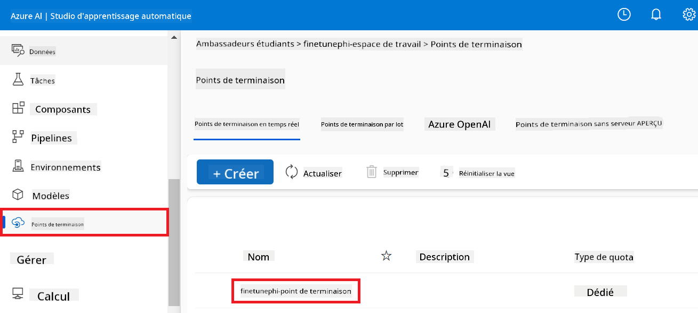
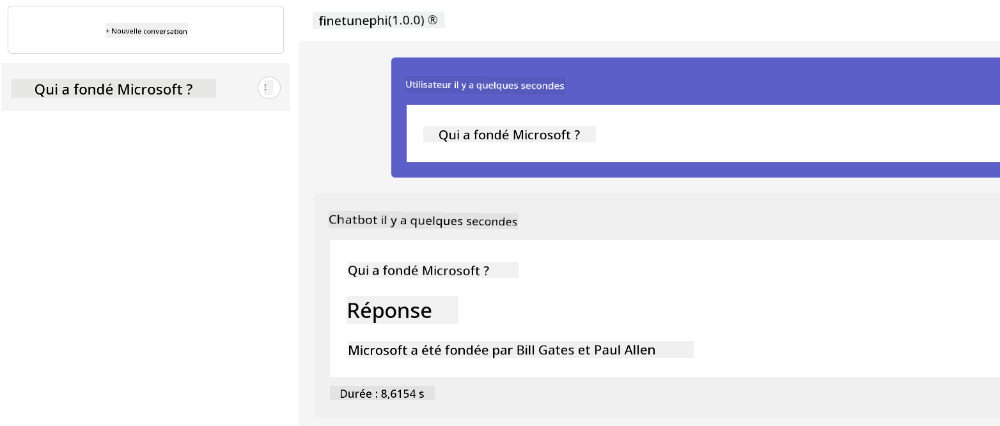

<!--
CO_OP_TRANSLATOR_METADATA:
{
  "original_hash": "7ca2c30fdb802664070e9cfbf92e24fe",
  "translation_date": "2026-01-04T06:23:16+00:00",
  "source_file": "md/02.Application/01.TextAndChat/Phi3/E2E_Phi-3-FineTuning_PromptFlow_Integration.md",
  "language_code": "fr"
}
-->
# Affiner et intégrer des modèles Phi-3 personnalisés avec Prompt flow

Cet exemple de bout en bout (E2E) est basé sur le guide "[Fine-Tune and Integrate Custom Phi-3 Models with Prompt Flow: Step-by-Step Guide](https://techcommunity.microsoft.com/t5/educator-developer-blog/fine-tune-and-integrate-custom-phi-3-models-with-prompt-flow/ba-p/4178612?WT.mc_id=aiml-137032-kinfeylo)" de la Microsoft Tech Community. Il présente les processus d'affinage, de déploiement et d'intégration de modèles Phi-3 personnalisés avec Prompt flow.

## Aperçu

Dans cet exemple E2E, vous apprendrez à affiner le modèle Phi-3 et à l'intégrer avec Prompt flow. En tirant parti d'Azure Machine Learning et de Prompt flow, vous établirez un flux de travail pour déployer et utiliser des modèles d'IA personnalisés. Cet exemple E2E est divisé en trois scénarios :

**Scénario 1 : Configurer les ressources Azure et se préparer à l'affinage**

**Scénario 2 : Affiner le modèle Phi-3 et le déployer dans Azure Machine Learning Studio**

**Scénario 3 : Intégrer avec Prompt flow et discuter avec votre modèle personnalisé**

Voici un aperçu de cet exemple E2E.


### Table of Contents

1. **[Scénario 1 : Configurer les ressources Azure et se préparer à l'affinage](../../../../../../md/02.Application/01.TextAndChat/Phi3)**
    - [Créer un espace de travail Azure Machine Learning](../../../../../../md/02.Application/01.TextAndChat/Phi3)
    - [Demander des quotas GPU dans l'abonnement Azure](../../../../../../md/02.Application/01.TextAndChat/Phi3)
    - [Ajouter une attribution de rôle](../../../../../../md/02.Application/01.TextAndChat/Phi3)
    - [Configurer le projet](../../../../../../md/02.Application/01.TextAndChat/Phi3)
    - [Préparer le jeu de données pour l'affinage](../../../../../../md/02.Application/01.TextAndChat/Phi3)

1. **[Scénario 2 : Affiner le modèle Phi-3 et le déployer dans Azure Machine Learning Studio](../../../../../../md/02.Application/01.TextAndChat/Phi3)**
    - [Configurer Azure CLI](../../../../../../md/02.Application/01.TextAndChat/Phi3)
    - [Affiner le modèle Phi-3](../../../../../../md/02.Application/01.TextAndChat/Phi3)
    - [Déployer le modèle affiné](../../../../../../md/02.Application/01.TextAndChat/Phi3)

1. **[Scénario 3 : Intégrer avec Prompt flow et discuter avec votre modèle personnalisé](../../../../../../md/02.Application/01.TextAndChat/Phi3)**
    - [Intégrer le modèle Phi-3 personnalisé avec Prompt flow](../../../../../../md/02.Application/01.TextAndChat/Phi3)
    - [Discuter avec votre modèle personnalisé](../../../../../../md/02.Application/01.TextAndChat/Phi3)

## Scénario 1 : Configurer les ressources Azure et se préparer à l'affinage

### Créer un espace de travail Azure Machine Learning

1. Tapez *azure machine learning* dans la **barre de recherche** en haut de la page du portail et sélectionnez **Azure Machine Learning** parmi les options qui apparaissent.

    

1. Sélectionnez **+ Create** dans le menu de navigation.

1. Sélectionnez **New workspace** dans le menu de navigation.

    

1. Effectuez les tâches suivantes :

    - Sélectionnez votre **Subscription**.
    - Sélectionnez le **Resource group** à utiliser (créez-en un nouveau si nécessaire).
    - Entrez le **Workspace Name**. Il doit s'agir d'une valeur unique.
    - Sélectionnez la **Region** que vous souhaitez utiliser.
    - Sélectionnez le **Storage account** à utiliser (créez-en un nouveau si nécessaire).
    - Sélectionnez le **Key vault** à utiliser (créez-en un nouveau si nécessaire).
    - Sélectionnez l'**Application insights** à utiliser (créez-en un nouveau si nécessaire).
    - Sélectionnez le **Container registry** à utiliser (créez-en un nouveau si nécessaire).

    

1. Sélectionnez **Review + Create**.

1. Sélectionnez **Create**.

### Demander des quotas GPU dans l'abonnement Azure

Dans cet exemple E2E, vous utiliserez le *Standard_NC24ads_A100_v4 GPU* pour l'affinage, qui nécessite une demande de quota, et le *Standard_E4s_v3* CPU pour le déploiement, qui ne nécessite pas de demande de quota.

> [!NOTE]
>
> Seuls les abonnements Pay-As-You-Go (le type d'abonnement standard) sont éligibles à l'allocation GPU ; les abonnements bénéficiant d'avantages ne sont pas actuellement pris en charge.
>
> Pour ceux qui utilisent des abonnements bénéficiant d'avantages (comme Visual Studio Enterprise Subscription) ou qui souhaitent tester rapidement le processus d'affinage et de déploiement, ce tutoriel fournit également des indications pour effectuer un affinage avec un jeu de données minimal en utilisant un CPU. Cependant, il est important de noter que les résultats d'affinage sont nettement meilleurs lorsqu'on utilise un GPU avec des jeux de données plus volumineux.

1. Visitez [Azure ML Studio](https://ml.azure.com/home?wt.mc_id=studentamb_279723).

1. Effectuez les tâches suivantes pour demander le quota *Standard NCADSA100v4 Family* :

    - Sélectionnez **Quota** dans l'onglet de gauche.
    - Sélectionnez la **Virtual machine family** à utiliser. Par exemple, sélectionnez **Standard NCADSA100v4 Family Cluster Dedicated vCPUs**, qui inclut le *Standard_NC24ads_A100_v4* GPU.
    - Sélectionnez **Request quota** dans le menu de navigation.

        

    - Dans la page Request quota, saisissez la **New cores limit** que vous souhaitez utiliser. Par exemple, 24.
    - Dans la page Request quota, sélectionnez **Submit** pour demander le quota GPU.

> [!NOTE]
> Vous pouvez sélectionner le GPU ou le CPU approprié à vos besoins en vous référant au document [Sizes for Virtual Machines in Azure](https://learn.microsoft.com/azure/virtual-machines/sizes/overview?tabs=breakdownseries%2Cgeneralsizelist%2Ccomputesizelist%2Cmemorysizelist%2Cstoragesizelist%2Cgpusizelist%2Cfpgasizelist%2Chpcsizelist).

### Ajouter une attribution de rôle

Pour affiner et déployer vos modèles, vous devez d'abord créer une identité gérée assignée par l'utilisateur (User Assigned Managed Identity, UAI) et lui attribuer les autorisations appropriées. Cette UAI sera utilisée pour l'authentification lors du déploiement.

#### Créer une identité gérée assignée par l'utilisateur (UAI)

1. Tapez *managed identities* dans la **barre de recherche** en haut de la page du portail et sélectionnez **Managed Identities** parmi les options qui apparaissent.

    

1. Sélectionnez **+ Create**.

    

1. Effectuez les tâches suivantes :

    - Sélectionnez votre **Subscription**.
    - Sélectionnez le **Resource group** à utiliser (créez-en un nouveau si nécessaire).
    - Sélectionnez la **Region** que vous souhaitez utiliser.
    - Entrez le **Name**. Il doit s'agir d'une valeur unique.

1. Sélectionnez **Review + create**.

1. Sélectionnez **+ Create**.

#### Ajouter l'attribution de rôle Contributor à l'identité gérée

1. Accédez à la ressource Managed Identity que vous avez créée.

1. Sélectionnez **Azure role assignments** dans l'onglet de gauche.

1. Sélectionnez **+Add role assignment** dans le menu de navigation.

1. Dans la page Add role assignment, effectuez les tâches suivantes :
    - Sélectionnez la **Scope** sur **Resource group**.
    - Sélectionnez votre **Subscription**.
    - Sélectionnez le **Resource group** à utiliser.
    - Sélectionnez le **Role** **Contributor**.

    

1. Sélectionnez **Save**.

#### Ajouter l'attribution de rôle Storage Blob Data Reader à l'identité gérée

1. Tapez *storage accounts* dans la **barre de recherche** en haut de la page du portail et sélectionnez **Storage accounts** parmi les options qui apparaissent.

    

1. Sélectionnez le compte de stockage associé à l'espace de travail Azure Machine Learning que vous avez créé. Par exemple, *finetunephistorage*.

1. Effectuez les tâches suivantes pour accéder à la page Add role assignment :

    - Accédez au compte de stockage Azure que vous avez créé.
    - Sélectionnez **Access Control (IAM)** dans l'onglet de gauche.
    - Sélectionnez **+ Add** dans le menu de navigation.
    - Sélectionnez **Add role assignment** dans le menu de navigation.

    

1. Dans la page Add role assignment, effectuez les tâches suivantes :

    - Dans la page Role, tapez *Storage Blob Data Reader* dans la **barre de recherche** et sélectionnez **Storage Blob Data Reader** parmi les options qui apparaissent.
    - Dans la page Role, sélectionnez **Next**.
    - Dans la page Members, sélectionnez **Assign access to** **Managed identity**.
    - Dans la page Members, sélectionnez **+ Select members**.
    - Dans la page Select managed identities, sélectionnez votre **Subscription**.
    - Dans la page Select managed identities, sélectionnez la **Managed identity** sur **Manage Identity**.
    - Dans la page Select managed identities, sélectionnez la Managed Identity que vous avez créée. Par exemple, *finetunephi-managedidentity*.
    - Dans la page Select managed identities, sélectionnez **Select**.

    

1. Sélectionnez **Review + assign**.

#### Ajouter l'attribution de rôle AcrPull à l'identité gérée

1. Tapez *container registries* dans la **barre de recherche** en haut de la page du portail et sélectionnez **Container registries** parmi les options qui apparaissent.

    

1. Sélectionnez le registre de conteneurs associé à l'espace de travail Azure Machine Learning. Par exemple, *finetunephicontainerregistries*

1. Effectuez les tâches suivantes pour accéder à la page Add role assignment :

    - Sélectionnez **Access Control (IAM)** dans l'onglet de gauche.
    - Sélectionnez **+ Add** dans le menu de navigation.
    - Sélectionnez **Add role assignment** dans le menu de navigation.

1. Dans la page Add role assignment, effectuez les tâches suivantes :

    - Dans la page Role, tapez *AcrPull* dans la **barre de recherche** et sélectionnez **AcrPull** parmi les options qui apparaissent.
    - Dans la page Role, sélectionnez **Next**.
    - Dans la page Members, sélectionnez **Assign access to** **Managed identity**.
    - Dans la page Members, sélectionnez **+ Select members**.
    - Dans la page Select managed identities, sélectionnez votre **Subscription**.
    - Dans la page Select managed identities, sélectionnez la **Managed identity** sur **Manage Identity**.
    - Dans la page Select managed identities, sélectionnez la Managed Identity que vous avez créée. Par exemple, *finetunephi-managedidentity*.
    - Dans la page Select managed identities, sélectionnez **Select**.
    - Sélectionnez **Review + assign**.

### Configurer le projet

Vous allez maintenant créer un dossier de travail et configurer un environnement virtuel pour développer un programme qui interagit avec les utilisateurs et utilise l'historique des conversations stocké dans Azure Cosmos DB pour guider ses réponses.

#### Créer un dossier de travail

1. Ouvrez une fenêtre de terminal et tapez la commande suivante pour créer un dossier nommé *finetune-phi* dans le chemin par défaut.

    ```console
    mkdir finetune-phi
    ```

1. Tapez la commande suivante dans votre terminal pour naviguer vers le dossier *finetune-phi* que vous avez créé.

    ```console
    cd finetune-phi
    ```

#### Créer un environnement virtuel

1. Tapez la commande suivante dans votre terminal pour créer un environnement virtuel nommé *.venv*.

    ```console
    python -m venv .venv
    ```

1. Tapez la commande suivante dans votre terminal pour activer l'environnement virtuel.

    ```console
    .venv\Scripts\activate.bat
    ```

> [!NOTE]
>
> Si cela a fonctionné, vous devriez voir *(.venv)* avant l'invite de commande.

#### Installer les paquets requis

1. Tapez les commandes suivantes dans votre terminal pour installer les paquets requis.

    ```console
    pip install datasets==2.19.1
    pip install transformers==4.41.1
    pip install azure-ai-ml==1.16.0
    pip install torch==2.3.1
    pip install trl==0.9.4
    pip install promptflow==1.12.0
    ```

#### Créer les fichiers du projet
In this exercice, vous allez créer les fichiers essentiels pour notre projet. Ces fichiers incluent des scripts pour télécharger le jeu de données, configurer l’environnement Azure Machine Learning, affiner le modèle Phi-3, et déployer le modèle affiné. Vous créerez également un fichier *conda.yml* pour configurer l’environnement d’affinage.

Dans cet exercice, vous allez :

- Créer un fichier *download_dataset.py* pour télécharger le jeu de données.
- Créer un fichier *setup_ml.py* pour configurer l’environnement Azure Machine Learning.
- Créer un fichier *fine_tune.py* dans le dossier *finetuning_dir* pour affiner le modèle Phi-3 en utilisant le jeu de données.
- Créer un fichier *conda.yml* pour configurer l’environnement d’affinage.
- Créer un fichier *deploy_model.py* pour déployer le modèle affiné.
- Créer un fichier *integrate_with_promptflow.py*, pour intégrer le modèle affiné et exécuter le modèle en utilisant Prompt flow.
- Créer un fichier flow.dag.yml, pour configurer la structure du flux de travail pour Prompt flow.
- Créer un fichier *config.py* pour renseigner les informations Azure.

> [!NOTE]
>
> Structure complète du dossier :
>
> ```text
> └── YourUserName
> .    └── finetune-phi
> .        ├── finetuning_dir
> .        │      └── fine_tune.py
> .        ├── conda.yml
> .        ├── config.py
> .        ├── deploy_model.py
> .        ├── download_dataset.py
> .        ├── flow.dag.yml
> .        ├── integrate_with_promptflow.py
> .        └── setup_ml.py
> ```

1. Ouvrez **Visual Studio Code**.

1. Sélectionnez **File** dans la barre de menus.

1. Sélectionnez **Open Folder**.

1. Sélectionnez le dossier *finetune-phi* que vous avez créé, situé à *C:\Users\yourUserName\finetune-phi*.

    

1. Dans le volet de gauche de Visual Studio Code, cliquez avec le bouton droit et sélectionnez **New File** pour créer un nouveau fichier nommé *download_dataset.py*.

1. Dans le volet de gauche de Visual Studio Code, cliquez avec le bouton droit et sélectionnez **New File** pour créer un nouveau fichier nommé *setup_ml.py*.

1. Dans le volet de gauche de Visual Studio Code, cliquez avec le bouton droit et sélectionnez **New File** pour créer un nouveau fichier nommé *deploy_model.py*.

    

1. Dans le volet de gauche de Visual Studio Code, cliquez avec le bouton droit et sélectionnez **New Folder** pour créer un nouveau dossier nommé *finetuning_dir*.

1. Dans le dossier *finetuning_dir*, créez un nouveau fichier nommé *fine_tune.py*.

#### Create and Configure *conda.yml* file

1. Dans le volet de gauche de Visual Studio Code, cliquez avec le bouton droit et sélectionnez **New File** pour créer un nouveau fichier nommé *conda.yml*.

1. Ajoutez le code suivant au fichier *conda.yml* pour configurer l’environnement d’affinage pour le modèle Phi-3.

    ```yml
    name: phi-3-training-env
    channels:
      - defaults
      - conda-forge
    dependencies:
      - python=3.10
      - pip
      - numpy<2.0
      - pip:
          - torch==2.4.0
          - torchvision==0.19.0
          - trl==0.8.6
          - transformers==4.41
          - datasets==2.21.0
          - azureml-core==1.57.0
          - azure-storage-blob==12.19.0
          - azure-ai-ml==1.16
          - azure-identity==1.17.1
          - accelerate==0.33.0
          - mlflow==2.15.1
          - azureml-mlflow==1.57.0
    ```

#### Create and Configure *config.py* file

1. Dans le volet de gauche de Visual Studio Code, cliquez avec le bouton droit et sélectionnez **New File** pour créer un nouveau fichier nommé *config.py*.

1. Ajoutez le code suivant au fichier *config.py* pour inclure vos informations Azure.

    ```python
    # Paramètres Azure
    AZURE_SUBSCRIPTION_ID = "your_subscription_id"
    AZURE_RESOURCE_GROUP_NAME = "your_resource_group_name" # "TestGroup"

    # Paramètres Azure Machine Learning
    AZURE_ML_WORKSPACE_NAME = "your_workspace_name" # "finetunephi-workspace"

    # Paramètres d'identité gérée Azure
    AZURE_MANAGED_IDENTITY_CLIENT_ID = "your_azure_managed_identity_client_id"
    AZURE_MANAGED_IDENTITY_NAME = "your_azure_managed_identity_name" # "finetune-mangedidentity"
    AZURE_MANAGED_IDENTITY_RESOURCE_ID = f"/subscriptions/{AZURE_SUBSCRIPTION_ID}/resourceGroups/{AZURE_RESOURCE_GROUP_NAME}/providers/Microsoft.ManagedIdentity/userAssignedIdentities/{AZURE_MANAGED_IDENTITY_NAME}"

    # Chemins des fichiers du jeu de données
    TRAIN_DATA_PATH = "data/train_data.jsonl"
    TEST_DATA_PATH = "data/test_data.jsonl"

    # Paramètres du modèle affiné
    AZURE_MODEL_NAME = "your_fine_tuned_model_name" # "finetune-phi-model"
    AZURE_ENDPOINT_NAME = "your_fine_tuned_model_endpoint_name" # "finetune-phi-endpoint"
    AZURE_DEPLOYMENT_NAME = "your_fine_tuned_model_deployment_name" # "finetune-phi-deployment"

    AZURE_ML_API_KEY = "your_fine_tuned_model_api_key"
    AZURE_ML_ENDPOINT = "your_fine_tuned_model_endpoint_uri" # "https://{your-endpoint-name}.{your-region}.inference.ml.azure.com/score"
    ```

#### Add Azure environment variables

1. Effectuez les tâches suivantes pour ajouter l’ID d’abonnement Azure :

    - Tapez *subscriptions* dans la **barre de recherche** en haut de la page du portail et sélectionnez **Subscriptions** parmi les options qui apparaissent.
    - Sélectionnez l’abonnement Azure que vous utilisez actuellement.
    - Copiez et collez votre Subscription ID dans le fichier *config.py*.

    

1. Effectuez les tâches suivantes pour ajouter le nom de l’espace de travail Azure :

    - Accédez à la ressource Azure Machine Learning que vous avez créée.
    - Copiez et collez le nom de votre compte dans le fichier *config.py*.

    

1. Effectuez les tâches suivantes pour ajouter le nom du groupe de ressources Azure :

    - Accédez à la ressource Azure Machine Learning que vous avez créée.
    - Copiez et collez le nom de votre groupe de ressources Azure dans le fichier *config.py*.

    

2. Effectuez les tâches suivantes pour ajouter le nom de l’identité managée Azure

    - Accédez à la ressource Managed Identities que vous avez créée.
    - Copiez et collez le nom de votre identité managée Azure dans le fichier *config.py*.

    

### Préparer le jeu de données pour l’affinage

Dans cet exercice, vous exécuterez le fichier *download_dataset.py* pour télécharger les jeux de données *ULTRACHAT_200k* vers votre environnement local. Vous utiliserez ensuite ces jeux de données pour affiner le modèle Phi-3 dans Azure Machine Learning.

#### Téléchargez votre jeu de données en utilisant *download_dataset.py*

1. Ouvrez le fichier *download_dataset.py* dans Visual Studio Code.

1. Ajoutez le code suivant dans *download_dataset.py*.

    ```python
    import json
    import os
    from datasets import load_dataset
    from config import (
        TRAIN_DATA_PATH,
        TEST_DATA_PATH)

    def load_and_split_dataset(dataset_name, config_name, split_ratio):
        """
        Load and split a dataset.
        """
        # Charger le jeu de données avec le nom, la configuration et le ratio de séparation spécifiés
        dataset = load_dataset(dataset_name, config_name, split=split_ratio)
        print(f"Original dataset size: {len(dataset)}")
        
        # Diviser le jeu de données en ensembles d'entraînement et de test (80 % entraînement, 20 % test)
        split_dataset = dataset.train_test_split(test_size=0.2)
        print(f"Train dataset size: {len(split_dataset['train'])}")
        print(f"Test dataset size: {len(split_dataset['test'])}")
        
        return split_dataset

    def save_dataset_to_jsonl(dataset, filepath):
        """
        Save a dataset to a JSONL file.
        """
        # Créer le répertoire s'il n'existe pas
        os.makedirs(os.path.dirname(filepath), exist_ok=True)
        
        # Ouvrir le fichier en mode écriture
        with open(filepath, 'w', encoding='utf-8') as f:
            # Itérer sur chaque enregistrement du jeu de données
            for record in dataset:
                # Convertir l'enregistrement en objet JSON et l'écrire dans le fichier
                json.dump(record, f)
                # Écrire un caractère de nouvelle ligne pour séparer les enregistrements
                f.write('\n')
        
        print(f"Dataset saved to {filepath}")

    def main():
        """
        Main function to load, split, and save the dataset.
        """
        # Charger et diviser le jeu de données ULTRACHAT_200k avec une configuration spécifique et un ratio de séparation
        dataset = load_and_split_dataset("HuggingFaceH4/ultrachat_200k", 'default', 'train_sft[:1%]')
        
        # Extraire les ensembles d'entraînement et de test de la division
        train_dataset = dataset['train']
        test_dataset = dataset['test']

        # Enregistrer l'ensemble d'entraînement dans un fichier JSONL
        save_dataset_to_jsonl(train_dataset, TRAIN_DATA_PATH)
        
        # Enregistrer l'ensemble de test dans un fichier JSONL séparé
        save_dataset_to_jsonl(test_dataset, TEST_DATA_PATH)

    if __name__ == "__main__":
        main()

    ```

> [!TIP]
>
> **Conseils pour l’affinage avec un jeu de données minimal en utilisant un CPU**
>
> Si vous souhaitez utiliser un CPU pour l’affinage, cette approche est idéale pour les personnes disposant d’abonnements avantageux (comme Visual Studio Enterprise Subscription) ou pour tester rapidement le processus d’affinage et de déploiement.
>
> Remplacez `dataset = load_and_split_dataset("HuggingFaceH4/ultrachat_200k", 'default', 'train_sft[:1%]')` par `dataset = load_and_split_dataset("HuggingFaceH4/ultrachat_200k", 'default', 'train_sft[:10]')`
>

1. Tapez la commande suivante dans votre terminal pour exécuter le script et télécharger le jeu de données dans votre environnement local.

    ```console
    python download_data.py
    ```

1. Vérifiez que les jeux de données ont bien été enregistrés dans votre répertoire local *finetune-phi/data*.

> [!NOTE]
>
> **Taille du jeu de données et durée de l’affinage**
>
> Dans cet exemple E2E, vous utilisez seulement 1% du jeu de données (`train_sft[:1%]`). Cela réduit considérablement la quantité de données, accélérant à la fois l’upload et les processus d’affinage. Vous pouvez ajuster le pourcentage pour trouver le bon équilibre entre le temps d’entraînement et les performances du modèle. L’utilisation d’un sous-ensemble plus petit du jeu de données réduit le temps nécessaire pour l’affinage, rendant le processus plus gérable pour un exemple E2E.

## Scénario 2 : Affiner le modèle Phi-3 et déployer dans Azure Machine Learning Studio

### Configurez Azure CLI

Vous devez configurer Azure CLI pour authentifier votre environnement. Azure CLI vous permet de gérer les ressources Azure directement depuis la ligne de commande et fournit les informations d’identification nécessaires pour qu’Azure Machine Learning accède à ces ressources. Pour commencer, installez [Azure CLI](https://learn.microsoft.com/cli/azure/install-azure-cli)

1. Ouvrez une fenêtre de terminal et tapez la commande suivante pour vous connecter à votre compte Azure.

    ```console
    az login
    ```

1. Sélectionnez le compte Azure que vous souhaitez utiliser.

1. Sélectionnez l’abonnement Azure que vous souhaitez utiliser.

    

> [!TIP]
>
> Si vous rencontrez des difficultés pour vous connecter à Azure, essayez d’utiliser un code de périphérique. Ouvrez une fenêtre de terminal et tapez la commande suivante pour vous connecter à votre compte Azure :
>
> ```console
> az login --use-device-code
> ```
>

### Affiner le modèle Phi-3

Dans cet exercice, vous allez affiner le modèle Phi-3 en utilisant le jeu de données fourni. Tout d’abord, vous définirez le processus d’affinage dans le fichier *fine_tune.py*. Ensuite, vous configurerez l’environnement Azure Machine Learning et lancerez le processus d’affinage en exécutant le fichier *setup_ml.py*. Ce script garantit que l’affinage se déroule au sein de l’environnement Azure Machine Learning.

En exécutant *setup_ml.py*, vous lancerez le processus d’affinage dans l’environnement Azure Machine Learning.

#### Ajoutez du code au fichier *fine_tune.py*

1. Accédez au dossier *finetuning_dir* et ouvrez le fichier *fine_tune.py* dans Visual Studio Code.

1. Ajoutez le code suivant dans *fine_tune.py*.

    ```python
    import argparse
    import sys
    import logging
    import os
    from datasets import load_dataset
    import torch
    import mlflow
    from transformers import AutoModelForCausalLM, AutoTokenizer, TrainingArguments
    from trl import SFTTrainer

    # Pour éviter l'erreur INVALID_PARAMETER_VALUE dans MLflow, désactivez l'intégration MLflow
    os.environ["DISABLE_MLFLOW_INTEGRATION"] = "True"

    # Configuration de la journalisation
    logging.basicConfig(
        format="%(asctime)s - %(levelname)s - %(name)s - %(message)s",
        datefmt="%Y-%m-%d %H:%M:%S",
        handlers=[logging.StreamHandler(sys.stdout)],
        level=logging.WARNING
    )
    logger = logging.getLogger(__name__)

    def initialize_model_and_tokenizer(model_name, model_kwargs):
        """
        Initialize the model and tokenizer with the given pretrained model name and arguments.
        """
        model = AutoModelForCausalLM.from_pretrained(model_name, **model_kwargs)
        tokenizer = AutoTokenizer.from_pretrained(model_name)
        tokenizer.model_max_length = 2048
        tokenizer.pad_token = tokenizer.unk_token
        tokenizer.pad_token_id = tokenizer.convert_tokens_to_ids(tokenizer.pad_token)
        tokenizer.padding_side = 'right'
        return model, tokenizer

    def apply_chat_template(example, tokenizer):
        """
        Apply a chat template to tokenize messages in the example.
        """
        messages = example["messages"]
        if messages[0]["role"] != "system":
            messages.insert(0, {"role": "system", "content": ""})
        example["text"] = tokenizer.apply_chat_template(
            messages, tokenize=False, add_generation_prompt=False
        )
        return example

    def load_and_preprocess_data(train_filepath, test_filepath, tokenizer):
        """
        Load and preprocess the dataset.
        """
        train_dataset = load_dataset('json', data_files=train_filepath, split='train')
        test_dataset = load_dataset('json', data_files=test_filepath, split='train')
        column_names = list(train_dataset.features)

        train_dataset = train_dataset.map(
            apply_chat_template,
            fn_kwargs={"tokenizer": tokenizer},
            num_proc=10,
            remove_columns=column_names,
            desc="Applying chat template to train dataset",
        )

        test_dataset = test_dataset.map(
            apply_chat_template,
            fn_kwargs={"tokenizer": tokenizer},
            num_proc=10,
            remove_columns=column_names,
            desc="Applying chat template to test dataset",
        )

        return train_dataset, test_dataset

    def train_and_evaluate_model(train_dataset, test_dataset, model, tokenizer, output_dir):
        """
        Train and evaluate the model.
        """
        training_args = TrainingArguments(
            bf16=True,
            do_eval=True,
            output_dir=output_dir,
            eval_strategy="epoch",
            learning_rate=5.0e-06,
            logging_steps=20,
            lr_scheduler_type="cosine",
            num_train_epochs=3,
            overwrite_output_dir=True,
            per_device_eval_batch_size=4,
            per_device_train_batch_size=4,
            remove_unused_columns=True,
            save_steps=500,
            seed=0,
            gradient_checkpointing=True,
            gradient_accumulation_steps=1,
            warmup_ratio=0.2,
        )

        trainer = SFTTrainer(
            model=model,
            args=training_args,
            train_dataset=train_dataset,
            eval_dataset=test_dataset,
            max_seq_length=2048,
            dataset_text_field="text",
            tokenizer=tokenizer,
            packing=True
        )

        train_result = trainer.train()
        trainer.log_metrics("train", train_result.metrics)

        mlflow.transformers.log_model(
            transformers_model={"model": trainer.model, "tokenizer": tokenizer},
            artifact_path=output_dir,
        )

        tokenizer.padding_side = 'left'
        eval_metrics = trainer.evaluate()
        eval_metrics["eval_samples"] = len(test_dataset)
        trainer.log_metrics("eval", eval_metrics)

    def main(train_file, eval_file, model_output_dir):
        """
        Main function to fine-tune the model.
        """
        model_kwargs = {
            "use_cache": False,
            "trust_remote_code": True,
            "torch_dtype": torch.bfloat16,
            "device_map": None,
            "attn_implementation": "eager"
        }

        # pretrained_model_name = "microsoft/Phi-3-mini-4k-instruct"
        pretrained_model_name = "microsoft/Phi-3.5-mini-instruct"

        with mlflow.start_run():
            model, tokenizer = initialize_model_and_tokenizer(pretrained_model_name, model_kwargs)
            train_dataset, test_dataset = load_and_preprocess_data(train_file, eval_file, tokenizer)
            train_and_evaluate_model(train_dataset, test_dataset, model, tokenizer, model_output_dir)

    if __name__ == "__main__":
        parser = argparse.ArgumentParser()
        parser.add_argument("--train-file", type=str, required=True, help="Path to the training data")
        parser.add_argument("--eval-file", type=str, required=True, help="Path to the evaluation data")
        parser.add_argument("--model_output_dir", type=str, required=True, help="Directory to save the fine-tuned model")
        args = parser.parse_args()
        main(args.train_file, args.eval_file, args.model_output_dir)

    ```

1. Enregistrez et fermez le fichier *fine_tune.py*.

> [!TIP]
> **Vous pouvez affiner le modèle Phi-3.5**
>
> Dans le fichier *fine_tune.py*, vous pouvez changer la valeur de `pretrained_model_name` de `"microsoft/Phi-3-mini-4k-instruct"` vers n’importe quel modèle que vous souhaitez affiner. Par exemple, si vous le changez en `"microsoft/Phi-3.5-mini-instruct"`, vous utiliserez le modèle Phi-3.5-mini-instruct pour l’affinage. Pour trouver et utiliser le nom du modèle que vous préférez, visitez [Hugging Face](https://huggingface.co/), recherchez le modèle qui vous intéresse, puis copiez-collez son nom dans le champ `pretrained_model_name` de votre script.
>
> <image type="content" src="../../../../imgs/02/FineTuning-PromptFlow/finetunephi3.5.png" alt-text="Affiner Phi-3.5.">
>

#### Ajoutez du code au fichier *setup_ml.py*

1. Ouvrez le fichier *setup_ml.py* dans Visual Studio Code.

1. Ajoutez le code suivant dans *setup_ml.py*.

    ```python
    import logging
    from azure.ai.ml import MLClient, command, Input
    from azure.ai.ml.entities import Environment, AmlCompute
    from azure.identity import AzureCliCredential
    from config import (
        AZURE_SUBSCRIPTION_ID,
        AZURE_RESOURCE_GROUP_NAME,
        AZURE_ML_WORKSPACE_NAME,
        TRAIN_DATA_PATH,
        TEST_DATA_PATH
    )

    # Constantes

    # Décommentez les lignes suivantes pour utiliser une instance CPU pour l'entraînement
    # COMPUTE_INSTANCE_TYPE = "Standard_E16s_v3" # cpu
    # COMPUTE_NAME = "cpu-e16s-v3"
    # DOCKER_IMAGE_NAME = "mcr.microsoft.com/azureml/openmpi4.1.0-ubuntu20.04:latest"

    # Décommentez les lignes suivantes pour utiliser une instance GPU pour l'entraînement
    COMPUTE_INSTANCE_TYPE = "Standard_NC24ads_A100_v4"
    COMPUTE_NAME = "gpu-nc24s-a100-v4"
    DOCKER_IMAGE_NAME = "mcr.microsoft.com/azureml/curated/acft-hf-nlp-gpu:59"

    CONDA_FILE = "conda.yml"
    LOCATION = "eastus2" # Remplacez par l'emplacement de votre cluster de calcul
    FINETUNING_DIR = "./finetuning_dir" # Chemin vers le script de fine-tuning
    TRAINING_ENV_NAME = "phi-3-training-environment" # Nom de l'environnement d'entraînement
    MODEL_OUTPUT_DIR = "./model_output" # Chemin vers le dossier de sortie du modèle dans Azure ML

    # Configuration de la journalisation pour suivre le processus
    logger = logging.getLogger(__name__)
    logging.basicConfig(
        format="%(asctime)s - %(levelname)s - %(name)s - %(message)s",
        datefmt="%Y-%m-%d %H:%M:%S",
        level=logging.WARNING
    )

    def get_ml_client():
        """
        Initialize the ML Client using Azure CLI credentials.
        """
        credential = AzureCliCredential()
        return MLClient(credential, AZURE_SUBSCRIPTION_ID, AZURE_RESOURCE_GROUP_NAME, AZURE_ML_WORKSPACE_NAME)

    def create_or_get_environment(ml_client):
        """
        Create or update the training environment in Azure ML.
        """
        env = Environment(
            image=DOCKER_IMAGE_NAME,  # Image Docker pour l'environnement
            conda_file=CONDA_FILE,  # Fichier d'environnement Conda
            name=TRAINING_ENV_NAME,  # Nom de l'environnement
        )
        return ml_client.environments.create_or_update(env)

    def create_or_get_compute_cluster(ml_client, compute_name, COMPUTE_INSTANCE_TYPE, location):
        """
        Create or update the compute cluster in Azure ML.
        """
        try:
            compute_cluster = ml_client.compute.get(compute_name)
            logger.info(f"Compute cluster '{compute_name}' already exists. Reusing it for the current run.")
        except Exception:
            logger.info(f"Compute cluster '{compute_name}' does not exist. Creating a new one with size {COMPUTE_INSTANCE_TYPE}.")
            compute_cluster = AmlCompute(
                name=compute_name,
                size=COMPUTE_INSTANCE_TYPE,
                location=location,
                tier="Dedicated",  # Niveau du cluster de calcul
                min_instances=0,  # Nombre minimum d'instances
                max_instances=1  # Nombre maximum d'instances
            )
            ml_client.compute.begin_create_or_update(compute_cluster).wait()  # Attendre la création du cluster
        return compute_cluster

    def create_fine_tuning_job(env, compute_name):
        """
        Set up the fine-tuning job in Azure ML.
        """
        return command(
            code=FINETUNING_DIR,  # Chemin vers fine_tune.py
            command=(
                "python fine_tune.py "
                "--train-file ${{inputs.train_file}} "
                "--eval-file ${{inputs.eval_file}} "
                "--model_output_dir ${{inputs.model_output}}"
            ),
            environment=env,  # Environnement d'entraînement
            compute=compute_name,  # Cluster de calcul à utiliser
            inputs={
                "train_file": Input(type="uri_file", path=TRAIN_DATA_PATH),  # Chemin vers le fichier de données d'entraînement
                "eval_file": Input(type="uri_file", path=TEST_DATA_PATH),  # Chemin vers le fichier de données d'évaluation
                "model_output": MODEL_OUTPUT_DIR
            }
        )

    def main():
        """
        Main function to set up and run the fine-tuning job in Azure ML.
        """
        # Initialiser le client ML
        ml_client = get_ml_client()

        # Créer l'environnement
        env = create_or_get_environment(ml_client)
        
        # Créer ou récupérer un cluster de calcul existant
        create_or_get_compute_cluster(ml_client, COMPUTE_NAME, COMPUTE_INSTANCE_TYPE, LOCATION)

        # Créer et soumettre le job de fine-tuning
        job = create_fine_tuning_job(env, COMPUTE_NAME)
        returned_job = ml_client.jobs.create_or_update(job)  # Soumettre le job
        ml_client.jobs.stream(returned_job.name)  # Afficher les logs du job en continu
        
        # Capturer le nom du job
        job_name = returned_job.name
        print(f"Job name: {job_name}")

    if __name__ == "__main__":
        main()

    ```

1. Remplacez `COMPUTE_INSTANCE_TYPE`, `COMPUTE_NAME`, et `LOCATION` par vos informations spécifiques.

    ```python
   # Décommentez les lignes suivantes pour utiliser une instance GPU pour l'entraînement
    COMPUTE_INSTANCE_TYPE = "Standard_NC24ads_A100_v4"
    COMPUTE_NAME = "gpu-nc24s-a100-v4"
    ...
    LOCATION = "eastus2" # Remplacez par l'emplacement de votre cluster de calcul
    ```

> [!TIP]
>
> **Conseils pour l’affinage avec un jeu de données minimal en utilisant un CPU**
>
> Si vous souhaitez utiliser un CPU pour l’affinage, cette approche est idéale pour les personnes disposant d’abonnements avantageux (comme Visual Studio Enterprise Subscription) ou pour tester rapidement le processus d’affinage et de déploiement.
>
> 1. Ouvrez le fichier *setup_ml*.
> 1. Remplacez `COMPUTE_INSTANCE_TYPE`, `COMPUTE_NAME`, et `DOCKER_IMAGE_NAME` par les valeurs suivantes. Si vous n’avez pas accès à *Standard_E16s_v3*, vous pouvez utiliser une instance CPU équivalente ou demander un nouveau quota.
> 1. Remplacez `LOCATION` par vos informations spécifiques.
>
>    ```python
>    # Uncomment the following lines to use a CPU instance for training
>    COMPUTE_INSTANCE_TYPE = "Standard_E16s_v3" # cpu
>    COMPUTE_NAME = "cpu-e16s-v3"
>    DOCKER_IMAGE_NAME = "mcr.microsoft.com/azureml/openmpi4.1.0-ubuntu20.04:latest"
>    LOCATION = "eastus2" # Replace with the location of your compute cluster
>    ```
>

1. Tapez la commande suivante pour exécuter le script *setup_ml.py* et démarrer le processus d’affinage dans Azure Machine Learning.

    ```python
    python setup_ml.py
    ```

1. Dans cet exercice, vous avez réussi à affiner le modèle Phi-3 en utilisant Azure Machine Learning. En exécutant le script *setup_ml.py*, vous avez configuré l’environnement Azure Machine Learning et lancé le processus d’affinage défini dans le fichier *fine_tune.py*. Veuillez noter que le processus d’affinage peut prendre un temps considérable. Après avoir exécuté la commande `python setup_ml.py`, vous devrez attendre que le processus se termine. Vous pouvez surveiller l’état du job d’affinage en suivant le lien fourni dans le terminal vers le portail Azure Machine Learning.

    

### Déployer le modèle affiné

Pour intégrer le modèle Phi-3 affiné avec Prompt Flow, vous devez déployer le modèle afin de le rendre accessible pour l’inférence en temps réel. Ce processus implique l’enregistrement du modèle, la création d’un endpoint en ligne et le déploiement du modèle.

#### Définir le nom du modèle, le nom de l’endpoint et le nom du déploiement pour le déploiement

1. Ouvrez le fichier *config.py*.

1. Remplacez `AZURE_MODEL_NAME = "your_fine_tuned_model_name"` par le nom souhaité pour votre modèle.

1. Remplacez `AZURE_ENDPOINT_NAME = "your_fine_tuned_model_endpoint_name"` par le nom souhaité pour votre endpoint.

1. Remplacez `AZURE_DEPLOYMENT_NAME = "your_fine_tuned_model_deployment_name"` par le nom souhaité pour votre déploiement.

#### Ajoutez du code au fichier *deploy_model.py*

L’exécution du fichier *deploy_model.py* automatise l’ensemble du processus de déploiement. Il enregistre le modèle, crée un endpoint et exécute le déploiement en se basant sur les paramètres spécifiés dans le fichier config.py, qui inclut le nom du modèle, le nom de l’endpoint et le nom du déploiement.

1. Ouvrez le fichier *deploy_model.py* dans Visual Studio Code.

1. Ajoutez le code suivant dans *deploy_model.py*.

    ```python
    import logging
    from azure.identity import AzureCliCredential
    from azure.ai.ml import MLClient
    from azure.ai.ml.entities import Model, ProbeSettings, ManagedOnlineEndpoint, ManagedOnlineDeployment, IdentityConfiguration, ManagedIdentityConfiguration, OnlineRequestSettings
    from azure.ai.ml.constants import AssetTypes

    # Importations de configuration
    from config import (
        AZURE_SUBSCRIPTION_ID,
        AZURE_RESOURCE_GROUP_NAME,
        AZURE_ML_WORKSPACE_NAME,
        AZURE_MANAGED_IDENTITY_RESOURCE_ID,
        AZURE_MANAGED_IDENTITY_CLIENT_ID,
        AZURE_MODEL_NAME,
        AZURE_ENDPOINT_NAME,
        AZURE_DEPLOYMENT_NAME
    )

    # Constantes
    JOB_NAME = "your-job-name"
    COMPUTE_INSTANCE_TYPE = "Standard_E4s_v3"

    deployment_env_vars = {
        "SUBSCRIPTION_ID": AZURE_SUBSCRIPTION_ID,
        "RESOURCE_GROUP_NAME": AZURE_RESOURCE_GROUP_NAME,
        "UAI_CLIENT_ID": AZURE_MANAGED_IDENTITY_CLIENT_ID,
    }

    # Configuration de la journalisation
    logging.basicConfig(
        format="%(asctime)s - %(levelname)s - %(name)s - %(message)s",
        datefmt="%Y-%m-%d %H:%M:%S",
        level=logging.DEBUG
    )
    logger = logging.getLogger(__name__)

    def get_ml_client():
        """Initialize and return the ML Client."""
        credential = AzureCliCredential()
        return MLClient(credential, AZURE_SUBSCRIPTION_ID, AZURE_RESOURCE_GROUP_NAME, AZURE_ML_WORKSPACE_NAME)

    def register_model(ml_client, model_name, job_name):
        """Register a new model."""
        model_path = f"azureml://jobs/{job_name}/outputs/artifacts/paths/model_output"
        logger.info(f"Registering model {model_name} from job {job_name} at path {model_path}.")
        run_model = Model(
            path=model_path,
            name=model_name,
            description="Model created from run.",
            type=AssetTypes.MLFLOW_MODEL,
        )
        model = ml_client.models.create_or_update(run_model)
        logger.info(f"Registered model ID: {model.id}")
        return model

    def delete_existing_endpoint(ml_client, endpoint_name):
        """Delete existing endpoint if it exists."""
        try:
            endpoint_result = ml_client.online_endpoints.get(name=endpoint_name)
            logger.info(f"Deleting existing endpoint {endpoint_name}.")
            ml_client.online_endpoints.begin_delete(name=endpoint_name).result()
            logger.info(f"Deleted existing endpoint {endpoint_name}.")
        except Exception as e:
            logger.info(f"No existing endpoint {endpoint_name} found to delete: {e}")

    def create_or_update_endpoint(ml_client, endpoint_name, description=""):
        """Create or update an endpoint."""
        delete_existing_endpoint(ml_client, endpoint_name)
        logger.info(f"Creating new endpoint {endpoint_name}.")
        endpoint = ManagedOnlineEndpoint(
            name=endpoint_name,
            description=description,
            identity=IdentityConfiguration(
                type="user_assigned",
                user_assigned_identities=[ManagedIdentityConfiguration(resource_id=AZURE_MANAGED_IDENTITY_RESOURCE_ID)]
            )
        )
        endpoint_result = ml_client.online_endpoints.begin_create_or_update(endpoint).result()
        logger.info(f"Created new endpoint {endpoint_name}.")
        return endpoint_result

    def create_or_update_deployment(ml_client, endpoint_name, deployment_name, model):
        """Create or update a deployment."""

        logger.info(f"Creating deployment {deployment_name} for endpoint {endpoint_name}.")
        deployment = ManagedOnlineDeployment(
            name=deployment_name,
            endpoint_name=endpoint_name,
            model=model.id,
            instance_type=COMPUTE_INSTANCE_TYPE,
            instance_count=1,
            environment_variables=deployment_env_vars,
            request_settings=OnlineRequestSettings(
                max_concurrent_requests_per_instance=3,
                request_timeout_ms=180000,
                max_queue_wait_ms=120000
            ),
            liveness_probe=ProbeSettings(
                failure_threshold=30,
                success_threshold=1,
                period=100,
                initial_delay=500,
            ),
            readiness_probe=ProbeSettings(
                failure_threshold=30,
                success_threshold=1,
                period=100,
                initial_delay=500,
            ),
        )
        deployment_result = ml_client.online_deployments.begin_create_or_update(deployment).result()
        logger.info(f"Created deployment {deployment.name} for endpoint {endpoint_name}.")
        return deployment_result

    def set_traffic_to_deployment(ml_client, endpoint_name, deployment_name):
        """Set traffic to the specified deployment."""
        try:
            # Récupérer les détails du point de terminaison actuel
            endpoint = ml_client.online_endpoints.get(name=endpoint_name)
            
            # Consigner l'allocation de trafic actuelle pour le débogage
            logger.info(f"Current traffic allocation: {endpoint.traffic}")
            
            # Définir l'allocation de trafic pour le déploiement
            endpoint.traffic = {deployment_name: 100}
            
            # Mettre à jour le point de terminaison avec la nouvelle allocation de trafic
            endpoint_poller = ml_client.online_endpoints.begin_create_or_update(endpoint)
            updated_endpoint = endpoint_poller.result()
            
            # Consigner l'allocation de trafic mise à jour pour le débogage
            logger.info(f"Updated traffic allocation: {updated_endpoint.traffic}")
            logger.info(f"Set traffic to deployment {deployment_name} at endpoint {endpoint_name}.")
            return updated_endpoint
        except Exception as e:
            # Consigner toute erreur survenant pendant le processus
            logger.error(f"Failed to set traffic to deployment: {e}")
            raise


    def main():
        ml_client = get_ml_client()

        registered_model = register_model(ml_client, AZURE_MODEL_NAME, JOB_NAME)
        logger.info(f"Registered model ID: {registered_model.id}")

        endpoint = create_or_update_endpoint(ml_client, AZURE_ENDPOINT_NAME, "Endpoint for finetuned Phi-3 model")
        logger.info(f"Endpoint {AZURE_ENDPOINT_NAME} is ready.")

        try:
            deployment = create_or_update_deployment(ml_client, AZURE_ENDPOINT_NAME, AZURE_DEPLOYMENT_NAME, registered_model)
            logger.info(f"Deployment {AZURE_DEPLOYMENT_NAME} is created for endpoint {AZURE_ENDPOINT_NAME}.")

            set_traffic_to_deployment(ml_client, AZURE_ENDPOINT_NAME, AZURE_DEPLOYMENT_NAME)
            logger.info(f"Traffic is set to deployment {AZURE_DEPLOYMENT_NAME} at endpoint {AZURE_ENDPOINT_NAME}.")
        except Exception as e:
            logger.error(f"Failed to create or update deployment: {e}")

    if __name__ == "__main__":
        main()

    ```

1. Effectuez les tâches suivantes pour obtenir le `JOB_NAME` :

    - Accédez à la ressource Azure Machine Learning que vous avez créée.
    - Sélectionnez **Studio web URL** pour ouvrir l’espace de travail Azure Machine Learning.
    - Sélectionnez **Jobs** dans l’onglet de gauche.
    - Sélectionnez l’expérience pour l’affinage. Par exemple, *finetunephi*.
    - Sélectionnez le job que vous avez créé.
    - Copiez et collez le nom de votre travail dans `JOB_NAME = "your-job-name"` dans le fichier *deploy_model.py*.

1. Remplacez `COMPUTE_INSTANCE_TYPE` par vos informations spécifiques.

1. Tapez la commande suivante pour exécuter le script *deploy_model.py* et démarrer le processus de déploiement dans Azure Machine Learning.

    ```python
    python deploy_model.py
    ```

> [!WARNING]
> Pour éviter des frais supplémentaires sur votre compte, assurez-vous de supprimer l'endpoint créé dans l’espace de travail Azure Machine Learning.
>

#### Vérifier l'état du déploiement dans l’espace de travail Azure Machine Learning

1. Rendez-vous sur [Azure ML Studio](https://ml.azure.com/home?wt.mc_id=studentamb_279723).

1. Accédez à l’espace de travail Azure Machine Learning que vous avez créé.

1. Sélectionnez **Studio web URL** pour ouvrir l’espace de travail Azure Machine Learning.

1. Sélectionnez **Endpoints** dans l’onglet latéral gauche.

    

2. Sélectionnez l'endpoint que vous avez créé.

    

3. Sur cette page, vous pouvez gérer les endpoints créés pendant le processus de déploiement.

## Scénario 3 : Intégrer avec Prompt flow et discuter avec votre modèle personnalisé

### Intégrer le modèle personnalisé Phi-3 avec Prompt flow

Après avoir déployé avec succès votre modèle affiné, vous pouvez maintenant l'intégrer à Prompt flow pour utiliser votre modèle dans des applications en temps réel, permettant une variété de tâches interactives avec votre modèle personnalisé Phi-3.

#### Configurez la clé API et l’URI de point de terminaison du modèle Phi-3 affiné

1. Accédez à l’espace de travail Azure Machine learning que vous avez créé.
1. Sélectionnez **Endpoints** dans l’onglet latéral gauche.
1. Sélectionnez l'endpoint que vous avez créé.
1. Sélectionnez **Consume** dans le menu de navigation.
1. Copiez et collez votre **REST endpoint** dans le fichier *config.py*, en remplaçant `AZURE_ML_ENDPOINT = "your_fine_tuned_model_endpoint_uri"` par votre **REST endpoint**.
1. Copiez et collez votre **Primary key** dans le fichier *config.py*, en remplaçant `AZURE_ML_API_KEY = "your_fine_tuned_model_api_key"` par votre **Primary key**.

    

#### Ajoutez du code au fichier *flow.dag.yml*

1. Ouvrez le fichier *flow.dag.yml* dans Visual Studio Code.

1. Ajoutez le code suivant dans *flow.dag.yml*.

    ```yml
    inputs:
      input_data:
        type: string
        default: "Who founded Microsoft?"

    outputs:
      answer:
        type: string
        reference: ${integrate_with_promptflow.output}

    nodes:
    - name: integrate_with_promptflow
      type: python
      source:
        type: code
        path: integrate_with_promptflow.py
      inputs:
        input_data: ${inputs.input_data}
    ```

#### Ajoutez du code au fichier *integrate_with_promptflow.py*

1. Ouvrez le fichier *integrate_with_promptflow.py* dans Visual Studio Code.

1. Ajoutez le code suivant dans *integrate_with_promptflow.py*.

    ```python
    import logging
    import requests
    from promptflow.core import tool
    import asyncio
    import platform
    from config import (
        AZURE_ML_ENDPOINT,
        AZURE_ML_API_KEY
    )

    # Configuration de la journalisation
    logging.basicConfig(
        format="%(asctime)s - %(levelname)s - %(name)s - %(message)s",
        datefmt="%Y-%m-%d %H:%M:%S",
        level=logging.DEBUG
    )
    logger = logging.getLogger(__name__)

    def query_azml_endpoint(input_data: list, endpoint_url: str, api_key: str) -> str:
        """
        Send a request to the Azure ML endpoint with the given input data.
        """
        headers = {
            "Content-Type": "application/json",
            "Authorization": f"Bearer {api_key}"
        }
        data = {
            "input_data": [input_data],
            "params": {
                "temperature": 0.7,
                "max_new_tokens": 128,
                "do_sample": True,
                "return_full_text": True
            }
        }
        try:
            response = requests.post(endpoint_url, json=data, headers=headers)
            response.raise_for_status()
            result = response.json()[0]
            logger.info("Successfully received response from Azure ML Endpoint.")
            return result
        except requests.exceptions.RequestException as e:
            logger.error(f"Error querying Azure ML Endpoint: {e}")
            raise

    def setup_asyncio_policy():
        """
        Setup asyncio event loop policy for Windows.
        """
        if platform.system() == 'Windows':
            asyncio.set_event_loop_policy(asyncio.WindowsSelectorEventLoopPolicy())
            logger.info("Set Windows asyncio event loop policy.")

    @tool
    def my_python_tool(input_data: str) -> str:
        """
        Tool function to process input data and query the Azure ML endpoint.
        """
        setup_asyncio_policy()
        return query_azml_endpoint(input_data, AZURE_ML_ENDPOINT, AZURE_ML_API_KEY)

    ```

### Discutez avec votre modèle personnalisé

1. Tapez la commande suivante pour exécuter le script *deploy_model.py* et démarrer le processus de déploiement dans Azure Machine Learning.

    ```python
    pf flow serve --source ./ --port 8080 --host localhost
    ```

1. Voici un exemple des résultats : vous pouvez maintenant discuter avec votre modèle Phi-3 personnalisé. Il est recommandé de poser des questions basées sur les données utilisées pour l'affinage.

    

---

<!-- CO-OP TRANSLATOR DISCLAIMER START -->
Clause de non-responsabilité :
Ce document a été traduit à l'aide du service de traduction automatique par IA Co-op Translator (https://github.com/Azure/co-op-translator). Bien que nous nous efforcions d'en assurer l'exactitude, veuillez noter que les traductions automatisées peuvent contenir des erreurs ou des inexactitudes. Le document original dans sa langue d'origine doit être considéré comme la source faisant foi. Pour les informations critiques, il est recommandé de faire appel à une traduction professionnelle effectuée par un traducteur humain. Nous déclinons toute responsabilité en cas de malentendus ou de mauvaises interprétations résultant de l'utilisation de cette traduction.
<!-- CO-OP TRANSLATOR DISCLAIMER END -->