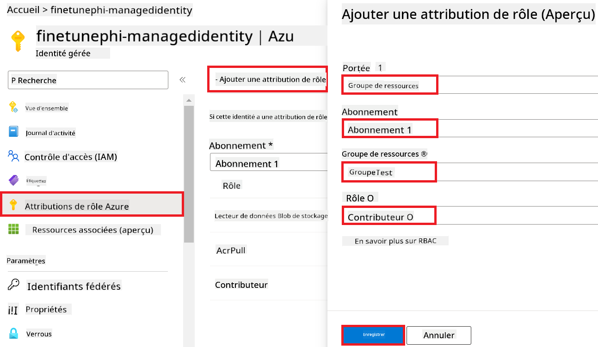
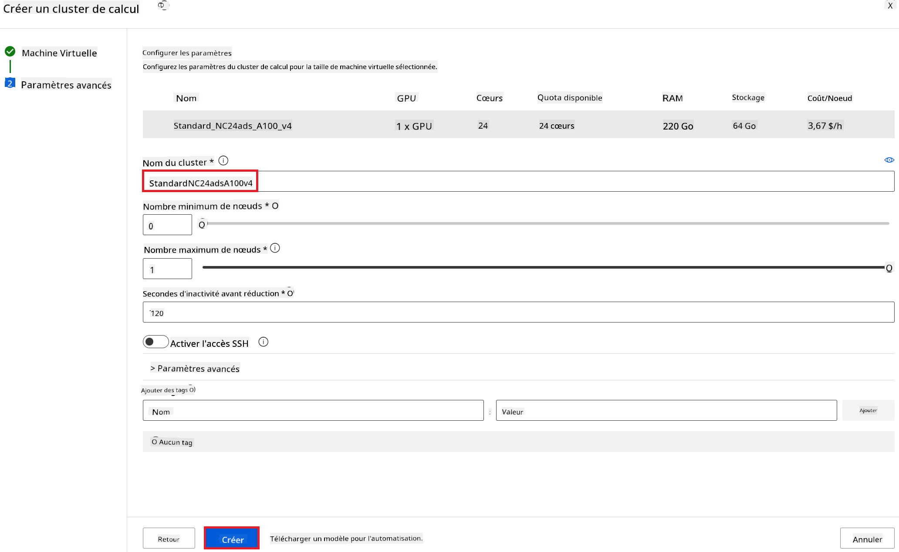
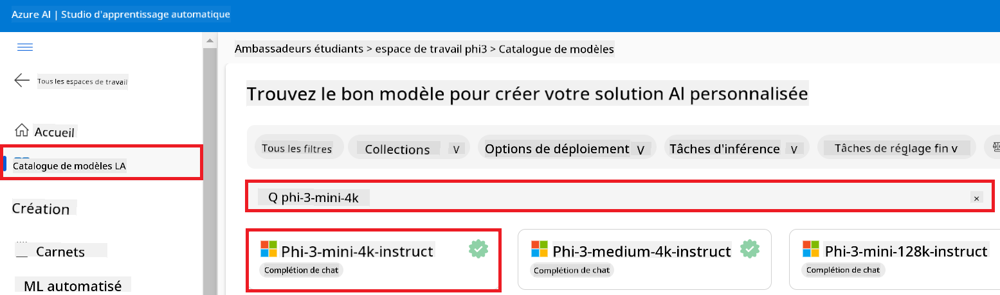
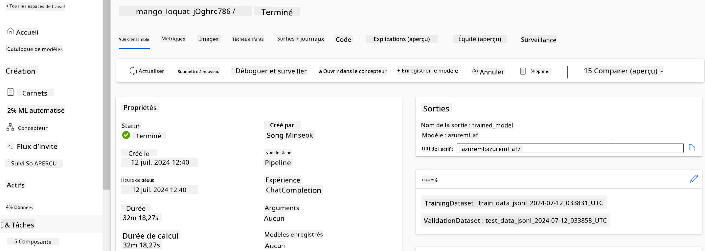
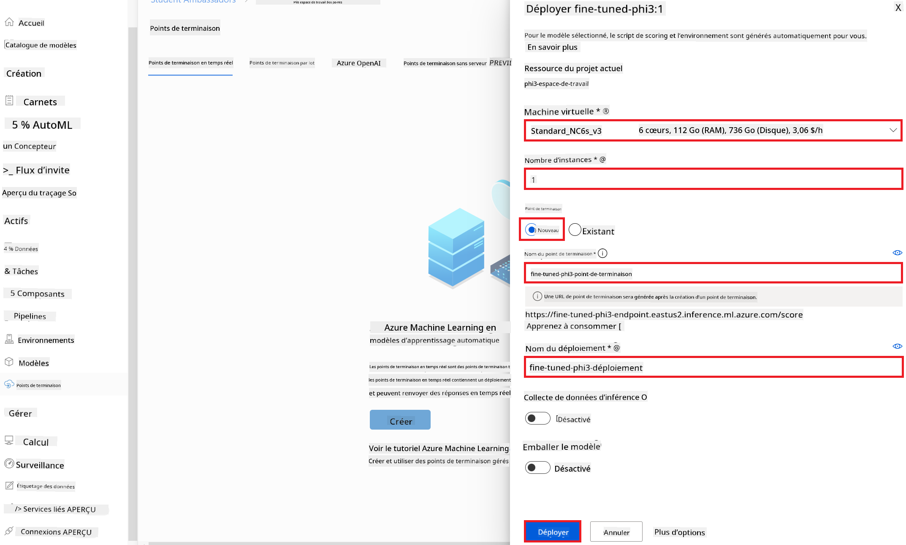

<!--
CO_OP_TRANSLATOR_METADATA:
{
  "original_hash": "0df910a227098303cc392b6ad204c271",
  "translation_date": "2026-01-06T04:02:11+00:00",
  "source_file": "md/02.Application/01.TextAndChat/Phi3/E2E_Phi-3-FineTuning_PromptFlow_Integration_AIFoundry.md",
  "language_code": "fr"
}
-->
# Affiner et intégrer des modèles Phi-3 personnalisés avec Prompt flow dans Azure AI Foundry

Cet exemple de bout en bout (E2E) est basé sur le guide "[Fine-Tune and Integrate Custom Phi-3 Models with Prompt Flow in Azure AI Foundry](https://techcommunity.microsoft.com/t5/educator-developer-blog/fine-tune-and-integrate-custom-phi-3-models-with-prompt-flow-in/ba-p/4191726?WT.mc_id=aiml-137032-kinfeylo)" de la communauté technique Microsoft. Il présente les processus d'affinage, de déploiement et d'intégration des modèles Phi-3 personnalisés avec Prompt flow dans Azure AI Foundry.
Contrairement à l'exemple E2E, "[Fine-Tune and Integrate Custom Phi-3 Models with Prompt Flow](./E2E_Phi-3-FineTuning_PromptFlow_Integration.md)", qui impliquait l'exécution de code localement, ce tutoriel se concentre entièrement sur l'affinage et l'intégration de votre modèle au sein d'Azure AI / ML Studio.

## Aperçu

Dans cet exemple E2E, vous apprendrez comment affiner le modèle Phi-3 et l'intégrer avec Prompt flow dans Azure AI Foundry. En tirant parti d'Azure AI / ML Studio, vous établirez un flux de travail pour le déploiement et l'utilisation de modèles d'IA personnalisés. Cet exemple E2E est divisé en trois scénarios :

**Scénario 1 : Configurer les ressources Azure et préparer l'affinage**

**Scénario 2 : Affiner le modèle Phi-3 et déployer dans Azure Machine Learning Studio**

**Scénario 3 : Intégrer avec Prompt flow et discuter avec votre modèle personnalisé dans Azure AI Foundry**

Voici un aperçu de cet exemple E2E.


### Table des matières

1. **[Scénario 1 : Configurer les ressources Azure et préparer l'affinage](../../../../../../md/02.Application/01.TextAndChat/Phi3)**
    - [Créer un espace de travail Azure Machine Learning](../../../../../../md/02.Application/01.TextAndChat/Phi3)
    - [Demander des quotas GPU dans la souscription Azure](../../../../../../md/02.Application/01.TextAndChat/Phi3)
    - [Ajouter une attribution de rôle](../../../../../../md/02.Application/01.TextAndChat/Phi3)
    - [Configurer le projet](../../../../../../md/02.Application/01.TextAndChat/Phi3)
    - [Préparer le jeu de données pour l'affinage](../../../../../../md/02.Application/01.TextAndChat/Phi3)

1. **[Scénario 2 : Affiner le modèle Phi-3 et déployer dans Azure Machine Learning Studio](../../../../../../md/02.Application/01.TextAndChat/Phi3)**
    - [Affiner le modèle Phi-3](../../../../../../md/02.Application/01.TextAndChat/Phi3)
    - [Déployer le modèle Phi-3 affiné](../../../../../../md/02.Application/01.TextAndChat/Phi3)

1. **[Scénario 3 : Intégrer avec Prompt flow et discuter avec votre modèle personnalisé dans Azure AI Foundry](../../../../../../md/02.Application/01.TextAndChat/Phi3)**
    - [Intégrer le modèle Phi-3 personnalisé avec Prompt flow](../../../../../../md/02.Application/01.TextAndChat/Phi3)
    - [Discuter avec votre modèle Phi-3 personnalisé](../../../../../../md/02.Application/01.TextAndChat/Phi3)

## Scénario 1 : Configurer les ressources Azure et préparer l'affinage

### Créer un espace de travail Azure Machine Learning

1. Tapez *azure machine learning* dans la **barre de recherche** en haut de la page du portail et sélectionnez **Azure Machine Learning** parmi les options qui apparaissent.

    

2. Sélectionnez **+ Créer** dans le menu de navigation.

3. Sélectionnez **Nouvel espace de travail** dans le menu de navigation.

    

4. Effectuez les tâches suivantes :

    - Sélectionnez votre **Abonnement** Azure.
    - Sélectionnez le **Groupe de ressources** à utiliser (créez-en un nouveau si nécessaire).
    - Saisissez un **Nom d'espace de travail**. Il doit être une valeur unique.
    - Sélectionnez la **Région** que vous souhaitez utiliser.
    - Sélectionnez le **Compte de stockage** à utiliser (créez-en un nouveau si nécessaire).
    - Sélectionnez le **Coffre de clés** à utiliser (créez-en un nouveau si nécessaire).
    - Sélectionnez les **Informations d'application** à utiliser (créez-en un nouveau si nécessaire).
    - Sélectionnez le **Registre de conteneurs** à utiliser (créez-en un nouveau si nécessaire).

    

5. Sélectionnez **Vérifier + créer**.

6. Sélectionnez **Créer**.

### Demander des quotas GPU dans la souscription Azure

Dans ce tutoriel, vous apprendrez à affiner et déployer un modèle Phi-3, en utilisant des GPU. Pour l'affinage, vous utiliserez le GPU *Standard_NC24ads_A100_v4*, qui nécessite une demande de quota. Pour le déploiement, vous utiliserez le GPU *Standard_NC6s_v3*, qui nécessite également une demande de quota.

> [!NOTE]
>
> Seules les souscriptions Pay-As-You-Go (type standard) sont éligibles à l'allocation GPU ; les souscriptions bénéficiant d'avantages ne sont actuellement pas prises en charge.
>

1. Visitez [Azure ML Studio](https://ml.azure.com/home?wt.mc_id=studentamb_279723).

1. Effectuez les tâches suivantes pour demander un quota *Standard NCADSA100v4 Family*:

    - Sélectionnez **Quota** dans l'onglet de gauche.
    - Sélectionnez la **famille de machines virtuelles** à utiliser. Par exemple, sélectionnez **Standard NCADSA100v4 Family Cluster Dedicated vCPUs**, qui inclut le GPU *Standard_NC24ads_A100_v4*.
    - Sélectionnez **Demander quota** dans le menu de navigation.

        

    - Sur la page Demande de quota, saisissez la **Nouvelle limite de cœurs** que vous souhaitez utiliser. Par exemple, 24.
    - Sur la page Demande de quota, sélectionnez **Soumettre** pour demander le quota GPU.

1. Effectuez les tâches suivantes pour demander un quota *Standard NCSv3 Family*:

    - Sélectionnez **Quota** dans l'onglet de gauche.
    - Sélectionnez la **famille de machines virtuelles** à utiliser. Par exemple, sélectionnez **Standard NCSv3 Family Cluster Dedicated vCPUs**, qui inclut le GPU *Standard_NC6s_v3*.
    - Sélectionnez **Demander quota** dans le menu de navigation.
    - Sur la page Demande de quota, saisissez la **Nouvelle limite de cœurs** que vous souhaitez utiliser. Par exemple, 24.
    - Sur la page Demande de quota, sélectionnez **Soumettre** pour demander le quota GPU.

### Ajouter une attribution de rôle

Pour affiner et déployer vos modèles, vous devez d'abord créer une identité gérée assignée par l'utilisateur (User Assigned Managed Identity - UAI) et lui attribuer les autorisations appropriées. Cette UAI sera utilisée pour l'authentification lors du déploiement.

#### Créer une identité gérée assignée par l'utilisateur (UAI)

1. Tapez *managed identities* dans la **barre de recherche** en haut de la page du portail et sélectionnez **Identités gérées** parmi les options qui apparaissent.

    

1. Sélectionnez **+ Créer**.

    

1. Effectuez les tâches suivantes :

    - Sélectionnez votre **Abonnement** Azure.
    - Sélectionnez le **Groupe de ressources** à utiliser (créez-en un nouveau si nécessaire).
    - Sélectionnez la **Région** que vous souhaitez utiliser.
    - Saisissez un **Nom**. Il doit être une valeur unique.

    

1. Sélectionnez **Vérifier + créer**.

1. Sélectionnez **+ Créer**.

#### Ajouter une attribution de rôle Contributeur à l'identité gérée

1. Accédez à la ressource Identité gérée que vous avez créée.

1. Sélectionnez **Attributions de rôles Azure** dans l'onglet de gauche.

1. Sélectionnez **+ Ajouter une attribution de rôle** dans le menu de navigation.

1. Dans la page Ajouter une attribution de rôle, effectuez les tâches suivantes :
    - Sélectionnez le **Portée** à **Groupe de ressources**.
    - Sélectionnez votre **Abonnement** Azure.
    - Sélectionnez le **Groupe de ressources** à utiliser.
    - Sélectionnez le **Rôle** à **Contributeur**.

    

2. Sélectionnez **Enregistrer**.

#### Ajouter une attribution de rôle Storage Blob Data Reader à l'identité gérée

1. Tapez *storage accounts* dans la **barre de recherche** en haut du portail et sélectionnez **Comptes de stockage** parmi les options qui apparaissent.

    

1. Sélectionnez le compte de stockage associé à l'espace de travail Azure Machine Learning que vous avez créé. Par exemple, *finetunephistorage*.

1. Effectuez les tâches suivantes pour accéder à la page Ajouter une attribution de rôle :

    - Accédez au compte de stockage Azure que vous avez créé.
    - Sélectionnez **Contrôle d'accès (IAM)** dans l'onglet de gauche.
    - Sélectionnez **+ Ajouter** dans le menu de navigation.
    - Sélectionnez **Ajouter une attribution de rôle** dans le menu de navigation.

    

1. Dans la page Ajouter une attribution de rôle, effectuez les tâches suivantes :

    - Dans la page Rôle, tapez *Storage Blob Data Reader* dans la **barre de recherche** et sélectionnez **Storage Blob Data Reader** parmi les options qui apparaissent.
    - Dans la page Rôle, sélectionnez **Suivant**.
    - Dans la page Membres, sélectionnez **Attribuer l'accès à** **Identité gérée**.
    - Dans la page Membres, sélectionnez **+ Sélectionner des membres**.
    - Dans la page Sélectionner des identités gérées, sélectionnez votre **Abonnement** Azure.
    - Dans la page Sélectionner des identités gérées, sélectionnez l'**Identité gérée** que vous avez créée.
    - Dans la page Sélectionner des identités gérées, sélectionnez l'identité gérée que vous avez créée. Par exemple, *finetunephi-managedidentity*.
    - Dans la page Sélectionner des identités gérées, sélectionnez **Sélectionner**.

    

1. Sélectionnez **Vérifier + attribuer**.

#### Ajouter une attribution de rôle AcrPull à l'identité gérée

1. Tapez *container registries* dans la **barre de recherche** en haut du portail et sélectionnez **Registres de conteneurs** parmi les options qui apparaissent.

    

1. Sélectionnez le registre de conteneurs associé à l'espace de travail Azure Machine Learning. Par exemple, *finetunephicontainerregistry*.

1. Effectuez les tâches suivantes pour accéder à la page Ajouter une attribution de rôle :

    - Sélectionnez **Contrôle d'accès (IAM)** dans l'onglet de gauche.
    - Sélectionnez **+ Ajouter** dans le menu de navigation.
    - Sélectionnez **Ajouter une attribution de rôle** dans le menu de navigation.

1. Dans la page Ajouter une attribution de rôle, effectuez les tâches suivantes :

    - Dans la page Rôle, tapez *AcrPull* dans la **barre de recherche** et sélectionnez **AcrPull** parmi les options qui apparaissent.
    - Dans la page Rôle, sélectionnez **Suivant**.
    - Dans la page Membres, sélectionnez **Attribuer l'accès à** **Identité gérée**.
    - Dans la page Membres, sélectionnez **+ Sélectionner des membres**.
    - Dans la page Sélectionner des identités gérées, sélectionnez votre **Abonnement** Azure.
    - Dans la page Sélectionner des identités gérées, sélectionnez l'**Identité gérée** que vous avez créée.
    - Dans la page Sélectionner des identités gérées, sélectionnez l'identité gérée créée. Par exemple, *finetunephi-managedidentity*.
    - Dans la page Sélectionner des identités gérées, sélectionnez **Sélectionner**.
    - Sélectionnez **Vérifier + attribuer**.

### Configurer le projet

Pour télécharger les jeux de données nécessaires à l'affinage, vous allez configurer un environnement local.

Dans cet exercice, vous allez

- Créer un dossier pour y travailler.
- Créer un environnement virtuel.
- Installer les paquets requis.
- Créer un fichier *download_dataset.py* pour télécharger le jeu de données.

#### Créer un dossier pour y travailler

1. Ouvrez une fenêtre de terminal et tapez la commande suivante pour créer un dossier nommé *finetune-phi* dans le chemin par défaut.

    ```console
    mkdir finetune-phi
    ```

2. Tapez la commande suivante dans votre terminal pour naviguer vers le dossier *finetune-phi* que vous avez créé.

    ```console
    cd finetune-phi
    ```

#### Créer un environnement virtuel

1. Tapez la commande suivante dans votre terminal pour créer un environnement virtuel nommé *.venv*.

    ```console
    python -m venv .venv
    ```

2. Tapez la commande suivante dans votre terminal pour activer l’environnement virtuel.

    ```console
    .venv\Scripts\activate.bat
    ```

> [!NOTE]
> Si cela a fonctionné, vous devriez voir *(.venv)* avant l’invite de commande.

#### Installer les paquets requis

1. Tapez les commandes suivantes dans votre terminal pour installer les paquets nécessaires.

    ```console
    pip install datasets==2.19.1
    ```

#### Créer `download_dataset.py`

> [!NOTE]
> Structure complète du dossier :
>
> ```text
> └── YourUserName
> .    └── finetune-phi
> .        └── download_dataset.py
> ```

1. Ouvrez **Visual Studio Code**.

1. Sélectionnez **Fichier** dans la barre de menu.

1. Sélectionnez **Ouvrir un dossier**.

1. Sélectionnez le dossier *finetune-phi* que vous avez créé, situé à *C:\Users\yourUserName\finetune-phi*.

    

1. Dans le volet gauche de Visual Studio Code, faites un clic droit et sélectionnez **Nouveau fichier** pour créer un nouveau fichier nommé *download_dataset.py*.

    

### Préparer le jeu de données pour l’affinage

Dans cet exercice, vous allez exécuter le fichier *download_dataset.py* pour télécharger les jeux de données *ultrachat_200k* dans votre environnement local. Vous utiliserez ensuite ces jeux de données pour affiner le modèle Phi-3 dans Azure Machine Learning.

Dans cet exercice, vous allez :

- Ajouter du code dans le fichier *download_dataset.py* pour télécharger les jeux de données.
- Exécuter le fichier *download_dataset.py* pour télécharger les jeux de données dans votre environnement local.

#### Téléchargez votre jeu de données à l’aide de *download_dataset.py*

1. Ouvrez le fichier *download_dataset.py* dans Visual Studio Code.

1. Ajoutez le code suivant dans le fichier *download_dataset.py*.

    ```python
    import json
    import os
    from datasets import load_dataset

    def load_and_split_dataset(dataset_name, config_name, split_ratio):
        """
        Load and split a dataset.
        """
        # Charger l'ensemble de données avec le nom, la configuration et le ratio de division spécifiés
        dataset = load_dataset(dataset_name, config_name, split=split_ratio)
        print(f"Original dataset size: {len(dataset)}")
        
        # Diviser l'ensemble de données en ensembles d'entraînement et de test (80% entraînement, 20% test)
        split_dataset = dataset.train_test_split(test_size=0.2)
        print(f"Train dataset size: {len(split_dataset['train'])}")
        print(f"Test dataset size: {len(split_dataset['test'])}")
        
        return split_dataset

    def save_dataset_to_jsonl(dataset, filepath):
        """
        Save a dataset to a JSONL file.
        """
        # Créer le répertoire s'il n'existe pas
        os.makedirs(os.path.dirname(filepath), exist_ok=True)
        
        # Ouvrir le fichier en mode écriture
        with open(filepath, 'w', encoding='utf-8') as f:
            # Itérer sur chaque enregistrement dans l'ensemble de données
            for record in dataset:
                # Convertir l'enregistrement en objet JSON et l'écrire dans le fichier
                json.dump(record, f)
                # Écrire un caractère de saut de ligne pour séparer les enregistrements
                f.write('\n')
        
        print(f"Dataset saved to {filepath}")

    def main():
        """
        Main function to load, split, and save the dataset.
        """
        # Charger et diviser l'ensemble de données ULTRACHAT_200k avec une configuration spécifique et un ratio de division
        dataset = load_and_split_dataset("HuggingFaceH4/ultrachat_200k", 'default', 'train_sft[:1%]')
        
        # Extraire les ensembles de données d'entraînement et de test de la division
        train_dataset = dataset['train']
        test_dataset = dataset['test']

        # Enregistrer l'ensemble d'entraînement dans un fichier JSONL
        save_dataset_to_jsonl(train_dataset, "data/train_data.jsonl")
        
        # Enregistrer l'ensemble de test dans un fichier JSONL séparé
        save_dataset_to_jsonl(test_dataset, "data/test_data.jsonl")

    if __name__ == "__main__":
        main()

    ```

1. Tapez la commande suivante dans votre terminal pour exécuter le script et télécharger le jeu de données dans votre environnement local.

    ```console
    python download_dataset.py
    ```

1. Vérifiez que les jeux de données ont été enregistrés avec succès dans votre dossier local *finetune-phi/data*.

> [!NOTE]
>
> #### Remarque sur la taille du jeu de données et le temps d’affinage
>
> Dans ce tutoriel, vous utilisez seulement 1 % du jeu de données (`split='train[:1%]'`). Cela réduit considérablement la quantité de données, accélérant à la fois le téléchargement et le processus d’affinage. Vous pouvez ajuster ce pourcentage pour trouver un équilibre optimal entre le temps d’entraînement et la performance du modèle. Utiliser un sous-ensemble plus petit du jeu de données réduit le temps nécessaire pour l’affinage, rendant le processus plus gérable pour un tutoriel.

## Scénario 2 : Affiner le modèle Phi-3 et le déployer dans Azure Machine Learning Studio

### Affiner le modèle Phi-3

Dans cet exercice, vous allez affiner le modèle Phi-3 dans Azure Machine Learning Studio.

Dans cet exercice, vous allez :

- Créer un cluster informatique pour l’affinage.
- Affiner le modèle Phi-3 dans Azure Machine Learning Studio.

#### Créer un cluster informatique pour l’affinage

1. Visitez [Azure ML Studio](https://ml.azure.com/home?wt.mc_id=studentamb_279723).

1. Sélectionnez **Compute** dans l’onglet à gauche.

1. Sélectionnez **Compute clusters** dans le menu de navigation.

1. Sélectionnez **+ Nouveau**.

    

1. Effectuez les tâches suivantes :

    - Sélectionnez la **Région** que vous souhaitez utiliser.
    - Sélectionnez le **niveau de machine virtuelle** sur **Dédié**.
    - Sélectionnez le **type de machine virtuelle** sur **GPU**.
    - Sélectionnez le filtre **Taille de machine virtuelle** sur **Sélectionner parmi toutes les options**.
    - Sélectionnez la **taille de machine virtuelle** sur **Standard_NC24ads_A100_v4**.

    

1. Sélectionnez **Suivant**.

1. Effectuez les tâches suivantes :

    - Entrez un **Nom de cluster**. Il doit être une valeur unique.
    - Sélectionnez le **Nombre minimum de nœuds** sur **0**.
    - Sélectionnez le **Nombre maximum de nœuds** sur **1**.
    - Sélectionnez le **Temps avant la réduction d’échelle en secondes** sur **120**.

    

1. Sélectionnez **Créer**.

#### Affiner le modèle Phi-3

1. Visitez [Azure ML Studio](https://ml.azure.com/home?wt.mc_id=studentamb_279723).

1. Sélectionnez l’espace de travail Azure Machine Learning que vous avez créé.

    

1. Effectuez les tâches suivantes :

    - Sélectionnez **Catalogue de modèles** dans l’onglet à gauche.
    - Tapez *phi-3-mini-4k* dans la **barre de recherche** et sélectionnez **Phi-3-mini-4k-instruct** parmi les options qui s’affichent.

    

1. Sélectionnez **Fine-tune** dans le menu de navigation.

    

1. Effectuez les tâches suivantes :

    - Sélectionnez **Sélectionner le type de tâche** sur **Chat completion**.
    - Sélectionnez **+ Sélectionner les données** pour téléverser les **Données d’entraînement**.
    - Sélectionnez le type de téléversement des données de validation sur **Fournir des données de validation différentes**.
    - Sélectionnez **+ Sélectionner les données** pour téléverser les **Données de validation**.

    

> [!TIP]
>
> Vous pouvez sélectionner **Paramètres avancés** pour personnaliser des configurations telles que **learning_rate** et **lr_scheduler_type** afin d’optimiser le processus d’affinage selon vos besoins spécifiques.

1. Sélectionnez **Terminer**.

1. Dans cet exercice, vous avez affiné avec succès le modèle Phi-3 en utilisant Azure Machine Learning. Veuillez noter que le processus d’affinage peut prendre un temps considérable. Après avoir lancé la tâche d’affinage, vous devez attendre sa complétion. Vous pouvez suivre le statut de la tâche d’affinage en naviguant dans l’onglet Jobs à gauche de votre espace de travail Azure Machine Learning. Dans la prochaine série, vous déploierez le modèle affiné et l’intégrerez avec Prompt flow.

    

### Déployer le modèle Phi-3 affiné

Pour intégrer le modèle Phi-3 affiné avec Prompt flow, vous devez déployer le modèle afin de le rendre accessible pour l’inférence en temps réel. Ce processus implique d’enregistrer le modèle, de créer un point de terminaison en ligne, puis de déployer le modèle.

Dans cet exercice, vous allez :

- Enregistrer le modèle affiné dans l’espace de travail Azure Machine Learning.
- Créer un point de terminaison en ligne.
- Déployer le modèle Phi-3 affiné enregistré.

#### Enregistrer le modèle affiné

1. Visitez [Azure ML Studio](https://ml.azure.com/home?wt.mc_id=studentamb_279723).

1. Sélectionnez l’espace de travail Azure Machine Learning que vous avez créé.

    

1. Sélectionnez **Modèles** dans l’onglet à gauche.
1. Sélectionnez **+ Enregistrer**.
1. Sélectionnez **Depuis la sortie d’un job**.

    

1. Sélectionnez le job que vous avez créé.

    

1. Sélectionnez **Suivant**.

1. Sélectionnez **Type de modèle** sur **MLflow**.

1. Assurez-vous que **Sortie du job** est sélectionné ; cela devrait être automatique.

    

2. Sélectionnez **Suivant**.

3. Sélectionnez **Enregistrer**.

    

4. Vous pouvez visualiser votre modèle enregistré en naviguant dans le menu **Modèles** de l’onglet à gauche.

    

#### Déployer le modèle affiné

1. Rendez-vous dans l’espace de travail Azure Machine Learning que vous avez créé.

1. Sélectionnez **Points de terminaison** dans l’onglet à gauche.

1. Sélectionnez **Points de terminaison en temps réel** dans le menu de navigation.

    

1. Sélectionnez **Créer**.

1. Sélectionnez le modèle enregistré que vous avez créé.

    

1. Sélectionnez **Sélectionner**.

1. Effectuez les tâches suivantes :

    - Sélectionnez **Machine virtuelle** sur *Standard_NC6s_v3*.
    - Sélectionnez le **Nombre d’instances** que vous souhaitez utiliser. Par exemple, *1*.
    - Sélectionnez le **Point de terminaison** sur **Nouveau** pour créer un point de terminaison.
    - Entrez un **Nom de point de terminaison**. Il doit être unique.
    - Entrez un **Nom de déploiement**. Il doit être unique.

    

1. Sélectionnez **Déployer**.

> [!WARNING]
> Pour éviter des frais supplémentaires sur votre compte, assurez-vous de supprimer le point de terminaison créé dans l’espace de travail Azure Machine Learning.
>

#### Vérifier le statut du déploiement dans Azure Machine Learning Workspace

1. Rendez-vous dans l’espace de travail Azure Machine Learning que vous avez créé.

1. Sélectionnez **Points de terminaison** dans l’onglet à gauche.

1. Sélectionnez le point de terminaison que vous avez créé.

    

1. Sur cette page, vous pouvez gérer les points de terminaison pendant le processus de déploiement.

> [!NOTE]
> Une fois le déploiement terminé, assurez-vous que **Trafic en direct** est réglé à **100 %**. S’il ne l’est pas, sélectionnez **Mettre à jour le trafic** pour ajuster les paramètres de trafic. Notez que vous ne pouvez pas tester le modèle si le trafic est réglé à 0 %.
>
> 
>

## Scénario 3 : Intégrer avec Prompt flow et discuter avec votre modèle personnalisé dans Azure AI Foundry

### Intégrer le modèle Phi-3 personnalisé avec Prompt flow

Après avoir déployé avec succès votre modèle affiné, vous pouvez maintenant l’intégrer avec Prompt Flow pour utiliser votre modèle dans des applications temps réel, permettant une variété de tâches interactives avec votre modèle Phi-3 personnalisé.

Dans cet exercice, vous allez :

- Créer un Hub Azure AI Foundry.
- Créer un projet Azure AI Foundry.
- Créer un Prompt flow.
- Ajouter une connexion personnalisée pour le modèle Phi-3 affiné.
- Configurer Prompt flow pour discuter avec votre modèle Phi-3 personnalisé.

> [!NOTE]
> Vous pouvez également intégrer Promptflow en utilisant Azure ML Studio. Le même processus d’intégration peut être appliqué à Azure ML Studio.

#### Créer un Hub Azure AI Foundry

Vous devez créer un Hub avant de créer un projet. Un Hub agit comme un groupe de ressources, vous permettant d’organiser et de gérer plusieurs projets dans Azure AI Foundry.

1. Visitez [Azure AI Foundry](https://ai.azure.com/?WT.mc_id=aiml-137032-kinfeylo).

1. Sélectionnez **Tous les hubs** dans l’onglet à gauche.

1. Sélectionnez **+ Nouveau hub** dans le menu de navigation.


1. Effectuez les tâches suivantes :

    - Saisissez le **Nom du hub**. Il doit s'agir d'une valeur unique.
    - Sélectionnez votre **Abonnement** Azure.
    - Sélectionnez le **Groupe de ressources** à utiliser (créez-en un nouveau si nécessaire).
    - Sélectionnez la **Région** que vous souhaitez utiliser.
    - Sélectionnez **Connecter les services Azure AI** à utiliser (créez-en un nouveau si nécessaire).
    - Sélectionnez **Connecter Azure AI Search** sur **Ignorer la connexion**.


1. Sélectionnez **Suivant**.

#### Créer un projet Azure AI Foundry

1. Dans le Hub que vous avez créé, sélectionnez **Tous les projets** dans l'onglet à gauche.

1. Sélectionnez **+ Nouveau projet** dans le menu de navigation.


1. Saisissez le **Nom du projet**. Il doit s'agir d'une valeur unique.


1. Sélectionnez **Créer un projet**.

#### Ajouter une connexion personnalisée pour le modèle Phi-3 affiné

Pour intégrer votre modèle Phi-3 personnalisé avec Prompt flow, vous devez enregistrer le point de terminaison et la clé du modèle dans une connexion personnalisée. Cette configuration garantit l'accès à votre modèle Phi-3 personnalisé dans Prompt flow.

#### Définir la clé API et l'URI du point de terminaison du modèle Phi-3 affiné

1. Visitez [Azure ML Studio](https://ml.azure.com/home?WT.mc_id=aiml-137032-kinfeylo).

1. Accédez à l’espace de travail Azure Machine Learning que vous avez créé.

1. Sélectionnez **Points de terminaison** dans l'onglet à gauche.


1. Sélectionnez le point de terminaison que vous avez créé.


1. Sélectionnez **Consommer** dans le menu de navigation.

1. Copiez votre **Point de terminaison REST** et votre **Clé principale**.


#### Ajouter la connexion personnalisée

1. Visitez [Azure AI Foundry](https://ai.azure.com/?WT.mc_id=aiml-137032-kinfeylo).

1. Accédez au projet Azure AI Foundry que vous avez créé.

1. Dans le projet que vous avez créé, sélectionnez **Paramètres** dans l'onglet à gauche.

1. Sélectionnez **+ Nouvelle connexion**.


1. Sélectionnez **Clés personnalisées** dans le menu de navigation.


1. Effectuez les tâches suivantes :

    - Sélectionnez **+ Ajouter une paire clé-valeur**.
    - Pour le nom de la clé, saisissez **endpoint** et collez le point de terminaison copié depuis Azure ML Studio dans le champ valeur.
    - Sélectionnez à nouveau **+ Ajouter une paire clé-valeur**.
    - Pour le nom de la clé, saisissez **key** et collez la clé copiée depuis Azure ML Studio dans le champ valeur.
    - Après avoir ajouté les clés, sélectionnez **est secret** pour empêcher que la clé ne soit exposée.


1. Sélectionnez **Ajouter une connexion**.

#### Créer un Prompt flow

Vous avez ajouté une connexion personnalisée dans Azure AI Foundry. Maintenant, créons un Prompt flow en suivant les étapes ci-dessous. Ensuite, vous connecterez ce Prompt flow à la connexion personnalisée afin de pouvoir utiliser le modèle affiné dans le Prompt flow.

1. Accédez au projet Azure AI Foundry que vous avez créé.

1. Sélectionnez **Prompt flow** dans l'onglet à gauche.

1. Sélectionnez **+ Créer** dans le menu de navigation.


1. Sélectionnez **Chat flow** dans le menu de navigation.


1. Saisissez le **Nom du dossier** à utiliser.


2. Sélectionnez **Créer**.

#### Configurer le Prompt flow pour discuter avec votre modèle Phi-3 personnalisé

Vous devez intégrer le modèle Phi-3 affiné dans un Prompt flow. Cependant, le Prompt flow existant fourni n'est pas conçu à cet effet. Par conséquent, vous devez redessiner le Prompt flow pour permettre l'intégration du modèle personnalisé.

1. Dans le Prompt flow, effectuez les tâches suivantes pour reconstruire le flux existant :

    - Sélectionnez **Mode fichier brut**.
    - Supprimez tout le code existant dans le fichier *flow.dag.yml*.
    - Ajoutez le code suivant dans le fichier *flow.dag.yml*.

        ```yml
        inputs:
          input_data:
            type: string
            default: "Who founded Microsoft?"

        outputs:
          answer:
            type: string
            reference: ${integrate_with_promptflow.output}

        nodes:
        - name: integrate_with_promptflow
          type: python
          source:
            type: code
            path: integrate_with_promptflow.py
          inputs:
            input_data: ${inputs.input_data}
        ```

    - Sélectionnez **Enregistrer**.


1. Ajoutez le code suivant dans le fichier *integrate_with_promptflow.py* pour utiliser le modèle Phi-3 personnalisé dans Prompt flow.

    ```python
    import logging
    import requests
    from promptflow import tool
    from promptflow.connections import CustomConnection

    # Configuration de la journalisation
    logging.basicConfig(
        format="%(asctime)s - %(levelname)s - %(name)s - %(message)s",
        datefmt="%Y-%m-%d %H:%M:%S",
        level=logging.DEBUG
    )
    logger = logging.getLogger(__name__)

    def query_phi3_model(input_data: str, connection: CustomConnection) -> str:
        """
        Send a request to the Phi-3 model endpoint with the given input data using Custom Connection.
        """

        # "connection" est le nom de la connexion personnalisée, "endpoint", "key" sont les clés dans la connexion personnalisée
        endpoint_url = connection.endpoint
        api_key = connection.key

        headers = {
            "Content-Type": "application/json",
            "Authorization": f"Bearer {api_key}"
        }
        data = {
            "input_data": {
                "input_string": [
                    {"role": "user", "content": input_data}
                ],
                "parameters": {
                    "temperature": 0.7,
                    "max_new_tokens": 128
                }
            }
        }
        try:
            response = requests.post(endpoint_url, json=data, headers=headers)
            response.raise_for_status()
            
            # Enregistrer la réponse JSON complète
            logger.debug(f"Full JSON response: {response.json()}")

            result = response.json()["output"]
            logger.info("Successfully received response from Azure ML Endpoint.")
            return result
        except requests.exceptions.RequestException as e:
            logger.error(f"Error querying Azure ML Endpoint: {e}")
            raise

    @tool
    def my_python_tool(input_data: str, connection: CustomConnection) -> str:
        """
        Tool function to process input data and query the Phi-3 model.
        """
        return query_phi3_model(input_data, connection)

    ```


> [!NOTE]
> Pour plus d'informations détaillées sur l'utilisation de Prompt flow dans Azure AI Foundry, vous pouvez consulter [Prompt flow dans Azure AI Foundry](https://learn.microsoft.com/azure/ai-studio/how-to/prompt-flow).

1. Sélectionnez **Entrée de chat**, **Sortie de chat** pour activer le chat avec votre modèle.


1. Vous êtes maintenant prêt à discuter avec votre modèle Phi-3 personnalisé. Dans l'exercice suivant, vous apprendrez à démarrer le Prompt flow et à l'utiliser pour discuter avec votre modèle Phi-3 affiné.

> [!NOTE]
>
> Le flux reconstruit devrait ressembler à l'image ci-dessous :
>
> 
>

### Discuter avec votre modèle Phi-3 personnalisé

Maintenant que vous avez affiné et intégré votre modèle Phi-3 personnalisé avec Prompt flow, vous êtes prêt à commencer à interagir avec lui. Cet exercice vous guidera à travers le processus de configuration et de lancement d'une conversation avec votre modèle en utilisant Prompt flow. En suivant ces étapes, vous pourrez exploiter pleinement les capacités de votre modèle Phi-3 affiné pour diverses tâches et conversations.

- Discutez avec votre modèle Phi-3 personnalisé en utilisant Prompt flow.

#### Démarrer Prompt flow

1. Sélectionnez **Démarrer les sessions de calcul** pour lancer Prompt flow.


1. Sélectionnez **Valider et analyser l'entrée** pour renouveler les paramètres.


1. Sélectionnez la **Valeur** de la **connexion** vers la connexion personnalisée que vous avez créée. Par exemple, *connection*.


#### Discuter avec votre modèle personnalisé

1. Sélectionnez **Chat**.


1. Voici un exemple de résultats : vous pouvez maintenant discuter avec votre modèle Phi-3 personnalisé. Il est recommandé de poser des questions basées sur les données utilisées pour l'affinage.


---

<!-- CO-OP TRANSLATOR DISCLAIMER START -->
**Avertissement** :  
Ce document a été traduit à l’aide du service de traduction automatique [Co-op Translator](https://github.com/Azure/co-op-translator). Bien que nous nous efforçons d’assurer l'exactitude, veuillez noter que les traductions automatisées peuvent contenir des erreurs ou des imprécisions. Le document original dans sa langue d’origine doit être considéré comme la source faisant foi. Pour toute information essentielle, il est recommandé de recourir à une traduction professionnelle réalisée par un humain. Nous déclinons toute responsabilité en cas de malentendus ou d’interprétations erronées résultant de l’utilisation de cette traduction.
<!-- CO-OP TRANSLATOR DISCLAIMER END -->