<!--
CO_OP_TRANSLATOR_METADATA:
{
  "original_hash": "ecbd9179a21edbaafaf114d47f09f3e3",
  "translation_date": "2025-07-17T00:56:08+00:00",
  "source_file": "md/02.Application/01.TextAndChat/Phi3/E2E_Phi-3-FineTuning_PromptFlow_Integration_AIFoundry.md",
  "language_code": "fr"
}
-->
# Affiner et intégrer des modèles Phi-3 personnalisés avec Prompt flow dans Azure AI Foundry

Cet exemple de bout en bout (E2E) est basé sur le guide "[Fine-Tune and Integrate Custom Phi-3 Models with Prompt Flow in Azure AI Foundry](https://techcommunity.microsoft.com/t5/educator-developer-blog/fine-tune-and-integrate-custom-phi-3-models-with-prompt-flow-in/ba-p/4191726?WT.mc_id=aiml-137032-kinfeylo)" de la communauté technique Microsoft. Il présente les processus d’affinage, de déploiement et d’intégration des modèles Phi-3 personnalisés avec Prompt flow dans Azure AI Foundry. Contrairement à l’exemple E2E, "[Fine-Tune and Integrate Custom Phi-3 Models with Prompt Flow](./E2E_Phi-3-FineTuning_PromptFlow_Integration.md)", qui impliquait l’exécution de code en local, ce tutoriel se concentre entièrement sur l’affinage et l’intégration de votre modèle au sein d’Azure AI / ML Studio.

## Vue d’ensemble

Dans cet exemple E2E, vous apprendrez à affiner le modèle Phi-3 et à l’intégrer avec Prompt flow dans Azure AI Foundry. En tirant parti d’Azure AI / ML Studio, vous mettrez en place un flux de travail pour déployer et utiliser des modèles d’IA personnalisés. Cet exemple E2E est divisé en trois scénarios :

**Scénario 1 : Configurer les ressources Azure et préparer l’affinage**

**Scénario 2 : Affiner le modèle Phi-3 et déployer dans Azure Machine Learning Studio**

**Scénario 3 : Intégrer avec Prompt flow et discuter avec votre modèle personnalisé dans Azure AI Foundry**

Voici un aperçu de cet exemple E2E.


### Table des matières

1. **[Scénario 1 : Configurer les ressources Azure et préparer l’affinage](../../../../../../md/02.Application/01.TextAndChat/Phi3)**
    - [Créer un espace de travail Azure Machine Learning](../../../../../../md/02.Application/01.TextAndChat/Phi3)
    - [Demander des quotas GPU dans l’abonnement Azure](../../../../../../md/02.Application/01.TextAndChat/Phi3)
    - [Ajouter une attribution de rôle](../../../../../../md/02.Application/01.TextAndChat/Phi3)
    - [Configurer le projet](../../../../../../md/02.Application/01.TextAndChat/Phi3)
    - [Préparer le jeu de données pour l’affinage](../../../../../../md/02.Application/01.TextAndChat/Phi3)

1. **[Scénario 2 : Affiner le modèle Phi-3 et déployer dans Azure Machine Learning Studio](../../../../../../md/02.Application/01.TextAndChat/Phi3)**
    - [Affiner le modèle Phi-3](../../../../../../md/02.Application/01.TextAndChat/Phi3)
    - [Déployer le modèle Phi-3 affiné](../../../../../../md/02.Application/01.TextAndChat/Phi3)

1. **[Scénario 3 : Intégrer avec Prompt flow et discuter avec votre modèle personnalisé dans Azure AI Foundry](../../../../../../md/02.Application/01.TextAndChat/Phi3)**
    - [Intégrer le modèle Phi-3 personnalisé avec Prompt flow](../../../../../../md/02.Application/01.TextAndChat/Phi3)
    - [Discuter avec votre modèle Phi-3 personnalisé](../../../../../../md/02.Application/01.TextAndChat/Phi3)

## Scénario 1 : Configurer les ressources Azure et préparer l’affinage

### Créer un espace de travail Azure Machine Learning

1. Tapez *azure machine learning* dans la **barre de recherche** en haut de la page du portail et sélectionnez **Azure Machine Learning** parmi les options proposées.

    

2. Sélectionnez **+ Créer** dans le menu de navigation.

3. Sélectionnez **Nouvel espace de travail** dans le menu de navigation.

    

4. Effectuez les tâches suivantes :

    - Sélectionnez votre **Abonnement** Azure.
    - Sélectionnez le **Groupe de ressources** à utiliser (créez-en un nouveau si nécessaire).
    - Saisissez un **Nom d’espace de travail**. Il doit être unique.
    - Sélectionnez la **Région** que vous souhaitez utiliser.
    - Sélectionnez le **Compte de stockage** à utiliser (créez-en un nouveau si nécessaire).
    - Sélectionnez le **Coffre de clés** à utiliser (créez-en un nouveau si nécessaire).
    - Sélectionnez les **Application insights** à utiliser (créez-en un nouveau si nécessaire).
    - Sélectionnez le **Registre de conteneurs** à utiliser (créez-en un nouveau si nécessaire).

    

5. Sélectionnez **Vérifier + créer**.

6. Sélectionnez **Créer**.

### Demander des quotas GPU dans l’abonnement Azure

Dans ce tutoriel, vous apprendrez à affiner et déployer un modèle Phi-3 en utilisant des GPU. Pour l’affinage, vous utiliserez le GPU *Standard_NC24ads_A100_v4*, qui nécessite une demande de quota. Pour le déploiement, vous utiliserez le GPU *Standard_NC6s_v3*, qui nécessite également une demande de quota.

> [!NOTE]
>
> Seuls les abonnements Pay-As-You-Go (type d’abonnement standard) sont éligibles à l’allocation GPU ; les abonnements bénéficiant d’avantages ne sont pas encore pris en charge.
>

1. Rendez-vous sur [Azure ML Studio](https://ml.azure.com/home?wt.mc_id=studentamb_279723).

1. Effectuez les tâches suivantes pour demander un quota *Standard NCADSA100v4 Family* :

    - Sélectionnez **Quota** dans l’onglet à gauche.
    - Sélectionnez la **famille de machines virtuelles** à utiliser. Par exemple, sélectionnez **Standard NCADSA100v4 Family Cluster Dedicated vCPUs**, qui inclut le GPU *Standard_NC24ads_A100_v4*.
    - Sélectionnez **Demander un quota** dans le menu de navigation.

        

    - Sur la page Demander un quota, saisissez la **nouvelle limite de cœurs** que vous souhaitez utiliser. Par exemple, 24.
    - Sur la page Demander un quota, sélectionnez **Soumettre** pour demander le quota GPU.

1. Effectuez les tâches suivantes pour demander un quota *Standard NCSv3 Family* :

    - Sélectionnez **Quota** dans l’onglet à gauche.
    - Sélectionnez la **famille de machines virtuelles** à utiliser. Par exemple, sélectionnez **Standard NCSv3 Family Cluster Dedicated vCPUs**, qui inclut le GPU *Standard_NC6s_v3*.
    - Sélectionnez **Demander un quota** dans le menu de navigation.
    - Sur la page Demander un quota, saisissez la **nouvelle limite de cœurs** que vous souhaitez utiliser. Par exemple, 24.
    - Sur la page Demander un quota, sélectionnez **Soumettre** pour demander le quota GPU.

### Ajouter une attribution de rôle

Pour affiner et déployer vos modèles, vous devez d’abord créer une identité gérée attribuée par l’utilisateur (User Assigned Managed Identity - UAI) et lui attribuer les autorisations appropriées. Cette UAI sera utilisée pour l’authentification lors du déploiement.

#### Créer une identité gérée attribuée par l’utilisateur (UAI)

1. Tapez *managed identities* dans la **barre de recherche** en haut de la page du portail et sélectionnez **Identités gérées** parmi les options proposées.

    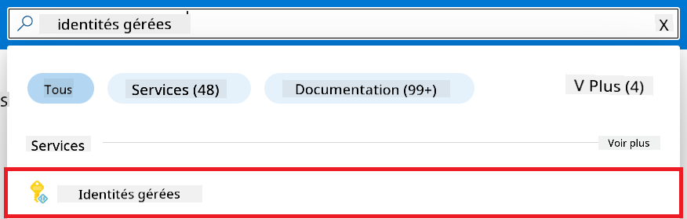

1. Sélectionnez **+ Créer**.

    

1. Effectuez les tâches suivantes :

    - Sélectionnez votre **Abonnement** Azure.
    - Sélectionnez le **Groupe de ressources** à utiliser (créez-en un nouveau si nécessaire).
    - Sélectionnez la **Région** que vous souhaitez utiliser.
    - Saisissez un **Nom**. Il doit être unique.

    

1. Sélectionnez **Vérifier + créer**.

1. Sélectionnez **+ Créer**.

#### Ajouter une attribution de rôle Contributeur à l’identité gérée

1. Accédez à la ressource Identité gérée que vous avez créée.

1. Sélectionnez **Attributions de rôles Azure** dans l’onglet à gauche.

1. Sélectionnez **+ Ajouter une attribution de rôle** dans le menu de navigation.

1. Sur la page Ajouter une attribution de rôle, effectuez les tâches suivantes :
    - Sélectionnez la **Portée** sur **Groupe de ressources**.
    - Sélectionnez votre **Abonnement** Azure.
    - Sélectionnez le **Groupe de ressources** à utiliser.
    - Sélectionnez le **Rôle** sur **Contributeur**.

    

2. Sélectionnez **Enregistrer**.

#### Ajouter une attribution de rôle Storage Blob Data Reader à l’identité gérée

1. Tapez *storage accounts* dans la **barre de recherche** en haut de la page du portail et sélectionnez **Comptes de stockage** parmi les options proposées.

    

1. Sélectionnez le compte de stockage associé à l’espace de travail Azure Machine Learning que vous avez créé. Par exemple, *finetunephistorage*.

1. Effectuez les tâches suivantes pour accéder à la page Ajouter une attribution de rôle :

    - Accédez au compte de stockage Azure que vous avez créé.
    - Sélectionnez **Contrôle d’accès (IAM)** dans l’onglet à gauche.
    - Sélectionnez **+ Ajouter** dans le menu de navigation.
    - Sélectionnez **Ajouter une attribution de rôle** dans le menu de navigation.

    

1. Sur la page Ajouter une attribution de rôle, effectuez les tâches suivantes :

    - Dans la page Rôle, tapez *Storage Blob Data Reader* dans la **barre de recherche** et sélectionnez **Storage Blob Data Reader** parmi les options proposées.
    - Dans la page Rôle, sélectionnez **Suivant**.
    - Dans la page Membres, sélectionnez **Attribuer l’accès à** **Identité gérée**.
    - Dans la page Membres, sélectionnez **+ Sélectionner des membres**.
    - Dans la page Sélectionner des identités gérées, sélectionnez votre **Abonnement** Azure.
    - Dans la page Sélectionner des identités gérées, sélectionnez l’**Identité gérée** à **Manage Identity**.
    - Dans la page Sélectionner des identités gérées, sélectionnez l’Identité gérée que vous avez créée. Par exemple, *finetunephi-managedidentity*.
    - Dans la page Sélectionner des identités gérées, sélectionnez **Sélectionner**.

    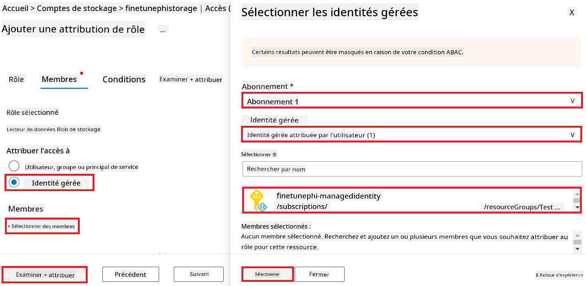

1. Sélectionnez **Vérifier + attribuer**.

#### Ajouter une attribution de rôle AcrPull à l’identité gérée

1. Tapez *container registries* dans la **barre de recherche** en haut de la page du portail et sélectionnez **Registres de conteneurs** parmi les options proposées.

    

1. Sélectionnez le registre de conteneurs associé à l’espace de travail Azure Machine Learning. Par exemple, *finetunephicontainerregistry*

1. Effectuez les tâches suivantes pour accéder à la page Ajouter une attribution de rôle :

    - Sélectionnez **Contrôle d’accès (IAM)** dans l’onglet à gauche.
    - Sélectionnez **+ Ajouter** dans le menu de navigation.
    - Sélectionnez **Ajouter une attribution de rôle** dans le menu de navigation.

1. Sur la page Ajouter une attribution de rôle, effectuez les tâches suivantes :

    - Dans la page Rôle, tapez *AcrPull* dans la **barre de recherche** et sélectionnez **AcrPull** parmi les options proposées.
    - Dans la page Rôle, sélectionnez **Suivant**.
    - Dans la page Membres, sélectionnez **Attribuer l’accès à** **Identité gérée**.
    - Dans la page Membres, sélectionnez **+ Sélectionner des membres**.
    - Dans la page Sélectionner des identités gérées, sélectionnez votre **Abonnement** Azure.
    - Dans la page Sélectionner des identités gérées, sélectionnez l’**Identité gérée** à **Manage Identity**.
    - Dans la page Sélectionner des identités gérées, sélectionnez l’Identité gérée que vous avez créée. Par exemple, *finetunephi-managedidentity*.
    - Dans la page Sélectionner des identités gérées, sélectionnez **Sélectionner**.
    - Sélectionnez **Vérifier + attribuer**.

### Configurer le projet

Pour télécharger les jeux de données nécessaires à l’affinage, vous allez configurer un environnement local.

Dans cet exercice, vous allez :

- Créer un dossier pour travailler à l’intérieur.
- Créer un environnement virtuel.
- Installer les packages requis.
- Créer un fichier *download_dataset.py* pour télécharger le jeu de données.

#### Créer un dossier pour travailler à l’intérieur

1. Ouvrez une fenêtre de terminal et tapez la commande suivante pour créer un dossier nommé *finetune-phi* dans le chemin par défaut.

    ```console
    mkdir finetune-phi
    ```

2. Tapez la commande suivante dans votre terminal pour naviguer dans le dossier *finetune-phi* que vous avez créé.
#### Créer un environnement virtuel

1. Tapez la commande suivante dans votre terminal pour créer un environnement virtuel nommé *.venv*.

    ```console
    python -m venv .venv
    ```

2. Tapez la commande suivante dans votre terminal pour activer l’environnement virtuel.

    ```console
    .venv\Scripts\activate.bat
    ```


> [!NOTE]
> Si cela a fonctionné, vous devriez voir *(.venv)* avant l’invite de commande.

#### Installer les paquets requis

1. Tapez les commandes suivantes dans votre terminal pour installer les paquets nécessaires.

    ```console
    pip install datasets==2.19.1
    ```

#### Créer `download_dataset.py`

> [!NOTE]
> Structure complète du dossier :
>
> ```text
> └── YourUserName
> .    └── finetune-phi
> .        └── download_dataset.py
> ```

1. Ouvrez **Visual Studio Code**.

1. Sélectionnez **Fichier** dans la barre de menu.

1. Sélectionnez **Ouvrir un dossier**.

1. Sélectionnez le dossier *finetune-phi* que vous avez créé, situé à *C:\Users\yourUserName\finetune-phi*.

    

1. Dans le volet de gauche de Visual Studio Code, faites un clic droit et sélectionnez **Nouveau fichier** pour créer un nouveau fichier nommé *download_dataset.py*.

    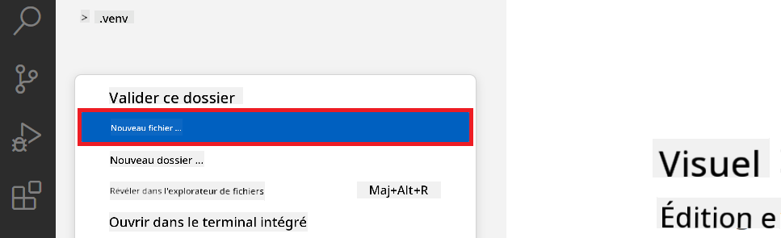

### Préparer le jeu de données pour l’affinage

Dans cet exercice, vous allez exécuter le fichier *download_dataset.py* pour télécharger les jeux de données *ultrachat_200k* dans votre environnement local. Vous utiliserez ensuite ces jeux de données pour affiner le modèle Phi-3 dans Azure Machine Learning.

Dans cet exercice, vous allez :

- Ajouter du code dans le fichier *download_dataset.py* pour télécharger les jeux de données.
- Exécuter le fichier *download_dataset.py* pour télécharger les jeux de données dans votre environnement local.

#### Télécharger votre jeu de données avec *download_dataset.py*

1. Ouvrez le fichier *download_dataset.py* dans Visual Studio Code.

1. Ajoutez le code suivant dans le fichier *download_dataset.py*.

    ```python
    import json
    import os
    from datasets import load_dataset

    def load_and_split_dataset(dataset_name, config_name, split_ratio):
        """
        Load and split a dataset.
        """
        # Load the dataset with the specified name, configuration, and split ratio
        dataset = load_dataset(dataset_name, config_name, split=split_ratio)
        print(f"Original dataset size: {len(dataset)}")
        
        # Split the dataset into train and test sets (80% train, 20% test)
        split_dataset = dataset.train_test_split(test_size=0.2)
        print(f"Train dataset size: {len(split_dataset['train'])}")
        print(f"Test dataset size: {len(split_dataset['test'])}")
        
        return split_dataset

    def save_dataset_to_jsonl(dataset, filepath):
        """
        Save a dataset to a JSONL file.
        """
        # Create the directory if it does not exist
        os.makedirs(os.path.dirname(filepath), exist_ok=True)
        
        # Open the file in write mode
        with open(filepath, 'w', encoding='utf-8') as f:
            # Iterate over each record in the dataset
            for record in dataset:
                # Dump the record as a JSON object and write it to the file
                json.dump(record, f)
                # Write a newline character to separate records
                f.write('\n')
        
        print(f"Dataset saved to {filepath}")

    def main():
        """
        Main function to load, split, and save the dataset.
        """
        # Load and split the ULTRACHAT_200k dataset with a specific configuration and split ratio
        dataset = load_and_split_dataset("HuggingFaceH4/ultrachat_200k", 'default', 'train_sft[:1%]')
        
        # Extract the train and test datasets from the split
        train_dataset = dataset['train']
        test_dataset = dataset['test']

        # Save the train dataset to a JSONL file
        save_dataset_to_jsonl(train_dataset, "data/train_data.jsonl")
        
        # Save the test dataset to a separate JSONL file
        save_dataset_to_jsonl(test_dataset, "data/test_data.jsonl")

    if __name__ == "__main__":
        main()

    ```

1. Tapez la commande suivante dans votre terminal pour exécuter le script et télécharger le jeu de données dans votre environnement local.

    ```console
    python download_dataset.py
    ```

1. Vérifiez que les jeux de données ont bien été enregistrés dans votre répertoire local *finetune-phi/data*.

> [!NOTE]
>
> #### Remarque sur la taille du jeu de données et le temps d’affinage
>
> Dans ce tutoriel, vous utilisez seulement 1 % du jeu de données (`split='train[:1%]'`). Cela réduit considérablement la quantité de données, accélérant à la fois le téléchargement et le processus d’affinage. Vous pouvez ajuster ce pourcentage pour trouver le bon équilibre entre le temps d’entraînement et la performance du modèle. Utiliser un sous-ensemble plus petit du jeu de données réduit le temps nécessaire pour l’affinage, rendant le processus plus accessible pour un tutoriel.

## Scénario 2 : Affiner le modèle Phi-3 et le déployer dans Azure Machine Learning Studio

### Affiner le modèle Phi-3

Dans cet exercice, vous allez affiner le modèle Phi-3 dans Azure Machine Learning Studio.

Dans cet exercice, vous allez :

- Créer un cluster informatique pour l’affinage.
- Affiner le modèle Phi-3 dans Azure Machine Learning Studio.

#### Créer un cluster informatique pour l’affinage

1. Rendez-vous sur [Azure ML Studio](https://ml.azure.com/home?wt.mc_id=studentamb_279723).

1. Sélectionnez **Compute** dans l’onglet latéral gauche.

1. Sélectionnez **Compute clusters** dans le menu de navigation.

1. Sélectionnez **+ New**.

    

1. Effectuez les opérations suivantes :

    - Sélectionnez la **Région** que vous souhaitez utiliser.
    - Sélectionnez le **Niveau de machine virtuelle** sur **Dedicated**.
    - Sélectionnez le **Type de machine virtuelle** sur **GPU**.
    - Filtrez la **Taille de machine virtuelle** sur **Select from all options**.
    - Sélectionnez la **Taille de machine virtuelle** sur **Standard_NC24ads_A100_v4**.

    

1. Sélectionnez **Next**.

1. Effectuez les opérations suivantes :

    - Saisissez un **Nom du cluster**. Il doit être unique.
    - Sélectionnez le **Nombre minimum de nœuds** sur **0**.
    - Sélectionnez le **Nombre maximum de nœuds** sur **1**.
    - Sélectionnez le **Temps d’inactivité avant réduction** sur **120** secondes.

    

1. Sélectionnez **Create**.

#### Affiner le modèle Phi-3

1. Rendez-vous sur [Azure ML Studio](https://ml.azure.com/home?wt.mc_id=studentamb_279723).

1. Sélectionnez l’espace de travail Azure Machine Learning que vous avez créé.

    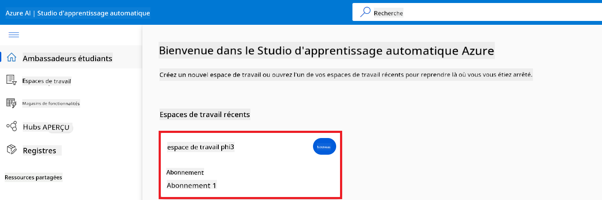

1. Effectuez les opérations suivantes :

    - Sélectionnez **Model catalog** dans l’onglet latéral gauche.
    - Tapez *phi-3-mini-4k* dans la **barre de recherche** et sélectionnez **Phi-3-mini-4k-instruct** parmi les options proposées.

    

1. Sélectionnez **Fine-tune** dans le menu de navigation.

    

1. Effectuez les opérations suivantes :

    - Sélectionnez **Select task type** sur **Chat completion**.
    - Sélectionnez **+ Select data** pour télécharger les **données d’entraînement**.
    - Sélectionnez le type de téléchargement des données de validation sur **Provide different validation data**.
    - Sélectionnez **+ Select data** pour télécharger les **données de validation**.

    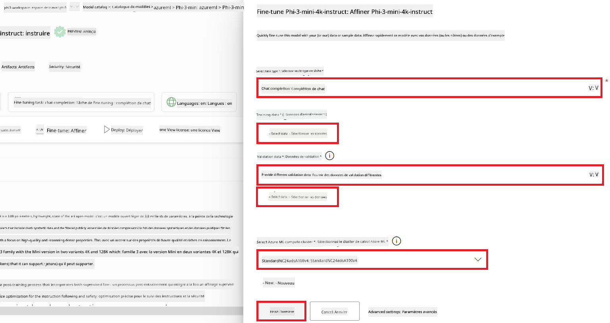

    > [!TIP]
    >
    > Vous pouvez sélectionner **Advanced settings** pour personnaliser des configurations telles que **learning_rate** et **lr_scheduler_type** afin d’optimiser le processus d’affinage selon vos besoins spécifiques.

1. Sélectionnez **Finish**.

1. Dans cet exercice, vous avez affiné avec succès le modèle Phi-3 en utilisant Azure Machine Learning. Notez que le processus d’affinage peut prendre un certain temps. Après avoir lancé la tâche d’affinage, vous devez attendre sa fin. Vous pouvez suivre l’état de la tâche dans l’onglet Jobs à gauche de votre espace de travail Azure Machine Learning. Dans la prochaine série, vous déploierez le modèle affiné et l’intégrerez avec Prompt flow.

    

### Déployer le modèle Phi-3 affiné

Pour intégrer le modèle Phi-3 affiné avec Prompt flow, vous devez déployer le modèle afin qu’il soit accessible pour des inférences en temps réel. Ce processus comprend l’enregistrement du modèle, la création d’un endpoint en ligne et le déploiement du modèle.

Dans cet exercice, vous allez :

- Enregistrer le modèle affiné dans l’espace de travail Azure Machine Learning.
- Créer un endpoint en ligne.
- Déployer le modèle Phi-3 affiné enregistré.

#### Enregistrer le modèle affiné

1. Rendez-vous sur [Azure ML Studio](https://ml.azure.com/home?wt.mc_id=studentamb_279723).

1. Sélectionnez l’espace de travail Azure Machine Learning que vous avez créé.

    

1. Sélectionnez **Models** dans l’onglet latéral gauche.

1. Sélectionnez **+ Register**.

1. Sélectionnez **From a job output**.

    

1. Sélectionnez la tâche que vous avez créée.

    

1. Sélectionnez **Next**.

1. Sélectionnez **Model type** sur **MLflow**.

1. Assurez-vous que **Job output** est sélectionné ; cela devrait être automatique.

    

2. Sélectionnez **Next**.

3. Sélectionnez **Register**.

    

4. Vous pouvez consulter votre modèle enregistré en naviguant dans le menu **Models** à gauche.

    

#### Déployer le modèle affiné

1. Rendez-vous dans l’espace de travail Azure Machine Learning que vous avez créé.

1. Sélectionnez **Endpoints** dans l’onglet latéral gauche.

1. Sélectionnez **Real-time endpoints** dans le menu de navigation.

    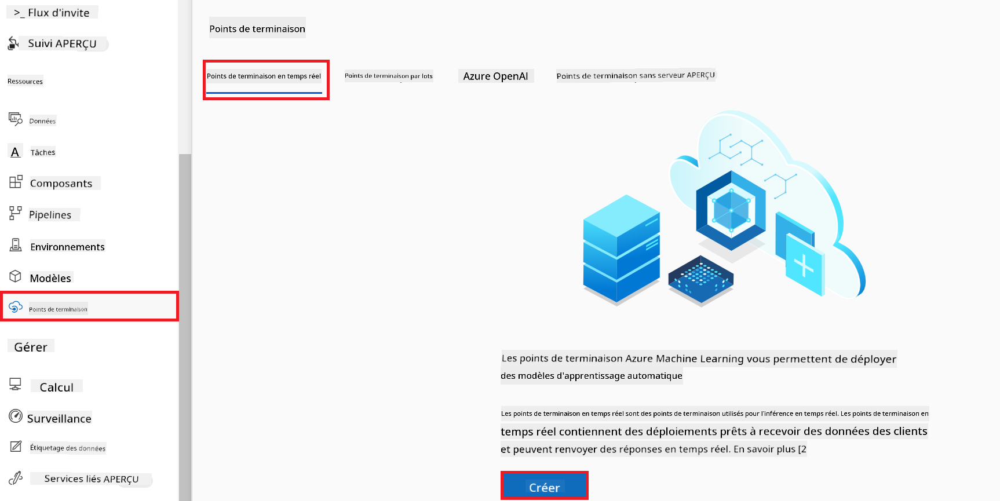

1. Sélectionnez **Create**.

1. Sélectionnez le modèle enregistré que vous avez créé.

    

1. Sélectionnez **Select**.

1. Effectuez les opérations suivantes :

    - Sélectionnez la **Machine virtuelle** sur *Standard_NC6s_v3*.
    - Sélectionnez le **Nombre d’instances** que vous souhaitez utiliser. Par exemple, *1*.
    - Sélectionnez **Endpoint** sur **New** pour créer un endpoint.
    - Saisissez un **Nom d’endpoint**. Il doit être unique.
    - Saisissez un **Nom de déploiement**. Il doit être unique.

    

1. Sélectionnez **Deploy**.

> [!WARNING]
> Pour éviter des frais supplémentaires sur votre compte, assurez-vous de supprimer l’endpoint créé dans l’espace de travail Azure Machine Learning.
>

#### Vérifier le statut du déploiement dans Azure Machine Learning Workspace

1. Rendez-vous dans l’espace de travail Azure Machine Learning que vous avez créé.

1. Sélectionnez **Endpoints** dans l’onglet latéral gauche.

1. Sélectionnez l’endpoint que vous avez créé.

    

1. Sur cette page, vous pouvez gérer les endpoints pendant le processus de déploiement.

> [!NOTE]
> Une fois le déploiement terminé, assurez-vous que le **Live traffic** est réglé à **100 %**. Si ce n’est pas le cas, sélectionnez **Update traffic** pour ajuster les paramètres de trafic. Notez que vous ne pouvez pas tester le modèle si le trafic est à 0 %.
>
> 
>

## Scénario 3 : Intégrer avec Prompt flow et discuter avec votre modèle personnalisé dans Azure AI Foundry

### Intégrer le modèle Phi-3 personnalisé avec Prompt flow

Après avoir déployé avec succès votre modèle affiné, vous pouvez maintenant l’intégrer avec Prompt Flow pour utiliser votre modèle dans des applications en temps réel, permettant une variété de tâches interactives avec votre modèle Phi-3 personnalisé.

Dans cet exercice, vous allez :

- Créer un hub Azure AI Foundry.
- Créer un projet Azure AI Foundry.
- Créer un Prompt flow.
- Ajouter une connexion personnalisée pour le modèle Phi-3 affiné.
- Configurer Prompt flow pour discuter avec votre modèle Phi-3 personnalisé.
> [!NOTE]  
> Vous pouvez également vous intégrer à Promptflow en utilisant Azure ML Studio. Le même processus d’intégration s’applique à Azure ML Studio.
#### Créer un Hub Azure AI Foundry

Vous devez créer un Hub avant de créer le Projet. Un Hub fonctionne comme un Groupe de ressources, vous permettant d’organiser et de gérer plusieurs Projets au sein d’Azure AI Foundry.

1. Rendez-vous sur [Azure AI Foundry](https://ai.azure.com/?WT.mc_id=aiml-137032-kinfeylo).

1. Sélectionnez **Tous les hubs** dans l’onglet à gauche.

1. Sélectionnez **+ Nouveau hub** dans le menu de navigation.

    

1. Effectuez les tâches suivantes :

    - Saisissez un **Nom du hub**. Il doit être unique.
    - Sélectionnez votre **Abonnement** Azure.
    - Sélectionnez le **Groupe de ressources** à utiliser (créez-en un nouveau si nécessaire).
    - Sélectionnez la **Région** que vous souhaitez utiliser.
    - Sélectionnez les **Services Azure AI connectés** à utiliser (créez-en un nouveau si nécessaire).
    - Sélectionnez **Connecter Azure AI Search** puis **Ignorer la connexion**.

    

1. Sélectionnez **Suivant**.

#### Créer un projet Azure AI Foundry

1. Dans le Hub que vous avez créé, sélectionnez **Tous les projets** dans l’onglet à gauche.

1. Sélectionnez **+ Nouveau projet** dans le menu de navigation.

    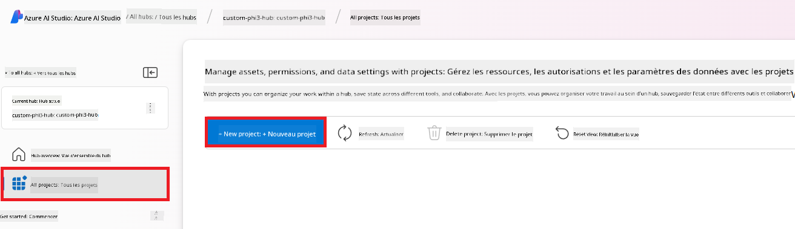

1. Saisissez un **Nom du projet**. Il doit être unique.

    

1. Sélectionnez **Créer un projet**.

#### Ajouter une connexion personnalisée pour le modèle Phi-3 affiné

Pour intégrer votre modèle Phi-3 personnalisé avec Prompt flow, vous devez enregistrer le point de terminaison et la clé du modèle dans une connexion personnalisée. Cette configuration garantit l’accès à votre modèle Phi-3 personnalisé dans Prompt flow.

#### Configurer la clé API et l’URI du point de terminaison du modèle Phi-3 affiné

1. Rendez-vous sur [Azure ML Studio](https://ml.azure.com/home?WT.mc_id=aiml-137032-kinfeylo).

1. Accédez à l’espace de travail Azure Machine Learning que vous avez créé.

1. Sélectionnez **Points de terminaison** dans l’onglet à gauche.

    

1. Sélectionnez le point de terminaison que vous avez créé.

    

1. Sélectionnez **Consommer** dans le menu de navigation.

1. Copiez votre **point de terminaison REST** et votre **clé principale**.

    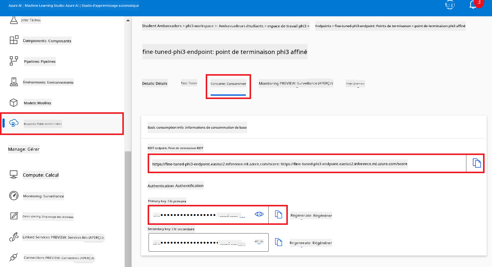

#### Ajouter la connexion personnalisée

1. Rendez-vous sur [Azure AI Foundry](https://ai.azure.com/?WT.mc_id=aiml-137032-kinfeylo).

1. Accédez au projet Azure AI Foundry que vous avez créé.

1. Dans le projet que vous avez créé, sélectionnez **Paramètres** dans l’onglet à gauche.

1. Sélectionnez **+ Nouvelle connexion**.

    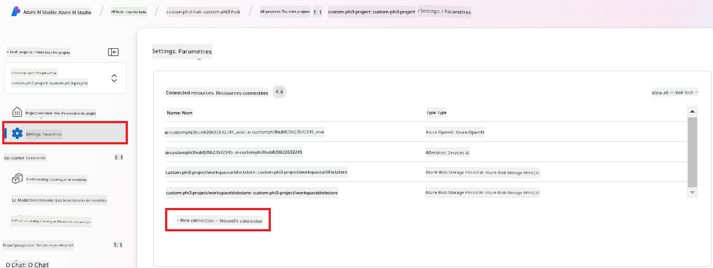

1. Sélectionnez **Clés personnalisées** dans le menu de navigation.

    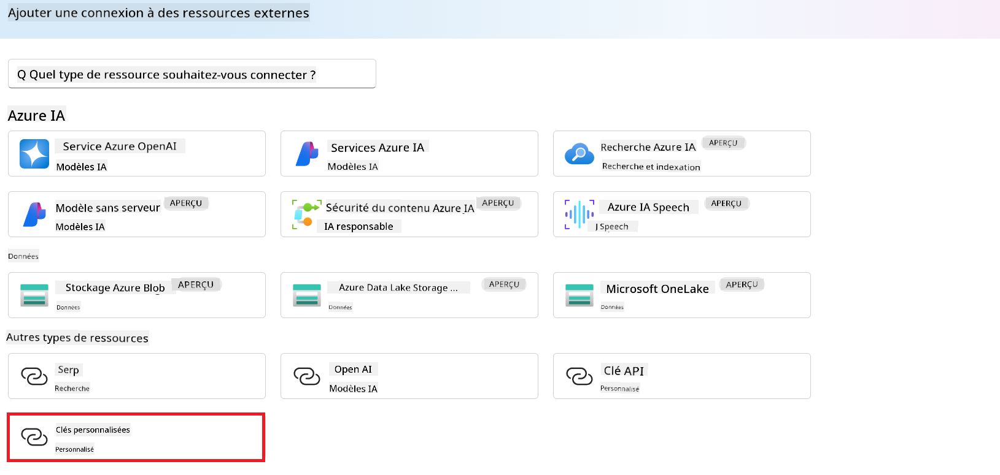

1. Effectuez les tâches suivantes :

    - Sélectionnez **+ Ajouter des paires clé-valeur**.
    - Pour le nom de la clé, saisissez **endpoint** et collez le point de terminaison copié depuis Azure ML Studio dans le champ valeur.
    - Sélectionnez à nouveau **+ Ajouter des paires clé-valeur**.
    - Pour le nom de la clé, saisissez **key** et collez la clé copiée depuis Azure ML Studio dans le champ valeur.
    - Après avoir ajouté les clés, cochez **est secret** pour empêcher l’exposition de la clé.

    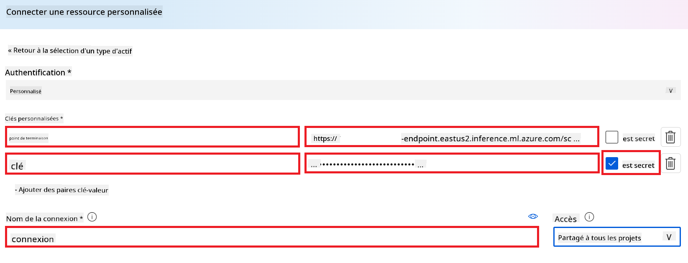

1. Sélectionnez **Ajouter la connexion**.

#### Créer un Prompt flow

Vous avez ajouté une connexion personnalisée dans Azure AI Foundry. Maintenant, créons un Prompt flow en suivant les étapes ci-dessous. Ensuite, vous connecterez ce Prompt flow à la connexion personnalisée afin de pouvoir utiliser le modèle affiné dans le Prompt flow.

1. Accédez au projet Azure AI Foundry que vous avez créé.

1. Sélectionnez **Prompt flow** dans l’onglet à gauche.

1. Sélectionnez **+ Créer** dans le menu de navigation.

    

1. Sélectionnez **Chat flow** dans le menu de navigation.

    

1. Saisissez un **Nom de dossier** à utiliser.

    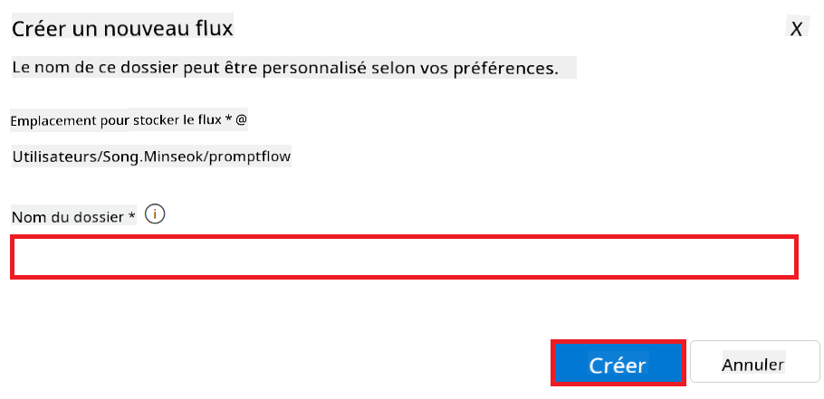

2. Sélectionnez **Créer**.

#### Configurer Prompt flow pour discuter avec votre modèle Phi-3 personnalisé

Vous devez intégrer le modèle Phi-3 affiné dans un Prompt flow. Cependant, le Prompt flow existant fourni n’est pas conçu pour cela. Vous devez donc repenser le Prompt flow pour permettre l’intégration du modèle personnalisé.

1. Dans le Prompt flow, effectuez les tâches suivantes pour reconstruire le flux existant :

    - Sélectionnez **Mode fichier brut**.
    - Supprimez tout le code existant dans le fichier *flow.dag.yml*.
    - Ajoutez le code suivant dans le fichier *flow.dag.yml*.

        ```yml
        inputs:
          input_data:
            type: string
            default: "Who founded Microsoft?"

        outputs:
          answer:
            type: string
            reference: ${integrate_with_promptflow.output}

        nodes:
        - name: integrate_with_promptflow
          type: python
          source:
            type: code
            path: integrate_with_promptflow.py
          inputs:
            input_data: ${inputs.input_data}
        ```

    - Sélectionnez **Enregistrer**.

    

1. Ajoutez le code suivant dans le fichier *integrate_with_promptflow.py* pour utiliser le modèle Phi-3 personnalisé dans Prompt flow.

    ```python
    import logging
    import requests
    from promptflow import tool
    from promptflow.connections import CustomConnection

    # Logging setup
    logging.basicConfig(
        format="%(asctime)s - %(levelname)s - %(name)s - %(message)s",
        datefmt="%Y-%m-%d %H:%M:%S",
        level=logging.DEBUG
    )
    logger = logging.getLogger(__name__)

    def query_phi3_model(input_data: str, connection: CustomConnection) -> str:
        """
        Send a request to the Phi-3 model endpoint with the given input data using Custom Connection.
        """

        # "connection" is the name of the Custom Connection, "endpoint", "key" are the keys in the Custom Connection
        endpoint_url = connection.endpoint
        api_key = connection.key

        headers = {
            "Content-Type": "application/json",
            "Authorization": f"Bearer {api_key}"
        }
        data = {
            "input_data": {
                "input_string": [
                    {"role": "user", "content": input_data}
                ],
                "parameters": {
                    "temperature": 0.7,
                    "max_new_tokens": 128
                }
            }
        }
        try:
            response = requests.post(endpoint_url, json=data, headers=headers)
            response.raise_for_status()
            
            # Log the full JSON response
            logger.debug(f"Full JSON response: {response.json()}")

            result = response.json()["output"]
            logger.info("Successfully received response from Azure ML Endpoint.")
            return result
        except requests.exceptions.RequestException as e:
            logger.error(f"Error querying Azure ML Endpoint: {e}")
            raise

    @tool
    def my_python_tool(input_data: str, connection: CustomConnection) -> str:
        """
        Tool function to process input data and query the Phi-3 model.
        """
        return query_phi3_model(input_data, connection)

    ```

    

> [!NOTE]
> Pour plus d’informations détaillées sur l’utilisation de Prompt flow dans Azure AI Foundry, vous pouvez consulter [Prompt flow in Azure AI Foundry](https://learn.microsoft.com/azure/ai-studio/how-to/prompt-flow).

1. Sélectionnez **Entrée chat**, **Sortie chat** pour activer la conversation avec votre modèle.

    

1. Vous êtes maintenant prêt à discuter avec votre modèle Phi-3 personnalisé. Dans l’exercice suivant, vous apprendrez comment démarrer Prompt flow et l’utiliser pour converser avec votre modèle Phi-3 affiné.

> [!NOTE]
>
> Le flux reconstruit devrait ressembler à l’image ci-dessous :
>
> 
>

### Discuter avec votre modèle Phi-3 personnalisé

Maintenant que vous avez affiné et intégré votre modèle Phi-3 personnalisé avec Prompt flow, vous êtes prêt à commencer à interagir avec lui. Cet exercice vous guidera dans le processus de configuration et de démarrage d’une conversation avec votre modèle via Prompt flow. En suivant ces étapes, vous pourrez exploiter pleinement les capacités de votre modèle Phi-3 affiné pour diverses tâches et échanges.

- Discutez avec votre modèle Phi-3 personnalisé en utilisant Prompt flow.

#### Démarrer Prompt flow

1. Sélectionnez **Démarrer les sessions de calcul** pour lancer Prompt flow.

    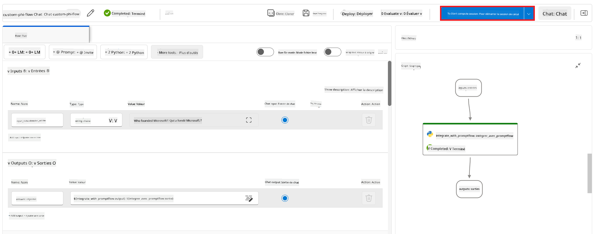

1. Sélectionnez **Valider et analyser l’entrée** pour renouveler les paramètres.

    

1. Sélectionnez la **Valeur** de la **connexion** vers la connexion personnalisée que vous avez créée. Par exemple, *connection*.

    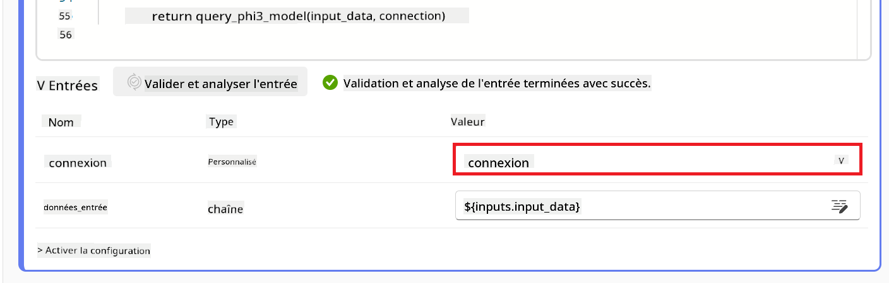

#### Discuter avec votre modèle personnalisé

1. Sélectionnez **Chat**.

    

1. Voici un exemple de résultats : vous pouvez maintenant discuter avec votre modèle Phi-3 personnalisé. Il est recommandé de poser des questions basées sur les données utilisées pour l’affinage.

    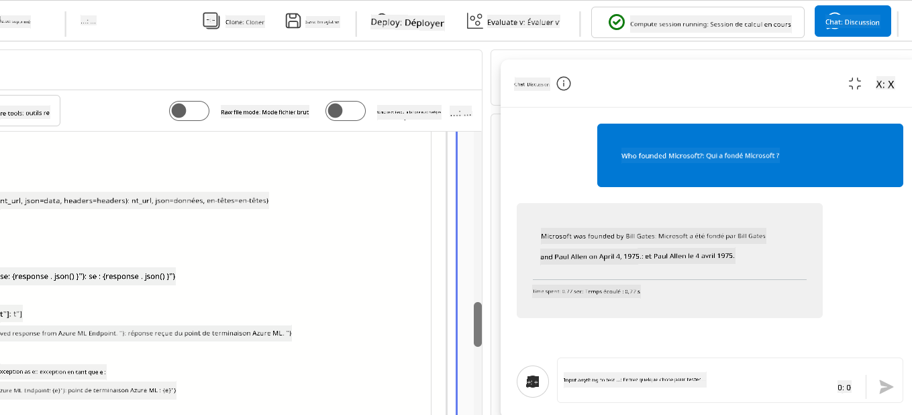

**Avertissement** :  
Ce document a été traduit à l’aide du service de traduction automatique [Co-op Translator](https://github.com/Azure/co-op-translator). Bien que nous nous efforcions d’assurer l’exactitude, veuillez noter que les traductions automatiques peuvent contenir des erreurs ou des inexactitudes. Le document original dans sa langue d’origine doit être considéré comme la source faisant foi. Pour les informations critiques, une traduction professionnelle réalisée par un humain est recommandée. Nous déclinons toute responsabilité en cas de malentendus ou de mauvaises interprétations résultant de l’utilisation de cette traduction.