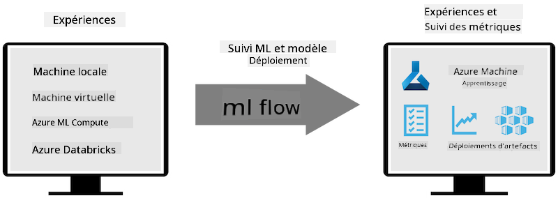
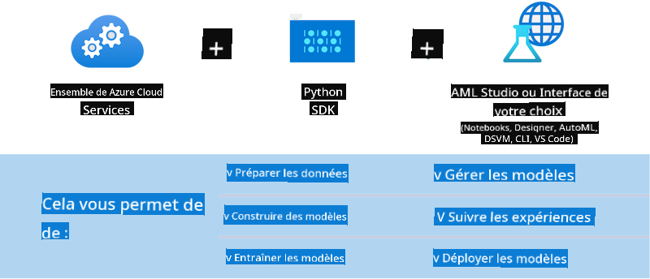

<!--
CO_OP_TRANSLATOR_METADATA:
{
  "original_hash": "f61c383bbf0c3dac97e43f833c258731",
  "translation_date": "2025-05-07T13:57:03+00:00",
  "source_file": "md/02.Application/01.TextAndChat/Phi3/E2E_Phi-3-MLflow.md",
  "language_code": "fr"
}
-->
# MLflow

[MLflow](https://mlflow.org/) est une plateforme open-source conçue pour gérer le cycle de vie complet du machine learning.


MLFlow est utilisé pour gérer le cycle de vie du ML, incluant l’expérimentation, la reproductibilité, le déploiement et un registre central de modèles. MLflow propose actuellement quatre composants.

- **MLflow Tracking :** Enregistrer et interroger les expériences, le code, la configuration des données et les résultats.
- **MLflow Projects :** Emballer le code data science dans un format permettant de reproduire les exécutions sur n’importe quelle plateforme.
- **Mlflow Models :** Déployer des modèles de machine learning dans différents environnements de service.
- **Model Registry :** Stocker, annoter et gérer les modèles dans un dépôt central.

Il inclut des fonctionnalités pour suivre les expériences, empaqueter le code en exécutions reproductibles, partager et déployer les modèles. MLFlow est intégré à Databricks et supporte une variété de bibliothèques ML, ce qui le rend agnostique à la bibliothèque utilisée. Il peut être utilisé avec n’importe quelle bibliothèque de machine learning et dans n’importe quel langage de programmation, grâce à une API REST et une interface en ligne de commande pour plus de commodité.



Les principales fonctionnalités de MLFlow comprennent :

- **Suivi des expériences :** Enregistrer et comparer les paramètres et résultats.
- **Gestion des modèles :** Déployer les modèles sur diverses plateformes de service et d’inférence.
- **Model Registry :** Gérer collaborativement le cycle de vie des MLflow Models, incluant la gestion des versions et les annotations.
- **Projects :** Emballer le code ML pour le partager ou l’utiliser en production.

MLFlow prend également en charge la boucle MLOps, qui comprend la préparation des données, l’enregistrement et la gestion des modèles, l’emballage des modèles pour l’exécution, le déploiement des services et la surveillance des modèles. Son objectif est de simplifier le passage du prototype au workflow de production, notamment dans les environnements cloud et edge.

## Scénario E2E - Création d’un wrapper et utilisation de Phi-3 comme modèle MLFlow

Dans cet exemple E2E, nous allons démontrer deux approches différentes pour créer un wrapper autour du petit modèle de langage Phi-3 (SLM) puis l’exécuter comme un modèle MLFlow, soit localement, soit dans le cloud, par exemple dans un workspace Azure Machine Learning.



| Projet | Description | Emplacement |
| ------------ | ----------- | -------- |
| Transformer Pipeline | Transformer Pipeline est l’option la plus simple pour créer un wrapper si vous souhaitez utiliser un modèle HuggingFace avec la saveur expérimentale transformers de MLFlow. | [**TransformerPipeline.ipynb**](../../../../../../code/06.E2E/E2E_Phi-3-MLflow_TransformerPipeline.ipynb) |
| Custom Python Wrapper | Au moment de la rédaction, le pipeline transformer ne supportait pas la génération de wrapper MLFlow pour les modèles HuggingFace au format ONNX, même avec le package Python expérimental optimum. Pour ce genre de cas, vous pouvez créer votre propre wrapper Python personnalisé pour le mode MLFlow | [**CustomPythonWrapper.ipynb**](../../../../../../code/06.E2E/E2E_Phi-3-MLflow_CustomPythonWrapper.ipynb) |

## Projet : Transformer Pipeline

1. Vous aurez besoin des packages Python pertinents de MLFlow et HuggingFace :

    ``` Python
    import mlflow
    import transformers
    ```

2. Ensuite, vous devez initialiser un pipeline transformer en faisant référence au modèle Phi-3 ciblé dans le registre HuggingFace. Comme on peut le voir dans la fiche modèle de _Phi-3-mini-4k-instruct_, sa tâche est de type « Génération de texte » :

    ``` Python
    pipeline = transformers.pipeline(
        task = "text-generation",
        model = "microsoft/Phi-3-mini-4k-instruct"
    )
    ```

3. Vous pouvez maintenant sauvegarder le pipeline transformer de votre modèle Phi-3 au format MLFlow en fournissant des détails supplémentaires comme le chemin des artefacts cibles, les paramètres spécifiques de configuration du modèle et le type d’API d’inférence :

    ``` Python
    model_info = mlflow.transformers.log_model(
        transformers_model = pipeline,
        artifact_path = "phi3-mlflow-model",
        model_config = model_config,
        task = "llm/v1/chat"
    )
    ```

## Projet : Custom Python Wrapper

1. Nous pouvons ici utiliser l’API generate() de [ONNX Runtime de Microsoft](https://github.com/microsoft/onnxruntime-genai) pour l’inférence du modèle ONNX ainsi que l’encodage/décodage des tokens. Vous devez choisir le package _onnxruntime_genai_ adapté à votre environnement de calcul, l’exemple ci-dessous ciblant le CPU :

    ``` Python
    import mlflow
    from mlflow.models import infer_signature
    import onnxruntime_genai as og
    ```

1. Notre classe personnalisée implémente deux méthodes : _load_context()_ pour initialiser le **modèle ONNX** de Phi-3 Mini 4K Instruct, les **paramètres du générateur** et le **tokenizer** ; et _predict()_ pour générer les tokens de sortie à partir du prompt fourni :

    ``` Python
    class Phi3Model(mlflow.pyfunc.PythonModel):
        def load_context(self, context):
            # Retrieving model from the artifacts
            model_path = context.artifacts["phi3-mini-onnx"]
            model_options = {
                 "max_length": 300,
                 "temperature": 0.2,         
            }
        
            # Defining the model
            self.phi3_model = og.Model(model_path)
            self.params = og.GeneratorParams(self.phi3_model)
            self.params.set_search_options(**model_options)
            
            # Defining the tokenizer
            self.tokenizer = og.Tokenizer(self.phi3_model)
    
        def predict(self, context, model_input):
            # Retrieving prompt from the input
            prompt = model_input["prompt"][0]
            self.params.input_ids = self.tokenizer.encode(prompt)
    
            # Generating the model's response
            response = self.phi3_model.generate(self.params)
    
            return self.tokenizer.decode(response[0][len(self.params.input_ids):])
    ```

1. Vous pouvez maintenant utiliser la fonction _mlflow.pyfunc.log_model()_ pour générer un wrapper Python personnalisé (au format pickle) pour le modèle Phi-3, avec le modèle ONNX original et les dépendances requises :

    ``` Python
    model_info = mlflow.pyfunc.log_model(
        artifact_path = artifact_path,
        python_model = Phi3Model(),
        artifacts = {
            "phi3-mini-onnx": "cpu_and_mobile/cpu-int4-rtn-block-32-acc-level-4",
        },
        input_example = input_example,
        signature = infer_signature(input_example, ["Run"]),
        extra_pip_requirements = ["torch", "onnxruntime_genai", "numpy"],
    )
    ```

## Signatures des modèles MLFlow générés

1. Dans l’étape 3 du projet Transformer Pipeline ci-dessus, nous avons défini la tâche du modèle MLFlow à « _llm/v1/chat_ ». Cette instruction génère un wrapper API pour le modèle, compatible avec l’API Chat d’OpenAI comme montré ci-dessous :

    ``` Python
    {inputs: 
      ['messages': Array({content: string (required), name: string (optional), role: string (required)}) (required), 'temperature': double (optional), 'max_tokens': long (optional), 'stop': Array(string) (optional), 'n': long (optional), 'stream': boolean (optional)],
    outputs: 
      ['id': string (required), 'object': string (required), 'created': long (required), 'model': string (required), 'choices': Array({finish_reason: string (required), index: long (required), message: {content: string (required), name: string (optional), role: string (required)} (required)}) (required), 'usage': {completion_tokens: long (required), prompt_tokens: long (required), total_tokens: long (required)} (required)],
    params: 
      None}
    ```

1. En conséquence, vous pouvez soumettre votre prompt au format suivant :

    ``` Python
    messages = [{"role": "user", "content": "What is the capital of Spain?"}]
    ```

1. Ensuite, utilisez un post-traitement compatible avec l’API OpenAI, par exemple _response[0][‘choices’][0][‘message’][‘content’]_, pour embellir votre sortie comme ceci :

    ``` JSON
    Question: What is the capital of Spain?
    
    Answer: The capital of Spain is Madrid. It is the largest city in Spain and serves as the political, economic, and cultural center of the country. Madrid is located in the center of the Iberian Peninsula and is known for its rich history, art, and architecture, including the Royal Palace, the Prado Museum, and the Plaza Mayor.
    
    Usage: {'prompt_tokens': 11, 'completion_tokens': 73, 'total_tokens': 84}
    ```

1. Dans l’étape 3 du projet Custom Python Wrapper ci-dessus, nous laissons le package MLFlow générer la signature du modèle à partir d’un exemple d’entrée donné. La signature de notre wrapper MLFlow ressemblera à ceci :

    ``` Python
    {inputs: 
      ['prompt': string (required)],
    outputs: 
      [string (required)],
    params: 
      None}
    ```

1. Ainsi, notre prompt devra contenir une clé dictionnaire "prompt", similaire à ceci :

    ``` Python
    {"prompt": "<|system|>You are a stand-up comedian.<|end|><|user|>Tell me a joke about atom<|end|><|assistant|>",}
    ```

1. La sortie du modèle sera alors fournie au format chaîne de caractères :

    ``` JSON
    Alright, here's a little atom-related joke for you!
    
    Why don't electrons ever play hide and seek with protons?
    
    Because good luck finding them when they're always "sharing" their electrons!
    
    Remember, this is all in good fun, and we're just having a little atomic-level humor!
    ```

**Avertissement** :  
Ce document a été traduit à l’aide du service de traduction automatique [Co-op Translator](https://github.com/Azure/co-op-translator). Bien que nous nous efforcions d’assurer l’exactitude, veuillez noter que les traductions automatiques peuvent contenir des erreurs ou des inexactitudes. Le document original dans sa langue d’origine doit être considéré comme la source faisant foi. Pour les informations critiques, une traduction professionnelle réalisée par un humain est recommandée. Nous ne sommes pas responsables des malentendus ou des interprétations erronées résultant de l’utilisation de cette traduction.