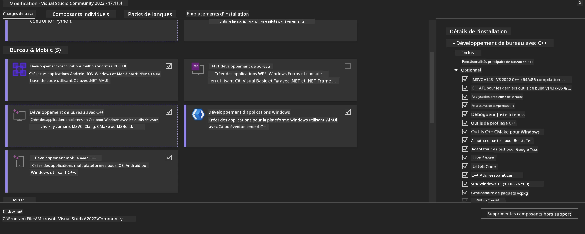
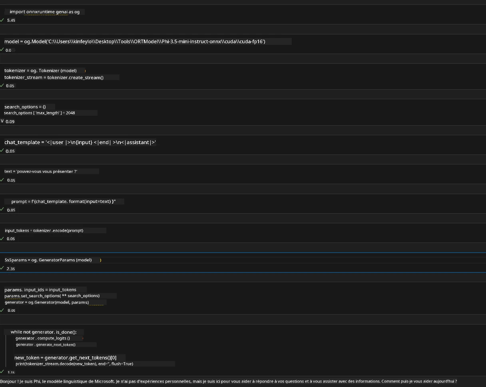
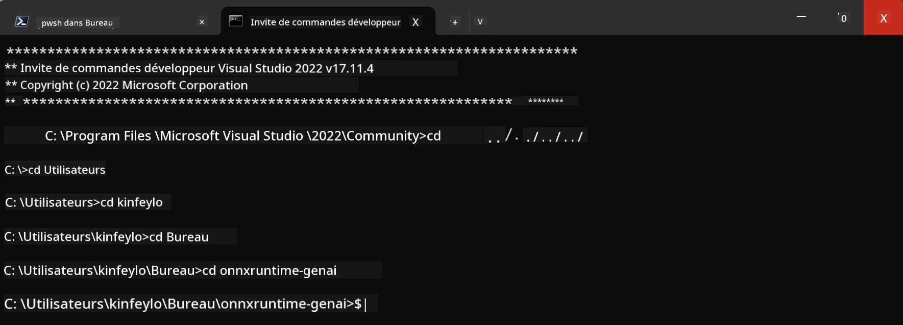

# **Guide pour OnnxRuntime GenAI Windows GPU**

Ce guide fournit les étapes pour configurer et utiliser ONNX Runtime (ORT) avec des GPU sous Windows. Il est conçu pour vous aider à tirer parti de l'accélération GPU pour vos modèles, améliorant ainsi la performance et l'efficacité.

Le document offre des conseils sur :

- Configuration de l'environnement : Instructions pour installer les dépendances nécessaires comme CUDA, cuDNN et ONNX Runtime.
- Configuration : Comment configurer l'environnement et ONNX Runtime pour utiliser efficacement les ressources GPU.
- Conseils d'optimisation : Recommandations pour affiner vos paramètres GPU pour une performance optimale.

### **1. Python 3.10.x /3.11.8**

   ***Note*** Il est conseillé d'utiliser [miniforge](https://github.com/conda-forge/miniforge/releases/latest/download/Miniforge3-Windows-x86_64.exe) comme environnement Python

   ```bash

   conda create -n pydev python==3.11.8

   conda activate pydev

   ```

   ***Rappel*** Si vous avez installé une quelconque bibliothèque Python ONNX, veuillez la désinstaller

### **2. Installer CMake avec winget**


   ```bash

   winget install -e --id Kitware.CMake

   ```

### **3. Installer Visual Studio 2022 - Développement Desktop avec C++**

   ***Note*** Si vous ne souhaitez pas compiler, vous pouvez sauter cette étape




### **4. Installer le pilote NVIDIA**

1. **Pilote GPU NVIDIA** [https://www.nvidia.com/en-us/drivers/](https://www.nvidia.com/en-us/drivers/)

2. **NVIDIA CUDA 12.4** [https://developer.nvidia.com/cuda-12-4-0-download-archive](https://developer.nvidia.com/cuda-12-4-0-download-archive)

3. **NVIDIA CUDNN 9.4** [https://developer.nvidia.com/cudnn-downloads](https://developer.nvidia.com/cudnn-downloads)

***Rappel*** Veuillez utiliser les paramètres par défaut lors du processus d'installation

### **5. Configurer l'environnement NVIDIA**

Copier les dossiers lib, bin, include de NVIDIA CUDNN 9.4 vers NVIDIA CUDA 12.4 lib, bin, include

- copier les fichiers de *'C:\Program Files\NVIDIA\CUDNN\v9.4\bin\12.6'* vers *'C:\Program Files\NVIDIA GPU Computing Toolkit\CUDA\v12.4\bin'*

- copier les fichiers de *'C:\Program Files\NVIDIA\CUDNN\v9.4\include\12.6'* vers *'C:\Program Files\NVIDIA GPU Computing Toolkit\CUDA\v12.4\include'*

- copier les fichiers de *'C:\Program Files\NVIDIA\CUDNN\v9.4\lib\12.6'* vers *'C:\Program Files\NVIDIA GPU Computing Toolkit\CUDA\v12.4\lib\x64'*


### **6. Télécharger Phi-3.5-mini-instruct-onnx**


   ```bash

   winget install -e --id Git.Git

   winget install -e --id GitHub.GitLFS

   git lfs install

   git clone https://huggingface.co/microsoft/Phi-3.5-mini-instruct-onnx

   ```

### **7. Exécuter InferencePhi35Instruct.ipynb**

   Ouvrez le [Notebook](../../../../code/09.UpdateSamples/Aug/ortgpu-phi35-instruct.ipynb) et exécutez





### **8. Compiler ORT GenAI GPU**


   ***Note*** 
   
   1. Veuillez désinstaller d'abord toutes les bibliothèques liées à onnx, onnxruntime et onnxruntime-genai

   
   ```bash

   pip list 
   
   ```

   Ensuite, désinstallez toutes les bibliothèques onnxruntime, c'est-à-dire 


   ```bash

   pip uninstall onnxruntime

   pip uninstall onnxruntime-genai

   pip uninstall onnxruntume-genai-cuda
   
   ```

   2. Vérifiez le support de l'extension Visual Studio

   Vérifiez dans C:\Program Files\NVIDIA GPU Computing Toolkit\CUDA\v12.4\extras que le dossier C:\Program Files\NVIDIA GPU Computing Toolkit\CUDA\v12.4\extras\visual_studio_integration est présent.
   
   S'il n'est pas trouvé, vérifiez dans les autres dossiers du toolkit Cuda et copiez le dossier visual_studio_integration avec son contenu vers C:\Program Files\NVIDIA GPU Computing Toolkit\CUDA\v12.4\extras\visual_studio_integration


   - Si vous ne souhaitez pas compiler, vous pouvez sauter cette étape


   ```bash

   git clone https://github.com/microsoft/onnxruntime-genai

   ```

   - Téléchargez [https://github.com/microsoft/onnxruntime/releases/download/v1.19.2/onnxruntime-win-x64-gpu-1.19.2.zip](https://github.com/microsoft/onnxruntime/releases/download/v1.19.2/onnxruntime-win-x64-gpu-1.19.2.zip)

   - Décompressez onnxruntime-win-x64-gpu-1.19.2.zip, renommez-le en **ort**, puis copiez le dossier ort dans onnxruntime-genai

   - En utilisant Windows Terminal, ouvrez Developer Command Prompt for VS 2022 et rendez-vous dans onnxruntime-genai 



   - Compilez-le avec votre environnement python

   
   ```bash

   cd onnxruntime-genai

   python build.py --use_cuda  --cuda_home "C:\Program Files\NVIDIA GPU Computing Toolkit\CUDA\v12.4" --config Release
 

   cd build/Windows/Release/Wheel

   pip install .whl

   ```

---

<!-- CO-OP TRANSLATOR DISCLAIMER START -->
**Avertissement** :
Ce document a été traduit à l'aide du service de traduction automatique [Co-op Translator](https://github.com/Azure/co-op-translator). Bien que nous nous efforçions d'assurer l'exactitude, veuillez noter que les traductions automatisées peuvent contenir des erreurs ou des inexactitudes. Le document original dans sa langue native doit être considéré comme la source faisant autorité. Pour les informations critiques, il est recommandé de recourir à une traduction professionnelle réalisée par un humain. Nous ne saurions être tenus responsables des malentendus ou erreurs d'interprétation découlant de l'utilisation de cette traduction.
<!-- CO-OP TRANSLATOR DISCLAIMER END -->