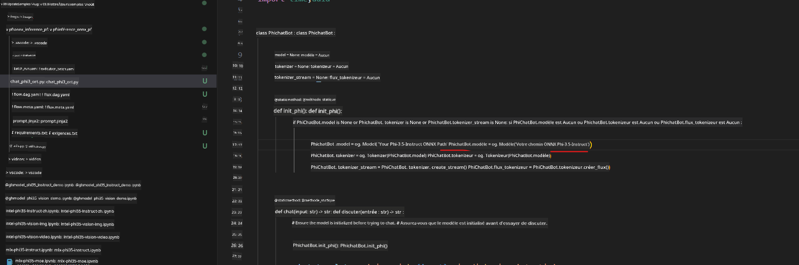

<!--
CO_OP_TRANSLATOR_METADATA:
{
  "original_hash": "92e7dac1e5af0dd7c94170fdaf6860fe",
  "translation_date": "2025-05-07T13:58:50+00:00",
  "source_file": "md/02.Application/01.TextAndChat/Phi3/UsingPromptFlowWithONNX.md",
  "language_code": "fr"
}
-->
# Utiliser le GPU Windows pour créer une solution Prompt flow avec Phi-3.5-Instruct ONNX

Le document suivant est un exemple montrant comment utiliser PromptFlow avec ONNX (Open Neural Network Exchange) pour développer des applications d’IA basées sur les modèles Phi-3.

PromptFlow est une suite d’outils de développement conçue pour simplifier le cycle complet de création d’applications IA basées sur les LLM (Large Language Model), de l’idéation et du prototypage jusqu’aux tests et à l’évaluation.

En intégrant PromptFlow avec ONNX, les développeurs peuvent :

- Optimiser les performances du modèle : tirer parti d’ONNX pour une inférence et un déploiement efficaces.
- Simplifier le développement : utiliser PromptFlow pour gérer le workflow et automatiser les tâches répétitives.
- Favoriser la collaboration : faciliter une meilleure collaboration entre les membres de l’équipe grâce à un environnement de développement unifié.

**Prompt flow** est une suite d’outils de développement conçue pour fluidifier le cycle complet de création d’applications IA basées sur les LLM, de l’idéation, du prototypage, des tests et de l’évaluation jusqu’au déploiement en production et à la surveillance. Il rend l’ingénierie des prompts beaucoup plus simple et vous permet de créer des applications LLM de qualité production.

Prompt flow peut se connecter à OpenAI, Azure OpenAI Service, ainsi qu’à des modèles personnalisables (Huggingface, LLM/SLM locaux). Nous espérons déployer le modèle ONNX quantifié de Phi-3.5 dans des applications locales. Prompt flow peut nous aider à mieux planifier notre activité et à réaliser des solutions locales basées sur Phi-3.5. Dans cet exemple, nous allons combiner la bibliothèque ONNX Runtime GenAI pour compléter la solution Prompt flow basée sur un GPU Windows.

## **Installation**

### **ONNX Runtime GenAI pour GPU Windows**

Lisez cette documentation pour configurer ONNX Runtime GenAI pour GPU Windows [cliquer ici](./ORTWindowGPUGuideline.md)

### **Configurer Prompt flow dans VSCode**

1. Installer l’extension Prompt flow pour VS Code


2. Après avoir installé l’extension Prompt flow pour VS Code, cliquez sur l’extension, puis choisissez **Installation dependencies** et suivez ce guide pour installer le SDK Prompt flow dans votre environnement


3. Téléchargez le [code d’exemple](../../../../../../code/09.UpdateSamples/Aug/pf/onnx_inference_pf) et ouvrez cet exemple avec VS Code


4. Ouvrez **flow.dag.yaml** pour sélectionner votre environnement Python


   Ouvrez **chat_phi3_ort.py** pour modifier l’emplacement de votre modèle Phi-3.5-instruct ONNX



5. Lancez votre prompt flow pour tester

Ouvrez **flow.dag.yaml** et cliquez sur l’éditeur visuel


Après avoir cliqué, exécutez-le pour tester


1. Vous pouvez exécuter un batch dans le terminal pour obtenir plus de résultats


```bash

pf run create --file batch_run.yaml --stream --name 'Your eval qa name'    

```

Vous pouvez consulter les résultats dans votre navigateur par défaut


**Avertissement** :  
Ce document a été traduit à l'aide du service de traduction automatique [Co-op Translator](https://github.com/Azure/co-op-translator). Bien que nous nous efforçons d'assurer l'exactitude, veuillez noter que les traductions automatisées peuvent contenir des erreurs ou des inexactitudes. Le document original dans sa langue d'origine doit être considéré comme la source faisant foi. Pour les informations critiques, une traduction professionnelle réalisée par un humain est recommandée. Nous déclinons toute responsabilité en cas de malentendus ou d'interprétations erronées résultant de l'utilisation de cette traduction.