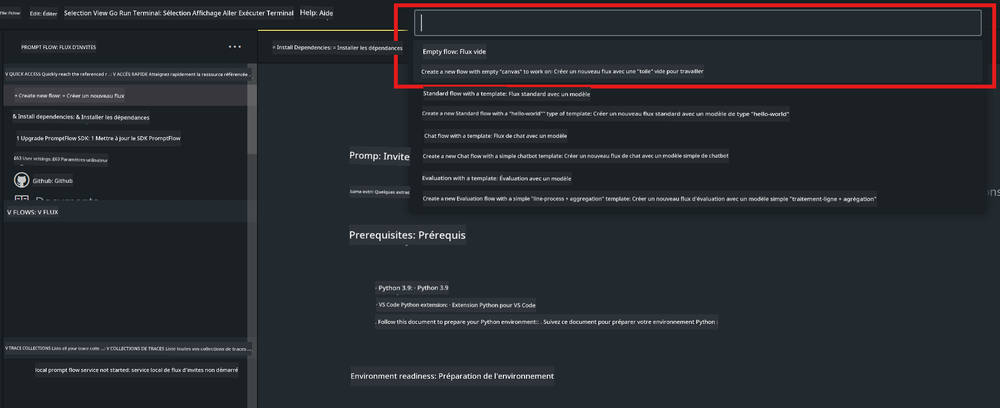
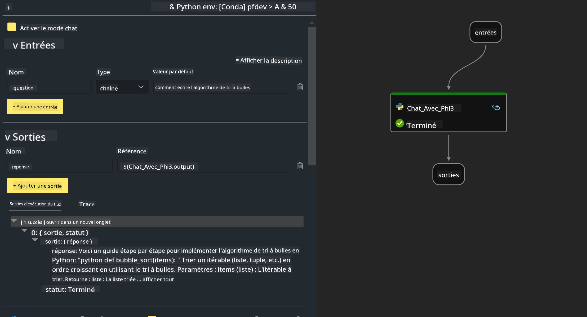

<!--
CO_OP_TRANSLATOR_METADATA:
{
  "original_hash": "bc29f7fe7fc16bed6932733eac8c81b8",
  "translation_date": "2025-07-17T03:53:42+00:00",
  "source_file": "md/02.Application/02.Code/Phi3/VSCodeExt/HOL/AIPC/02.PromptflowWithNPU.md",
  "language_code": "fr"
}
-->
# **Lab 2 - Exécuter Prompt flow avec Phi-3-mini sur AIPC**

## **Qu'est-ce que Prompt flow**

Prompt flow est une suite d’outils de développement conçue pour simplifier le cycle complet de création d’applications IA basées sur les LLM, de l’idéation, du prototypage, des tests, de l’évaluation jusqu’au déploiement en production et à la surveillance. Il facilite grandement l’ingénierie des prompts et vous permet de créer des applications LLM de qualité production.

Avec Prompt flow, vous pourrez :

- Créer des flux qui relient LLM, prompts, code Python et autres outils dans un workflow exécutable.

- Déboguer et itérer vos flux, notamment les interactions avec les LLM, en toute simplicité.

- Évaluer vos flux, calculer des métriques de qualité et de performance sur des jeux de données plus importants.

- Intégrer les tests et évaluations dans votre système CI/CD pour garantir la qualité de votre flux.

- Déployer vos flux sur la plateforme de service de votre choix ou les intégrer facilement dans la base de code de votre application.

- (Optionnel mais fortement recommandé) Collaborer avec votre équipe en utilisant la version cloud de Prompt flow sur Azure AI.

## **Qu'est-ce que AIPC**

Un AI PC est équipé d’un CPU, d’un GPU et d’un NPU, chacun avec des capacités spécifiques d’accélération IA. Un NPU, ou unité de traitement neuronal, est un accélérateur spécialisé qui gère les tâches d’intelligence artificielle (IA) et d’apprentissage automatique (ML) directement sur votre PC, sans envoyer les données vers le cloud. Le GPU et le CPU peuvent aussi traiter ces charges, mais le NPU est particulièrement efficace pour les calculs IA à faible consommation d’énergie. L’AI PC représente un changement fondamental dans le fonctionnement de nos ordinateurs. Ce n’est pas une solution à un problème inexistant auparavant, mais une amélioration majeure pour l’usage quotidien des PC.

Comment cela fonctionne-t-il ? Comparé à l’IA générative et aux énormes modèles de langage (LLM) entraînés sur d’énormes quantités de données publiques, l’IA qui s’exécutera sur votre PC sera plus accessible à tous les niveaux. Le concept est plus facile à comprendre, et comme elle est entraînée sur vos données, sans nécessiter d’accès au cloud, les avantages sont immédiatement plus attrayants pour un public plus large.

À court terme, le monde de l’AI PC implique des assistants personnels et des modèles IA plus petits fonctionnant directement sur votre PC, utilisant vos données pour offrir des améliorations IA personnelles, privées et plus sécurisées pour des tâches quotidiennes – prendre des notes de réunion, organiser une ligue de fantasy football, automatiser des améliorations pour la retouche photo et vidéo, ou préparer l’itinéraire parfait pour une réunion de famille en fonction des heures d’arrivée et de départ de chacun.

## **Créer des flux de génération de code sur AIPC**

***Note*** : Si vous n’avez pas encore installé l’environnement, veuillez consulter [Lab 0 - Installations](./01.Installations.md)

1. Ouvrez l’extension Prompt flow dans Visual Studio Code et créez un projet de flux vide



2. Ajoutez les paramètres Inputs et Outputs puis ajoutez un code Python comme nouveau flux



Vous pouvez vous référer à cette structure (flow.dag.yaml) pour construire votre flux

```yaml

inputs:
  question:
    type: string
    default: how to write Bubble Algorithm
outputs:
  answer:
    type: string
    reference: ${Chat_With_Phi3.output}
nodes:
- name: Chat_With_Phi3
  type: python
  source:
    type: code
    path: Chat_With_Phi3.py
  inputs:
    question: ${inputs.question}


```

3. Ajoutez le code dans ***Chat_With_Phi3.py***

```python


from promptflow.core import tool

# import torch
from transformers import AutoTokenizer, pipeline,TextStreamer
import intel_npu_acceleration_library as npu_lib

import warnings

import asyncio
import platform

class Phi3CodeAgent:
    
    model = None
    tokenizer = None
    text_streamer = None
    
    model_id = "microsoft/Phi-3-mini-4k-instruct"

    @staticmethod
    def init_phi3():
        
        if Phi3CodeAgent.model is None or Phi3CodeAgent.tokenizer is None or Phi3CodeAgent.text_streamer is None:
            Phi3CodeAgent.model = npu_lib.NPUModelForCausalLM.from_pretrained(
                                    Phi3CodeAgent.model_id,
                                    torch_dtype="auto",
                                    dtype=npu_lib.int4,
                                    trust_remote_code=True
                                )
            Phi3CodeAgent.tokenizer = AutoTokenizer.from_pretrained(Phi3CodeAgent.model_id)
            Phi3CodeAgent.text_streamer = TextStreamer(Phi3CodeAgent.tokenizer, skip_prompt=True)

    

    @staticmethod
    def chat_with_phi3(prompt):
        
        Phi3CodeAgent.init_phi3()

        messages = "<|system|>You are a AI Python coding assistant. Please help me to generate code in Python.The answer only genertated Python code, but any comments and instructions do not need to be generated<|end|><|user|>" + prompt +"<|end|><|assistant|>"


        generation_args = {
            "max_new_tokens": 1024,
            "return_full_text": False,
            "temperature": 0.3,
            "do_sample": False,
            "streamer": Phi3CodeAgent.text_streamer,
        }

        pipe = pipeline(
            "text-generation",
            model=Phi3CodeAgent.model,
            tokenizer=Phi3CodeAgent.tokenizer,
            # **generation_args
        )

        result = ''

        with warnings.catch_warnings():
            warnings.simplefilter("ignore")
            response = pipe(messages, **generation_args)
            result =response[0]['generated_text']
            return result


@tool
def my_python_tool(question: str) -> str:
    if platform.system() == 'Windows':
        asyncio.set_event_loop_policy(asyncio.WindowsSelectorEventLoopPolicy())
    return Phi3CodeAgent.chat_with_phi3(question)


```

4. Vous pouvez tester le flux en mode Debug ou Run pour vérifier si la génération de code fonctionne correctement


5. Lancez le flux en tant qu’API de développement dans le terminal

```

pf flow serve --source ./ --port 8080 --host localhost   

```

Vous pouvez le tester dans Postman / Thunder Client

### **Note**

1. La première exécution prend du temps. Il est recommandé de télécharger le modèle phi-3 via Hugging face CLI.

2. Compte tenu de la puissance de calcul limitée du NPU Intel, il est conseillé d’utiliser Phi-3-mini-4k-instruct.

3. Nous utilisons l’accélération Intel NPU pour la quantification en conversion INT4, mais si vous relancez le service, vous devez supprimer les dossiers cache et nc_workshop.

## **Ressources**

1. Apprendre Promptflow [https://microsoft.github.io/promptflow/](https://microsoft.github.io/promptflow/)

2. Apprendre l’accélération Intel NPU [https://github.com/intel/intel-npu-acceleration-library](https://github.com/intel/intel-npu-acceleration-library)

3. Code d’exemple, télécharger [Local NPU Agent Sample Code](../../../../../../../../../code/07.Lab/01/AIPC)

**Avertissement** :  
Ce document a été traduit à l’aide du service de traduction automatique [Co-op Translator](https://github.com/Azure/co-op-translator). Bien que nous nous efforcions d’assurer l’exactitude, veuillez noter que les traductions automatiques peuvent contenir des erreurs ou des inexactitudes. Le document original dans sa langue d’origine doit être considéré comme la source faisant foi. Pour les informations critiques, une traduction professionnelle réalisée par un humain est recommandée. Nous déclinons toute responsabilité en cas de malentendus ou de mauvaises interprétations résultant de l’utilisation de cette traduction.