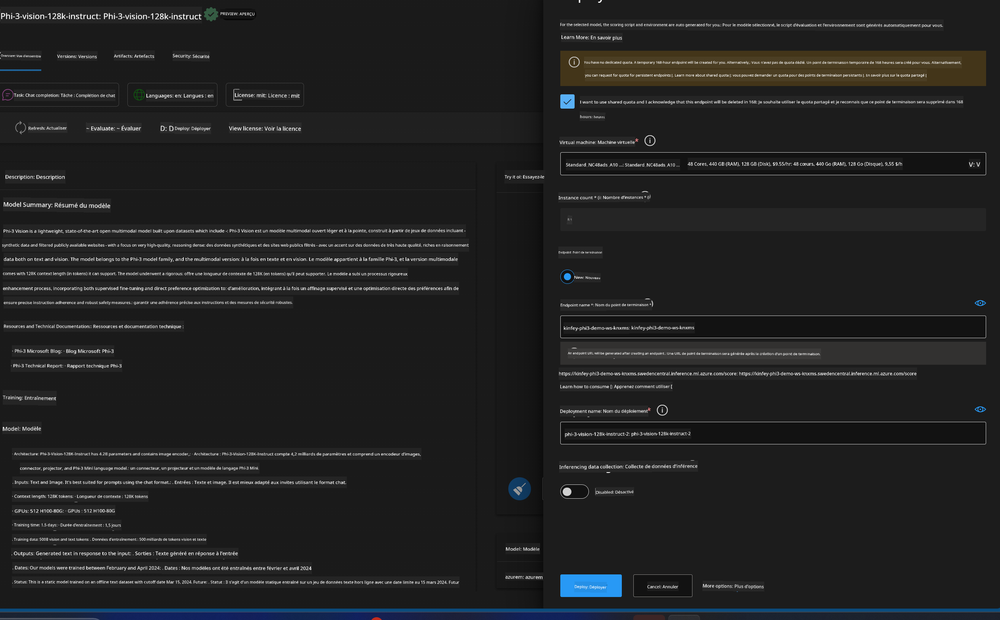

<!--
CO_OP_TRANSLATOR_METADATA:
{
  "original_hash": "20cb4e6ac1686248e8be913ccf6c2bc2",
  "translation_date": "2025-07-17T04:03:35+00:00",
  "source_file": "md/02.Application/02.Code/Phi3/VSCodeExt/HOL/AIPC/03.DeployPhi3VisionOnAzure.md",
  "language_code": "fr"
}
-->
# **Laboratoire 3 - Déployer Phi-3-vision sur Azure Machine Learning Service**

Nous utilisons le NPU pour réaliser le déploiement en production du code local, puis nous souhaitons intégrer la capacité d’introduire PHI-3-VISION afin de générer du code à partir d’images.

Dans cette introduction, nous allons rapidement créer un service Model As Service Phi-3 Vision dans Azure Machine Learning Service.

***Note*** : Phi-3 Vision nécessite une puissance de calcul importante pour générer du contenu plus rapidement. Nous avons besoin de la puissance de calcul cloud pour nous aider à y parvenir.


### **1. Créer un Azure Machine Learning Service**

Nous devons créer un Azure Machine Learning Service dans le portail Azure. Si vous souhaitez apprendre comment faire, veuillez consulter ce lien [https://learn.microsoft.com/azure/machine-learning/quickstart-create-resources?view=azureml-api-2](https://learn.microsoft.com/azure/machine-learning/quickstart-create-resources?view=azureml-api-2)


### **2. Choisir Phi-3 Vision dans Azure Machine Learning Service**


### **3. Déployer Phi-3-Vision sur Azure**





### **4. Tester le point de terminaison dans Postman**


***Note***

1. Les paramètres à transmettre doivent inclure Authorization, azureml-model-deployment, et Content-Type. Vous devez vérifier les informations de déploiement pour les obtenir.

2. Pour transmettre les paramètres, Phi-3-Vision nécessite un lien vers une image. Veuillez vous référer à la méthode GPT-4-Vision pour transmettre les paramètres, par exemple

```json

{
  "input_data":{
    "input_string":[
      {
        "role":"user",
        "content":[ 
          {
            "type": "text",
            "text": "You are a Python coding assistant.Please create Python code for image "
          },
          {
              "type": "image_url",
              "image_url": {
                "url": "https://ajaytech.co/wp-content/uploads/2019/09/index.png"
              }
          }
        ]
      }
    ],
    "parameters":{
          "temperature": 0.6,
          "top_p": 0.9,
          "do_sample": false,
          "max_new_tokens": 2048
    }
  }
}

```

3. Appelez **/score** en utilisant la méthode Post

**Félicitations** ! Vous avez terminé le déploiement rapide de PHI-3-VISION et testé comment générer du code à partir d’images. Ensuite, nous pourrons construire des applications en combinant NPUs et cloud.

**Avertissement** :  
Ce document a été traduit à l’aide du service de traduction automatique [Co-op Translator](https://github.com/Azure/co-op-translator). Bien que nous nous efforcions d’assurer l’exactitude, veuillez noter que les traductions automatiques peuvent contenir des erreurs ou des inexactitudes. Le document original dans sa langue d’origine doit être considéré comme la source faisant foi. Pour les informations critiques, une traduction professionnelle réalisée par un humain est recommandée. Nous déclinons toute responsabilité en cas de malentendus ou de mauvaises interprétations résultant de l’utilisation de cette traduction.