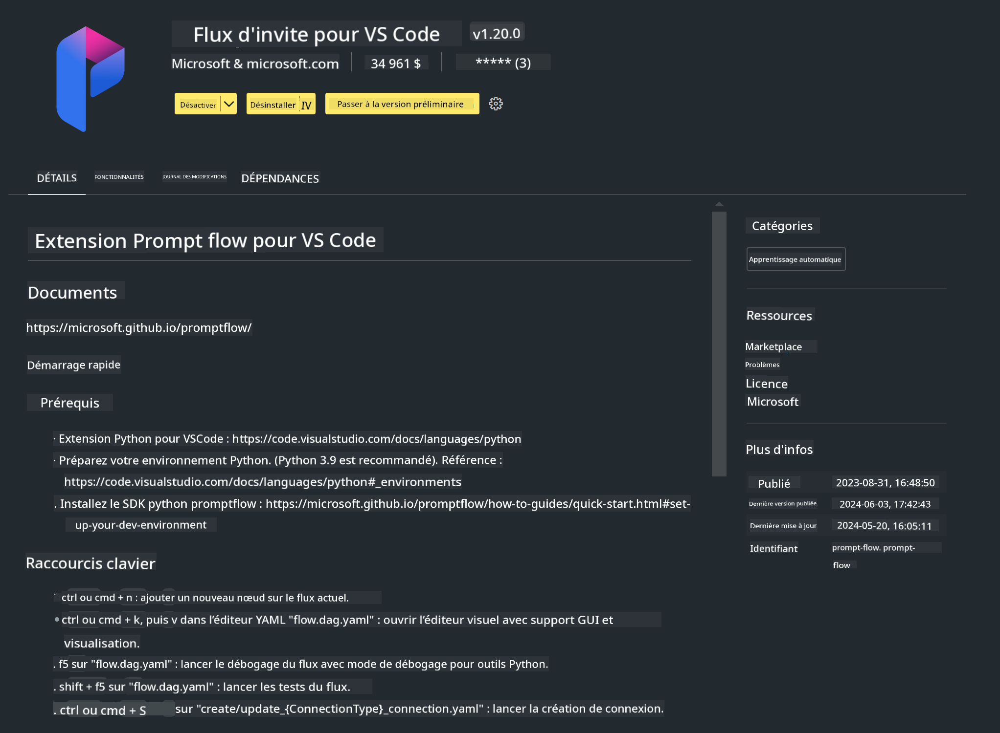

<!--
CO_OP_TRANSLATOR_METADATA:
{
  "original_hash": "4b16264917d9b93169745d92b8ce8c65",
  "translation_date": "2025-05-07T13:54:36+00:00",
  "source_file": "md/02.Application/02.Code/Phi3/VSCodeExt/HOL/Apple/01.Installations.md",
  "language_code": "fr"
}
-->
# **Lab 0 - Installation**

Lorsque nous entrons dans le Lab, nous devons configurer l’environnement approprié :

### **1. Python 3.11+**

Il est recommandé d’utiliser miniforge pour configurer votre environnement Python.

Pour configurer miniforge, veuillez consulter [https://github.com/conda-forge/miniforge](https://github.com/conda-forge/miniforge)

Après avoir configuré miniforge, exécutez la commande suivante dans Power Shell

```bash

conda create -n pyenv python==3.11.8 -y

conda activate pyenv

```

### **2. Installer le SDK Prompt flow**

Dans le Lab 1, nous utilisons Prompt flow, il faut donc configurer le SDK Prompt flow.

```bash

pip install promptflow --upgrade

```

Vous pouvez vérifier le SDK promptflow avec cette commande

```bash

pf --version

```

### **3. Installer l’extension Prompt flow pour Visual Studio Code**



### **4. Framework MLX d’Apple**

MLX est un framework pour la recherche en apprentissage automatique sur les puces Apple Silicon, développé par l’équipe de recherche en machine learning d’Apple. Vous pouvez utiliser **le framework Apple MLX** pour accélérer LLM / SLM avec Apple Silicon. Pour en savoir plus, vous pouvez consulter [https://github.com/microsoft/PhiCookBook/blob/main/md/01.Introduction/03/MLX_Inference.md](https://github.com/microsoft/PhiCookBook/blob/main/md/01.Introduction/03/MLX_Inference.md).

Installer la bibliothèque MLX framework en bash

```bash

pip install mlx-lm

```

### **5. Autres bibliothèques Python**

Créez un fichier requirements.txt et ajoutez ce contenu

```txt

notebook
numpy 
scipy 
scikit-learn 
matplotlib 
pandas 
pillow 
graphviz

```

### **6. Installer NVM**

Installez nvm dans Powershell

```bash

brew install nvm

```

Installez nodejs 18.20

```bash

nvm install 18.20.0

nvm use 18.20.0

```

### **7. Installer le support de développement Visual Studio Code**

```bash

npm install --global yo generator-code

```

Félicitations ! Vous avez configuré le SDK avec succès. Passez maintenant aux étapes pratiques.

**Avertissement** :  
Ce document a été traduit à l'aide du service de traduction automatique [Co-op Translator](https://github.com/Azure/co-op-translator). Bien que nous nous efforçons d'assurer l'exactitude, veuillez noter que les traductions automatiques peuvent contenir des erreurs ou des inexactitudes. Le document original dans sa langue native doit être considéré comme la source faisant foi. Pour les informations critiques, il est recommandé de faire appel à une traduction professionnelle réalisée par un humain. Nous déclinons toute responsabilité en cas de malentendus ou de mauvaises interprétations résultant de l'utilisation de cette traduction.