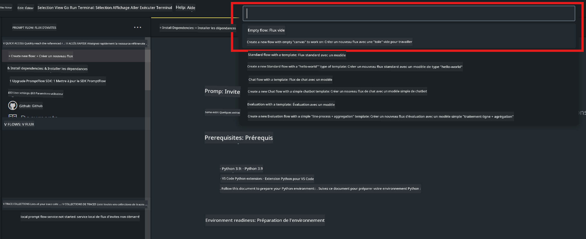

<!--
CO_OP_TRANSLATOR_METADATA:
{
  "original_hash": "3dbbf568625b1ee04b354c2dc81d3248",
  "translation_date": "2025-07-17T04:22:11+00:00",
  "source_file": "md/02.Application/02.Code/Phi3/VSCodeExt/HOL/Apple/02.PromptflowWithMLX.md",
  "language_code": "fr"
}
-->
# **Lab 2 - Exécuter Prompt flow avec Phi-3-mini dans AIPC**

## **Qu'est-ce que Prompt flow**

Prompt flow est une suite d’outils de développement conçue pour simplifier le cycle complet de développement des applications IA basées sur les LLM, de l’idéation, prototypage, test, évaluation jusqu’au déploiement en production et à la surveillance. Il facilite grandement l’ingénierie des prompts et vous permet de créer des applications LLM de qualité production.

Avec Prompt flow, vous pourrez :

- Créer des flux qui relient les LLM, prompts, code Python et autres outils dans un workflow exécutable.

- Déboguer et itérer vos flux, en particulier les interactions avec les LLM, facilement.

- Évaluer vos flux, calculer des métriques de qualité et de performance sur des jeux de données plus larges.

- Intégrer les tests et évaluations dans votre système CI/CD pour garantir la qualité de votre flux.

- Déployer vos flux sur la plateforme de service de votre choix ou les intégrer facilement dans la base de code de votre application.

- (Optionnel mais fortement recommandé) Collaborer avec votre équipe en utilisant la version cloud de Prompt flow dans Azure AI.

## **Créer des flux de génération de code sur Apple Silicon**

***Note*** : Si vous n’avez pas encore terminé l’installation de l’environnement, veuillez consulter [Lab 0 - Installations](./01.Installations.md)

1. Ouvrez l’extension Prompt flow dans Visual Studio Code et créez un projet de flux vide



2. Ajoutez les paramètres d’Entrée et de Sortie puis ajoutez du code Python comme nouveau flux


Vous pouvez vous référer à cette structure (flow.dag.yaml) pour construire votre flux

```yaml

inputs:
  prompt:
    type: string
    default: Write python code for Fibonacci serie. Please use markdown as output
outputs:
  result:
    type: string
    reference: ${gen_code_by_phi3.output}
nodes:
- name: gen_code_by_phi3
  type: python
  source:
    type: code
    path: gen_code_by_phi3.py
  inputs:
    prompt: ${inputs.prompt}


```

3. Quantifier phi-3-mini

Nous souhaitons mieux exécuter SLM sur des appareils locaux. En général, nous quantifions le modèle (INT4, FP16, FP32)

```bash

python -m mlx_lm.convert --hf-path microsoft/Phi-3-mini-4k-instruct

```

**Note :** le dossier par défaut est mlx_model

4. Ajoutez le code dans ***Chat_With_Phi3.py***

```python


from promptflow import tool

from mlx_lm import load, generate


# The inputs section will change based on the arguments of the tool function, after you save the code
# Adding type to arguments and return value will help the system show the types properly
# Please update the function name/signature per need
@tool
def my_python_tool(prompt: str) -> str:

    model_id = './mlx_model_phi3_mini'

    model, tokenizer = load(model_id)

    # <|user|>\nWrite python code for Fibonacci serie. Please use markdown as output<|end|>\n<|assistant|>

    response = generate(model, tokenizer, prompt="<|user|>\n" + prompt  + "<|end|>\n<|assistant|>", max_tokens=2048, verbose=True)

    return response


```

4. Vous pouvez tester le flux via Debug ou Run pour vérifier si la génération de code fonctionne correctement


5. Exécutez le flux en tant qu’API de développement dans le terminal

```

pf flow serve --source ./ --port 8080 --host localhost   

```

Vous pouvez le tester dans Postman / Thunder Client

### **Note**

1. La première exécution prend du temps. Il est recommandé de télécharger le modèle phi-3 via Hugging face CLI.

2. Compte tenu de la puissance de calcul limitée du NPU Intel, il est conseillé d’utiliser Phi-3-mini-4k-instruct.

3. Nous utilisons l’accélération Intel NPU pour quantifier la conversion INT4, mais si vous relancez le service, vous devez supprimer les dossiers cache et nc_workshop.

## **Ressources**

1. Apprendre Promptflow [https://microsoft.github.io/promptflow/](https://microsoft.github.io/promptflow/)

2. Apprendre l’accélération Intel NPU [https://github.com/intel/intel-npu-acceleration-library](https://github.com/intel/intel-npu-acceleration-library)

3. Code d’exemple, télécharger [Local NPU Agent Sample Code](../../../../../../../../../code/07.Lab/01/AIPC/local-npu-agent)

**Avertissement** :  
Ce document a été traduit à l’aide du service de traduction automatique [Co-op Translator](https://github.com/Azure/co-op-translator). Bien que nous nous efforcions d’assurer l’exactitude, veuillez noter que les traductions automatiques peuvent contenir des erreurs ou des inexactitudes. Le document original dans sa langue d’origine doit être considéré comme la source faisant foi. Pour les informations critiques, une traduction professionnelle réalisée par un humain est recommandée. Nous déclinons toute responsabilité en cas de malentendus ou de mauvaises interprétations résultant de l’utilisation de cette traduction.