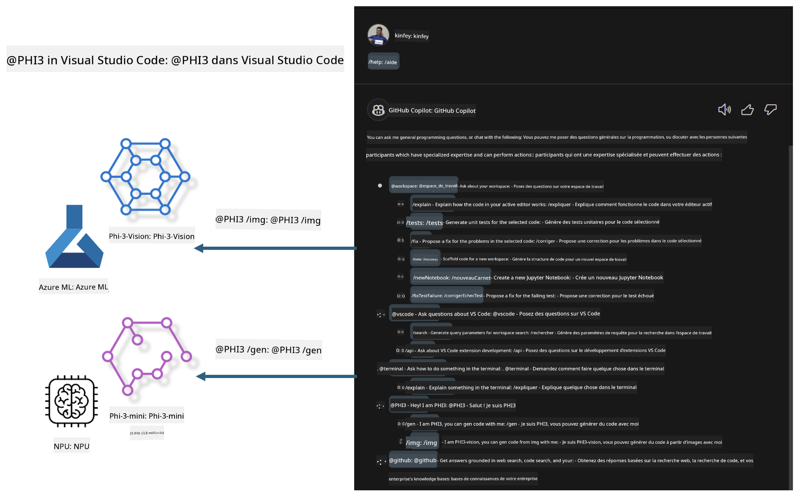

<!--
CO_OP_TRANSLATOR_METADATA:
{
  "original_hash": "00b7a699de8ac405fa821f4c0f7fc0ab",
  "translation_date": "2025-05-07T13:47:24+00:00",
  "source_file": "md/02.Application/02.Code/Phi3/VSCodeExt/README.md",
  "language_code": "fr"
}
-->
# **Créez votre propre GitHub Copilot Chat Visual Studio Code avec la famille Microsoft Phi-3**

Avez-vous déjà utilisé l’agent workspace dans GitHub Copilot Chat ? Souhaitez-vous créer votre propre agent de code pour votre équipe ? Ce laboratoire pratique vise à combiner un modèle open source pour construire un agent métier de génération de code de niveau entreprise.

## **Fondations**

### **Pourquoi choisir Microsoft Phi-3**

Phi-3 est une série familiale, comprenant phi-3-mini, phi-3-small et phi-3-medium, basés sur différents paramètres d’entraînement pour la génération de texte, la complétion de dialogues et la génération de code. Il existe aussi phi-3-vision basé sur la Vision. Cette série est adaptée aux entreprises ou aux équipes souhaitant créer des solutions d’IA générative hors ligne.

Nous recommandons la lecture de ce lien [https://github.com/microsoft/PhiCookBook/blob/main/md/01.Introduction/01/01.PhiFamily.md](https://github.com/microsoft/PhiCookBook/blob/main/md/01.Introduction/01/01.PhiFamily.md)

### **Microsoft GitHub Copilot Chat**

L’extension GitHub Copilot Chat vous offre une interface de chat qui vous permet d’interagir avec GitHub Copilot et d’obtenir des réponses à vos questions liées au code directement dans VS Code, sans avoir à consulter la documentation ou à chercher sur des forums en ligne.

Copilot Chat peut utiliser la coloration syntaxique, l’indentation et d’autres fonctionnalités de formatage pour rendre la réponse générée plus claire. Selon le type de question posée, la réponse peut contenir des liens vers le contexte utilisé par Copilot pour générer sa réponse, comme des fichiers source ou de la documentation, ou des boutons pour accéder à des fonctionnalités de VS Code.

- Copilot Chat s’intègre dans votre flux de développement et vous assiste là où vous en avez besoin :

- Démarrez une conversation de chat en ligne directement depuis l’éditeur ou le terminal pour obtenir de l’aide pendant que vous codez

- Utilisez la vue Chat pour avoir un assistant IA à vos côtés à tout moment

- Lancez Quick Chat pour poser une question rapide et reprendre votre travail immédiatement

Vous pouvez utiliser GitHub Copilot Chat dans divers scénarios, tels que :

- Répondre à des questions de codage sur la meilleure façon de résoudre un problème

- Expliquer le code de quelqu’un d’autre et suggérer des améliorations

- Proposer des corrections de code

- Générer des cas de tests unitaires

- Générer de la documentation de code

Nous recommandons la lecture de ce lien [https://code.visualstudio.com/docs/copilot/copilot-chat](https://code.visualstudio.com/docs/copilot/copilot-chat?WT.mc_id=aiml-137032-kinfeylo)

### **Microsoft GitHub Copilot Chat @workspace**

L’utilisation de **@workspace** dans Copilot Chat vous permet de poser des questions sur l’ensemble de votre base de code. En fonction de la question, Copilot récupère intelligemment les fichiers et symboles pertinents, qu’il référence ensuite dans sa réponse sous forme de liens et d’exemples de code.

Pour répondre à votre question, **@workspace** explore les mêmes sources qu’un développeur utiliserait en naviguant dans une base de code sous VS Code :

- Tous les fichiers du workspace, sauf ceux ignorés par un fichier .gitignore

- La structure des répertoires avec les dossiers et noms de fichiers imbriqués

- L’index de recherche de code GitHub, si le workspace est un dépôt GitHub indexé par code search

- Les symboles et définitions présents dans le workspace

- Le texte actuellement sélectionné ou visible dans l’éditeur actif

Note : Le fichier .gitignore est ignoré si vous avez un fichier ouvert ou du texte sélectionné dans un fichier ignoré.

Nous recommandons la lecture de ce lien [[https://code.visualstudio.com/docs/copilot/copilot-chat](https://code.visualstudio.com/docs/copilot/workspace-context?WT.mc_id=aiml-137032-kinfeylo)]

## **En savoir plus sur ce laboratoire**

GitHub Copilot a grandement amélioré l’efficacité de programmation en entreprise, et chaque entreprise souhaite personnaliser les fonctions pertinentes de GitHub Copilot. De nombreuses entreprises ont développé des extensions personnalisées similaires à GitHub Copilot, basées sur leurs propres scénarios métier et modèles open source. Pour les entreprises, ces extensions personnalisées sont plus faciles à contrôler, mais cela peut aussi impacter l’expérience utilisateur. Après tout, GitHub Copilot offre des fonctionnalités plus avancées pour gérer des scénarios généraux et un haut niveau de professionnalisme. Si l’expérience peut rester cohérente, il est préférable de personnaliser sa propre extension d’entreprise. GitHub Copilot Chat fournit des API pertinentes pour que les entreprises étendent l’expérience de chat. Maintenir une expérience cohérente tout en ayant des fonctions personnalisées constitue une meilleure expérience utilisateur.

Ce laboratoire utilise principalement le modèle Phi-3 combiné avec un NPU local et Azure en mode hybride pour construire un Agent personnalisé dans GitHub Copilot Chat ***@PHI3*** afin d’assister les développeurs d’entreprise dans la génération de code***(@PHI3 /gen)*** et la génération de code à partir d’images ***(@PHI3 /img)***.

### ***Note :***

Ce laboratoire est actuellement implémenté sur AIPC avec CPU Intel et Apple Silicon. Nous continuerons à mettre à jour la version Qualcomm du NPU.

## **Laboratoire**

| Nom | Description | AIPC | Apple |
| ------------ | ----------- | -------- |-------- |
| Lab0 - Installations(✅) | Configuration et installation des environnements et outils nécessaires | [Go](./HOL/AIPC/01.Installations.md) |[Go](./HOL/Apple/01.Installations.md) |
| Lab1 - Exécution du flux Prompt avec Phi-3-mini (✅) | En combinant AIPC / Apple Silicon, utilisation du NPU local pour créer de la génération de code via Phi-3-mini | [Go](./HOL/AIPC/02.PromptflowWithNPU.md) |  [Go](./HOL/Apple/02.PromptflowWithMLX.md) |
| Lab2 - Déploiement de Phi-3-vision sur Azure Machine Learning Service(✅) | Génération de code via le déploiement du catalogue de modèles Azure Machine Learning Service - image Phi-3-vision | [Go](./HOL/AIPC/03.DeployPhi3VisionOnAzure.md) |[Go](./HOL/Apple/03.DeployPhi3VisionOnAzure.md) |
| Lab3 - Création d’un agent @phi-3 dans GitHub Copilot Chat(✅)  | Création d’un agent Phi-3 personnalisé dans GitHub Copilot Chat pour compléter la génération de code, génération de code graphique, RAG, etc. | [Go](./HOL/AIPC/04.CreatePhi3AgentInVSCode.md) | [Go](./HOL/Apple/04.CreatePhi3AgentInVSCode.md) |
| Code d’exemple (✅)  | Télécharger le code d’exemple | [Go](../../../../../../../code/07.Lab/01/AIPC) | [Go](../../../../../../../code/07.Lab/01/Apple) |

## **Ressources**

1. Phi-3 Cookbook [https://github.com/microsoft/Phi-3CookBook](https://github.com/microsoft/Phi-3CookBook)

2. En savoir plus sur GitHub Copilot [https://learn.microsoft.com/training/paths/copilot/](https://learn.microsoft.com/training/paths/copilot/?WT.mc_id=aiml-137032-kinfeylo)

3. En savoir plus sur GitHub Copilot Chat [https://learn.microsoft.com/training/paths/accelerate-app-development-using-github-copilot/](https://learn.microsoft.com/training/paths/accelerate-app-development-using-github-copilot/?WT.mc_id=aiml-137032-kinfeylo)

4. En savoir plus sur l’API GitHub Copilot Chat [https://code.visualstudio.com/api/extension-guides/chat](https://code.visualstudio.com/api/extension-guides/chat?WT.mc_id=aiml-137032-kinfeylo)

5. En savoir plus sur Azure AI Foundry [https://learn.microsoft.com/training/paths/create-custom-copilots-ai-studio/](https://learn.microsoft.com/training/paths/create-custom-copilots-ai-studio/?WT.mc_id=aiml-137032-kinfeylo)

6. En savoir plus sur le catalogue de modèles Azure AI Foundry [https://learn.microsoft.com/azure/ai-studio/how-to/model-catalog-overview](https://learn.microsoft.com/azure/ai-studio/how-to/model-catalog-overview)

**Avertissement** :  
Ce document a été traduit à l’aide du service de traduction automatique [Co-op Translator](https://github.com/Azure/co-op-translator). Bien que nous nous efforçons d’assurer l’exactitude, veuillez noter que les traductions automatiques peuvent contenir des erreurs ou des inexactitudes. Le document original dans sa langue d’origine doit être considéré comme la source faisant foi. Pour les informations critiques, il est recommandé de recourir à une traduction professionnelle réalisée par un humain. Nous déclinons toute responsabilité en cas de malentendus ou d’interprétations erronées résultant de l’utilisation de cette traduction.