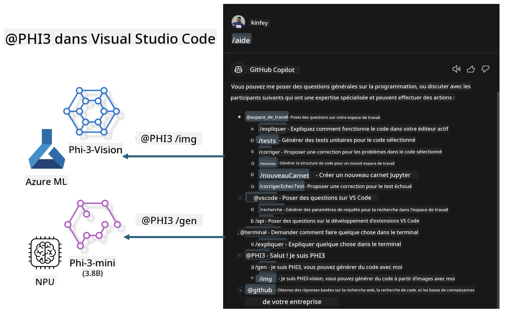

# **Créez votre propre Visual Studio Code GitHub Copilot Chat avec la famille Microsoft Phi-3**

Avez-vous utilisé l’agent espace de travail dans GitHub Copilot Chat ? Voulez-vous créer votre propre agent de code pour votre équipe ? Ce laboratoire pratique espère combiner un modèle open source afin de construire un agent d’entreprise pour le code.

## **Fondation**

### **Pourquoi choisir Microsoft Phi-3**

Phi-3 est une série familiale, incluant phi-3-mini, phi-3-small et phi-3-medium basés sur différents paramètres de formation pour la génération de texte, l’achèvement de dialogue et la génération de code. Il existe également phi-3-vision basé sur Vision. Il est adapté aux entreprises ou différentes équipes pour créer des solutions d’IA générative hors ligne.

Il est recommandé de lire ce lien [https://github.com/microsoft/PhiCookBook/blob/main/md/01.Introduction/01/01.PhiFamily.md](https://github.com/microsoft/PhiCookBook/blob/main/md/01.Introduction/01/01.PhiFamily.md)

### **Microsoft GitHub Copilot Chat**

L’extension GitHub Copilot Chat vous offre une interface de chat qui vous permet d’interagir avec GitHub Copilot et de recevoir des réponses aux questions liées au codage directement dans VS Code, sans que vous ayez besoin de naviguer dans la documentation ou de rechercher dans des forums en ligne.

Copilot Chat peut utiliser la coloration syntaxique, l’indentation et d’autres fonctionnalités de formatage pour clarifier la réponse générée. Selon le type de question posée par l’utilisateur, le résultat peut contenir des liens vers le contexte utilisé par Copilot pour générer la réponse, comme des fichiers source ou de la documentation, ou des boutons pour accéder à des fonctionnalités de VS Code.

- Copilot Chat s’intègre dans votre flux de développement et vous assiste où vous en avez besoin :

- Démarrez une conversation de chat en ligne directement depuis l’éditeur ou le terminal pour obtenir de l’aide pendant que vous codez

- Utilisez la vue Chat pour avoir un assistant IA sur le côté afin de vous aider à tout moment

- Lancez Quick Chat pour poser une question rapide et retourner à ce que vous faisiez

Vous pouvez utiliser GitHub Copilot Chat dans divers scénarios, tels que :

- Répondre aux questions de codage sur la meilleure façon de résoudre un problème

- Expliquer le code de quelqu’un d’autre et suggérer des améliorations

- Proposer des corrections de code

- Générer des cas de tests unitaires

- Générer de la documentation de code

Il est recommandé de lire ce lien [https://code.visualstudio.com/docs/copilot/copilot-chat](https://code.visualstudio.com/docs/copilot/copilot-chat?WT.mc_id=aiml-137032-kinfeylo)

###  **Microsoft GitHub Copilot Chat @workspace**

Faire référence à **@workspace** dans Copilot Chat vous permet de poser des questions sur l’ensemble de votre base de code. En fonction de la question, Copilot récupère intelligemment les fichiers et symboles pertinents, qu’il cite ensuite dans sa réponse sous forme de liens et d’exemples de code.

Pour répondre à votre question, **@workspace** recherche dans les mêmes sources qu’un développeur utiliserait lorsqu’il navigue dans une base de code dans VS Code :

- Tous les fichiers dans l’espace de travail, à l’exception des fichiers ignorés par un fichier .gitignore

- La structure des répertoires avec les dossiers et noms de fichiers imbriqués

- L’index de recherche de code de GitHub, si l’espace de travail est un dépôt GitHub et indexé par la recherche de code

- Les symboles et définitions dans l’espace de travail

- Le texte actuellement sélectionné ou visible dans l’éditeur actif

Note : .gitignore est contourné si vous avez un fichier ouvert ou du texte sélectionné dans un fichier ignoré.

Il est recommandé de lire ce lien [[https://code.visualstudio.com/docs/copilot/copilot-chat](https://code.visualstudio.com/docs/copilot/workspace-context?WT.mc_id=aiml-137032-kinfeylo)]

## **En savoir plus sur ce laboratoire**

GitHub Copilot a considérablement amélioré l’efficacité de programmation des entreprises, et chaque entreprise espère personnaliser les fonctionnalités pertinentes de GitHub Copilot. De nombreuses entreprises ont personnalisé des Extensions similaires à GitHub Copilot basées sur leurs propres scénarios métier et modèles open source. Pour les entreprises, les Extensions personnalisées sont plus faciles à contrôler, mais cela influence également l’expérience utilisateur. Après tout, GitHub Copilot a des fonctions plus solides pour gérer des scénarios généraux et la professionnalité. Si l’expérience peut rester cohérente, il serait préférable de personnaliser l’Extension propre à l’entreprise. GitHub Copilot Chat fournit des API pertinentes pour les entreprises afin d’étendre l’expérience Chat. Maintenir une expérience cohérente tout en disposant de fonctions personnalisées est une meilleure expérience utilisateur.

Ce laboratoire utilise principalement le modèle Phi-3 combiné avec le NPU local et Azure hybride pour construire un Agent personnalisé dans GitHub Copilot Chat ***@PHI3*** pour assister les développeurs d’entreprise dans la génération de code***(@PHI3 /gen)*** et la génération de code basée sur des images ***(@PHI3 /img)***.

### ***Note :*** 

Ce laboratoire est actuellement implémenté dans l’AIPC des CPU Intel et Apple Silicon. Nous continuerons à mettre à jour la version Qualcomm du NPU.

## **Laboratoire**

| Nom | Description | AIPC | Apple |
| ------------ | ----------- | -------- |-------- |
| Lab0 - Installations(✅) | Configurer et installer les environnements et outils d’installation liés | [Go](./HOL/AIPC/01.Installations.md) |[Go](./HOL/Apple/01.Installations.md) |
| Lab1 - Exécuter le flux Prompt avec Phi-3-mini (✅) | Combiné avec AIPC / Apple Silicon, utilisant le NPU local pour créer une génération de code via Phi-3-mini | [Go](./HOL/AIPC/02.PromptflowWithNPU.md) |  [Go](./HOL/Apple/02.PromptflowWithMLX.md) |
| Lab2 - Déployer Phi-3-vision sur Azure Machine Learning Service(✅) | Générer du code en déployant le catalogue de modèles d’Azure Machine Learning Service - image Phi-3-vision | [Go](./HOL/AIPC/03.DeployPhi3VisionOnAzure.md) |[Go](./HOL/Apple/03.DeployPhi3VisionOnAzure.md) |
| Lab3 - Créer un agent @phi-3 dans GitHub Copilot Chat(✅)  | Créer un agent Phi-3 personnalisé dans GitHub Copilot Chat pour compléter la génération de code, la génération de graphique, le RAG, etc. | [Go](./HOL/AIPC/04.CreatePhi3AgentInVSCode.md) | [Go](./HOL/Apple/04.CreatePhi3AgentInVSCode.md) |
| Code d’exemple (✅)  | Télécharger le code d’exemple | [Go](../../../../../../../code/07.Lab/01/AIPC) | [Go](../../../../../../../code/07.Lab/01/Apple) |

## **Ressources**

1. Phi-3 Cookbook [https://github.com/microsoft/Phi-3CookBook](https://github.com/microsoft/Phi-3CookBook)

2. En savoir plus sur GitHub Copilot [https://learn.microsoft.com/training/paths/copilot/](https://learn.microsoft.com/training/paths/copilot/?WT.mc_id=aiml-137032-kinfeylo)

3. En savoir plus sur GitHub Copilot Chat [https://learn.microsoft.com/training/paths/accelerate-app-development-using-github-copilot/](https://learn.microsoft.com/training/paths/accelerate-app-development-using-github-copilot/?WT.mc_id=aiml-137032-kinfeylo)

4. En savoir plus sur l’API GitHub Copilot Chat [https://code.visualstudio.com/api/extension-guides/chat](https://code.visualstudio.com/api/extension-guides/chat?WT.mc_id=aiml-137032-kinfeylo)

5. En savoir plus sur Microsoft Foundry [https://learn.microsoft.com/training/paths/create-custom-copilots-ai-studio/](https://learn.microsoft.com/training/paths/create-custom-copilots-ai-studio/?WT.mc_id=aiml-137032-kinfeylo)

6. En savoir plus sur le catalogue de modèles Microsoft Foundry [https://learn.microsoft.com/azure/ai-studio/how-to/model-catalog-overview](https://learn.microsoft.com/azure/ai-studio/how-to/model-catalog-overview)

---

<!-- CO-OP TRANSLATOR DISCLAIMER START -->
**Avertissement** :  
Ce document a été traduit à l'aide du service de traduction automatique [Co-op Translator](https://github.com/Azure/co-op-translator). Bien que nous nous efforcions d'assurer l'exactitude, veuillez noter que les traductions automatiques peuvent contenir des erreurs ou des inexactitudes. Le document original dans sa langue d'origine doit être considéré comme la source faisant foi. Pour les informations critiques, nous recommandons une traduction professionnelle réalisée par un humain. Nous déclinons toute responsabilité en cas de malentendus ou d'interprétations erronées résultant de l'utilisation de cette traduction.
<!-- CO-OP TRANSLATOR DISCLAIMER END -->