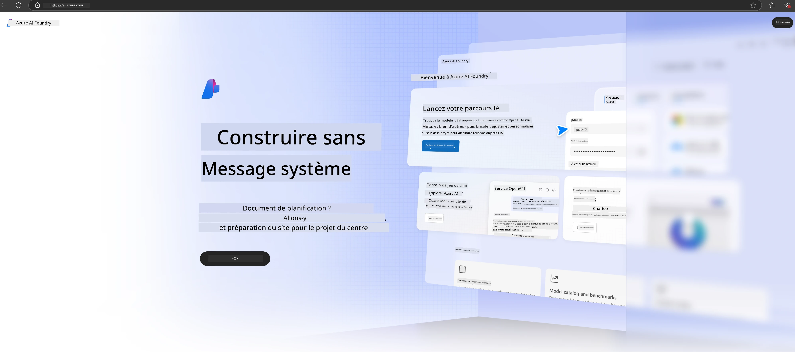

# **Utilisation de Phi-3 dans Microsoft Foundry**

Avec le développement de l’IA générative, nous espérons utiliser une plateforme unifiée pour gérer différents LLM et SLM, l'intégration des données d'entreprise, les opérations de réglage fin/RAG, ainsi que l'évaluation des différentes activités d'entreprise après intégration des LLM et SLM, etc., afin que les applications intelligentes d’IA générative puissent être mieux mises en œuvre. [Microsoft Foundry](https://ai.azure.com) est une plateforme d’application d’IA générative de niveau entreprise.

Avec Microsoft Foundry, vous pouvez évaluer les réponses des grands modèles de langage (LLM) et orchestrer les composants d’application de prompt avec prompt flow pour de meilleures performances. La plateforme facilite la montée en charge pour transformer aisément les preuves de concept en production complète. Une surveillance continue et un affinage soutiennent le succès à long terme.

Nous pouvons rapidement déployer le modèle Phi-3 sur Microsoft Foundry en quelques étapes simples, puis utiliser Microsoft Foundry pour compléter les travaux liés à Phi-3 comme Playground/Chat, Fine-tuning, évaluation et autres.

## **1. Préparation**

Si vous avez déjà installé le [Azure Developer CLI](https://learn.microsoft.com/azure/developer/azure-developer-cli/overview?WT.mc_id=aiml-138114-kinfeylo) sur votre machine, utiliser ce modèle est aussi simple que d’exécuter cette commande dans un nouveau répertoire.

## Création manuelle

Créer un projet et un hub Microsoft Foundry est un excellent moyen d’organiser et de gérer votre travail d’IA. Voici un guide étape par étape pour commencer :

### Créer un projet dans Microsoft Foundry

1. **Aller sur Microsoft Foundry** : Connectez-vous au portail Microsoft Foundry.
2. **Créer un projet** :
   - Si vous êtes dans un projet, sélectionnez « Microsoft Foundry » en haut à gauche de la page pour accéder à la page d’accueil.
   - Sélectionnez « + Créer un projet ».
   - Entrez un nom pour le projet.
   - Si vous avez un hub, il sera sélectionné par défaut. Si vous avez accès à plusieurs hubs, vous pouvez en sélectionner un autre dans la liste déroulante. Si vous souhaitez créer un nouveau hub, sélectionnez « Créer un nouveau hub » et fournissez un nom.
   - Sélectionnez « Créer ».

### Créer un hub dans Microsoft Foundry

1. **Aller sur Microsoft Foundry** : Connectez-vous avec votre compte Azure.
2. **Créer un hub** :
   - Sélectionnez le centre de gestion dans le menu de gauche.
   - Sélectionnez « Toutes les ressources », puis la flèche vers le bas à côté de « + Nouveau projet » et sélectionnez « + Nouveau hub ».
   - Dans la fenêtre « Créer un nouveau hub », entrez un nom pour votre hub (par exemple, contoso-hub) et modifiez les autres champs selon vos souhaits.
   - Sélectionnez « Suivant », vérifiez les informations, puis sélectionnez « Créer ».

Pour des instructions plus détaillées, vous pouvez consulter la [documentation officielle Microsoft](https://learn.microsoft.com/azure/ai-studio/how-to/create-projects).

Après une création réussie, vous pouvez accéder au studio que vous avez créé via [ai.azure.com](https://ai.azure.com/)

Il peut y avoir plusieurs projets sur un même AI Foundry. Créez un projet dans AI Foundry pour vous préparer.

Créez des [QuickStarts](https://learn.microsoft.com/azure/ai-studio/quickstarts/get-started-code) Microsoft Foundry

## **2. Déployer un modèle Phi dans Microsoft Foundry**

Cliquez sur l’option Explorer du projet pour entrer dans le Catalogue de modèles et sélectionnez Phi-3

Sélectionnez Phi-3-mini-4k-instruct

Cliquez sur 'Déployer' pour déployer le modèle Phi-3-mini-4k-instruct

> [!NOTE]
>
> Vous pouvez sélectionner la puissance de calcul lors du déploiement

## **3. Playground Chat Phi dans Microsoft Foundry**

Allez à la page de déploiement, sélectionnez Playground, et discutez avec Phi-3 de Microsoft Foundry

## **4. Déploiement du modèle depuis Microsoft Foundry**

Pour déployer un modèle à partir du catalogue de modèles Azure, vous pouvez suivre ces étapes :

- Connectez-vous à Microsoft Foundry.
- Choisissez le modèle que vous voulez déployer dans le catalogue de modèles Microsoft Foundry.
- Sur la page Détails du modèle, sélectionnez Déployer puis sélectionnez API Serverless avec Azure AI Content Safety.
- Sélectionnez le projet dans lequel vous souhaitez déployer vos modèles. Pour utiliser l’offre API Serverless, votre espace de travail doit appartenir à la région East US 2 ou Sweden Central. Vous pouvez personnaliser le nom du déploiement.
- Dans l’assistant de déploiement, sélectionnez Tarification et conditions pour en savoir plus sur la tarification et les conditions d’utilisation.
- Sélectionnez Déployer. Attendez que le déploiement soit prêt et que vous soyez redirigé vers la page Déploiements.
- Sélectionnez Ouvrir dans playground pour commencer à interagir avec le modèle.
- Vous pouvez revenir à la page Déploiements, sélectionner le déploiement, et noter l’URL cible et la clé secrète de l’endpoint, que vous pouvez utiliser pour appeler le déploiement et générer des complétions.
- Vous pouvez toujours trouver les détails de l’endpoint, l’URL et les clés d’accès en naviguant dans l’onglet Build et en sélectionnant Déploiements dans la section Composants.

> [!NOTE]
> Veuillez noter que votre compte doit disposer des permissions de rôle Azure AI Developer sur le groupe de ressources pour effectuer ces étapes.

## **5. Utilisation de l’API Phi dans Microsoft Foundry**

Vous pouvez accéder à https://{Nom de votre projet}.region.inference.ml.azure.com/swagger.json via Postman GET et le combiner avec la clé pour découvrir les interfaces fournies

Vous pouvez obtenir très facilement les paramètres de requête ainsi que les paramètres de réponse.

---

<!-- CO-OP TRANSLATOR DISCLAIMER START -->
**Clause de non-responsabilité** :  
Ce document a été traduit à l’aide du service de traduction automatique [Co-op Translator](https://github.com/Azure/co-op-translator). Bien que nous nous efforcions d’assurer l’exactitude, veuillez noter que les traductions automatiques peuvent contenir des erreurs ou des inexactitudes. Le document original dans sa langue d’origine doit être considéré comme la source officielle. Pour les informations critiques, il est recommandé de recourir à une traduction professionnelle réalisée par un humain. Nous déclinons toute responsabilité en cas de malentendus ou de mauvaises interprétations résultant de l’utilisation de cette traduction.
<!-- CO-OP TRANSLATOR DISCLAIMER END -->