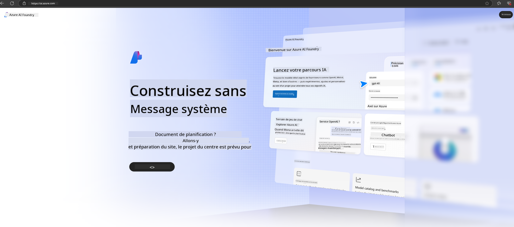

<!--
CO_OP_TRANSLATOR_METADATA:
{
  "original_hash": "3a1e48b628022485aac989c9f733e792",
  "translation_date": "2025-07-17T05:17:55+00:00",
  "source_file": "md/02.QuickStart/AzureAIFoundry_QuickStart.md",
  "language_code": "fr"
}
-->
# **Utilisation de Phi-3 dans Azure AI Foundry**

Avec le développement de l’IA générative, nous souhaitons utiliser une plateforme unifiée pour gérer différents LLM et SLM, l’intégration des données d’entreprise, les opérations de fine-tuning/RAG, ainsi que l’évaluation des différents métiers après intégration des LLM et SLM, etc., afin de mieux implémenter des applications intelligentes basées sur l’IA générative. [Azure AI Foundry](https://ai.azure.com) est une plateforme d’application d’IA générative de niveau entreprise.

Avec Azure AI Foundry, vous pouvez évaluer les réponses des grands modèles de langage (LLM) et orchestrer les composants d’application de prompt avec prompt flow pour de meilleures performances. La plateforme facilite la montée en charge pour transformer facilement des preuves de concept en production complète. La surveillance continue et l’affinement garantissent un succès à long terme.

Nous pouvons rapidement déployer le modèle Phi-3 sur Azure AI Foundry en quelques étapes simples, puis utiliser Azure AI Foundry pour réaliser les travaux liés à Phi-3 tels que Playground/Chat, fine-tuning, évaluation, etc.

## **1. Préparation**

Si vous avez déjà installé le [Azure Developer CLI](https://learn.microsoft.com/azure/developer/azure-developer-cli/overview?WT.mc_id=aiml-138114-kinfeylo) sur votre machine, utiliser ce modèle est aussi simple que d’exécuter cette commande dans un nouveau répertoire.

## Création manuelle

Créer un projet et un hub Microsoft Azure AI Foundry est un excellent moyen d’organiser et de gérer votre travail en IA. Voici un guide étape par étape pour commencer :

### Création d’un projet dans Azure AI Foundry

1. **Accédez à Azure AI Foundry** : Connectez-vous au portail Azure AI Foundry.
2. **Créez un projet** :
   - Si vous êtes dans un projet, sélectionnez « Azure AI Foundry » en haut à gauche de la page pour revenir à la page d’accueil.
   - Sélectionnez « + Create project ».
   - Entrez un nom pour le projet.
   - Si vous avez un hub, il sera sélectionné par défaut. Si vous avez accès à plusieurs hubs, vous pouvez en choisir un autre dans la liste déroulante. Si vous souhaitez créer un nouveau hub, sélectionnez « Create new hub » et donnez-lui un nom.
   - Sélectionnez « Create ».

### Création d’un hub dans Azure AI Foundry

1. **Accédez à Azure AI Foundry** : Connectez-vous avec votre compte Azure.
2. **Créez un hub** :
   - Sélectionnez le centre de gestion dans le menu de gauche.
   - Sélectionnez « All resources », puis la flèche vers le bas à côté de « + New project » et choisissez « + New hub ».
   - Dans la fenêtre « Create a new hub », entrez un nom pour votre hub (par exemple, contoso-hub) et modifiez les autres champs selon vos préférences.
   - Sélectionnez « Next », vérifiez les informations, puis cliquez sur « Create ».

Pour des instructions plus détaillées, vous pouvez consulter la [documentation officielle Microsoft](https://learn.microsoft.com/azure/ai-studio/how-to/create-projects).

Après création réussie, vous pouvez accéder au studio que vous avez créé via [ai.azure.com](https://ai.azure.com/)

Il peut y avoir plusieurs projets dans un même AI Foundry. Créez un projet dans AI Foundry pour vous préparer.

Créez des [QuickStarts](https://learn.microsoft.com/azure/ai-studio/quickstarts/get-started-code) Azure AI Foundry

## **2. Déployer un modèle Phi dans Azure AI Foundry**

Cliquez sur l’option Explore du projet pour entrer dans le Catalogue de modèles et sélectionnez Phi-3

Sélectionnez Phi-3-mini-4k-instruct

Cliquez sur « Deploy » pour déployer le modèle Phi-3-mini-4k-instruct

> [!NOTE]
>
> Vous pouvez choisir la puissance de calcul lors du déploiement

## **3. Playground Chat Phi dans Azure AI Foundry**

Allez sur la page de déploiement, sélectionnez Playground, et discutez avec Phi-3 d’Azure AI Foundry

## **4. Déploiement du modèle depuis Azure AI Foundry**

Pour déployer un modèle depuis le Catalogue de modèles Azure, vous pouvez suivre ces étapes :

- Connectez-vous à Azure AI Foundry.
- Choisissez le modèle que vous souhaitez déployer dans le catalogue de modèles Azure AI Foundry.
- Sur la page Détails du modèle, sélectionnez Deploy puis choisissez Serverless API avec Azure AI Content Safety.
- Sélectionnez le projet dans lequel vous souhaitez déployer vos modèles. Pour utiliser l’offre Serverless API, votre espace de travail doit appartenir à la région East US 2 ou Sweden Central. Vous pouvez personnaliser le nom du déploiement.
- Dans l’assistant de déploiement, sélectionnez Pricing and terms pour en savoir plus sur les tarifs et les conditions d’utilisation.
- Sélectionnez Deploy. Patientez jusqu’à ce que le déploiement soit prêt et que vous soyez redirigé vers la page Deployments.
- Sélectionnez Open in playground pour commencer à interagir avec le modèle.
- Vous pouvez revenir à la page Deployments, sélectionner le déploiement, et noter l’URL cible de l’endpoint ainsi que la clé secrète, que vous pouvez utiliser pour appeler le déploiement et générer des complétions.
- Vous pouvez toujours retrouver les détails de l’endpoint, l’URL et les clés d’accès en naviguant dans l’onglet Build et en sélectionnant Deployments dans la section Components.

> [!NOTE]
> Veuillez noter que votre compte doit disposer des permissions de rôle Azure AI Developer sur le groupe de ressources pour effectuer ces étapes.

## **5. Utilisation de l’API Phi dans Azure AI Foundry**

Vous pouvez accéder à https://{Your project name}.region.inference.ml.azure.com/swagger.json via Postman en GET et l’associer à la Key pour découvrir les interfaces fournies.

Vous pouvez obtenir très facilement les paramètres de requête ainsi que les paramètres de réponse.

**Avertissement** :  
Ce document a été traduit à l’aide du service de traduction automatique [Co-op Translator](https://github.com/Azure/co-op-translator). Bien que nous nous efforcions d’assurer l’exactitude, veuillez noter que les traductions automatiques peuvent contenir des erreurs ou des inexactitudes. Le document original dans sa langue d’origine doit être considéré comme la source faisant foi. Pour les informations critiques, une traduction professionnelle réalisée par un humain est recommandée. Nous déclinons toute responsabilité en cas de malentendus ou de mauvaises interprétations résultant de l’utilisation de cette traduction.