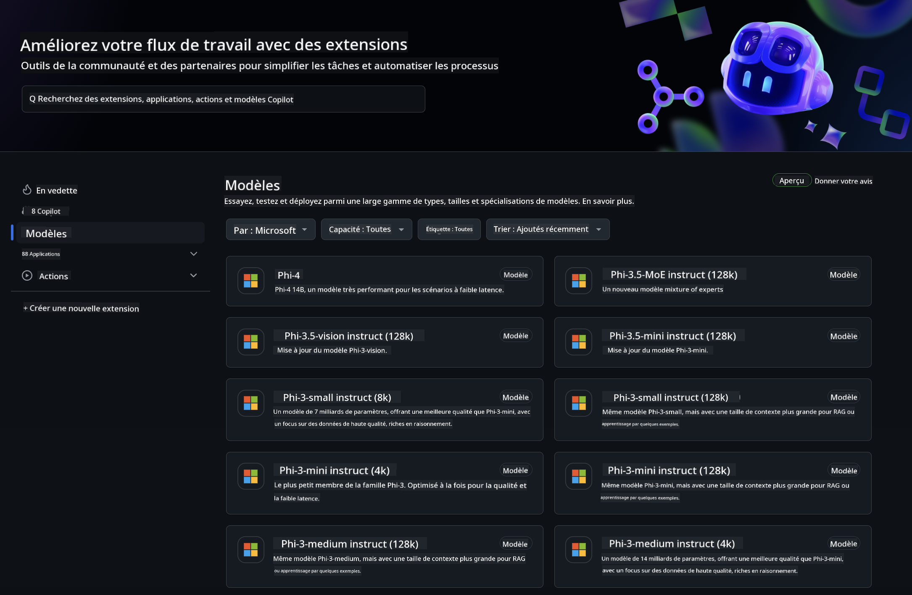
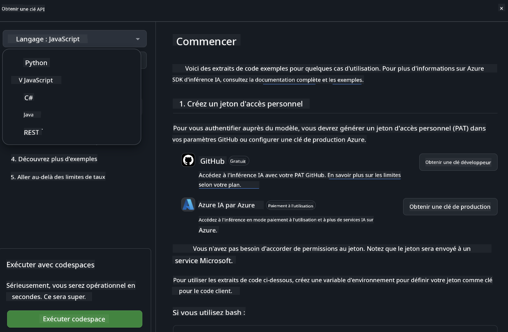
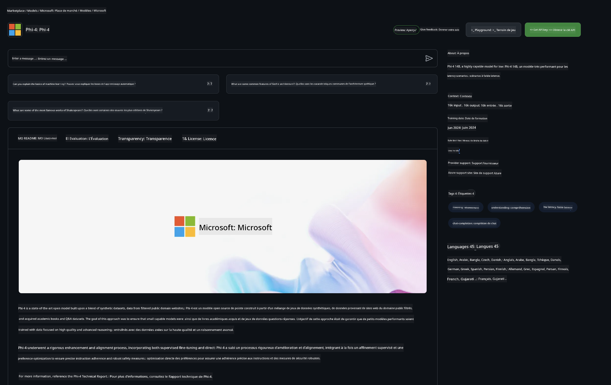

<!--
CO_OP_TRANSLATOR_METADATA:
{
  "original_hash": "5113634b77370af6790f9697d5d7de90",
  "translation_date": "2025-05-07T13:07:42+00:00",
  "source_file": "md/02.QuickStart/GitHubModel_QuickStart.md",
  "language_code": "fr"
}
-->
## GitHub Models - Bêta publique limitée

Bienvenue sur [GitHub Models](https://github.com/marketplace/models) ! Tout est prêt pour que vous puissiez explorer les modèles d’IA hébergés sur Azure AI.



Pour plus d’informations sur les modèles disponibles sur GitHub Models, consultez le [GitHub Model Marketplace](https://github.com/marketplace/models)

## Modèles disponibles

Chaque modèle dispose d’un espace de test dédié ainsi que d’exemples de code


### Modèles Phi-3 dans le catalogue GitHub Model

[Phi-3-Medium-128k-Instruct](https://github.com/marketplace/models/azureml/Phi-3-medium-128k-instruct)

[Phi-3-medium-4k-instruct](https://github.com/marketplace/models/azureml/Phi-3-medium-4k-instruct)

[Phi-3-mini-128k-instruct](https://github.com/marketplace/models/azureml/Phi-3-mini-128k-instruct)

[Phi-3-mini-4k-instruct](https://github.com/marketplace/models/azureml/Phi-3-mini-4k-instruct)

[Phi-3-small-128k-instruct](https://github.com/marketplace/models/azureml/Phi-3-small-128k-instruct)

[Phi-3-small-8k-instruct](https://github.com/marketplace/models/azureml/Phi-3-small-8k-instruct)

## Premiers pas

Quelques exemples de base sont prêts à être exécutés. Vous les trouverez dans le répertoire samples. Si vous souhaitez aller directement à votre langage préféré, les exemples sont disponibles dans les langages suivants :

- Python
- JavaScript
- cURL

Un environnement Codespaces dédié est également disponible pour exécuter les exemples et les modèles.



## Exemples de code

Voici des extraits de code pour quelques cas d’usage. Pour plus d’informations sur Azure AI Inference SDK, consultez la documentation complète et les exemples.

## Configuration

1. Créez un jeton d’accès personnel  
Vous n’avez pas besoin d’attribuer de permissions au jeton. Notez que ce jeton sera envoyé à un service Microsoft.

Pour utiliser les extraits de code ci-dessous, créez une variable d’environnement pour définir votre jeton comme clé pour le code client.

Si vous utilisez bash :  
```
export GITHUB_TOKEN="<your-github-token-goes-here>"
```  
Si vous êtes sous powershell :  

```
$Env:GITHUB_TOKEN="<your-github-token-goes-here>"
```  

Si vous utilisez l’invite de commandes Windows :  

```
set GITHUB_TOKEN=<your-github-token-goes-here>
```  

## Exemple Python

### Installation des dépendances  
Installez Azure AI Inference SDK via pip (Requis : Python >=3.8) :

```
pip install azure-ai-inference
```  
### Exécuter un exemple simple

Cet exemple montre un appel basique à l’API de complétion de chat. Il utilise le point d’accès d’inférence du modèle GitHub AI et votre jeton GitHub. L’appel est synchrone.

```
import os
from azure.ai.inference import ChatCompletionsClient
from azure.ai.inference.models import SystemMessage, UserMessage
from azure.core.credentials import AzureKeyCredential

endpoint = "https://models.inference.ai.azure.com"
# Replace Model_Name 
model_name = "Phi-3-small-8k-instruct"
token = os.environ["GITHUB_TOKEN"]

client = ChatCompletionsClient(
    endpoint=endpoint,
    credential=AzureKeyCredential(token),
)

response = client.complete(
    messages=[
        SystemMessage(content="You are a helpful assistant."),
        UserMessage(content="What is the capital of France?"),
    ],
    model=model_name,
    temperature=1.,
    max_tokens=1000,
    top_p=1.
)

print(response.choices[0].message.content)
```

### Exécuter une conversation multi-tours

Cet exemple illustre une conversation multi-tours avec l’API de complétion de chat. Pour une application de chat, vous devrez gérer l’historique de la conversation et envoyer les derniers messages au modèle.

```
import os
from azure.ai.inference import ChatCompletionsClient
from azure.ai.inference.models import AssistantMessage, SystemMessage, UserMessage
from azure.core.credentials import AzureKeyCredential

token = os.environ["GITHUB_TOKEN"]
endpoint = "https://models.inference.ai.azure.com"
# Replace Model_Name
model_name = "Phi-3-small-8k-instruct"

client = ChatCompletionsClient(
    endpoint=endpoint,
    credential=AzureKeyCredential(token),
)

messages = [
    SystemMessage(content="You are a helpful assistant."),
    UserMessage(content="What is the capital of France?"),
    AssistantMessage(content="The capital of France is Paris."),
    UserMessage(content="What about Spain?"),
]

response = client.complete(messages=messages, model=model_name)

print(response.choices[0].message.content)
```

### Diffuser la sortie

Pour une meilleure expérience utilisateur, il est conseillé de diffuser la réponse du modèle afin que le premier token apparaisse rapidement et éviter d’attendre de longues réponses.

```
import os
from azure.ai.inference import ChatCompletionsClient
from azure.ai.inference.models import SystemMessage, UserMessage
from azure.core.credentials import AzureKeyCredential

token = os.environ["GITHUB_TOKEN"]
endpoint = "https://models.inference.ai.azure.com"
# Replace Model_Name
model_name = "Phi-3-small-8k-instruct"

client = ChatCompletionsClient(
    endpoint=endpoint,
    credential=AzureKeyCredential(token),
)

response = client.complete(
    stream=True,
    messages=[
        SystemMessage(content="You are a helpful assistant."),
        UserMessage(content="Give me 5 good reasons why I should exercise every day."),
    ],
    model=model_name,
)

for update in response:
    if update.choices:
        print(update.choices[0].delta.content or "", end="")

client.close()
```  
## JavaScript

### Installation des dépendances

Installez Node.js.

Copiez les lignes suivantes et enregistrez-les dans un fichier package.json dans votre dossier.

```
{
  "type": "module",
  "dependencies": {
    "@azure-rest/ai-inference": "latest",
    "@azure/core-auth": "latest",
    "@azure/core-sse": "latest"
  }
}
```

Note : @azure/core-sse est nécessaire uniquement si vous diffusez la réponse des complétions de chat.

Ouvrez un terminal dans ce dossier et lancez npm install.

Pour chaque extrait de code ci-dessous, copiez le contenu dans un fichier sample.js et exécutez-le avec node sample.js.

### Exécuter un exemple simple

Cet exemple montre un appel basique à l’API de complétion de chat. Il utilise le point d’accès d’inférence du modèle GitHub AI et votre jeton GitHub. L’appel est synchrone.

```
import ModelClient from "@azure-rest/ai-inference";
import { AzureKeyCredential } from "@azure/core-auth";

const token = process.env["GITHUB_TOKEN"];
const endpoint = "https://models.inference.ai.azure.com";
// Update your modelname
const modelName = "Phi-3-small-8k-instruct";

export async function main() {

  const client = new ModelClient(endpoint, new AzureKeyCredential(token));

  const response = await client.path("/chat/completions").post({
    body: {
      messages: [
        { role:"system", content: "You are a helpful assistant." },
        { role:"user", content: "What is the capital of France?" }
      ],
      model: modelName,
      temperature: 1.,
      max_tokens: 1000,
      top_p: 1.
    }
  });

  if (response.status !== "200") {
    throw response.body.error;
  }
  console.log(response.body.choices[0].message.content);
}

main().catch((err) => {
  console.error("The sample encountered an error:", err);
});
```

### Exécuter une conversation multi-tours

Cet exemple illustre une conversation multi-tours avec l’API de complétion de chat. Pour une application de chat, vous devrez gérer l’historique de la conversation et envoyer les derniers messages au modèle.

```
import ModelClient from "@azure-rest/ai-inference";
import { AzureKeyCredential } from "@azure/core-auth";

const token = process.env["GITHUB_TOKEN"];
const endpoint = "https://models.inference.ai.azure.com";
// Update your modelname
const modelName = "Phi-3-small-8k-instruct";

export async function main() {

  const client = new ModelClient(endpoint, new AzureKeyCredential(token));

  const response = await client.path("/chat/completions").post({
    body: {
      messages: [
        { role: "system", content: "You are a helpful assistant." },
        { role: "user", content: "What is the capital of France?" },
        { role: "assistant", content: "The capital of France is Paris." },
        { role: "user", content: "What about Spain?" },
      ],
      model: modelName,
    }
  });

  if (response.status !== "200") {
    throw response.body.error;
  }

  for (const choice of response.body.choices) {
    console.log(choice.message.content);
  }
}

main().catch((err) => {
  console.error("The sample encountered an error:", err);
});
```

### Diffuser la sortie  
Pour une meilleure expérience utilisateur, il est conseillé de diffuser la réponse du modèle afin que le premier token apparaisse rapidement et éviter d’attendre de longues réponses.

```
import ModelClient from "@azure-rest/ai-inference";
import { AzureKeyCredential } from "@azure/core-auth";
import { createSseStream } from "@azure/core-sse";

const token = process.env["GITHUB_TOKEN"];
const endpoint = "https://models.inference.ai.azure.com";
// Update your modelname
const modelName = "Phi-3-small-8k-instruct";

export async function main() {

  const client = new ModelClient(endpoint, new AzureKeyCredential(token));

  const response = await client.path("/chat/completions").post({
    body: {
      messages: [
        { role: "system", content: "You are a helpful assistant." },
        { role: "user", content: "Give me 5 good reasons why I should exercise every day." },
      ],
      model: modelName,
      stream: true
    }
  }).asNodeStream();

  const stream = response.body;
  if (!stream) {
    throw new Error("The response stream is undefined");
  }

  if (response.status !== "200") {
    stream.destroy();
    throw new Error(`Failed to get chat completions, http operation failed with ${response.status} code`);
  }

  const sseStream = createSseStream(stream);

  for await (const event of sseStream) {
    if (event.data === "[DONE]") {
      return;
    }
    for (const choice of (JSON.parse(event.data)).choices) {
        process.stdout.write(choice.delta?.content ?? ``);
    }
  }
}

main().catch((err) => {
  console.error("The sample encountered an error:", err);
});
```

## REST

### Exécuter un exemple simple

Collez ce qui suit dans un shell :

```
curl -X POST "https://models.inference.ai.azure.com/chat/completions" \
    -H "Content-Type: application/json" \
    -H "Authorization: Bearer $GITHUB_TOKEN" \
    -d '{
        "messages": [
            {
                "role": "system",
                "content": "You are a helpful assistant."
            },
            {
                "role": "user",
                "content": "What is the capital of France?"
            }
        ],
        "model": "Phi-3-small-8k-instruct"
    }'
```  
### Exécuter une conversation multi-tours

Appelez l’API de complétion de chat en passant l’historique de la conversation :

```
curl -X POST "https://models.inference.ai.azure.com/chat/completions" \
    -H "Content-Type: application/json" \
    -H "Authorization: Bearer $GITHUB_TOKEN" \
    -d '{
        "messages": [
            {
                "role": "system",
                "content": "You are a helpful assistant."
            },
            {
                "role": "user",
                "content": "What is the capital of France?"
            },
            {
                "role": "assistant",
                "content": "The capital of France is Paris."
            },
            {
                "role": "user",
                "content": "What about Spain?"
            }
        ],
        "model": "Phi-3-small-8k-instruct"
    }'
```  
### Diffuser la sortie

Voici un exemple d’appel à l’endpoint avec diffusion de la réponse.

```
curl -X POST "https://models.inference.ai.azure.com/chat/completions" \
    -H "Content-Type: application/json" \
    -H "Authorization: Bearer $GITHUB_TOKEN" \
    -d '{
        "messages": [
            {
                "role": "system",
                "content": "You are a helpful assistant."
            },
            {
                "role": "user",
                "content": "Give me 5 good reasons why I should exercise every day."
            }
        ],
        "stream": true,
        "model": "Phi-3-small-8k-instruct"
    }'
```

## Utilisation GRATUITE et limites de débit pour GitHub Models



Les [limites de débit pour le playground et l’utilisation gratuite de l’API](https://docs.github.com/en/github-models/prototyping-with-ai-models#rate-limits) sont conçues pour vous permettre d’expérimenter les modèles et de prototyper votre application IA. Pour dépasser ces limites et faire évoluer votre application, vous devez provisionner des ressources depuis un compte Azure et vous authentifier via ce compte plutôt qu’avec votre jeton personnel GitHub. Vous n’aurez pas besoin de modifier autre chose dans votre code. Utilisez ce lien pour découvrir comment dépasser les limites du niveau gratuit dans Azure AI.

### Informations importantes

Gardez à l’esprit qu’en interagissant avec un modèle, vous expérimentez avec de l’IA, donc des erreurs de contenu peuvent survenir.

Cette fonctionnalité est soumise à diverses limites (nombre de requêtes par minute, par jour, tokens par requête, requêtes simultanées) et n’est pas conçue pour des cas d’usage en production.

GitHub Models utilise Azure AI Content Safety. Ces filtres ne peuvent pas être désactivés dans l’expérience GitHub Models. Si vous utilisez des modèles via un service payant, configurez vos filtres de contenu selon vos besoins.

Ce service est soumis aux conditions de pré-lancement de GitHub.

**Avertissement** :  
Ce document a été traduit à l'aide du service de traduction automatique [Co-op Translator](https://github.com/Azure/co-op-translator). Bien que nous nous efforcions d'assurer l'exactitude, veuillez noter que les traductions automatiques peuvent contenir des erreurs ou des inexactitudes. Le document original dans sa langue d'origine doit être considéré comme la source faisant foi. Pour les informations critiques, une traduction professionnelle réalisée par un humain est recommandée. Nous déclinons toute responsabilité en cas de malentendus ou de mauvaises interprétations résultant de l'utilisation de cette traduction.