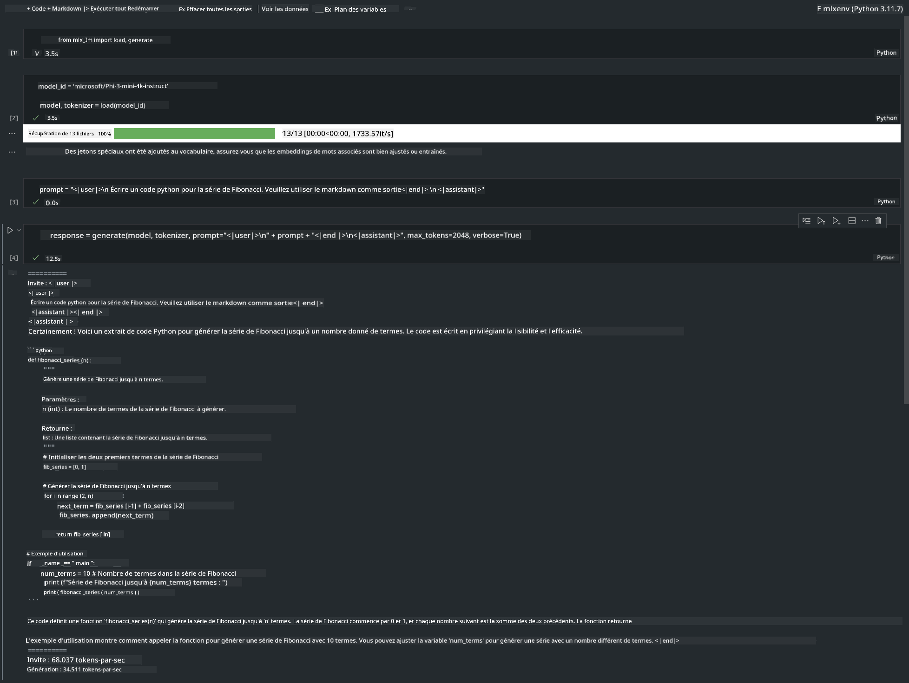

<!--
CO_OP_TRANSLATOR_METADATA:
{
  "original_hash": "dcb656f3d206fc4968e236deec5d4384",
  "translation_date": "2025-05-07T13:41:18+00:00",
  "source_file": "md/03.FineTuning/03.Inference/MLX_Inference.md",
  "language_code": "fr"
}
-->
# **Inférence Phi-3 avec le Framework Apple MLX**

## **Qu’est-ce que le Framework MLX**

MLX est un framework de tableaux pour la recherche en apprentissage automatique sur les puces Apple, développé par l’équipe de recherche en machine learning d’Apple.

MLX a été conçu par des chercheurs en machine learning pour des chercheurs en machine learning. Le framework se veut à la fois facile d’utilisation et performant pour entraîner et déployer des modèles. Sa conception est également simple sur le plan conceptuel. Nous souhaitons faciliter l’extension et l’amélioration de MLX par les chercheurs afin de permettre une exploration rapide de nouvelles idées.

Les LLMs peuvent être accélérés sur les appareils Apple Silicon grâce à MLX, et les modèles peuvent être exécutés localement de manière très pratique.

## **Utiliser MLX pour l’inférence de Phi-3-mini**

### **1. Configurer votre environnement MLX**

1. Python 3.11.x  
2. Installer la bibliothèque MLX

```bash

pip install mlx-lm

```

### **2. Exécuter Phi-3-mini dans le Terminal avec MLX**

```bash

python -m mlx_lm.generate --model microsoft/Phi-3-mini-4k-instruct --max-token 2048 --prompt  "<|user|>\nCan you introduce yourself<|end|>\n<|assistant|>"

```

Le résultat (mon environnement est Apple M1 Max, 64GB) est


### **3. Quantifier Phi-3-mini avec MLX dans le Terminal**

```bash

python -m mlx_lm.convert --hf-path microsoft/Phi-3-mini-4k-instruct

```

***Note :*** Le modèle peut être quantifié via mlx_lm.convert, la quantification par défaut étant INT4. Cet exemple montre la quantification de Phi-3-mini en INT4.

Le modèle peut être quantifié via mlx_lm.convert, la quantification par défaut étant INT4. Ici, on quantifie Phi-3-mini en INT4. Après quantification, il sera enregistré dans le répertoire par défaut ./mlx_model

Nous pouvons tester le modèle quantifié avec MLX depuis le terminal

```bash

python -m mlx_lm.generate --model ./mlx_model/ --max-token 2048 --prompt  "<|user|>\nCan you introduce yourself<|end|>\n<|assistant|>"

```

Le résultat est


### **4. Exécuter Phi-3-mini avec MLX dans Jupyter Notebook**



***Note :*** Veuillez consulter cet exemple [cliquer sur ce lien](../../../../../code/03.Inference/MLX/MLX_DEMO.ipynb)

## **Ressources**

1. En savoir plus sur le Framework Apple MLX [https://ml-explore.github.io](https://ml-explore.github.io/mlx/build/html/index.html)

2. Dépôt GitHub Apple MLX [https://github.com/ml-explore](https://github.com/ml-explore)

**Avertissement** :  
Ce document a été traduit à l’aide du service de traduction automatique [Co-op Translator](https://github.com/Azure/co-op-translator). Bien que nous nous efforcions d’assurer l’exactitude, veuillez noter que les traductions automatisées peuvent contenir des erreurs ou des inexactitudes. Le document original dans sa langue d’origine doit être considéré comme la source faisant foi. Pour les informations critiques, il est recommandé de recourir à une traduction professionnelle réalisée par un humain. Nous déclinons toute responsabilité en cas de malentendus ou d’interprétations erronées résultant de l’utilisation de cette traduction.