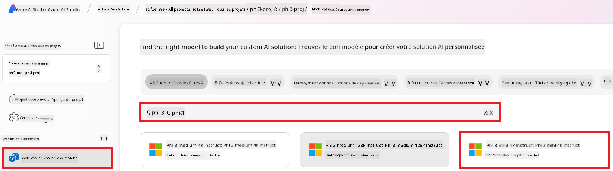

<!--
CO_OP_TRANSLATOR_METADATA:
{
  "original_hash": "c1559c5af6caccf6f623fd43a6b3a9a3",
  "translation_date": "2025-07-17T05:54:00+00:00",
  "source_file": "md/03.FineTuning/FineTuning_AIFoundry.md",
  "language_code": "fr"
}
-->
# Affinage de Phi-3 avec Azure AI Foundry

Explorons comment affiner le modèle de langage Phi-3 Mini de Microsoft en utilisant Azure AI Foundry. L’affinage vous permet d’adapter Phi-3 Mini à des tâches spécifiques, le rendant ainsi plus puissant et mieux adapté au contexte.

## Considérations

- **Capacités :** Quels modèles peuvent être affinés ? Quelles sont les possibilités d’adaptation du modèle de base ?
- **Coût :** Quel est le modèle tarifaire pour l’affinage ?
- **Personnalisation :** Dans quelle mesure puis-je modifier le modèle de base – et de quelles manières ?
- **Praticité :** Comment se déroule concrètement l’affinage – dois-je écrire du code personnalisé ? Dois-je fournir ma propre puissance de calcul ?
- **Sécurité :** Les modèles affinés présentent des risques de sécurité – existe-t-il des garde-fous pour éviter des dommages involontaires ?


## Préparation à l’affinage

### Prérequis

> [!NOTE]
> Pour les modèles de la famille Phi-3, l’offre d’affinage en mode pay-as-you-go est uniquement disponible avec des hubs créés dans la région **East US 2**.

- Un abonnement Azure. Si vous n’en avez pas, créez un [compte Azure payant](https://azure.microsoft.com/pricing/purchase-options/pay-as-you-go) pour commencer.

- Un [projet AI Foundry](https://ai.azure.com?WT.mc_id=aiml-138114-kinfeylo).
- Les contrôles d’accès basés sur les rôles Azure (Azure RBAC) sont utilisés pour autoriser les opérations dans Azure AI Foundry. Pour réaliser les étapes de cet article, votre compte utilisateur doit avoir le __rôle Azure AI Developer__ sur le groupe de ressources.

### Enregistrement du fournisseur de ressources pour l’abonnement

Vérifiez que l’abonnement est enregistré auprès du fournisseur de ressources `Microsoft.Network`.

1. Connectez-vous au [portail Azure](https://portal.azure.com).
1. Sélectionnez **Abonnements** dans le menu de gauche.
1. Choisissez l’abonnement que vous souhaitez utiliser.
1. Sélectionnez **Paramètres du projet AI** > **Fournisseurs de ressources** dans le menu de gauche.
1. Vérifiez que **Microsoft.Network** figure dans la liste des fournisseurs de ressources. Sinon, ajoutez-le.

### Préparation des données

Préparez vos données d’entraînement et de validation pour affiner votre modèle. Vos ensembles de données d’entraînement et de validation doivent contenir des exemples d’entrées et de sorties illustrant la manière dont vous souhaitez que le modèle fonctionne.

Assurez-vous que tous vos exemples d’entraînement respectent le format attendu pour l’inférence. Pour affiner efficacement les modèles, veillez à disposer d’un jeu de données équilibré et diversifié.

Cela implique de maintenir un équilibre des données, d’inclure différents scénarios, et de peaufiner périodiquement les données d’entraînement pour qu’elles correspondent aux attentes du monde réel, ce qui conduit à des réponses plus précises et équilibrées du modèle.

Différents types de modèles nécessitent des formats de données d’entraînement différents.

### Chat Completion

Les données d’entraînement et de validation que vous utilisez **doivent** être formatées en JSON Lines (JSONL). Pour `Phi-3-mini-128k-instruct`, le jeu de données d’affinage doit être formaté selon le format conversationnel utilisé par l’API Chat completions.

### Exemple de format de fichier

```json
    {"messages": [{"role": "system", "content": "You are an Xbox customer support agent whose primary goal is to help users with issues they are experiencing with their Xbox devices. You are friendly and concise. You only provide factual answers to queries, and do not provide answers that are not related to Xbox."}, {"role": "user", "content": "Is Xbox better than PlayStation?"}, {"role": "assistant", "content": "I apologize, but I cannot provide personal opinions. My primary job is to assist you with any issues related to your Xbox device. Do you have any Xbox-related issues that need addressing?"}]}
    {"messages": [{"role": "system", "content": "You are an Xbox customer support agent whose primary goal is to help users with issues they are experiencing with their Xbox devices. You are friendly and concise. You only provide factual answers to queries, and do not provide answers that are not related to Xbox."}, {"role": "user", "content": "Can I play PC games on my Xbox?"}, {"role": "assistant", "content": "While Xbox consoles don't natively support PC games, they can play an array of Xbox games, many of which are also available on PC. Can I assist you with finding games compatible with your Xbox device?"}]}
    {"messages": [{"role": "system", "content": "You are an Xbox customer support agent whose primary goal is to help users with issues they are experiencing with their Xbox devices. You are friendly and concise. You only provide factual answers to queries, and do not provide answers that are not related to Xbox."}, {"role": "user", "content": "I'm having trouble connecting my Xbox to the Wi-Fi."}, {"role": "assistant", "content": "No worries, let's go through the network settings on your Xbox. Can you please tell me what happens when you try to connect it to the Wi-Fi?"}]}
```

Le type de fichier supporté est JSON Lines. Les fichiers sont téléchargés dans le datastore par défaut et mis à disposition dans votre projet.

## Affinage de Phi-3 avec Azure AI Foundry

Azure AI Foundry vous permet d’adapter les grands modèles de langage à vos propres jeux de données via un processus appelé affinage. L’affinage apporte une valeur significative en permettant la personnalisation et l’optimisation pour des tâches et applications spécifiques. Il améliore les performances, réduit les coûts, diminue la latence et produit des résultats sur mesure.


### Créer un nouveau projet

1. Connectez-vous à [Azure AI Foundry](https://ai.azure.com).

1. Sélectionnez **+New project** pour créer un nouveau projet dans Azure AI Foundry.

    

1. Effectuez les opérations suivantes :

    - Nom du **Hub** du projet. Il doit être unique.
    - Sélectionnez le **Hub** à utiliser (créez-en un nouveau si nécessaire).

    

1. Effectuez les opérations suivantes pour créer un nouveau hub :

    - Saisissez le **Nom du Hub**. Il doit être unique.
    - Sélectionnez votre **Abonnement** Azure.
    - Sélectionnez le **Groupe de ressources** à utiliser (créez-en un nouveau si nécessaire).
    - Sélectionnez la **Région** que vous souhaitez utiliser.
    - Sélectionnez le **Connect Azure AI Services** à utiliser (créez-en un nouveau si nécessaire).
    - Sélectionnez **Connect Azure AI Search** puis **Skip connecting**.

    

1. Sélectionnez **Next**.
1. Sélectionnez **Create a project**.

### Préparation des données

Avant l’affinage, rassemblez ou créez un jeu de données pertinent pour votre tâche, comme des instructions de chat, des paires questions-réponses, ou tout autre texte pertinent. Nettoyez et prétraitez ces données en supprimant le bruit, en gérant les valeurs manquantes, et en tokenisant le texte.

### Affiner les modèles Phi-3 dans Azure AI Foundry

> [!NOTE]
> L’affinage des modèles Phi-3 est actuellement pris en charge uniquement pour les projets situés dans la région East US 2.

1. Sélectionnez **Model catalog** dans l’onglet à gauche.

1. Tapez *phi-3* dans la **barre de recherche** et sélectionnez le modèle phi-3 que vous souhaitez utiliser.

    

1. Sélectionnez **Fine-tune**.

    

1. Saisissez le **Nom du modèle affiné**.

    

1. Sélectionnez **Next**.

1. Effectuez les opérations suivantes :

    - Sélectionnez le **type de tâche** : **Chat completion**.
    - Sélectionnez les **données d’entraînement** que vous souhaitez utiliser. Vous pouvez les télécharger via les données d’Azure AI Foundry ou depuis votre environnement local.

    

1. Sélectionnez **Next**.

1. Téléchargez les **données de validation** que vous souhaitez utiliser, ou sélectionnez **Automatic split of training data**.

    

1. Sélectionnez **Next**.

1. Effectuez les opérations suivantes :

    - Sélectionnez le **multiplicateur de taille de lot** que vous souhaitez utiliser.
    - Sélectionnez le **taux d’apprentissage** que vous souhaitez utiliser.
    - Sélectionnez le nombre d’**époques** que vous souhaitez utiliser.

    

1. Sélectionnez **Submit** pour lancer le processus d’affinage.

    

1. Une fois votre modèle affiné, le statut s’affichera comme **Completed**, comme illustré ci-dessous. Vous pouvez alors déployer le modèle et l’utiliser dans votre propre application, dans le playground, ou dans prompt flow. Pour plus d’informations, consultez [Comment déployer la famille de petits modèles de langage Phi-3 avec Azure AI Foundry](https://learn.microsoft.com/azure/ai-studio/how-to/deploy-models-phi-3?tabs=phi-3-5&pivots=programming-language-python).

    

> [!NOTE]
> Pour plus de détails sur l’affinage de Phi-3, veuillez consulter [Affiner les modèles Phi-3 dans Azure AI Foundry](https://learn.microsoft.com/azure/ai-studio/how-to/fine-tune-phi-3?tabs=phi-3-mini).

## Nettoyer vos modèles affinés

Vous pouvez supprimer un modèle affiné depuis la liste des modèles affinés dans [Azure AI Foundry](https://ai.azure.com) ou depuis la page des détails du modèle. Sélectionnez le modèle affiné à supprimer depuis la page Fine-tuning, puis cliquez sur le bouton Supprimer pour effacer le modèle affiné.

> [!NOTE]
> Vous ne pouvez pas supprimer un modèle personnalisé s’il possède un déploiement actif. Vous devez d’abord supprimer le déploiement du modèle avant de pouvoir supprimer le modèle personnalisé.

## Coûts et quotas

### Considérations sur les coûts et quotas pour les modèles Phi-3 affinés en tant que service

Les modèles Phi affinés en tant que service sont proposés par Microsoft et intégrés à Azure AI Foundry pour utilisation. Vous pouvez consulter les tarifs lors du [déploiement](https://learn.microsoft.com/azure/ai-studio/how-to/deploy-models-phi-3?tabs=phi-3-5&pivots=programming-language-python) ou de l’affinage des modèles dans l’onglet Tarification et conditions du guide de déploiement.

## Filtrage de contenu

Les modèles déployés en tant que service avec paiement à l’usage sont protégés par Azure AI Content Safety. Lorsqu’ils sont déployés sur des points de terminaison en temps réel, vous pouvez choisir de désactiver cette fonctionnalité. Avec Azure AI Content Safety activé, à la fois le prompt et la complétion passent par un ensemble de modèles de classification visant à détecter et empêcher la production de contenu nuisible. Le système de filtrage détecte et agit sur des catégories spécifiques de contenu potentiellement dangereux, tant dans les prompts d’entrée que dans les complétions de sortie. Pour en savoir plus, consultez [Azure AI Content Safety](https://learn.microsoft.com/azure/ai-studio/concepts/content-filtering).

**Configuration de l’affinage**

Hyperparamètres : Définissez les hyperparamètres tels que le taux d’apprentissage, la taille des lots, et le nombre d’époques d’entraînement.

**Fonction de perte**

Choisissez une fonction de perte adaptée à votre tâche (par exemple, l’entropie croisée).

**Optimiseur**

Sélectionnez un optimiseur (par exemple, Adam) pour les mises à jour des gradients pendant l’entraînement.

**Processus d’affinage**

- Charger le modèle pré-entraîné : Chargez le checkpoint Phi-3 Mini.
- Ajouter des couches personnalisées : Ajoutez des couches spécifiques à la tâche (par exemple, une tête de classification pour les instructions de chat).

**Entraîner le modèle**  
Affinez le modèle en utilisant votre jeu de données préparé. Surveillez la progression de l’entraînement et ajustez les hyperparamètres si nécessaire.

**Évaluation et validation**

Jeu de validation : Séparez vos données en ensembles d’entraînement et de validation.

**Évaluer les performances**

Utilisez des métriques comme la précision, le F1-score ou la perplexité pour évaluer les performances du modèle.

## Sauvegarder le modèle affiné

**Checkpoint**  
Sauvegardez le checkpoint du modèle affiné pour une utilisation future.

## Déploiement

- Déployez en tant que service web : Déployez votre modèle affiné comme un service web dans Azure AI Foundry.
- Testez le point de terminaison : Envoyez des requêtes de test au point de terminaison déployé pour vérifier son fonctionnement.

## Itérer et améliorer

Itérez : Si les performances ne sont pas satisfaisantes, ajustez les hyperparamètres, ajoutez plus de données, ou affinez sur davantage d’époques.

## Surveiller et affiner

Surveillez continuellement le comportement du modèle et affinez-le au besoin.

## Personnaliser et étendre

Tâches personnalisées : Phi-3 Mini peut être affiné pour diverses tâches au-delà des instructions de chat. Explorez d’autres cas d’usage !  
Expérimentez : Testez différentes architectures, combinaisons de couches et techniques pour améliorer les performances.

> [!NOTE]
> L’affinage est un processus itératif. Expérimentez, apprenez et adaptez votre modèle pour obtenir les meilleurs résultats pour votre tâche spécifique !

**Avertissement** :  
Ce document a été traduit à l’aide du service de traduction automatique [Co-op Translator](https://github.com/Azure/co-op-translator). Bien que nous nous efforcions d’assurer l’exactitude, veuillez noter que les traductions automatiques peuvent contenir des erreurs ou des inexactitudes. Le document original dans sa langue d’origine doit être considéré comme la source faisant foi. Pour les informations critiques, une traduction professionnelle réalisée par un humain est recommandée. Nous déclinons toute responsabilité en cas de malentendus ou de mauvaises interprétations résultant de l’utilisation de cette traduction.