# Affinage de Phi-3 avec Microsoft Foundry

 Explorons comment affiner le modèle de langage Phi-3 Mini de Microsoft en utilisant Microsoft Foundry. L’affinage vous permet d’adapter Phi-3 Mini à des tâches spécifiques, le rendant ainsi encore plus puissant et contextuellement pertinent.

## Considérations

- **Capacités :** Quels modèles sont affinables ? Quelles tâches peut-on apprendre au modèle de base par affinage ?
- **Coût :** Quel est le modèle tarifaire pour l’affinage ?
- **Personnalisabilité :** Dans quelle mesure puis-je modifier le modèle de base – et de quelles manières ?
- **Praticité :** Comment se déroule réellement l’affinage – dois-je écrire du code personnalisé ? Dois-je fournir mes propres ressources de calcul ?
- **Sécurité :** Les modèles affinés présentent des risques de sécurité – existe-t-il des garde-fous pour éviter des dommages involontaires ?

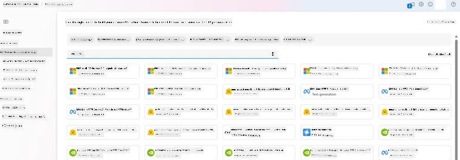

## Préparation pour l’affinage

### Prérequis

> [!NOTE]
> Pour les modèles de la famille Phi-3, l’offre d’affinage en mode paiement à l’utilisation est disponible uniquement avec des hubs créés dans les régions **East US 2**.

- Un abonnement Azure. Si vous n’avez pas d’abonnement Azure, créez un [compte Azure payant](https://azure.microsoft.com/pricing/purchase-options/pay-as-you-go) pour commencer.

- Un [projet AI Foundry](https://ai.azure.com?WT.mc_id=aiml-138114-kinfeylo).
- Les contrôles d’accès basés sur les rôles Azure (Azure RBAC) sont utilisés pour accorder l’accès aux opérations dans Microsoft Foundry. Pour effectuer les étapes de cet article, votre compte utilisateur doit se voir attribuer le __rôle Azure AI Developer__ sur le groupe de ressources.

### Enregistrement du fournisseur d’abonnement

Vérifiez que l’abonnement est enregistré auprès du fournisseur de ressources `Microsoft.Network`.

1. Connectez-vous au [portail Azure](https://portal.azure.com).
1. Sélectionnez **Abonnements** dans le menu de gauche.
1. Sélectionnez l’abonnement que vous souhaitez utiliser.
1. Sélectionnez **Paramètres du projet AI** > **Fournisseurs de ressources** dans le menu de gauche.
1. Confirmez que **Microsoft.Network** figure dans la liste des fournisseurs de ressources. Sinon, ajoutez-le.

### Préparation des données

Préparez vos données d’entraînement et de validation pour affiner votre modèle. Vos ensembles de données d’entraînement et de validation doivent contenir des exemples d’entrées et de sorties illustrant la manière dont vous souhaitez que le modèle se comporte.

Assurez-vous que tous vos exemples d’entraînement respectent le format attendu pour l’inférence. Pour affiner efficacement les modèles, assurez-vous d’avoir un jeu de données équilibré et diversifié.

Cela implique de maintenir un équilibre des données, d’inclure différents scénarios, et de raffiner périodiquement les données d’entraînement pour correspondre aux attentes du monde réel, menant ainsi à des réponses de modèle plus précises et équilibrées.

Différents types de modèles requièrent un format différent pour les données d’entraînement.

### Achèvement de chat

Les données d’entraînement et de validation que vous utilisez **doivent** être formatées en document JSON Lines (JSONL). Pour `Phi-3-mini-128k-instruct`, le jeu de données d’affinage doit être formaté dans le format conversationnel utilisé par l’API de complétions de chat.

### Format de fichier exemple

```json
    {"messages": [{"role": "system", "content": "You are an Xbox customer support agent whose primary goal is to help users with issues they are experiencing with their Xbox devices. You are friendly and concise. You only provide factual answers to queries, and do not provide answers that are not related to Xbox."}, {"role": "user", "content": "Is Xbox better than PlayStation?"}, {"role": "assistant", "content": "I apologize, but I cannot provide personal opinions. My primary job is to assist you with any issues related to your Xbox device. Do you have any Xbox-related issues that need addressing?"}]}
    {"messages": [{"role": "system", "content": "You are an Xbox customer support agent whose primary goal is to help users with issues they are experiencing with their Xbox devices. You are friendly and concise. You only provide factual answers to queries, and do not provide answers that are not related to Xbox."}, {"role": "user", "content": "Can I play PC games on my Xbox?"}, {"role": "assistant", "content": "While Xbox consoles don't natively support PC games, they can play an array of Xbox games, many of which are also available on PC. Can I assist you with finding games compatible with your Xbox device?"}]}
    {"messages": [{"role": "system", "content": "You are an Xbox customer support agent whose primary goal is to help users with issues they are experiencing with their Xbox devices. You are friendly and concise. You only provide factual answers to queries, and do not provide answers that are not related to Xbox."}, {"role": "user", "content": "I'm having trouble connecting my Xbox to the Wi-Fi."}, {"role": "assistant", "content": "No worries, let's go through the network settings on your Xbox. Can you please tell me what happens when you try to connect it to the Wi-Fi?"}]}
```

Le type de fichier pris en charge est JSON Lines. Les fichiers sont téléchargés dans le magasin de données par défaut et mis à disposition dans votre projet.

## Affinage de Phi-3 avec Microsoft Foundry

Microsoft Foundry vous permet d’adapter les grands modèles de langage à vos propres jeux de données via un processus appelé affinage. L’affinage apporte une valeur significative en permettant la personnalisation et l’optimisation pour des tâches et applications spécifiques. Cela conduit à une meilleure performance, une efficacité coût, une latence réduite, et des sorties adaptées.

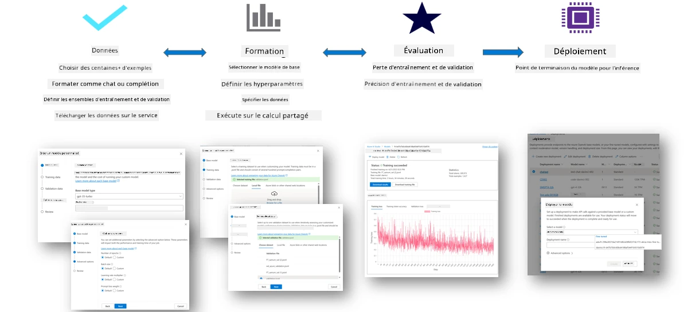

### Créer un nouveau projet

1. Connectez-vous à [Microsoft Foundry](https://ai.azure.com).

1. Sélectionnez **+Nouveau projet** pour créer un nouveau projet dans Microsoft Foundry.

    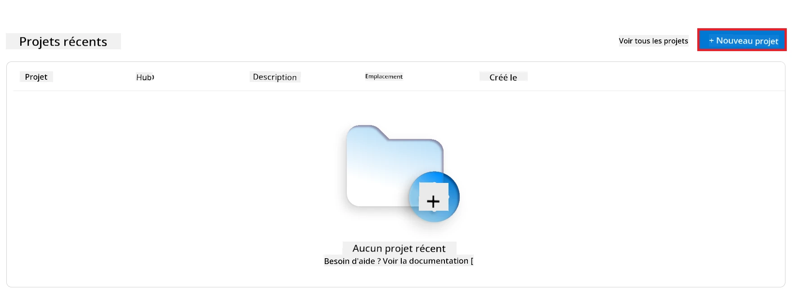

1. Effectuez les tâches suivantes :

    - Nom **Hub** du projet. Il doit être une valeur unique.
    - Sélectionnez le **Hub** à utiliser (ou créez-en un nouveau si nécessaire).

    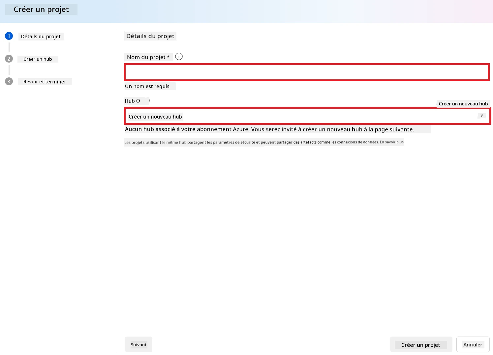

1. Effectuez les tâches suivantes pour créer un nouveau hub :

    - Saisissez un **Nom de Hub**. Il doit être unique.
    - Sélectionnez votre **Abonnement** Azure.
    - Sélectionnez le **Groupe de ressources** à utiliser (ou créez-en un nouveau si nécessaire).
    - Sélectionnez la **Région** souhaitée.
    - Sélectionnez le **Connecter Azure AI Services** à utiliser (ou créez-en un nouveau si nécessaire).
    - Sélectionnez **Connecter Azure AI Search** pour **Ignorer la connexion**.

    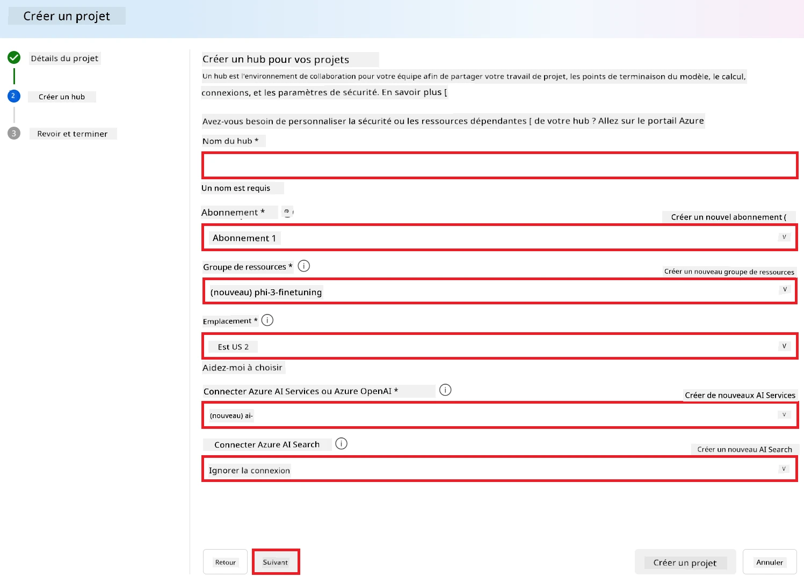

1. Sélectionnez **Suivant**.
1. Sélectionnez **Créer un projet**.

### Préparation des données

Avant l’affinage, rassemblez ou créez un jeu de données pertinent pour votre tâche, comme des instructions de chat, des paires question-réponse, ou tout autre texte pertinent. Nettoyez et pré-traitez ces données en éliminant le bruit, en gérant les valeurs manquantes, et en tokenisant le texte.

### Affiner les modèles Phi-3 dans Microsoft Foundry

> [!NOTE]
> L’affinage des modèles Phi-3 est actuellement supporté uniquement dans les projets situés dans East US 2.

1. Sélectionnez **Catalogue de modèles** dans l’onglet à gauche.

1. Tapez *phi-3* dans la **barre de recherche** et sélectionnez le modèle phi-3 que vous souhaitez utiliser.

    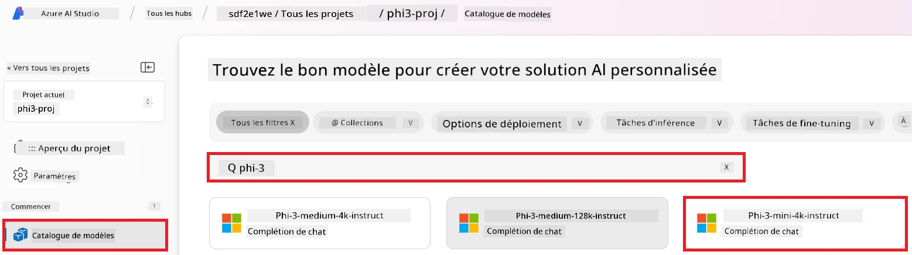

1. Sélectionnez **Affiner**.

    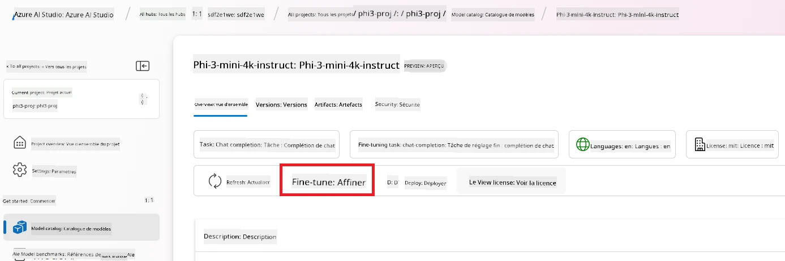

1. Entrez le **Nom du modèle affiné**.

    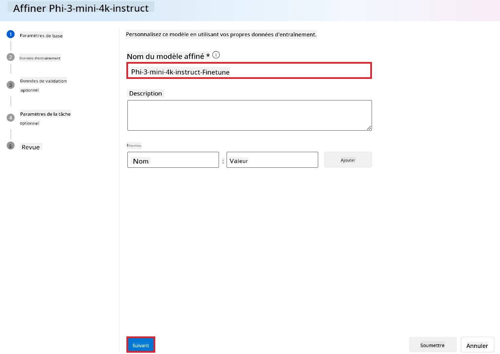

1. Sélectionnez **Suivant**.

1. Effectuez les tâches suivantes :

    - Sélectionnez le **type de tâche** comme **Achèvement de chat**.
    - Sélectionnez les **Données d’entraînement** que vous souhaitez utiliser. Vous pouvez les télécharger via les données de Microsoft Foundry ou depuis votre environnement local.

    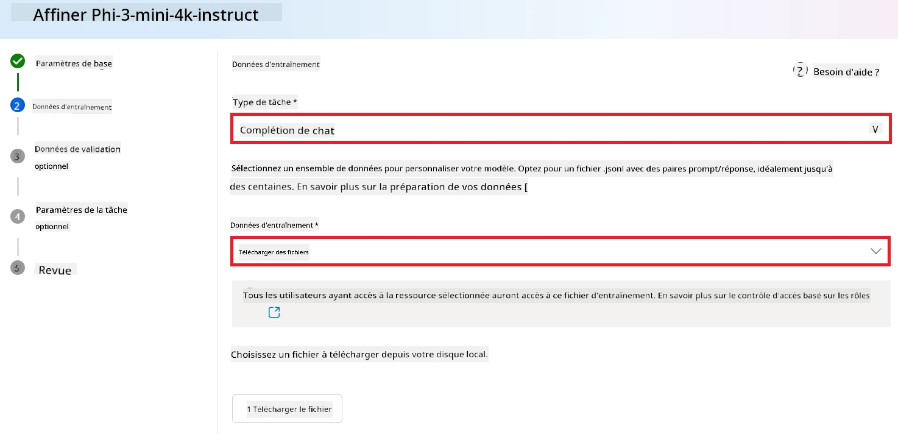

1. Sélectionnez **Suivant**.

1. Téléchargez les **Données de validation** que vous souhaitez utiliser, ou vous pouvez sélectionner **Division automatique des données d’entraînement**.

    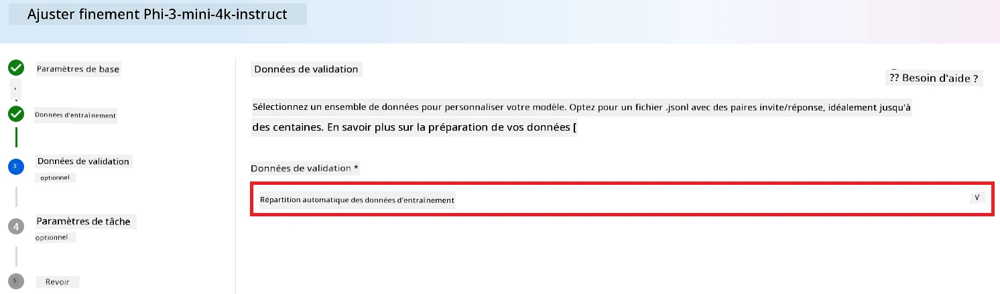

1. Sélectionnez **Suivant**.

1. Effectuez les tâches suivantes :

    - Sélectionnez le **Facteur multiplicateur de taille de lot** souhaité.
    - Sélectionnez le **Taux d’apprentissage** souhaité.
    - Sélectionnez le nombre d’**Époques** souhaité.

    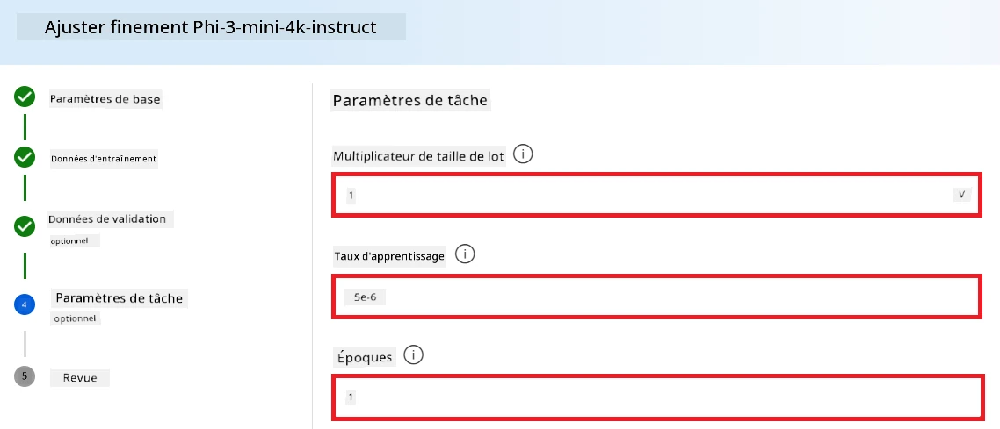

1. Sélectionnez **Soumettre** pour démarrer le processus d’affinage.

    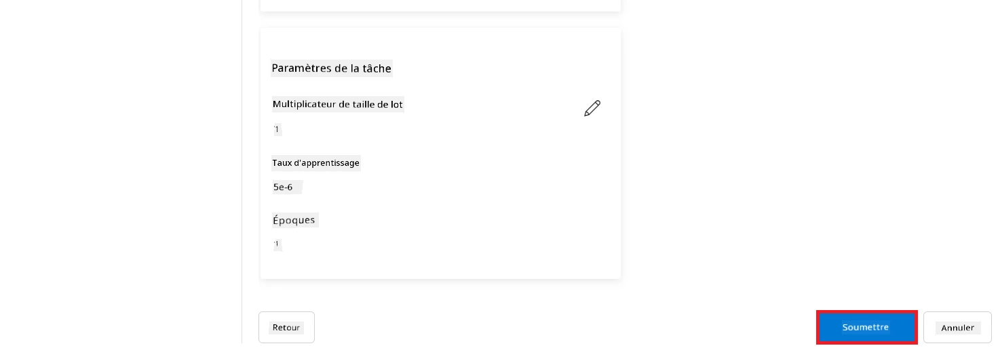


1. Une fois que votre modèle est affiné, le statut s’affichera comme **Terminé**, comme montré ci-dessous. Vous pouvez maintenant déployer le modèle et l’utiliser dans votre propre application, dans le playground, ou dans prompt flow. Pour plus d’informations, consultez [Comment déployer la famille de petits modèles de langage Phi-3 avec Microsoft Foundry](https://learn.microsoft.com/azure/ai-studio/how-to/deploy-models-phi-3?tabs=phi-3-5&pivots=programming-language-python).

    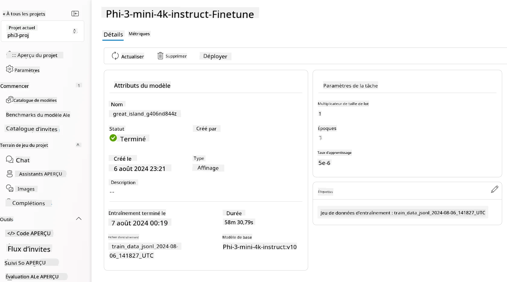

> [!NOTE]
> Pour plus d’informations détaillées sur l’affinage de Phi-3, veuillez visiter [Affiner les modèles Phi-3 dans Microsoft Foundry](https://learn.microsoft.com/azure/ai-studio/how-to/fine-tune-phi-3?tabs=phi-3-mini).

## Nettoyer vos modèles affinés

Vous pouvez supprimer un modèle affiné depuis la liste des modèles d’affinage dans [Microsoft Foundry](https://ai.azure.com) ou depuis la page de détails du modèle. Sélectionnez le modèle affiné à supprimer depuis la page d’Affinage, puis cliquez sur le bouton Supprimer pour supprimer le modèle affiné.

> [!NOTE]
> Vous ne pouvez pas supprimer un modèle personnalisé s’il possède un déploiement existant. Vous devez d’abord supprimer votre déploiement de modèle avant de pouvoir supprimer votre modèle personnalisé.

## Coût et quotas

### Considérations sur les coûts et quotas pour les modèles Phi-3 affinés en tant que service

Les modèles Phi affinés en tant que service sont offerts par Microsoft et intégrés à Microsoft Foundry pour utilisation. Vous pouvez consulter les tarifs lors du [déploiement](https://learn.microsoft.com/azure/ai-studio/how-to/deploy-models-phi-3?tabs=phi-3-5&pivots=programming-language-python) ou de l’affinage des modèles sous l’onglet Tarification et conditions dans l’assistant de déploiement.

## Filtrage de contenu

Les modèles déployés en tant que service avec paiement à l’utilisation sont protégés par Azure AI Content Safety. Lorsqu’ils sont déployés sur des points d’accès en temps réel, vous pouvez choisir de désactiver cette fonctionnalité. Avec Azure AI Content Safety activé, à la fois l’invite et la complétion passent par un ensemble de modèles de classification visant à détecter et empêcher la production de contenu nuisible. Le système de filtrage du contenu détecte et agit sur des catégories spécifiques de contenu potentiellement nuisible à la fois dans les invites d’entrée et les complétions de sortie. En savoir plus sur [Azure AI Content Safety](https://learn.microsoft.com/azure/ai-studio/concepts/content-filtering).

**Configuration de l’affinage**

Hyperparamètres : définissez des hyperparamètres tels que le taux d’apprentissage, la taille des lots, et le nombre d’époques d’entraînement.

**Fonction de perte**

Choisissez une fonction de perte appropriée pour votre tâche (par exemple, l’entropie croisée).

**Optimiseur**

Sélectionnez un optimiseur (par exemple, Adam) pour les mises à jour du gradient durant l’entraînement.

**Processus d’affinage**

- Charger le modèle pré-entraîné : chargez le point de contrôle Phi-3 Mini.
- Ajouter des couches personnalisées : ajoutez des couches spécifiques à la tâche (par exemple, une tête de classification pour les instructions de chat).

**Entraîner le modèle**  
Affinez le modèle avec votre jeu de données préparé. Surveillez la progression de l’entraînement et ajustez les hyperparamètres si nécessaire.

**Évaluation et validation**

Jeu de validation : divisez vos données en ensembles d’entraînement et de validation.

**Évaluer la performance**

Utilisez des métriques telles que la précision, le score F1, ou la perplexité pour évaluer la performance du modèle.

## Sauvegarder le modèle affiné

**Point de contrôle**  
Sauvegardez le point de contrôle du modèle affiné pour une utilisation future.

## Déploiement

- Déployer en tant que service web : déployez votre modèle affiné en tant que service web dans Microsoft Foundry.
- Tester le point d’accès : envoyez des requêtes de test au point d’accès déployé pour vérifier son bon fonctionnement.

## Itérer et améliorer

Itérez : si la performance n’est pas satisfaisante, recommencez en ajustant les hyperparamètres, en ajoutant plus de données, ou en affinant davantage d’époques.

## Surveiller et affiner

Surveillez continuellement le comportement du modèle et affinez-le si nécessaire.

## Personnaliser et étendre

Tâches personnalisées : Phi-3 Mini peut être affiné pour diverses tâches au-delà des instructions de chat. Explorez d’autres cas d’usage !  
Expérimentez : testez différentes architectures, combinaisons de couches, et techniques pour améliorer la performance.

> [!NOTE]
> L’affinage est un processus itératif. Expérimentez, apprenez, et adaptez votre modèle pour obtenir les meilleurs résultats pour votre tâche spécifique !

---

<!-- CO-OP TRANSLATOR DISCLAIMER START -->
**Avertissement** :  
Ce document a été traduit à l’aide du service de traduction automatique [Co-op Translator](https://github.com/Azure/co-op-translator). Bien que nous nous efforçons d’assurer l’exactitude, veuillez noter que les traductions automatisées peuvent contenir des erreurs ou des inexactitudes. Le document original dans sa langue d’origine doit être considéré comme la source faisant foi. Pour les informations critiques, une traduction professionnelle humaine est recommandée. Nous déclinons toute responsabilité en cas de malentendus ou de mauvaises interprétations résultant de l’utilisation de cette traduction.
<!-- CO-OP TRANSLATOR DISCLAIMER END -->