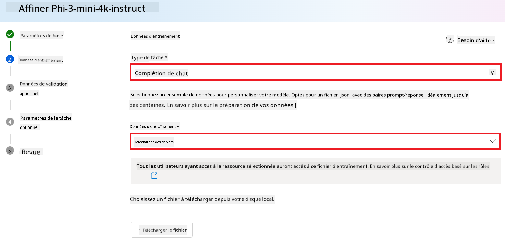
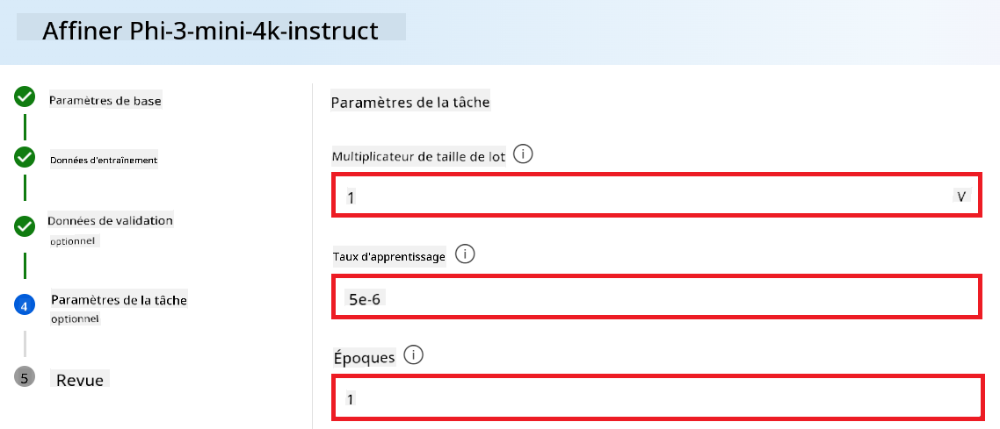

<!--
CO_OP_TRANSLATOR_METADATA:
{
  "original_hash": "c1559c5af6caccf6f623fd43a6b3a9a3",
  "translation_date": "2025-05-07T13:10:47+00:00",
  "source_file": "md/03.FineTuning/FineTuning_AIFoundry.md",
  "language_code": "fr"
}
-->
# Ajustement fin de Phi-3 avec Azure AI Foundry

Explorons comment affiner le modèle de langage Phi-3 Mini de Microsoft en utilisant Azure AI Foundry. L’ajustement fin permet d’adapter Phi-3 Mini à des tâches spécifiques, le rendant ainsi plus performant et mieux contextualisé.

## Points à considérer

- **Capacités :** Quels modèles peuvent être affinés ? Quelles tâches peut-on faire accomplir au modèle de base après ajustement ?
- **Coût :** Quel est le modèle tarifaire pour l’ajustement fin ?
- **Personnalisation :** Dans quelle mesure puis-je modifier le modèle de base – et de quelles façons ?
- **Praticité :** Comment se déroule concrètement l’ajustement fin – faut-il écrire du code personnalisé ? Dois-je fournir mes propres ressources de calcul ?
- **Sécurité :** Les modèles affinés présentent des risques de sécurité – existe-t-il des garde-fous pour éviter des dommages non intentionnels ?


## Préparation à l’ajustement fin

### Prérequis

> [!NOTE]
> Pour les modèles de la famille Phi-3, l’offre d’ajustement fin en mode pay-as-you-go est uniquement disponible avec des hubs créés dans les régions **East US 2**.

- Un abonnement Azure. Si vous n’en avez pas, créez un [compte Azure payant](https://azure.microsoft.com/pricing/purchase-options/pay-as-you-go) pour commencer.

- Un [projet AI Foundry](https://ai.azure.com?WT.mc_id=aiml-138114-kinfeylo).
- Le contrôle d’accès basé sur les rôles Azure (Azure RBAC) est utilisé pour gérer les opérations dans Azure AI Foundry. Pour réaliser les étapes de cet article, votre compte utilisateur doit avoir le __rôle Azure AI Developer__ sur le groupe de ressources.

### Enregistrement du fournisseur d’abonnement

Vérifiez que l’abonnement est enregistré auprès du fournisseur de ressources `Microsoft.Network`.

1. Connectez-vous au [portail Azure](https://portal.azure.com).
1. Sélectionnez **Abonnements** dans le menu de gauche.
1. Choisissez l’abonnement à utiliser.
1. Sélectionnez **Paramètres du projet AI** > **Fournisseurs de ressources** dans le menu de gauche.
1. Vérifiez que **Microsoft.Network** figure dans la liste des fournisseurs. Sinon, ajoutez-le.

### Préparation des données

Préparez vos données d’entraînement et de validation pour affiner votre modèle. Vos ensembles de données doivent contenir des exemples d’entrée et de sortie illustrant la manière dont vous souhaitez que le modèle se comporte.

Assurez-vous que tous vos exemples d’entraînement respectent le format attendu pour l’inférence. Pour un ajustement efficace, veillez à avoir un jeu de données équilibré et diversifié.

Cela implique de maintenir un équilibre dans les données, d’inclure différents scénarios et de réviser périodiquement les données d’entraînement pour qu’elles correspondent aux attentes du monde réel, ce qui conduit à des réponses plus précises et équilibrées du modèle.

Différents types de modèles requièrent des formats de données d’entraînement différents.

### Complétion de chat

Les données d’entraînement et de validation utilisées **doivent** être au format JSON Lines (JSONL). Pour `Phi-3-mini-128k-instruct`, le jeu de données d’ajustement fin doit être au format conversationnel utilisé par l’API de complétions de chat.

### Exemple de format de fichier

```json
    {"messages": [{"role": "system", "content": "You are an Xbox customer support agent whose primary goal is to help users with issues they are experiencing with their Xbox devices. You are friendly and concise. You only provide factual answers to queries, and do not provide answers that are not related to Xbox."}, {"role": "user", "content": "Is Xbox better than PlayStation?"}, {"role": "assistant", "content": "I apologize, but I cannot provide personal opinions. My primary job is to assist you with any issues related to your Xbox device. Do you have any Xbox-related issues that need addressing?"}]}
    {"messages": [{"role": "system", "content": "You are an Xbox customer support agent whose primary goal is to help users with issues they are experiencing with their Xbox devices. You are friendly and concise. You only provide factual answers to queries, and do not provide answers that are not related to Xbox."}, {"role": "user", "content": "Can I play PC games on my Xbox?"}, {"role": "assistant", "content": "While Xbox consoles don't natively support PC games, they can play an array of Xbox games, many of which are also available on PC. Can I assist you with finding games compatible with your Xbox device?"}]}
    {"messages": [{"role": "system", "content": "You are an Xbox customer support agent whose primary goal is to help users with issues they are experiencing with their Xbox devices. You are friendly and concise. You only provide factual answers to queries, and do not provide answers that are not related to Xbox."}, {"role": "user", "content": "I'm having trouble connecting my Xbox to the Wi-Fi."}, {"role": "assistant", "content": "No worries, let's go through the network settings on your Xbox. Can you please tell me what happens when you try to connect it to the Wi-Fi?"}]}
```

Le type de fichier supporté est JSON Lines. Les fichiers sont téléchargés dans le datastore par défaut et mis à disposition dans votre projet.

## Ajustement fin de Phi-3 avec Azure AI Foundry

Azure AI Foundry vous permet de personnaliser les grands modèles de langage à partir de vos propres jeux de données grâce à un processus appelé ajustement fin. Cette technique apporte une valeur significative en permettant la personnalisation et l’optimisation pour des tâches et applications spécifiques. Elle améliore les performances, réduit les coûts, diminue la latence et produit des résultats adaptés.


### Créer un nouveau projet

1. Connectez-vous à [Azure AI Foundry](https://ai.azure.com).

1. Sélectionnez **+Nouveau projet** pour créer un nouveau projet dans Azure AI Foundry.

    

1. Effectuez les actions suivantes :

    - Nom du **Hub** du projet. Il doit être unique.
    - Sélectionnez le **Hub** à utiliser (créez-en un nouveau si nécessaire).

    

1. Effectuez les actions suivantes pour créer un nouveau hub :

    - Saisissez le **Nom du Hub**. Il doit être unique.
    - Sélectionnez votre **Abonnement** Azure.
    - Sélectionnez le **Groupe de ressources** à utiliser (créez-en un nouveau si besoin).
    - Sélectionnez la **Région** souhaitée.
    - Sélectionnez le **Connecteur Azure AI Services** à utiliser (créez-en un nouveau si nécessaire).
    - Sélectionnez **Connect Azure AI Search** puis choisissez **Ignorer la connexion**.

    

1. Sélectionnez **Suivant**.
1. Sélectionnez **Créer un projet**.

### Préparation des données

Avant l’ajustement fin, rassemblez ou créez un jeu de données pertinent pour votre tâche, comme des instructions de chat, des paires question-réponse ou tout autre texte pertinent. Nettoyez et prétraitez ces données en supprimant le bruit, en traitant les valeurs manquantes et en tokenisant le texte.

### Affiner les modèles Phi-3 dans Azure AI Foundry

> [!NOTE]
> L’ajustement fin des modèles Phi-3 est actuellement pris en charge uniquement pour les projets situés dans East US 2.

1. Sélectionnez **Catalogue de modèles** dans l’onglet latéral gauche.

1. Tapez *phi-3* dans la **barre de recherche** et sélectionnez le modèle phi-3 que vous souhaitez utiliser.

    

1. Sélectionnez **Fine-tune**.

    

1. Saisissez le **Nom du modèle affiné**.

    

1. Sélectionnez **Suivant**.

1. Effectuez les actions suivantes :

    - Sélectionnez le **type de tâche** : **Chat completion**.
    - Sélectionnez les **données d’entraînement** à utiliser. Vous pouvez les importer via Azure AI Foundry ou depuis votre environnement local.

    

1. Sélectionnez **Suivant**.

1. Importez les **données de validation** à utiliser, ou sélectionnez **Fractionnement automatique des données d’entraînement**.

    

1. Sélectionnez **Suivant**.

1. Effectuez les actions suivantes :

    - Choisissez le **multiplicateur de taille de lot**.
    - Choisissez le **taux d’apprentissage**.
    - Choisissez le nombre d’**époques**.

    

1. Sélectionnez **Soumettre** pour lancer le processus d’ajustement fin.

    

1. Une fois votre modèle affiné, son statut sera affiché comme **Terminé**, comme dans l’image ci-dessous. Vous pouvez alors déployer le modèle et l’utiliser dans votre application, dans le playground ou dans prompt flow. Pour plus d’informations, consultez [Comment déployer la famille de petits modèles de langage Phi-3 avec Azure AI Foundry](https://learn.microsoft.com/azure/ai-studio/how-to/deploy-models-phi-3?tabs=phi-3-5&pivots=programming-language-python).

    

> [!NOTE]
> Pour des informations plus détaillées sur l’ajustement fin de Phi-3, veuillez consulter [Affiner les modèles Phi-3 dans Azure AI Foundry](https://learn.microsoft.com/azure/ai-studio/how-to/fine-tune-phi-3?tabs=phi-3-mini).

## Nettoyage des modèles affinés

Vous pouvez supprimer un modèle affiné depuis la liste des modèles d’ajustement fin dans [Azure AI Foundry](https://ai.azure.com) ou depuis la page des détails du modèle. Sélectionnez le modèle affiné à supprimer depuis la page d’ajustement fin, puis cliquez sur le bouton Supprimer.

> [!NOTE]
> Vous ne pouvez pas supprimer un modèle personnalisé s’il possède un déploiement actif. Vous devez d’abord supprimer le déploiement avant de pouvoir supprimer le modèle personnalisé.

## Coûts et quotas

### Considérations sur les coûts et quotas pour les modèles Phi-3 affinés en tant que service

Les modèles Phi affinés en tant que service sont proposés par Microsoft et intégrés à Azure AI Foundry. Vous pouvez consulter les tarifs lors du [déploiement](https://learn.microsoft.com/azure/ai-studio/how-to/deploy-models-phi-3?tabs=phi-3-5&pivots=programming-language-python) ou de l’ajustement fin des modèles, dans l’onglet Tarification et conditions du wizard de déploiement.

## Filtrage de contenu

Les modèles déployés en tant que service en mode pay-as-you-go sont protégés par Azure AI Content Safety. Lorsqu’ils sont déployés sur des points de terminaison en temps réel, vous pouvez choisir de désactiver cette fonctionnalité. Avec Azure AI Content Safety activé, à la fois l’invite et la complétion passent par un ensemble de modèles de classification visant à détecter et prévenir la génération de contenus nuisibles. Le système de filtrage détecte et agit sur des catégories spécifiques de contenus potentiellement dangereux, à la fois dans les entrées et les sorties. Pour en savoir plus, consultez [Azure AI Content Safety](https://learn.microsoft.com/azure/ai-studio/concepts/content-filtering).

**Configuration de l’ajustement fin**

Hyperparamètres : définissez les hyperparamètres tels que le taux d’apprentissage, la taille du lot et le nombre d’époques d’entraînement.

**Fonction de perte**

Choisissez une fonction de perte adaptée à votre tâche (par exemple, cross-entropie).

**Optimiseur**

Sélectionnez un optimiseur (par exemple, Adam) pour la mise à jour des gradients pendant l’entraînement.

**Processus d’ajustement fin**

- Charger le modèle pré-entraîné : chargez le checkpoint Phi-3 Mini.
- Ajouter des couches personnalisées : ajoutez des couches spécifiques à la tâche (par exemple, une tête de classification pour les instructions de chat).

**Entraîner le modèle**

Affinez le modèle avec votre jeu de données préparé. Surveillez la progression de l’entraînement et ajustez les hyperparamètres si nécessaire.

**Évaluation et validation**

Jeu de validation : divisez vos données en ensembles d’entraînement et de validation.

**Évaluer la performance**

Utilisez des métriques comme la précision, le score F1 ou la perplexité pour évaluer les performances du modèle.

## Sauvegarder le modèle affiné

**Checkpoint**

Sauvegardez le checkpoint du modèle affiné pour une utilisation ultérieure.

## Déploiement

- Déployer en tant que service web : déployez votre modèle affiné comme un service web dans Azure AI Foundry.
- Tester le point de terminaison : envoyez des requêtes de test au point de terminaison déployé pour vérifier son bon fonctionnement.

## Itérer et améliorer

Itérer : si les performances ne sont pas satisfaisantes, ajustez les hyperparamètres, ajoutez des données ou effectuez un affinage sur plus d’époques.

## Surveiller et affiner

Surveillez continuellement le comportement du modèle et affinez-le selon les besoins.

## Personnaliser et étendre

Tâches personnalisées : Phi-3 Mini peut être affiné pour diverses tâches au-delà des instructions de chat. Explorez d’autres cas d’usage !
Expérimentez : testez différentes architectures, combinaisons de couches et techniques pour améliorer les performances.

> [!NOTE]
> L’ajustement fin est un processus itératif. Expérimentez, apprenez et adaptez votre modèle pour obtenir les meilleurs résultats pour votre tâche spécifique !

**Avertissement** :  
Ce document a été traduit à l'aide du service de traduction automatique [Co-op Translator](https://github.com/Azure/co-op-translator). Bien que nous nous efforcions d'assurer l'exactitude, veuillez noter que les traductions automatisées peuvent contenir des erreurs ou des inexactitudes. Le document original dans sa langue d'origine doit être considéré comme la source faisant foi. Pour les informations critiques, une traduction professionnelle réalisée par un humain est recommandée. Nous ne saurions être tenus responsables de tout malentendu ou mauvaise interprétation résultant de l'utilisation de cette traduction.