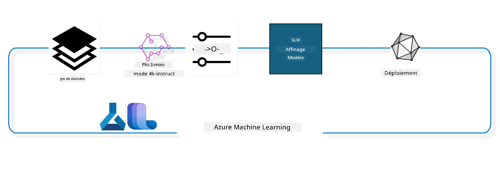

## Comment utiliser les composants de complétion de chat du registre système Azure ML pour affiner un modèle

Dans cet exemple, nous allons entreprendre l’affinage du modèle Phi-3-mini-4k-instruct pour compléter une conversation entre 2 personnes en utilisant le jeu de données ultrachat_200k.



L’exemple vous montrera comment effectuer un affinage avec le SDK Azure ML et Python, puis déployer le modèle affiné sur un endpoint en ligne pour une inférence en temps réel.

### Données d’entraînement

Nous utiliserons le jeu de données ultrachat_200k. Il s’agit d’une version fortement filtrée du jeu de données UltraChat et qui a été utilisée pour entraîner Zephyr-7B-β, un modèle de chat 7b de pointe.

### Modèle

Nous utiliserons le modèle Phi-3-mini-4k-instruct pour montrer comment l’utilisateur peut affiner un modèle pour une tâche de complétion de chat. Si vous avez ouvert ce notebook à partir d’une carte de modèle spécifique, pensez à remplacer le nom du modèle spécifique.

### Tâches

- Choisir un modèle à affiner.  
- Choisir et explorer les données d’entraînement.  
- Configurer le travail d’affinage.  
- Exécuter le travail d’affinage.  
- Revoir les métriques d’entraînement et d’évaluation.  
- Enregistrer le modèle affiné.  
- Déployer le modèle affiné pour une inférence en temps réel.  
- Nettoyer les ressources.  

## 1. Configuration des prérequis

- Installer les dépendances  
- Se connecter à l’espace de travail AzureML. En savoir plus sur la configuration de l’authentification SDK. Remplacer <WORKSPACE_NAME>, <RESOURCE_GROUP> et <SUBSCRIPTION_ID> ci-dessous.  
- Se connecter au registre système azureml  
- Définir un nom d’expérience optionnel  
- Vérifier ou créer le compute.  

> [!NOTE]  
> Les exigences : un seul nœud GPU peut contenir plusieurs cartes GPU. Par exemple, un nœud Standard_NC24rs_v3 contient 4 NVIDIA V100 GPUs alors que dans Standard_NC12s_v3, il y en a 2. Consultez la documentation pour ces informations. Le nombre de cartes GPU par nœud est défini dans le paramètre gpus_per_node ci-dessous. Le fait de définir correctement cette valeur garantit l’utilisation de tous les GPUs du nœud. Les SKU de compute GPU recommandés se trouvent ici et ici.  

### Bibliothèques Python

Installez les dépendances en exécutant la cellule ci-dessous. Ce n’est pas une étape optionnelle si vous exécutez dans un nouvel environnement.

```bash
pip install azure-ai-ml
pip install azure-identity
pip install datasets==2.9.0
pip install mlflow
pip install azureml-mlflow
```

### Interaction avec Azure ML

1. Ce script Python est utilisé pour interagir avec le service Azure Machine Learning (Azure ML). Voici ce qu’il fait :

    - Il importe les modules nécessaires depuis les packages azure.ai.ml, azure.identity et azure.ai.ml.entities. Il importe aussi le module time.

    - Il tente de s’authentifier en utilisant DefaultAzureCredential(), qui fournit une expérience d’authentification simplifiée pour démarrer rapidement le développement d’applications dans le cloud Azure. Si cela échoue, il utilise InteractiveBrowserCredential() qui fournit une invite d’authentification interactive.

    - Il tente ensuite de créer une instance MLClient avec la méthode from_config, qui lit la configuration depuis le fichier config par défaut (config.json). Si cela échoue, il crée une instance MLClient en fournissant manuellement subscription_id, resource_group_name et workspace_name.

    - Il crée une autre instance MLClient, cette fois pour le registre Azure ML nommé "azureml". Ce registre est l’endroit où les modèles, pipelines de fine-tuning et environnements sont stockés.

    - Il définit experiment_name à "chat_completion_Phi-3-mini-4k-instruct".

    - Il génère un horodatage unique en convertissant le temps actuel (en secondes depuis l’époque, en nombre à virgule flottante) en entier puis en chaîne de caractères. Cet horodatage peut être utilisé pour créer des noms et versions uniques.

    ```python
    # Importer les modules nécessaires d'Azure ML et Azure Identity
    from azure.ai.ml import MLClient
    from azure.identity import (
        DefaultAzureCredential,
        InteractiveBrowserCredential,
    )
    from azure.ai.ml.entities import AmlCompute
    import time  # Importer le module time
    
    # Essayer de s'authentifier en utilisant DefaultAzureCredential
    try:
        credential = DefaultAzureCredential()
        credential.get_token("https://management.azure.com/.default")
    except Exception as ex:  # Si DefaultAzureCredential échoue, utiliser InteractiveBrowserCredential
        credential = InteractiveBrowserCredential()
    
    # Essayer de créer une instance MLClient en utilisant le fichier de configuration par défaut
    try:
        workspace_ml_client = MLClient.from_config(credential=credential)
    except:  # Si cela échoue, créer une instance MLClient en fournissant manuellement les détails
        workspace_ml_client = MLClient(
            credential,
            subscription_id="<SUBSCRIPTION_ID>",
            resource_group_name="<RESOURCE_GROUP>",
            workspace_name="<WORKSPACE_NAME>",
        )
    
    # Créer une autre instance MLClient pour le registre Azure ML nommé "azureml"
    # Ce registre est l'endroit où sont stockés les modèles, les pipelines de fine-tuning et les environnements
    registry_ml_client = MLClient(credential, registry_name="azureml")
    
    # Définir le nom de l'expérience
    experiment_name = "chat_completion_Phi-3-mini-4k-instruct"
    
    # Générer un horodatage unique qui peut être utilisé pour des noms et versions nécessitant d'être uniques
    timestamp = str(int(time.time()))
    ```

## 2. Choisir un modèle fondation à affiner

1. Phi-3-mini-4k-instruct est un modèle léger de 3,8 milliards de paramètres, à la pointe, construit sur des ensembles de données utilisés pour Phi-2. Le modèle appartient à la famille Phi-3, et la version Mini existe en deux variantes 4K et 128K qui correspondent à la longueur de contexte (en tokens) qu’il peut supporter. Nous devons affiner le modèle pour notre usage spécifique afin de l’utiliser. Vous pouvez parcourir ces modèles dans le catalogue de modèles dans AzureML Studio, en filtrant par tâche de complétion de chat. Dans cet exemple, nous utilisons le modèle Phi-3-mini-4k-instruct. Si vous avez ouvert ce notebook pour un modèle différent, remplacez le nom et la version du modèle en conséquence.

> [!NOTE]  
> La propriété id du modèle. Elle sera passée en entrée du travail d’affinage. Elle est également disponible comme champ Asset ID dans la page des détails du modèle dans AzureML Studio Model Catalog.

2. Ce script Python interagit avec le service Azure Machine Learning (Azure ML). Voici ce qu’il fait :

    - Il définit model_name à "Phi-3-mini-4k-instruct".

    - Il utilise la méthode get de la propriété models de l’objet registry_ml_client pour récupérer la dernière version du modèle avec le nom spécifié dans le registre Azure ML. La méthode get est appelée avec deux arguments : le nom du modèle et un label spécifiant qu’il faut récupérer la dernière version du modèle.

    - Il affiche un message dans la console indiquant le nom, la version et l’id du modèle qui sera utilisé pour l’affinage. La méthode format de la chaîne est utilisée pour insérer le nom, la version et l’id du modèle dans le message. Le nom, la version et l’id du modèle sont accessibles comme propriétés de l’objet foundation_model.

    ```python
    # Définir le nom du modèle
    model_name = "Phi-3-mini-4k-instruct"
    
    # Obtenir la dernière version du modèle depuis le registre Azure ML
    foundation_model = registry_ml_client.models.get(model_name, label="latest")
    
    # Afficher le nom du modèle, la version et l’identifiant
    # Ces informations sont utiles pour le suivi et le débogage
    print(
        "\n\nUsing model name: {0}, version: {1}, id: {2} for fine tuning".format(
            foundation_model.name, foundation_model.version, foundation_model.id
        )
    )
    ```

## 3. Créer un compute à utiliser pour le travail

Le job d’affinage fonctionne UNIQUEMENT avec des compute GPU. La taille du compute dépend de la taille du modèle et dans la plupart des cas, il est difficile d’identifier le compute adapté. Dans cette cellule, nous guidons l’utilisateur pour sélectionner le compute adapté au travail.

> [!NOTE]  
> Les compute listés ci-dessous fonctionnent avec la configuration la plus optimisée. Tout changement dans cette configuration peut entraîner une erreur "Cuda Out Of Memory". Dans ce cas, essayez de passer à un compute de taille plus grande.

> [!NOTE]  
> Lors de la sélection de compute_cluster_size ci-dessous, assurez-vous que le compute est disponible dans votre groupe de ressources. Si un compute particulier n’est pas disponible, vous pouvez faire une demande pour obtenir l’accès aux ressources compute.

### Vérification du modèle pour le support d’affinage

1. Ce script Python interagit avec un modèle Azure Machine Learning (Azure ML). Voici ce qu’il fait :

    - Il importe le module ast, qui fournit des fonctions pour traiter les arbres de la grammaire abstraite Python.

    - Il vérifie si l’objet foundation_model (qui représente un modèle dans Azure ML) a un tag nommé finetune_compute_allow_list. Les tags dans Azure ML sont des paires clé-valeur que vous pouvez créer et utiliser pour filtrer et trier les modèles.

    - Si le tag finetune_compute_allow_list est présent, il utilise ast.literal_eval pour analyser en toute sécurité la valeur du tag (une chaîne) en une liste Python. Cette liste est ensuite assignée à la variable computes_allow_list. Il affiche ensuite un message indiquant qu’un compute doit être créé à partir de la liste.

    - Si le tag n’est pas présent, il définit computes_allow_list à None et affiche un message indiquant que le tag finetune_compute_allow_list ne fait pas partie des tags du modèle.

    - En résumé, ce script vérifie la présence d’un tag spécifique dans les métadonnées du modèle, convertit la valeur du tag en liste si elle existe, et fournit un retour à l’utilisateur.

    ```python
    # Importer le module ast, qui fournit des fonctions pour traiter les arbres de la grammaire abstraite de syntaxe Python
    import ast
    
    # Vérifier si le tag 'finetune_compute_allow_list' est présent dans les tags du modèle
    if "finetune_compute_allow_list" in foundation_model.tags:
        # Si le tag est présent, utiliser ast.literal_eval pour analyser en toute sécurité la valeur du tag (une chaîne) en une liste Python
        computes_allow_list = ast.literal_eval(
            foundation_model.tags["finetune_compute_allow_list"]
        )  # convertir une chaîne en liste python
        # Afficher un message indiquant qu'un calcul doit être créé à partir de la liste
        print(f"Please create a compute from the above list - {computes_allow_list}")
    else:
        # Si le tag n'est pas présent, définir computes_allow_list à None
        computes_allow_list = None
        # Afficher un message indiquant que le tag 'finetune_compute_allow_list' ne fait pas partie des tags du modèle
        print("`finetune_compute_allow_list` is not part of model tags")
    ```

### Vérification de l’instance Compute

1. Ce script Python interagit avec le service Azure Machine Learning (Azure ML) et effectue plusieurs vérifications sur une instance compute. Voici ce qu’il fait :

    - Il essaie de récupérer l’instance compute dont le nom est stocké dans compute_cluster depuis l’espace de travail Azure ML. Si l’état de provisioning de cette instance est "failed", il génère une erreur ValueError.

    - Il vérifie si computes_allow_list n’est pas None. Si ce n’est pas le cas, il convertit toutes les tailles de compute dans la liste en minuscules et vérifie si la taille de l’instance compute actuelle est dans cette liste. Si ce n’est pas le cas, il génère une erreur ValueError.

    - Si computes_allow_list est None, il vérifie si la taille de l’instance compute est dans une liste de tailles de VM GPU non supportées. Si elle y est, il génère une erreur ValueError.

    - Il récupère une liste de toutes les tailles de compute disponibles dans l’espace de travail. Ensuite, il itère sur cette liste et pour chaque taille, il vérifie si son nom correspond à la taille de l’instance compute actuelle. Si oui, il récupère le nombre de GPUs pour cette taille de compute et définit gpu_count_found à True.

    - Si gpu_count_found est True, il affiche le nombre de GPUs dans l’instance compute. Sinon, il génère une erreur ValueError.

    - En résumé, ce script effectue plusieurs vérifications sur une instance compute dans un espace de travail Azure ML, y compris l’état de provisioning, la taille par rapport à une liste autorisée ou interdite, ainsi que le nombre de GPUs.

    ```python
    # Afficher le message d'exception
    print(e)
    # Lever une ValueError si la taille de calcul n'est pas disponible dans l'espace de travail
    raise ValueError(
        f"WARNING! Compute size {compute_cluster_size} not available in workspace"
    )
    
    # Récupérer l'instance de calcul depuis l'espace de travail Azure ML
    compute = workspace_ml_client.compute.get(compute_cluster)
    # Vérifier si l'état de provisionnement de l'instance de calcul est "failed"
    if compute.provisioning_state.lower() == "failed":
        # Lever une ValueError si l'état de provisionnement est "failed"
        raise ValueError(
            f"Provisioning failed, Compute '{compute_cluster}' is in failed state. "
            f"please try creating a different compute"
        )
    
    # Vérifier si computes_allow_list n'est pas None
    if computes_allow_list is not None:
        # Convertir toutes les tailles de calcul dans computes_allow_list en minuscules
        computes_allow_list_lower_case = [x.lower() for x in computes_allow_list]
        # Vérifier si la taille de l'instance de calcul est dans computes_allow_list_lower_case
        if compute.size.lower() not in computes_allow_list_lower_case:
            # Lever une ValueError si la taille de l'instance de calcul n'est pas dans computes_allow_list_lower_case
            raise ValueError(
                f"VM size {compute.size} is not in the allow-listed computes for finetuning"
            )
    else:
        # Définir une liste des tailles de VM GPU non prises en charge
        unsupported_gpu_vm_list = [
            "standard_nc6",
            "standard_nc12",
            "standard_nc24",
            "standard_nc24r",
        ]
        # Vérifier si la taille de l'instance de calcul est dans unsupported_gpu_vm_list
        if compute.size.lower() in unsupported_gpu_vm_list:
            # Lever une ValueError si la taille de l'instance de calcul est dans unsupported_gpu_vm_list
            raise ValueError(
                f"VM size {compute.size} is currently not supported for finetuning"
            )
    
    # Initialiser un indicateur pour vérifier si le nombre de GPU dans l'instance de calcul a été trouvé
    gpu_count_found = False
    # Récupérer une liste de toutes les tailles de calcul disponibles dans l'espace de travail
    workspace_compute_sku_list = workspace_ml_client.compute.list_sizes()
    available_sku_sizes = []
    # Itérer sur la liste des tailles de calcul disponibles
    for compute_sku in workspace_compute_sku_list:
        available_sku_sizes.append(compute_sku.name)
        # Vérifier si le nom de la taille de calcul correspond à la taille de l'instance de calcul
        if compute_sku.name.lower() == compute.size.lower():
            # Si oui, récupérer le nombre de GPU pour cette taille de calcul et définir gpu_count_found à True
            gpus_per_node = compute_sku.gpus
            gpu_count_found = True
    # Si gpu_count_found est True, afficher le nombre de GPU dans l'instance de calcul
    if gpu_count_found:
        print(f"Number of GPU's in compute {compute.size}: {gpus_per_node}")
    else:
        # Si gpu_count_found est False, lever une ValueError
        raise ValueError(
            f"Number of GPU's in compute {compute.size} not found. Available skus are: {available_sku_sizes}."
            f"This should not happen. Please check the selected compute cluster: {compute_cluster} and try again."
        )
    ```

## 4. Choisir le jeu de données pour l’affinage du modèle

1. Nous utilisons le jeu de données ultrachat_200k. Le jeu de données a quatre découpages, adaptés pour l’affinage supervisé (supervised fine-tuning, sft). Le classement de génération (gen). Le nombre d’exemples par découpage est indiqué comme suit :

    ```bash
    train_sft test_sft  train_gen  test_gen
    207865  23110  256032  28304
    ```

1. Les cellules suivantes montrent la préparation basique des données pour l’affinage :

### Visualiser quelques lignes de données

Nous voulons que cet exemple s’exécute rapidement, donc sauvegardez les fichiers train_sft, test_sft contenant 5% des lignes déjà réduites. Cela signifie que le modèle affiné aura une précision moindre, donc il ne doit pas être utilisé en production.  
Le script download-dataset.py est utilisé pour télécharger le jeu de données ultrachat_200k et le transformer en un format consommable par le pipeline d’affinage. Comme le jeu de données est volumineux, nous n’en avons qu’une partie ici.

1. L’exécution du script ci-dessous télécharge uniquement 5% des données. Ce pourcentage peut être augmenté en changeant le paramètre dataset_split_pc à la valeur souhaitée.

> [!NOTE]  
> Certains modèles de langue ont différents codes de langue, donc les noms de colonnes dans le jeu de données doivent refléter cela.

1. Voici un exemple de ce à quoi les données doivent ressembler  
Le dataset de complétion de chat est stocké au format parquet avec chaque entrée suivant le schéma suivant :

    - Il s’agit d’un document JSON (JavaScript Object Notation), qui est un format d’échange de données populaire. Ce n’est pas un code exécutable, mais une façon de stocker et de transporter des données. Voici une décomposition de sa structure :

    - "prompt" : cette clé contient une chaîne de caractères représentant une tâche ou une question posée à un assistant IA.

    - "messages" : cette clé contient un tableau d’objets. Chaque objet représente un message dans une conversation entre un utilisateur et un assistant IA. Chaque objet message a deux clés :

    - "content" : cette clé contient une chaîne de caractères représentant le contenu du message.  
    - "role" : cette clé contient une chaîne de caractères représentant le rôle de l’entité ayant envoyé le message. Cela peut être "user" ou "assistant".  
    - "prompt_id" : cette clé contient une chaîne de caractères représentant un identifiant unique pour le prompt.

1. Dans ce document JSON spécifique, une conversation est représentée où un utilisateur demande à un assistant IA de créer un protagoniste pour une histoire dystopique. L’assistant répond, puis l’utilisateur demande plus de détails. L’assistant accepte de fournir plus de détails. Toute la conversation est associée à un identifiant de prompt spécifique.

    ```python
    {
        // The task or question posed to an AI assistant
        "prompt": "Create a fully-developed protagonist who is challenged to survive within a dystopian society under the rule of a tyrant. ...",
        
        // An array of objects, each representing a message in a conversation between a user and an AI assistant
        "messages":[
            {
                // The content of the user's message
                "content": "Create a fully-developed protagonist who is challenged to survive within a dystopian society under the rule of a tyrant. ...",
                // The role of the entity that sent the message
                "role": "user"
            },
            {
                // The content of the assistant's message
                "content": "Name: Ava\n\n Ava was just 16 years old when the world as she knew it came crashing down. The government had collapsed, leaving behind a chaotic and lawless society. ...",
                // The role of the entity that sent the message
                "role": "assistant"
            },
            {
                // The content of the user's message
                "content": "Wow, Ava's story is so intense and inspiring! Can you provide me with more details.  ...",
                // The role of the entity that sent the message
                "role": "user"
            }, 
            {
                // The content of the assistant's message
                "content": "Certainly! ....",
                // The role of the entity that sent the message
                "role": "assistant"
            }
        ],
        
        // A unique identifier for the prompt
        "prompt_id": "d938b65dfe31f05f80eb8572964c6673eddbd68eff3db6bd234d7f1e3b86c2af"
    }
    ```

### Télécharger les données

1. Ce script Python est utilisé pour télécharger un jeu de données en utilisant un script auxiliaire nommé download-dataset.py. Voici ce qu’il fait :

    - Il importe le module os, qui fournit un moyen portable d'utiliser des fonctionnalités dépendantes du système d’exploitation.

    - Il utilise la fonction os.system pour exécuter le script download-dataset.py dans le shell avec des arguments spécifiques en ligne de commande. Les arguments spécifient le jeu de données à télécharger (HuggingFaceH4/ultrachat_200k), le répertoire de destination (ultrachat_200k_dataset) et le pourcentage du jeu de données à extraire (5). La fonction os.system retourne le code de sortie de la commande exécutée, ce code est stocké dans la variable exit_status.

    - Il vérifie si exit_status n’est pas égal à 0. Dans les systèmes Unix-like, un code de sortie 0 indique en général que la commande a réussi, tout autre nombre indique une erreur. Si exit_status n’est pas 0, il lance une exception Exception avec un message indiquant qu’il y a eu une erreur en téléchargeant le dataset.

    - En résumé, ce script exécute une commande de téléchargement de jeu de données via un script auxiliaire, et lance une exception en cas d’échec.

    ```python
    # Importer le module os, qui fournit un moyen d'utiliser les fonctionnalités dépendantes du système d'exploitation
    import os
    
    # Utiliser la fonction os.system pour exécuter le script download-dataset.py dans le shell avec des arguments en ligne de commande spécifiques
    # Les arguments spécifient le jeu de données à télécharger (HuggingFaceH4/ultrachat_200k), le répertoire où le télécharger (ultrachat_200k_dataset), et le pourcentage du jeu de données à diviser (5)
    # La fonction os.system retourne le statut de sortie de la commande exécutée ; ce statut est stocké dans la variable exit_status
    exit_status = os.system(
        "python ./download-dataset.py --dataset HuggingFaceH4/ultrachat_200k --download_dir ultrachat_200k_dataset --dataset_split_pc 5"
    )
    
    # Vérifier si exit_status n'est pas égal à 0
    # Dans les systèmes d'exploitation de type Unix, un statut de sortie de 0 indique généralement que la commande a réussi, tandis que tout autre nombre indique une erreur
    # Si exit_status n'est pas 0, lever une Exception avec un message indiquant qu'il y a eu une erreur lors du téléchargement du jeu de données
    if exit_status != 0:
        raise Exception("Error downloading dataset")
    ```

### Chargement des données dans un DataFrame
1. Ce script Python charge un fichier JSON Lines dans un DataFrame pandas et affiche les 5 premières lignes. Voici un résumé de ce qu'il fait :

    - Il importe la bibliothèque pandas, qui est une bibliothèque puissante de manipulation et d'analyse de données.

    - Il définit la largeur maximale de colonne pour les options d'affichage de pandas à 0. Cela signifie que le texte complet de chaque colonne sera affiché sans troncature lorsque le DataFrame est imprimé.

    - Il utilise la fonction pd.read_json pour charger le fichier train_sft.jsonl du répertoire ultrachat_200k_dataset dans un DataFrame. L'argument lines=True indique que le fichier est au format JSON Lines, où chaque ligne est un objet JSON distinct.

    - Il utilise la méthode head pour afficher les 5 premières lignes du DataFrame. Si le DataFrame contient moins de 5 lignes, il affichera toutes les lignes.

    - En résumé, ce script charge un fichier JSON Lines dans un DataFrame et affiche les 5 premières lignes avec le texte complet des colonnes.
    
    ```python
    # Importez la bibliothèque pandas, qui est une bibliothèque puissante pour la manipulation et l'analyse de données
    import pandas as pd
    
    # Définissez la largeur maximale des colonnes pour les options d'affichage de pandas à 0
    # Cela signifie que le texte complet de chaque colonne sera affiché sans troncature lorsque le DataFrame est imprimé
    pd.set_option("display.max_colwidth", 0)
    
    # Utilisez la fonction pd.read_json pour charger le fichier train_sft.jsonl du répertoire ultrachat_200k_dataset dans un DataFrame
    # L'argument lines=True indique que le fichier est au format JSON Lines, où chaque ligne est un objet JSON séparé
    df = pd.read_json("./ultrachat_200k_dataset/train_sft.jsonl", lines=True)
    
    # Utilisez la méthode head pour afficher les 5 premières lignes du DataFrame
    # Si le DataFrame contient moins de 5 lignes, il affichera toutes les lignes
    df.head()
    ```

## 5. Soumettre la tâche de fine tuning en utilisant le modèle et les données comme entrées

Créez la tâche qui utilise le composant de pipeline chat-completion. En savoir plus sur tous les paramètres pris en charge pour le fine tuning.

### Définir les paramètres de fine tuning

1. Les paramètres de fine tuning peuvent être regroupés en 2 catégories - paramètres d'entraînement, paramètres d'optimisation

1. Les paramètres d'entraînement définissent les aspects de l'entraînement tels que –

    - L'optimiseur, le planificateur à utiliser
    - La métrique à optimiser pour le fine tuning
    - Le nombre d'étapes d'entraînement, la taille du lot, etc.
    - Les paramètres d'optimisation aident à optimiser la mémoire GPU et à utiliser efficacement les ressources de calcul.

1. Voici quelques-uns des paramètres appartenant à cette catégorie. Les paramètres d'optimisation diffèrent pour chaque modèle et sont emballés avec le modèle pour gérer ces variations.

    - Activer deepspeed et LoRA
    - Activer l'entraînement en précision mixte
    - Activer l'entraînement multi-nœuds

> [!NOTE]
> Le fine tuning supervisé peut entraîner une perte d'alignement ou un oubli catastrophique. Nous recommandons de vérifier ce problème et d'exécuter une étape d'alignement après le fine tuning.

### Paramètres de fine tuning

1. Ce script Python configure les paramètres pour le fine tuning d'un modèle d'apprentissage automatique. Voici un résumé de ce qu'il fait :

    - Il configure des paramètres d'entraînement par défaut tels que le nombre d'époques d'entraînement, les tailles de lot pour l'entraînement et l'évaluation, le taux d'apprentissage, et le type de planificateur de taux d'apprentissage.

    - Il configure des paramètres d'optimisation par défaut tels que l'application ou non de Layer-wise Relevance Propagation (LoRa) et DeepSpeed, ainsi que le stade de DeepSpeed.

    - Il combine les paramètres d'entraînement et d'optimisation dans un dictionnaire unique appelé finetune_parameters.

    - Il vérifie si le foundation_model a des paramètres par défaut spécifiques au modèle. Si oui, il affiche un message d'avertissement et met à jour le dictionnaire finetune_parameters avec ces paramètres spécifiques au modèle. La fonction ast.literal_eval est utilisée pour convertir les paramètres spécifiques du modèle de chaîne en dictionnaire Python.

    - Il affiche l’ensemble final des paramètres de fine tuning qui seront utilisés pour l'exécution.

    - En résumé, ce script configure et affiche les paramètres pour le fine tuning d'un modèle d'apprentissage automatique, avec la possibilité de remplacer les paramètres par défaut par des paramètres spécifiques au modèle.

    ```python
    # Configurez les paramètres d'entraînement par défaut tels que le nombre d'époques d'entraînement, les tailles de lot pour l'entraînement et l'évaluation, le taux d'apprentissage et le type de planificateur de taux d'apprentissage
    training_parameters = dict(
        num_train_epochs=3,
        per_device_train_batch_size=1,
        per_device_eval_batch_size=1,
        learning_rate=5e-6,
        lr_scheduler_type="cosine",
    )
    
    # Configurez les paramètres d'optimisation par défaut tels que l'application de Layer-wise Relevance Propagation (LoRa) et DeepSpeed, ainsi que le stade DeepSpeed
    optimization_parameters = dict(
        apply_lora="true",
        apply_deepspeed="true",
        deepspeed_stage=2,
    )
    
    # Combinez les paramètres d'entraînement et d'optimisation dans un dictionnaire unique appelé finetune_parameters
    finetune_parameters = {**training_parameters, **optimization_parameters}
    
    # Vérifiez si le foundation_model possède des paramètres par défaut spécifiques au modèle
    # Si c'est le cas, affichez un message d'avertissement et mettez à jour le dictionnaire finetune_parameters avec ces paramètres spécifiques au modèle
    # La fonction ast.literal_eval est utilisée pour convertir les paramètres par défaut spécifiques au modèle d'une chaîne de caractères en dictionnaire Python
    if "model_specific_defaults" in foundation_model.tags:
        print("Warning! Model specific defaults exist. The defaults could be overridden.")
        finetune_parameters.update(
            ast.literal_eval(  # convertir une chaîne en dictionnaire Python
                foundation_model.tags["model_specific_defaults"]
            )
        )
    
    # Affichez l'ensemble final des paramètres de fine-tuning qui seront utilisés pour l'exécution
    print(
        f"The following finetune parameters are going to be set for the run: {finetune_parameters}"
    )
    ```

### Pipeline d'entraînement

1. Ce script Python définit une fonction pour générer un nom d'affichage pour un pipeline d'entraînement d'apprentissage automatique, puis appelle cette fonction pour générer et afficher ce nom. Voici un résumé de ce qu'il fait :

1. La fonction get_pipeline_display_name est définie. Cette fonction génère un nom d'affichage basé sur divers paramètres liés au pipeline d'entraînement.

1. À l’intérieur de la fonction, elle calcule la taille totale du lot en multipliant la taille du lot par appareil, le nombre d'étapes d'accumulation de gradients, le nombre de GPU par nœud, et le nombre de nœuds utilisés pour le fine tuning.

1. Elle récupère divers autres paramètres tels que le type de planificateur de taux d'apprentissage, si DeepSpeed est appliqué, le stade de DeepSpeed, si Layer-wise Relevance Propagation (LoRa) est appliqué, la limite du nombre de points de contrôle du modèle à conserver, et la longueur maximale de séquence.

1. Elle construit une chaîne qui inclut tous ces paramètres, séparés par des tirets. Si DeepSpeed ou LoRa est appliqué, la chaîne inclut "ds" suivi du stade de DeepSpeed, ou "lora", respectivement. Sinon, elle inclut "nods" ou "nolora", respectivement.

1. La fonction retourne cette chaîne, qui sert de nom d’affichage pour le pipeline d'entraînement.

1. Après la définition de la fonction, celle-ci est appelée pour générer le nom d'affichage, qui est ensuite affiché.

1. En résumé, ce script génère un nom d'affichage pour un pipeline d'entraînement d'apprentissage automatique basé sur divers paramètres, puis affiche ce nom.

    ```python
    # Définir une fonction pour générer un nom d'affichage pour le pipeline d'entraînement
    def get_pipeline_display_name():
        # Calculer la taille totale du lot en multipliant la taille du lot par appareil, le nombre d'étapes d'accumulation de gradients, le nombre de GPU par nœud et le nombre de nœuds utilisés pour l'affinage
        batch_size = (
            int(finetune_parameters.get("per_device_train_batch_size", 1))
            * int(finetune_parameters.get("gradient_accumulation_steps", 1))
            * int(gpus_per_node)
            * int(finetune_parameters.get("num_nodes_finetune", 1))
        )
        # Récupérer le type de planificateur de taux d'apprentissage
        scheduler = finetune_parameters.get("lr_scheduler_type", "linear")
        # Récupérer si DeepSpeed est appliqué
        deepspeed = finetune_parameters.get("apply_deepspeed", "false")
        # Récupérer le stade de DeepSpeed
        ds_stage = finetune_parameters.get("deepspeed_stage", "2")
        # Si DeepSpeed est appliqué, inclure "ds" suivi du stade DeepSpeed dans le nom d'affichage ; sinon, inclure "nods"
        if deepspeed == "true":
            ds_string = f"ds{ds_stage}"
        else:
            ds_string = "nods"
        # Récupérer si la propagation de pertinence couche par couche (LoRa) est appliquée
        lora = finetune_parameters.get("apply_lora", "false")
        # Si LoRa est appliqué, inclure "lora" dans le nom d'affichage ; sinon, inclure "nolora"
        if lora == "true":
            lora_string = "lora"
        else:
            lora_string = "nolora"
        # Récupérer la limite sur le nombre de points de contrôle du modèle à conserver
        save_limit = finetune_parameters.get("save_total_limit", -1)
        # Récupérer la longueur maximale de séquence
        seq_len = finetune_parameters.get("max_seq_length", -1)
        # Construire le nom d'affichage en concaténant tous ces paramètres, séparés par des traits d'union
        return (
            model_name
            + "-"
            + "ultrachat"
            + "-"
            + f"bs{batch_size}"
            + "-"
            + f"{scheduler}"
            + "-"
            + ds_string
            + "-"
            + lora_string
            + f"-save_limit{save_limit}"
            + f"-seqlen{seq_len}"
        )
    
    # Appeler la fonction pour générer le nom d'affichage
    pipeline_display_name = get_pipeline_display_name()
    # Afficher le nom d'affichage
    print(f"Display name used for the run: {pipeline_display_name}")
    ```

### Configuration du pipeline

Ce script Python définit et configure un pipeline d'apprentissage automatique en utilisant le SDK Azure Machine Learning. Voici un résumé de ce qu'il fait :

1. Il importe les modules nécessaires du SDK Azure AI ML.

1. Il récupère un composant de pipeline nommé "chat_completion_pipeline" depuis le registre.

1. Il définit une tâche de pipeline en utilisant le décorateur `@pipeline` et la fonction `create_pipeline`. Le nom du pipeline est défini par `pipeline_display_name`.

1. À l’intérieur de la fonction `create_pipeline`, il initialise le composant de pipeline récupéré avec divers paramètres, incluant le chemin du modèle, les clusters de calcul pour différentes étapes, les divisions du jeu de données pour l'entraînement et le test, le nombre de GPU à utiliser pour le fine tuning, et d'autres paramètres de fine tuning.

1. Il mappe la sortie de la tâche de fine tuning à la sortie de la tâche du pipeline. Ceci est fait afin que le modèle fine tuné puisse être facilement enregistré, ce qui est nécessaire pour déployer le modèle vers un endpoint en ligne ou batch.

1. Il crée une instance du pipeline en appelant la fonction `create_pipeline`.

1. Il définit le paramètre `force_rerun` du pipeline à `True`, ce qui signifie que les résultats mis en cache des tâches précédentes ne seront pas utilisés.

1. Il définit le paramètre `continue_on_step_failure` du pipeline à `False`, ce qui signifie que le pipeline s'arrêtera si une étape échoue.

1. En résumé, ce script définit et configure un pipeline d'apprentissage automatique pour une tâche de complétion de chat en utilisant le SDK Azure Machine Learning.

    ```python
    # Importer les modules nécessaires du SDK Azure AI ML
    from azure.ai.ml.dsl import pipeline
    from azure.ai.ml import Input
    
    # Récupérer le composant de pipeline nommé "chat_completion_pipeline" depuis le registre
    pipeline_component_func = registry_ml_client.components.get(
        name="chat_completion_pipeline", label="latest"
    )
    
    # Définir le job pipeline en utilisant le décorateur @pipeline et la fonction create_pipeline
    # Le nom du pipeline est défini sur pipeline_display_name
    @pipeline(name=pipeline_display_name)
    def create_pipeline():
        # Initialiser le composant de pipeline récupéré avec divers paramètres
        # Ceux-ci incluent le chemin du modèle, les clusters de calcul pour différentes étapes, les divisions de jeu de données pour l'entraînement et le test, le nombre de GPU à utiliser pour le fine-tuning, et d'autres paramètres de fine-tuning
        chat_completion_pipeline = pipeline_component_func(
            mlflow_model_path=foundation_model.id,
            compute_model_import=compute_cluster,
            compute_preprocess=compute_cluster,
            compute_finetune=compute_cluster,
            compute_model_evaluation=compute_cluster,
            # Assigner les divisions du jeu de données aux paramètres
            train_file_path=Input(
                type="uri_file", path="./ultrachat_200k_dataset/train_sft.jsonl"
            ),
            test_file_path=Input(
                type="uri_file", path="./ultrachat_200k_dataset/test_sft.jsonl"
            ),
            # Paramètres d'entraînement
            number_of_gpu_to_use_finetuning=gpus_per_node,  # Défini sur le nombre de GPU disponibles dans le calcul
            **finetune_parameters
        )
        return {
            # Assigner la sortie du job de fine-tuning à la sortie du job pipeline
            # Cela est fait pour que nous puissions facilement enregistrer le modèle affiné
            # L'enregistrement du modèle est nécessaire pour déployer le modèle sur un endpoint en ligne ou en batch
            "trained_model": chat_completion_pipeline.outputs.mlflow_model_folder
        }
    
    # Créer une instance du pipeline en appelant la fonction create_pipeline
    pipeline_object = create_pipeline()
    
    # Ne pas utiliser les résultats mis en cache des jobs précédents
    pipeline_object.settings.force_rerun = True
    
    # Définir l'option de continuer en cas d'échec d'une étape à False
    # Cela signifie que le pipeline s'arrêtera si une étape échoue
    pipeline_object.settings.continue_on_step_failure = False
    ```

### Soumettre la tâche

1. Ce script Python soumet une tâche de pipeline d'apprentissage automatique dans un workspace Azure Machine Learning puis attend la fin de la tâche. Voici un résumé de ce qu'il fait :

    - Il appelle la méthode create_or_update de l'objet jobs dans workspace_ml_client pour soumettre la tâche de pipeline. Le pipeline à exécuter est spécifié par pipeline_object, et l'expérience sous laquelle la tâche est exécutée est spécifiée par experiment_name.

    - Il appelle ensuite la méthode stream de l'objet jobs dans workspace_ml_client pour attendre la fin de la tâche pipeline. La tâche à attendre est spécifiée par l'attribut name de l'objet pipeline_job.

    - En résumé, ce script soumet une tâche de pipeline d'apprentissage automatique dans un workspace Azure Machine Learning, puis attend la fin de la tâche.

    ```python
    # Soumettre le travail de pipeline à l'espace de travail Azure Machine Learning
    # Le pipeline à exécuter est spécifié par pipeline_object
    # L'expérience sous laquelle le travail est exécuté est spécifiée par experiment_name
    pipeline_job = workspace_ml_client.jobs.create_or_update(
        pipeline_object, experiment_name=experiment_name
    )
    
    # Attendre que le travail de pipeline soit terminé
    # Le travail à attendre est spécifié par l'attribut name de l'objet pipeline_job
    workspace_ml_client.jobs.stream(pipeline_job.name)
    ```

## 6. Enregistrer le modèle fine tuné dans le workspace

Nous allons enregistrer le modèle issu de la sortie de la tâche de fine tuning. Cela permettra de suivre la lignée entre le modèle fine tuné et la tâche de fine tuning. La tâche de fine tuning, elle-même, suit la lignée vers le modèle de base, les données et le code d'entraînement.

### Enregistrer le modèle ML

1. Ce script Python enregistre un modèle d'apprentissage automatique qui a été entraîné dans un pipeline Azure Machine Learning. Voici un résumé de ce qu'il fait :

    - Il importe les modules nécessaires du SDK Azure AI ML.

    - Il vérifie si la sortie trained_model est disponible depuis la tâche du pipeline en appelant la méthode get de l'objet jobs dans workspace_ml_client et en accédant à son attribut outputs.

    - Il construit un chemin vers le modèle entraîné en formatant une chaîne avec le nom de la tâche du pipeline et le nom de la sortie ("trained_model").

    - Il définit un nom pour le modèle fine tuné en ajoutant "-ultrachat-200k" au nom original du modèle et en remplaçant les barres obliques par des tirets.

    - Il prépare l'enregistrement du modèle en créant un objet Model avec divers paramètres, incluant le chemin vers le modèle, le type du modèle (modèle MLflow), le nom et la version du modèle, et une description du modèle.

    - Il enregistre le modèle en appelant la méthode create_or_update de l'objet models dans workspace_ml_client avec l'objet Model en argument.

    - Il affiche le modèle enregistré.

1. En résumé, ce script enregistre un modèle d'apprentissage automatique qui a été entraîné dans un pipeline Azure Machine Learning.
    
    ```python
    # Importer les modules nécessaires depuis le SDK Azure AI ML
    from azure.ai.ml.entities import Model
    from azure.ai.ml.constants import AssetTypes
    
    # Vérifier si la sortie `trained_model` est disponible à partir du travail de pipeline
    print("pipeline job outputs: ", workspace_ml_client.jobs.get(pipeline_job.name).outputs)
    
    # Construire un chemin vers le modèle entraîné en formatant une chaîne avec le nom du travail de pipeline et le nom de la sortie ("trained_model")
    model_path_from_job = "azureml://jobs/{0}/outputs/{1}".format(
        pipeline_job.name, "trained_model"
    )
    
    # Définir un nom pour le modèle affiné en ajoutant "-ultrachat-200k" au nom original du modèle et en remplaçant les barres obliques par des tirets
    finetuned_model_name = model_name + "-ultrachat-200k"
    finetuned_model_name = finetuned_model_name.replace("/", "-")
    
    print("path to register model: ", model_path_from_job)
    
    # Préparer l'enregistrement du modèle en créant un objet Model avec divers paramètres
    # Ceux-ci incluent le chemin vers le modèle, le type de modèle (modèle MLflow), le nom et la version du modèle, ainsi qu'une description du modèle
    prepare_to_register_model = Model(
        path=model_path_from_job,
        type=AssetTypes.MLFLOW_MODEL,
        name=finetuned_model_name,
        version=timestamp,  # Utiliser un horodatage comme version pour éviter les conflits de version
        description=model_name + " fine tuned model for ultrachat 200k chat-completion",
    )
    
    print("prepare to register model: \n", prepare_to_register_model)
    
    # Enregistrer le modèle en appelant la méthode create_or_update de l'objet models dans workspace_ml_client avec l'objet Model comme argument
    registered_model = workspace_ml_client.models.create_or_update(
        prepare_to_register_model
    )
    
    # Afficher le modèle enregistré
    print("registered model: \n", registered_model)
    ```

## 7. Déployer le modèle fine tuné sur un endpoint en ligne

Les endpoints en ligne fournissent une API REST durable pouvant être utilisée pour intégrer avec des applications qui doivent utiliser le modèle.

### Gérer le endpoint

1. Ce script Python crée un endpoint en ligne managé dans Azure Machine Learning pour un modèle enregistré. Voici un résumé de ce qu'il fait :

    - Il importe les modules nécessaires du SDK Azure AI ML.

    - Il définit un nom unique pour le endpoint en ligne en ajoutant un horodatage à la chaîne "ultrachat-completion-".

    - Il prépare la création du endpoint en ligne en créant un objet ManagedOnlineEndpoint avec divers paramètres, incluant le nom du endpoint, une description du endpoint, et le mode d'authentification ("key").

    - Il crée le endpoint en ligne en appelant la méthode begin_create_or_update de workspace_ml_client avec l'objet ManagedOnlineEndpoint en argument. Il attend ensuite la fin de l'opération avec la méthode wait.

1. En résumé, ce script crée un endpoint en ligne managé dans Azure Machine Learning pour un modèle enregistré.

    ```python
    # Importer les modules nécessaires du SDK Azure AI ML
    from azure.ai.ml.entities import (
        ManagedOnlineEndpoint,
        ManagedOnlineDeployment,
        ProbeSettings,
        OnlineRequestSettings,
    )
    
    # Définir un nom unique pour le point de terminaison en ligne en ajoutant un horodatage à la chaîne "ultrachat-completion-"
    online_endpoint_name = "ultrachat-completion-" + timestamp
    
    # Préparer la création du point de terminaison en ligne en créant un objet ManagedOnlineEndpoint avec divers paramètres
    # Ceux-ci incluent le nom du point de terminaison, une description du point de terminaison, et le mode d'authentification ("clé")
    endpoint = ManagedOnlineEndpoint(
        name=online_endpoint_name,
        description="Online endpoint for "
        + registered_model.name
        + ", fine tuned model for ultrachat-200k-chat-completion",
        auth_mode="key",
    )
    
    # Créer le point de terminaison en ligne en appelant la méthode begin_create_or_update du workspace_ml_client avec l'objet ManagedOnlineEndpoint en argument
    # Puis attendre la fin de l'opération de création en appelant la méthode wait
    workspace_ml_client.begin_create_or_update(endpoint).wait()
    ```

> [!NOTE]
> Vous pouvez trouver ici la liste des SKU prises en charge pour le déploiement - [Liste des SKU des endpoints en ligne managés](https://learn.microsoft.com/azure/machine-learning/reference-managed-online-endpoints-vm-sku-list)

### Déploiement du modèle ML

1. Ce script Python déploie un modèle d'apprentissage automatique enregistré vers un endpoint en ligne managé dans Azure Machine Learning. Voici un résumé de ce qu'il fait :

    - Il importe le module ast, qui fournit des fonctions pour traiter les arbres de la grammaire abstraite Python.

    - Il définit le type d'instance pour le déploiement sur "Standard_NC6s_v3".

    - Il vérifie si la balise inference_compute_allow_list est présente dans le modèle de base. Si oui, il convertit la valeur de la balise de chaîne en liste Python et l'assigne à inference_computes_allow_list. Sinon, il définit inference_computes_allow_list à None.

    - Il vérifie si le type d'instance spécifié est dans la liste d'autorisation. Si ce n'est pas le cas, il affiche un message demandant à l'utilisateur de sélectionner un type d'instance dans la liste d'autorisation.

    - Il prépare la création du déploiement en créant un objet ManagedOnlineDeployment avec divers paramètres, incluant le nom du déploiement, le nom du endpoint, l'ID du modèle, le type et le nombre d'instances, les paramètres de sonde de vivacité et les paramètres de requête.

    - Il crée le déploiement en appelant la méthode begin_create_or_update de workspace_ml_client avec l'objet ManagedOnlineDeployment comme argument. Il attend ensuite la fin de l'opération avec la méthode wait.

    - Il définit le trafic du endpoint pour diriger 100 % du trafic vers le déploiement "demo".

    - Il met à jour le endpoint en appelant la méthode begin_create_or_update de workspace_ml_client avec l'objet endpoint en argument. Il attend ensuite la fin de la mise à jour avec la méthode result.

1. En résumé, ce script déploie un modèle d'apprentissage automatique enregistré vers un endpoint en ligne managé dans Azure Machine Learning.

    ```python
    # Importer le module ast, qui fournit des fonctions pour traiter les arbres de la grammaire abstraite de syntaxe Python
    import ast
    
    # Définir le type d'instance pour le déploiement
    instance_type = "Standard_NC6s_v3"
    
    # Vérifier si la balise `inference_compute_allow_list` est présente dans le modèle de fondation
    if "inference_compute_allow_list" in foundation_model.tags:
        # Si c'est le cas, convertir la valeur de la balise d'une chaîne en une liste Python et l'assigner à `inference_computes_allow_list`
        inference_computes_allow_list = ast.literal_eval(
            foundation_model.tags["inference_compute_allow_list"]
        )
        print(f"Please create a compute from the above list - {computes_allow_list}")
    else:
        # Sinon, définir `inference_computes_allow_list` sur `None`
        inference_computes_allow_list = None
        print("`inference_compute_allow_list` is not part of model tags")
    
    # Vérifier si le type d'instance spécifié est dans la liste autorisée
    if (
        inference_computes_allow_list is not None
        and instance_type not in inference_computes_allow_list
    ):
        print(
            f"`instance_type` is not in the allow listed compute. Please select a value from {inference_computes_allow_list}"
        )
    
    # Préparer la création du déploiement en créant un objet `ManagedOnlineDeployment` avec divers paramètres
    demo_deployment = ManagedOnlineDeployment(
        name="demo",
        endpoint_name=online_endpoint_name,
        model=registered_model.id,
        instance_type=instance_type,
        instance_count=1,
        liveness_probe=ProbeSettings(initial_delay=600),
        request_settings=OnlineRequestSettings(request_timeout_ms=90000),
    )
    
    # Créer le déploiement en appelant la méthode `begin_create_or_update` du `workspace_ml_client` avec l'objet `ManagedOnlineDeployment` en argument
    # Puis attendre que l'opération de création soit terminée en appelant la méthode `wait`
    workspace_ml_client.online_deployments.begin_create_or_update(demo_deployment).wait()
    
    # Configurer le trafic du point de terminaison pour diriger 100 % du trafic vers le déploiement "demo"
    endpoint.traffic = {"demo": 100}
    
    # Mettre à jour le point de terminaison en appelant la méthode `begin_create_or_update` du `workspace_ml_client` avec l'objet `endpoint` en argument
    # Puis attendre que l'opération de mise à jour soit terminée en appelant la méthode `result`
    workspace_ml_client.begin_create_or_update(endpoint).result()
    ```

## 8. Tester le endpoint avec des données d'exemple

Nous allons récupérer des données d'exemple depuis le jeu de test et les soumettre au endpoint en ligne pour inférence. Nous afficherons ensuite les étiquettes prédites à côté des étiquettes de vérité terrain.

### Lecture des résultats

1. Ce script Python lit un fichier JSON Lines dans un DataFrame pandas, prend un échantillon aléatoire, et réinitialise l'index. Voici un résumé de ce qu'il fait :

    - Il lit le fichier ./ultrachat_200k_dataset/test_gen.jsonl dans un DataFrame pandas. La fonction read_json est utilisée avec l'argument lines=True car le fichier est au format JSON Lines, où chaque ligne est un objet JSON distinct.

    - Il prélève un échantillon aléatoire de 1 ligne depuis le DataFrame. La fonction sample est utilisée avec l'argument n=1 pour spécifier le nombre de lignes aléatoires à sélectionner.

    - Il réinitialise l'index du DataFrame. La fonction reset_index est utilisée avec l'argument drop=True pour supprimer l'index original et le remplacer par un nouvel index avec des valeurs entières par défaut.

    - Il affiche les 2 premières lignes du DataFrame en utilisant la fonction head avec l'argument 2. Cependant, puisque le DataFrame ne contient qu'une ligne après l'échantillonnage, seule cette ligne sera affichée.

1. En résumé, ce script lit un fichier JSON Lines dans un DataFrame pandas, prélève un échantillon aléatoire d'une ligne, réinitialise l'index, et affiche cette première ligne.
    
    ```python
    # Importer la bibliothèque pandas
    import pandas as pd
    
    # Lire le fichier JSON Lines './ultrachat_200k_dataset/test_gen.jsonl' dans un DataFrame pandas
    # L'argument 'lines=True' indique que le fichier est au format JSON Lines, où chaque ligne est un objet JSON séparé
    test_df = pd.read_json("./ultrachat_200k_dataset/test_gen.jsonl", lines=True)
    
    # Prendre un échantillon aléatoire d'1 ligne du DataFrame
    # L'argument 'n=1' spécifie le nombre de lignes aléatoires à sélectionner
    test_df = test_df.sample(n=1)
    
    # Réinitialiser l'index du DataFrame
    # L'argument 'drop=True' indique que l'index original doit être supprimé et remplacé par un nouvel index avec des valeurs entières par défaut
    # L'argument 'inplace=True' indique que le DataFrame doit être modifié sur place (sans créer un nouvel objet)
    test_df.reset_index(drop=True, inplace=True)
    
    # Afficher les 2 premières lignes du DataFrame
    # Cependant, comme le DataFrame ne contient qu'une seule ligne après l'échantillonnage, cela affichera seulement cette unique ligne
    test_df.head(2)
    ```

### Créer un objet JSON
1. Ce script Python crée un objet JSON avec des paramètres spécifiques et l'enregistre dans un fichier. Voici une explication de ce qu'il fait :

    - Il importe le module json, qui fournit des fonctions pour travailler avec des données JSON.

    - Il crée un dictionnaire parameters avec des clés et des valeurs qui représentent des paramètres pour un modèle d'apprentissage automatique. Les clés sont "temperature", "top_p", "do_sample" et "max_new_tokens", et leurs valeurs correspondantes sont 0.6, 0.9, True, et 200 respectivement.

    - Il crée un autre dictionnaire test_json avec deux clés : "input_data" et "params". La valeur de "input_data" est un autre dictionnaire avec les clés "input_string" et "parameters". La valeur de "input_string" est une liste contenant le premier message du DataFrame test_df. La valeur de "parameters" est le dictionnaire parameters créé précédemment. La valeur de "params" est un dictionnaire vide.

    - Il ouvre un fichier nommé sample_score.json
    
    ```python
    # Importer le module json, qui fournit des fonctions pour travailler avec les données JSON
    import json
    
    # Créer un dictionnaire `parameters` avec des clés et des valeurs qui représentent des paramètres pour un modèle d'apprentissage automatique
    # Les clés sont "temperature", "top_p", "do_sample" et "max_new_tokens", et leurs valeurs correspondantes sont respectivement 0.6, 0.9, True, et 200
    parameters = {
        "temperature": 0.6,
        "top_p": 0.9,
        "do_sample": True,
        "max_new_tokens": 200,
    }
    
    # Créer un autre dictionnaire `test_json` avec deux clés : "input_data" et "params"
    # La valeur de "input_data" est un autre dictionnaire avec les clés "input_string" et "parameters"
    # La valeur de "input_string" est une liste contenant le premier message du DataFrame `test_df`
    # La valeur de "parameters" est le dictionnaire `parameters` créé précédemment
    # La valeur de "params" est un dictionnaire vide
    test_json = {
        "input_data": {
            "input_string": [test_df["messages"][0]],
            "parameters": parameters,
        },
        "params": {},
    }
    
    # Ouvrir un fichier nommé `sample_score.json` dans le répertoire `./ultrachat_200k_dataset` en mode écriture
    with open("./ultrachat_200k_dataset/sample_score.json", "w") as f:
        # Écrire le dictionnaire `test_json` dans le fichier au format JSON en utilisant la fonction `json.dump`
        json.dump(test_json, f)
    ```

### Invocation de l'Endpoint

1. Ce script Python invoque un endpoint en ligne dans Azure Machine Learning pour évaluer un fichier JSON. Voici une explication de ce qu'il fait :

    - Il appelle la méthode invoke de la propriété online_endpoints de l'objet workspace_ml_client. Cette méthode est utilisée pour envoyer une requête à un endpoint en ligne et obtenir une réponse.

    - Il spécifie le nom de l'endpoint et le déploiement avec les arguments endpoint_name et deployment_name. Dans ce cas, le nom de l'endpoint est stocké dans la variable online_endpoint_name et le nom du déploiement est "demo".

    - Il précise le chemin vers le fichier JSON à évaluer avec l'argument request_file. Dans ce cas, le fichier est ./ultrachat_200k_dataset/sample_score.json.

    - Il stocke la réponse de l'endpoint dans la variable response.

    - Il affiche la réponse brute.

1. En résumé, ce script invoque un endpoint en ligne dans Azure Machine Learning pour évaluer un fichier JSON et affiche la réponse.

    ```python
    # Invoquer le point de terminaison en ligne dans Azure Machine Learning pour évaluer le fichier `sample_score.json`
    # La méthode `invoke` de la propriété `online_endpoints` de l'objet `workspace_ml_client` est utilisée pour envoyer une requête à un point de terminaison en ligne et obtenir une réponse
    # L'argument `endpoint_name` spécifie le nom du point de terminaison, qui est stocké dans la variable `online_endpoint_name`
    # L'argument `deployment_name` spécifie le nom du déploiement, qui est "demo"
    # L'argument `request_file` spécifie le chemin vers le fichier JSON à évaluer, qui est `./ultrachat_200k_dataset/sample_score.json`
    response = workspace_ml_client.online_endpoints.invoke(
        endpoint_name=online_endpoint_name,
        deployment_name="demo",
        request_file="./ultrachat_200k_dataset/sample_score.json",
    )
    
    # Afficher la réponse brute du point de terminaison
    print("raw response: \n", response, "\n")
    ```

## 9. Supprimer l'endpoint en ligne

1. N'oubliez pas de supprimer l'endpoint en ligne, sinon vous laisserez le compteur de facturation actif pour le calcul utilisé par l'endpoint. Cette ligne de code Python supprime un endpoint en ligne dans Azure Machine Learning. Voici une explication de ce qu'elle fait :

    - Elle appelle la méthode begin_delete de la propriété online_endpoints de l'objet workspace_ml_client. Cette méthode est utilisée pour démarrer la suppression d'un endpoint en ligne.

    - Elle spécifie le nom de l'endpoint à supprimer avec l'argument name. Dans ce cas, le nom de l'endpoint est stocké dans la variable online_endpoint_name.

    - Elle appelle la méthode wait pour attendre que l'opération de suppression soit terminée. C'est une opération bloquante, ce qui signifie qu'elle empêchera le script de continuer tant que la suppression n'est pas achevée.

    - En résumé, cette ligne de code démarre la suppression d'un endpoint en ligne dans Azure Machine Learning et attend que l'opération soit terminée.

    ```python
    # Supprimer le point de terminaison en ligne dans Azure Machine Learning
    # La méthode `begin_delete` de la propriété `online_endpoints` de l'objet `workspace_ml_client` est utilisée pour commencer la suppression d'un point de terminaison en ligne
    # L'argument `name` spécifie le nom du point de terminaison à supprimer, qui est stocké dans la variable `online_endpoint_name`
    # La méthode `wait` est appelée pour attendre la fin de l'opération de suppression. C'est une opération bloquante, ce qui signifie qu'elle empêchera le script de continuer jusqu'à ce que la suppression soit terminée
    workspace_ml_client.online_endpoints.begin_delete(name=online_endpoint_name).wait()
    ```

---

<!-- CO-OP TRANSLATOR DISCLAIMER START -->
**Avertissement** :  
Ce document a été traduit à l’aide du service de traduction automatique [Co-op Translator](https://github.com/Azure/co-op-translator). Bien que nous nous efforçons d’assurer l’exactitude, veuillez noter que les traductions automatiques peuvent contenir des erreurs ou des inexactitudes. Le document original dans sa langue d’origine doit être considéré comme la source faisant foi. Pour les informations critiques, il est recommandé de recourir à une traduction professionnelle humaine. Nous déclinons toute responsabilité en cas de malentendus ou de mauvaises interprétations résultant de l’utilisation de cette traduction.
<!-- CO-OP TRANSLATOR DISCLAIMER END -->