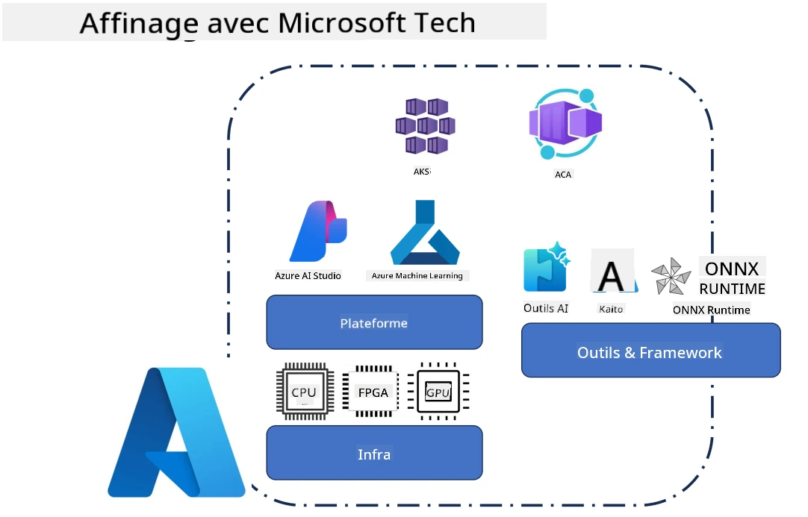
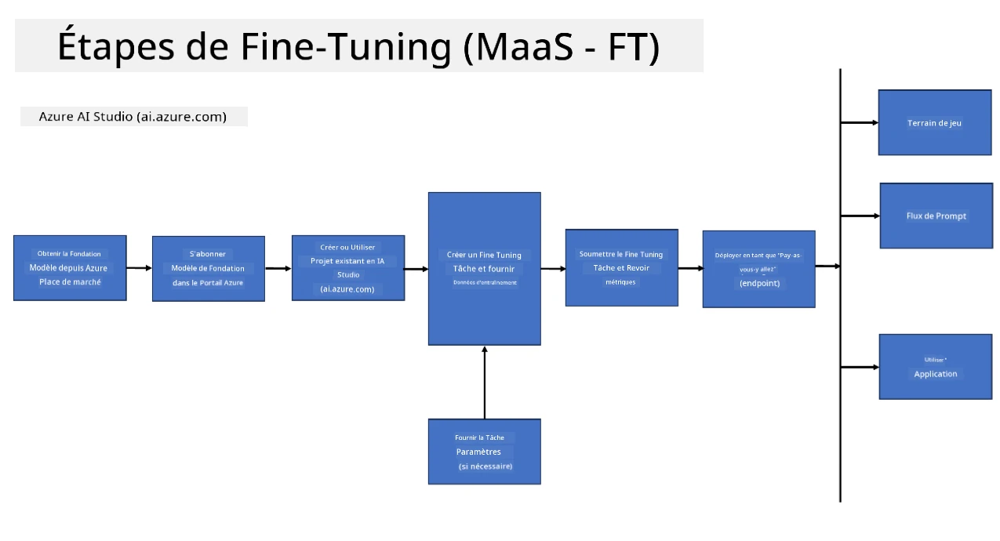
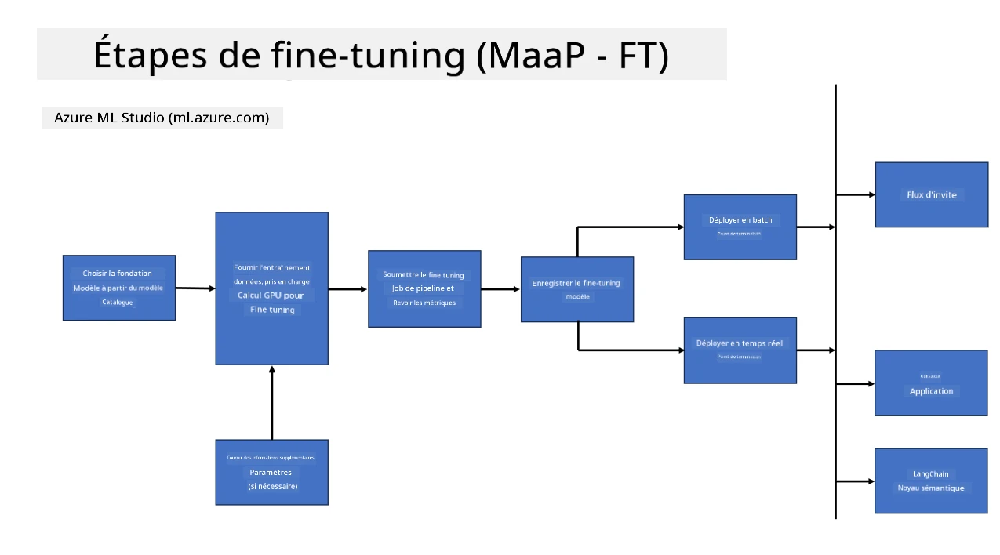
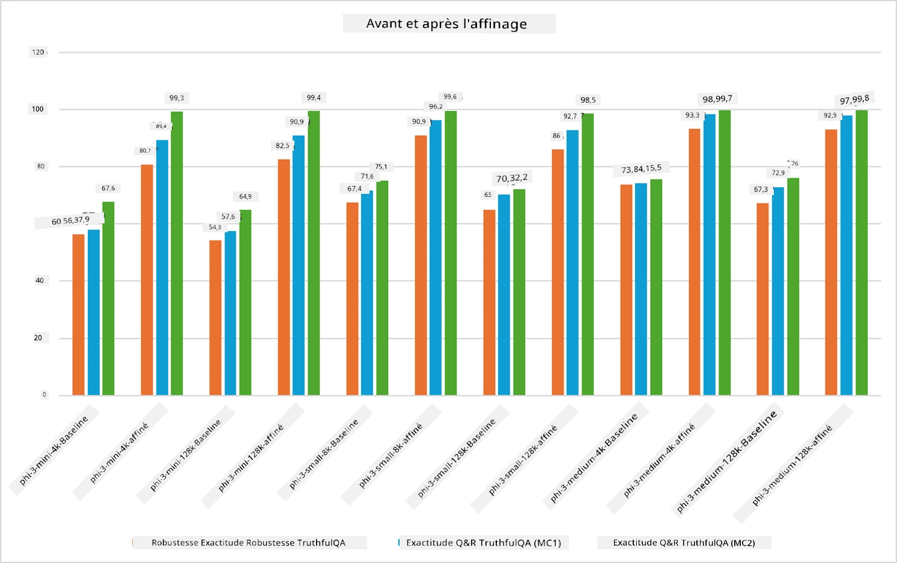

## Scénarios de Fine Tuning

Cette section fournit un aperçu des scénarios de fine-tuning dans les environnements Microsoft Foundry et Azure, y compris les modèles de déploiement, les couches d'infrastructure et les techniques d'optimisation couramment utilisées.

**Plateforme**  
Cela inclut des services gérés tels que Microsoft Foundry (anciennement Microsoft Foundry) et Azure Machine Learning, qui offrent la gestion des modèles, l'orchestration, le suivi des expériences et les workflows de déploiement.

**Infrastructure**  
Le fine-tuning nécessite des ressources de calcul évolutives. Dans les environnements Azure, cela inclut généralement des machines virtuelles basées sur GPU et des ressources CPU pour les charges légères, ainsi qu'un stockage évolutif pour les ensembles de données et les points de contrôle.

**Outils & Framework**  
Les workflows de fine-tuning s'appuient fréquemment sur des frameworks et des bibliothèques d'optimisation tels que Hugging Face Transformers, DeepSpeed, et PEFT (Parameter-Efficient Fine-Tuning).

Le processus de fine-tuning avec les technologies Microsoft couvre les services de plateforme, l'infrastructure de calcul et les frameworks d'entraînement. En comprenant comment ces composants fonctionnent ensemble, les développeurs peuvent adapter efficacement les modèles de base à des tâches spécifiques et des scénarios de production.

## Modèle en tant que Service

Affinez le modèle en utilisant le fine-tuning hébergé, sans avoir besoin de créer et gérer des ressources de calcul.

Le fine-tuning sans serveur est maintenant disponible pour les familles de modèles Phi-3, Phi-3.5 et Phi-4, permettant aux développeurs de personnaliser rapidement et facilement les modèles pour les scénarios cloud et edge sans avoir à organiser de ressources de calcul.

## Modèle en tant que Plateforme 

Les utilisateurs gèrent leurs propres ressources de calcul afin d’affiner leurs modèles.

[Exemple de Fine Tuning](https://github.com/Azure/azureml-examples/blob/main/sdk/python/foundation-models/system/finetune/chat-completion/chat-completion.ipynb)

## Comparaison des Techniques de Fine-Tuning

|Scénario|LoRA|QLoRA|PEFT|DeepSpeed|ZeRO|DoRA|
|---|---|---|---|---|---|---|
|Adapter des LLM pré-entraînés à des tâches ou domaines spécifiques|Oui|Oui|Oui|Oui|Oui|Oui|
|Fine-tuning pour des tâches NLP telles que classification de texte, reconnaissance d'entités nommées et traduction automatique|Oui|Oui|Oui|Oui|Oui|Oui|
|Fine-tuning pour des tâches de QA|Oui|Oui|Oui|Oui|Oui|Oui|
|Fine-tuning pour générer des réponses humaines dans les chatbots|Oui|Oui|Oui|Oui|Oui|Oui|
|Fine-tuning pour générer de la musique, de l'art ou d'autres formes de créativité|Oui|Oui|Oui|Oui|Oui|Oui|
|Réduction des coûts computationnels et financiers|Oui|Oui|Oui|Oui|Oui|Oui|
|Réduction de l'utilisation mémoire|Oui|Oui|Oui|Oui|Oui|Oui|
|Utilisation de moins de paramètres pour un fine-tuning efficace|Oui|Oui|Oui|Non|Non|Oui|
|Forme efficace en mémoire de parallélisme des données donnant accès à la mémoire GPU agrégée de tous les dispositifs GPU disponibles|Non|Non|Non|Oui|Oui|Non|

> [!NOTE]
> LoRA, QLoRA, PEFT et DoRA sont des méthodes de fine-tuning paramétriquement efficaces, tandis que DeepSpeed et ZeRO se concentrent sur l'entraînement distribué et l'optimisation mémoire.

## Exemples de Performance de Fine Tuning

---

<!-- CO-OP TRANSLATOR DISCLAIMER START -->
**Avertissement** :
Ce document a été traduit à l'aide du service de traduction automatique [Co-op Translator](https://github.com/Azure/co-op-translator). Bien que nous nous efforcions d'assurer l'exactitude, veuillez noter que les traductions automatisées peuvent contenir des erreurs ou des inexactitudes. Le document original dans sa langue d'origine doit être considéré comme la source faisant foi. Pour les informations critiques, une traduction professionnelle effectuée par un humain est recommandée. Nous déclinons toute responsabilité en cas de malentendus ou d'interprétations erronées résultant de l'utilisation de cette traduction.
<!-- CO-OP TRANSLATOR DISCLAIMER END -->