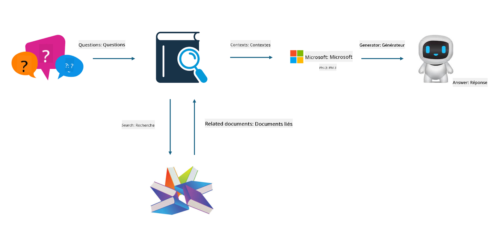

<!--
CO_OP_TRANSLATOR_METADATA:
{
  "original_hash": "e4e010400c2918557b36bb932a14004c",
  "translation_date": "2025-05-07T13:32:44+00:00",
  "source_file": "md/03.FineTuning/FineTuning_vs_RAG.md",
  "language_code": "fr"
}
-->
## Affinage vs RAG

## Génération Augmentée par Recherche

RAG combine la recherche de données et la génération de texte. Les données structurées et non structurées de l’entreprise sont stockées dans la base de données vectorielle. Lorsqu’on recherche du contenu pertinent, un résumé et des contenus associés sont extraits pour constituer un contexte, puis la capacité de complétion textuelle du LLM/SLM est utilisée pour générer le contenu.

## Processus RAG

## Affinage
L’affinage repose sur l’amélioration d’un modèle existant. Il ne nécessite pas de repartir de l’algorithme du modèle, mais les données doivent être accumulées de manière continue. Si vous souhaitez des termes et des expressions plus précis dans des applications industrielles, l’affinage est un meilleur choix. En revanche, si vos données évoluent fréquemment, l’affinage peut devenir complexe.

## Comment choisir
Si notre réponse nécessite l’intégration de données externes, RAG est la meilleure option.

Si vous avez besoin de produire des connaissances industrielles stables et précises, l’affinage sera un bon choix. RAG privilégie l’extraction de contenu pertinent, mais peut ne pas toujours saisir les subtilités spécialisées.

L’affinage nécessite un jeu de données de haute qualité, et s’il ne s’agit que d’un petit ensemble de données, l’impact sera limité. RAG est plus flexible.  
L’affinage est une boîte noire, une sorte de métaphysique, et il est difficile de comprendre son mécanisme interne. En revanche, RAG facilite la traçabilité des sources de données, ce qui permet d’ajuster efficacement les hallucinations ou erreurs de contenu et d’offrir une meilleure transparence.

**Avertissement** :  
Ce document a été traduit à l'aide du service de traduction automatique [Co-op Translator](https://github.com/Azure/co-op-translator). Bien que nous nous efforcions d'assurer l'exactitude, veuillez noter que les traductions automatiques peuvent contenir des erreurs ou des inexactitudes. Le document original dans sa langue d'origine doit être considéré comme la source faisant foi. Pour les informations critiques, il est recommandé de recourir à une traduction professionnelle réalisée par un humain. Nous déclinons toute responsabilité en cas de malentendus ou de mauvaises interprétations résultant de l'utilisation de cette traduction.