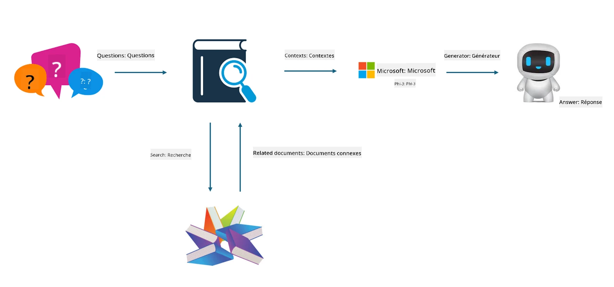

<!--
CO_OP_TRANSLATOR_METADATA:
{
  "original_hash": "e4e010400c2918557b36bb932a14004c",
  "translation_date": "2025-07-17T09:26:17+00:00",
  "source_file": "md/03.FineTuning/FineTuning_vs_RAG.md",
  "language_code": "fr"
}
-->
## Affinage vs RAG

## Retrieval Augmented Generation

RAG combine la recherche de données et la génération de texte. Les données structurées et non structurées de l’entreprise sont stockées dans une base de données vectorielle. Lorsqu’on recherche un contenu pertinent, un résumé et un contenu pertinents sont trouvés pour former un contexte, puis la capacité de complétion de texte du LLM/SLM est utilisée pour générer du contenu.

## Processus RAG

## Affinage
L’affinage consiste à améliorer un modèle existant. Il n’est pas nécessaire de repartir de l’algorithme du modèle, mais il faut accumuler continuellement des données. Si vous souhaitez une terminologie et une expression linguistique plus précises dans les applications industrielles, l’affinage est un meilleur choix. En revanche, si vos données changent fréquemment, l’affinage peut devenir complexe.

## Comment choisir
Si notre réponse nécessite l’introduction de données externes, RAG est le meilleur choix.

Si vous avez besoin de produire des connaissances industrielles stables et précises, l’affinage sera une bonne option. RAG privilégie la récupération de contenu pertinent, mais peut ne pas toujours saisir les nuances spécialisées.

L’affinage nécessite un jeu de données de haute qualité, et s’il s’agit d’un petit ensemble de données, cela ne fera pas une grande différence. RAG est plus flexible.  
L’affinage est une boîte noire, une sorte de métaphysique, et il est difficile de comprendre son mécanisme interne. En revanche, RAG facilite la traçabilité des sources de données, ce qui permet d’ajuster efficacement les hallucinations ou erreurs de contenu et offre une meilleure transparence.

**Avertissement** :  
Ce document a été traduit à l’aide du service de traduction automatique [Co-op Translator](https://github.com/Azure/co-op-translator). Bien que nous nous efforcions d’assurer l’exactitude, veuillez noter que les traductions automatiques peuvent contenir des erreurs ou des inexactitudes. Le document original dans sa langue d’origine doit être considéré comme la source faisant foi. Pour les informations critiques, une traduction professionnelle réalisée par un humain est recommandée. Nous déclinons toute responsabilité en cas de malentendus ou de mauvaises interprétations résultant de l’utilisation de cette traduction.