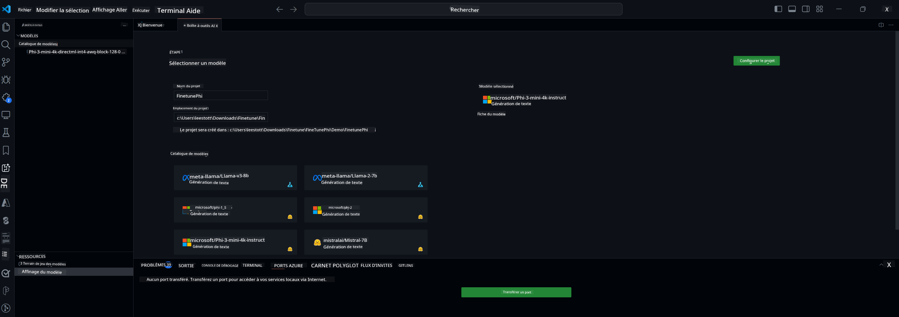

<!--
CO_OP_TRANSLATOR_METADATA:
{
  "original_hash": "c2bc0950f44919ac75a88c1a871680c2",
  "translation_date": "2025-07-17T08:59:14+00:00",
  "source_file": "md/03.FineTuning/Finetuning_VSCodeaitoolkit.md",
  "language_code": "fr"
}
-->
## Bienvenue dans AI Toolkit pour VS Code

[AI Toolkit pour VS Code](https://github.com/microsoft/vscode-ai-toolkit/tree/main) rassemble différents modèles issus du catalogue Azure AI Studio ainsi que d’autres catalogues comme Hugging Face. Cette boîte à outils simplifie les tâches courantes de développement pour créer des applications IA avec des outils et modèles d’IA générative grâce à :
- Découverte de modèles et espace de test pour débuter.
- Affinage et inférence de modèles en utilisant les ressources locales.
- Affinage et inférence à distance via les ressources Azure.

[Installer AI Toolkit pour VSCode](https://marketplace.visualstudio.com/items?itemName=ms-windows-ai-studio.windows-ai-studio)



**[Aperçu privé]** Provisionnement en un clic pour Azure Container Apps afin d’exécuter l’affinage et l’inférence des modèles dans le cloud.

Passons maintenant au développement de votre application IA :

- [Bienvenue dans AI Toolkit pour VS Code](../../../../md/03.FineTuning)
- [Développement local](../../../../md/03.FineTuning)
  - [Préparatifs](../../../../md/03.FineTuning)
  - [Activation de Conda](../../../../md/03.FineTuning)
  - [Affinage du modèle de base uniquement](../../../../md/03.FineTuning)
  - [Affinage et inférence du modèle](../../../../md/03.FineTuning)
  - [Affinage du modèle](../../../../md/03.FineTuning)
  - [Microsoft Olive](../../../../md/03.FineTuning)
  - [Exemples et ressources pour l’affinage](../../../../md/03.FineTuning)
- [**\[Aperçu privé\]** Développement à distance](../../../../md/03.FineTuning)
  - [Prérequis](../../../../md/03.FineTuning)
  - [Configuration d’un projet de développement à distance](../../../../md/03.FineTuning)
  - [Provisionnement des ressources Azure](../../../../md/03.FineTuning)
  - [\[Optionnel\] Ajouter un token Huggingface au secret de l’Azure Container App](../../../../md/03.FineTuning)
  - [Lancer l’affinage](../../../../md/03.FineTuning)
  - [Provisionner le point de terminaison d’inférence](../../../../md/03.FineTuning)
  - [Déployer le point de terminaison d’inférence](../../../../md/03.FineTuning)
  - [Utilisation avancée](../../../../md/03.FineTuning)

## Développement local
### Préparatifs

1. Assurez-vous que le pilote NVIDIA est installé sur l’hôte.  
2. Exécutez `huggingface-cli login` si vous utilisez HF pour exploiter un jeu de données.  
3. Explications des paramètres clés d’`Olive` pour tout ce qui modifie l’utilisation de la mémoire.

### Activation de Conda
Puisque nous utilisons un environnement WSL partagé, vous devez activer manuellement l’environnement conda. Après cette étape, vous pourrez lancer l’affinage ou l’inférence.

```bash
conda activate [conda-env-name] 
```

### Affinage du modèle de base uniquement
Pour tester simplement le modèle de base sans affinage, vous pouvez exécuter cette commande après avoir activé conda.

```bash
cd inference

# Web browser interface allows to adjust a few parameters like max new token length, temperature and so on.
# User has to manually open the link (e.g. http://0.0.0.0:7860) in a browser after gradio initiates the connections.
python gradio_chat.py --baseonly
```

### Affinage et inférence du modèle

Une fois l’espace de travail ouvert dans un conteneur de développement, ouvrez un terminal (le chemin par défaut est la racine du projet), puis lancez la commande ci-dessous pour affiner un LLM sur le jeu de données sélectionné.

```bash
python finetuning/invoke_olive.py 
```

Les points de contrôle et le modèle final seront sauvegardés dans le dossier `models`.

Ensuite, lancez l’inférence avec le modèle affiné via des conversations dans une `console`, un `navigateur web` ou `prompt flow`.

```bash
cd inference

# Console interface.
python console_chat.py

# Web browser interface allows to adjust a few parameters like max new token length, temperature and so on.
# User has to manually open the link (e.g. http://127.0.0.1:7860) in a browser after gradio initiates the connections.
python gradio_chat.py
```

Pour utiliser `prompt flow` dans VS Code, veuillez consulter ce [Démarrage rapide](https://microsoft.github.io/promptflow/how-to-guides/quick-start.html).

### Affinage du modèle

Téléchargez ensuite le modèle correspondant selon la disponibilité d’un GPU sur votre appareil.

Pour démarrer une session d’affinage local avec QLoRA, choisissez un modèle à affiner dans notre catalogue.
| Plateforme(s) | GPU disponible | Nom du modèle | Taille (Go) |
|---------|---------|--------|--------|
| Windows | Oui | Phi-3-mini-4k-**directml**-int4-awq-block-128-onnx | 2,13 Go |
| Linux | Oui | Phi-3-mini-4k-**cuda**-int4-onnx | 2,30 Go |
| Windows<br>Linux | Non | Phi-3-mini-4k-**cpu**-int4-rtn-block-32-acc-level-4-onnx | 2,72 Go |

**_Note_** Vous n’avez pas besoin d’un compte Azure pour télécharger les modèles.

Le modèle Phi3-mini (int4) fait environ 2 à 3 Go. Selon la vitesse de votre réseau, le téléchargement peut prendre quelques minutes.

Commencez par choisir un nom et un emplacement pour votre projet.  
Ensuite, sélectionnez un modèle dans le catalogue. Vous serez invité à télécharger le modèle de projet. Vous pourrez alors cliquer sur « Configurer le projet » pour ajuster différents paramètres.

### Microsoft Olive

Nous utilisons [Olive](https://microsoft.github.io/Olive/why-olive.html) pour exécuter l’affinage QLoRA sur un modèle PyTorch de notre catalogue. Tous les paramètres sont préconfigurés avec des valeurs par défaut pour optimiser l’exécution locale de l’affinage avec une gestion mémoire optimisée, mais ils peuvent être ajustés selon votre scénario.

### Exemples et ressources pour l’affinage

- [Guide de démarrage pour l’affinage](https://learn.microsoft.com/windows/ai/toolkit/toolkit-fine-tune)
- [Affinage avec un jeu de données HuggingFace](https://github.com/microsoft/vscode-ai-toolkit/blob/main/archive/walkthrough-hf-dataset.md)
- [Affinage avec un jeu de données simple](https://github.com/microsoft/vscode-ai-toolkit/blob/main/archive/walkthrough-simple-dataset.md)

## **[Aperçu privé]** Développement à distance

### Prérequis

1. Pour exécuter l’affinage du modèle dans votre environnement Azure Container App distant, assurez-vous que votre abonnement dispose d’une capacité GPU suffisante. Soumettez un [ticket de support](https://azure.microsoft.com/support/create-ticket/) pour demander la capacité nécessaire à votre application. [Plus d’infos sur la capacité GPU](https://learn.microsoft.com/azure/container-apps/workload-profiles-overview)  
2. Si vous utilisez un jeu de données privé sur HuggingFace, assurez-vous d’avoir un [compte HuggingFace](https://huggingface.co/?WT.mc_id=aiml-137032-kinfeylo) et de [générer un token d’accès](https://huggingface.co/docs/hub/security-tokens?WT.mc_id=aiml-137032-kinfeylo)  
3. Activez le flag de fonctionnalité Remote Fine-tuning and Inference dans AI Toolkit pour VS Code  
   1. Ouvrez les paramètres de VS Code via *Fichier -> Préférences -> Paramètres*.  
   2. Allez dans *Extensions* puis sélectionnez *AI Toolkit*.  
   3. Cochez l’option *"Enable Remote Fine-tuning And Inference"*.  
   4. Rechargez VS Code pour appliquer les changements.

- [Affinage à distance](https://github.com/microsoft/vscode-ai-toolkit/blob/main/archive/remote-finetuning.md)

### Configuration d’un projet de développement à distance
1. Exécutez la palette de commandes `AI Toolkit: Focus on Resource View`.  
2. Allez dans *Model Fine-tuning* pour accéder au catalogue de modèles. Donnez un nom à votre projet et choisissez son emplacement sur votre machine. Puis cliquez sur le bouton *"Configure Project"*.  
3. Configuration du projet  
    1. Ne cochez pas l’option *"Fine-tune locally"*.  
    2. Les paramètres de configuration Olive apparaîtront avec des valeurs par défaut préremplies. Ajustez-les et complétez-les selon vos besoins.  
    3. Passez à *Generate Project*. Cette étape utilise WSL et prépare un nouvel environnement Conda, en vue de futures mises à jour incluant les conteneurs de développement.  
4. Cliquez sur *"Relaunch Window In Workspace"* pour ouvrir votre projet de développement à distance.

> **Note :** Le projet fonctionne actuellement soit en local, soit à distance dans AI Toolkit pour VS Code. Si vous choisissez *"Fine-tune locally"* lors de la création, il fonctionnera uniquement en WSL sans capacités de développement à distance. Si vous ne cochez pas *"Fine-tune locally"*, le projet sera limité à l’environnement Azure Container App distant.

### Provisionnement des ressources Azure
Pour commencer, vous devez provisionner la ressource Azure pour l’affinage à distance. Lancez la commande `AI Toolkit: Provision Azure Container Apps job for fine-tuning` depuis la palette de commandes.

Suivez la progression du provisionnement via le lien affiché dans le canal de sortie.

### [Optionnel] Ajouter un token Huggingface au secret de l’Azure Container App
Si vous utilisez un jeu de données privé HuggingFace, configurez votre token HuggingFace comme variable d’environnement pour éviter une connexion manuelle sur le Hub Hugging Face.  
Vous pouvez le faire avec la commande `AI Toolkit: Add Azure Container Apps Job secret for fine-tuning`. Avec cette commande, définissez le nom du secret comme [`HF_TOKEN`](https://huggingface.co/docs/huggingface_hub/package_reference/environment_variables#hftoken) et utilisez votre token Hugging Face comme valeur du secret.

### Lancer l’affinage
Pour démarrer la tâche d’affinage à distance, exécutez la commande `AI Toolkit: Run fine-tuning`.

Pour consulter les logs système et console, vous pouvez visiter le portail Azure via le lien dans le panneau de sortie (plus d’informations sur [Afficher et interroger les logs sur Azure](https://aka.ms/ai-toolkit/remote-provision#view-and-query-logs-on-azure)). Ou bien, vous pouvez voir les logs de la console directement dans le panneau de sortie VSCode en lançant la commande `AI Toolkit: Show the running fine-tuning job streaming logs`.  
> **Note :** La tâche peut être mise en file d’attente en raison de ressources insuffisantes. Si les logs ne s’affichent pas, exécutez la commande `AI Toolkit: Show the running fine-tuning job streaming logs`, patientez un moment, puis relancez la commande pour vous reconnecter au flux des logs.

Durant ce processus, QLoRA sera utilisé pour l’affinage et créera des adaptateurs LoRA pour le modèle à utiliser lors de l’inférence.  
Les résultats de l’affinage seront stockés dans Azure Files.

### Provisionner le point de terminaison d’inférence
Une fois les adaptateurs entraînés dans l’environnement distant, utilisez une application Gradio simple pour interagir avec le modèle.  
Comme pour l’affinage, vous devez configurer les ressources Azure pour l’inférence distante en exécutant la commande `AI Toolkit: Provision Azure Container Apps for inference` depuis la palette de commandes.

Par défaut, l’abonnement et le groupe de ressources pour l’inférence doivent correspondre à ceux utilisés pour l’affinage. L’inférence utilisera le même environnement Azure Container App et accédera au modèle et aux adaptateurs stockés dans Azure Files, générés lors de l’étape d’affinage.

### Déployer le point de terminaison d’inférence
Si vous souhaitez modifier le code d’inférence ou recharger le modèle d’inférence, exécutez la commande `AI Toolkit: Deploy for inference`. Cela synchronisera votre code le plus récent avec Azure Container App et redémarrera la réplique.

Une fois le déploiement réussi, vous pouvez accéder à l’API d’inférence en cliquant sur le bouton « Aller au point de terminaison d’inférence » affiché dans la notification VSCode. Ou bien, le point de terminaison web API se trouve sous `ACA_APP_ENDPOINT` dans `./infra/inference.config.json` et dans le panneau de sortie. Vous êtes maintenant prêt à évaluer le modèle via ce point de terminaison.

### Utilisation avancée
Pour plus d’informations sur le développement à distance avec AI Toolkit, consultez la documentation [Affinage de modèles à distance](https://aka.ms/ai-toolkit/remote-provision) et [Inférence avec le modèle affiné](https://aka.ms/ai-toolkit/remote-inference).

**Avertissement** :  
Ce document a été traduit à l’aide du service de traduction automatique [Co-op Translator](https://github.com/Azure/co-op-translator). Bien que nous nous efforcions d’assurer l’exactitude, veuillez noter que les traductions automatiques peuvent contenir des erreurs ou des inexactitudes. Le document original dans sa langue d’origine doit être considéré comme la source faisant foi. Pour les informations critiques, une traduction professionnelle réalisée par un humain est recommandée. Nous déclinons toute responsabilité en cas de malentendus ou de mauvaises interprétations résultant de l’utilisation de cette traduction.