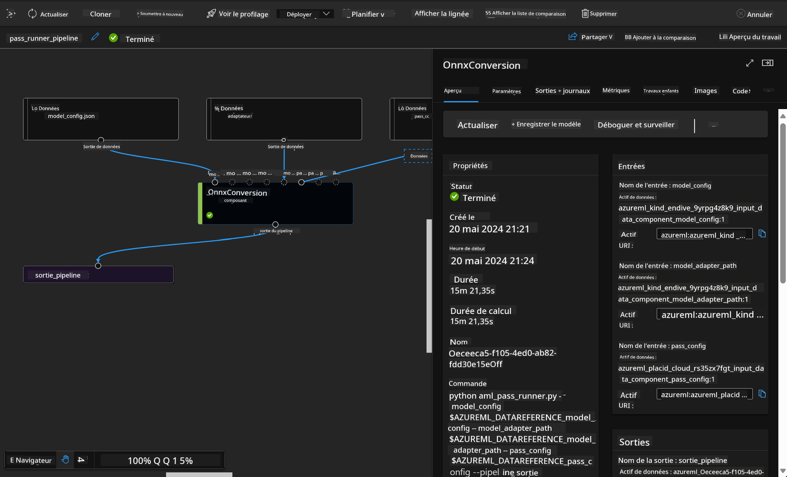

<!--
CO_OP_TRANSLATOR_METADATA:
{
  "original_hash": "7fe541373802e33568e94e13226d463c",
  "translation_date": "2025-05-07T13:31:20+00:00",
  "source_file": "md/03.FineTuning/Introduce_AzureML.md",
  "language_code": "fr"
}
-->
# **Présentation du service Azure Machine Learning**

[Azure Machine Learning](https://ml.azure.com?WT.mc_id=aiml-138114-kinfeylo) est un service cloud conçu pour accélérer et gérer le cycle de vie des projets de machine learning (ML).

Les professionnels du ML, data scientists et ingénieurs peuvent l’utiliser au quotidien pour :

- Entraîner et déployer des modèles.  
- Gérer les opérations de machine learning (MLOps).  
- Vous pouvez créer un modèle dans Azure Machine Learning ou utiliser un modèle issu d’une plateforme open source, comme PyTorch, TensorFlow ou scikit-learn.  
- Les outils MLOps vous aident à surveiller, réentraîner et redéployer les modèles.

## À qui s’adresse Azure Machine Learning ?

**Data Scientists et Ingénieurs ML**

Ils peuvent utiliser des outils pour accélérer et automatiser leurs tâches quotidiennes.  
Azure ML offre des fonctionnalités pour l’équité, l’explicabilité, le suivi et l’auditabilité.

**Développeurs d’applications**  
Ils peuvent intégrer les modèles dans des applications ou services de manière fluide.

**Développeurs plateforme**

Ils ont accès à un ensemble complet d’outils soutenus par des API durables d’Azure Resource Manager.  
Ces outils permettent de créer des solutions ML avancées.

**Entreprises**

En travaillant dans le cloud Microsoft Azure, les entreprises bénéficient d’une sécurité familière et d’un contrôle d’accès basé sur les rôles.  
Elles peuvent configurer des projets pour contrôler l’accès aux données protégées et aux opérations spécifiques.

## Productivité pour toute l’équipe  
Les projets ML nécessitent souvent une équipe aux compétences variées pour construire et maintenir les solutions.

Azure ML propose des outils qui vous permettent de :  
- Collaborer avec votre équipe via des notebooks partagés, des ressources de calcul, du calcul sans serveur, des données et des environnements.  
- Développer des modèles avec équité, explicabilité, suivi et auditabilité pour répondre aux exigences de traçabilité et de conformité.  
- Déployer rapidement et facilement des modèles ML à grande échelle, puis les gérer et les gouverner efficacement avec MLOps.  
- Exécuter des charges de travail de machine learning partout, avec une gouvernance, une sécurité et une conformité intégrées.

## Outils multiplateformes compatibles

Chaque membre de l’équipe ML peut utiliser ses outils préférés pour accomplir ses tâches.  
Que vous réalisiez des expérimentations rapides, un réglage d’hyperparamètres, la construction de pipelines ou la gestion des inférences, vous pouvez utiliser des interfaces familières telles que :  
- Azure Machine Learning Studio  
- Python SDK (v2)  
- Azure CLI (v2)  
- Azure Resource Manager REST APIs

Au fur et à mesure de l’affinement des modèles et de la collaboration tout au long du cycle de développement, vous pouvez partager et retrouver des actifs, ressources et métriques via l’interface Azure Machine Learning studio.

## **LLM/SLM dans Azure ML**

Azure ML a intégré de nombreuses fonctions liées aux LLM/SLM, combinant LLMOps et SLMOps pour créer une plateforme technologique d’intelligence artificielle générative à l’échelle de l’entreprise.

### **Catalogue de modèles**

Les utilisateurs d’entreprise peuvent déployer différents modèles selon les scénarios métiers via le Catalogue de modèles, et fournir des services en tant que Model as Service pour les développeurs ou utilisateurs d’entreprise.

Le Catalogue de modèles dans Azure Machine Learning studio est le centre pour découvrir et utiliser une large gamme de modèles permettant de créer des applications d’IA générative. Le catalogue comprend des centaines de modèles provenant de fournisseurs tels que Azure OpenAI service, Mistral, Meta, Cohere, Nvidia, Hugging Face, ainsi que des modèles entraînés par Microsoft. Les modèles issus de fournisseurs autres que Microsoft sont considérés comme des produits non-Microsoft, selon les Conditions des produits Microsoft, et soumis aux conditions associées au modèle.

### **Pipeline de tâches**

Le cœur d’un pipeline de machine learning est de diviser une tâche complète en un flux de travail en plusieurs étapes. Chaque étape est un composant gérable qui peut être développé, optimisé, configuré et automatisé individuellement. Les étapes sont reliées par des interfaces bien définies. Le service pipeline d’Azure Machine Learning orchestre automatiquement toutes les dépendances entre les étapes.

Pour le fine-tuning de SLM / LLM, on peut gérer nos données, entraînement et processus de génération via Pipeline.

### **Prompt flow**

Avantages de l’utilisation d’Azure Machine Learning prompt flow  
Azure Machine Learning prompt flow offre de nombreux avantages qui accompagnent les utilisateurs de l’idéation à l’expérimentation, jusqu’à des applications LLM prêtes pour la production :

**Agilité en ingénierie des prompts**

Expérience d’écriture interactive : Azure Machine Learning prompt flow propose une représentation visuelle de la structure du flux, permettant aux utilisateurs de comprendre et naviguer facilement dans leurs projets. Il offre aussi une expérience de codage proche d’un notebook pour un développement et un débogage efficaces.  
Variantes pour le réglage des prompts : les utilisateurs peuvent créer et comparer plusieurs variantes de prompt, facilitant un processus itératif de raffinement.

Évaluation : des flux d’évaluation intégrés permettent aux utilisateurs d’apprécier la qualité et l’efficacité de leurs prompts et flux.

Ressources complètes : Azure Machine Learning prompt flow comprend une bibliothèque d’outils, d’exemples et de modèles intégrés, servant de point de départ au développement, stimulant la créativité et accélérant le processus.

**Prêt pour l’entreprise des applications basées sur LLM**

Collaboration : Azure Machine Learning prompt flow supporte la collaboration en équipe, permettant à plusieurs utilisateurs de travailler ensemble sur des projets d’ingénierie de prompts, partager leurs connaissances et gérer le contrôle des versions.

Plateforme tout-en-un : Azure Machine Learning prompt flow simplifie tout le processus d’ingénierie des prompts, du développement à l’évaluation, jusqu’au déploiement et à la surveillance. Les utilisateurs peuvent déployer facilement leurs flux en tant que points de terminaison Azure Machine Learning et suivre leurs performances en temps réel, garantissant une opération optimale et une amélioration continue.

Solutions d’Entreprise Azure Machine Learning : Prompt flow s’appuie sur les solides solutions de préparation entreprise d’Azure Machine Learning, offrant une base sécurisée, évolutive et fiable pour le développement, l’expérimentation et le déploiement des flux.

Avec Azure Machine Learning prompt flow, les utilisateurs peuvent libérer leur agilité en ingénierie des prompts, collaborer efficacement et tirer parti de solutions de niveau entreprise pour réussir le développement et le déploiement d’applications basées sur LLM.

En combinant la puissance de calcul, les données et les différents composants d’Azure ML, les développeurs d’entreprise peuvent facilement créer leurs propres applications d’intelligence artificielle.

**Avertissement** :  
Ce document a été traduit à l’aide du service de traduction automatique [Co-op Translator](https://github.com/Azure/co-op-translator). Bien que nous nous efforçons d’assurer l’exactitude, veuillez noter que les traductions automatiques peuvent contenir des erreurs ou des inexactitudes. Le document original dans sa langue d’origine doit être considéré comme la source faisant foi. Pour des informations critiques, il est recommandé de recourir à une traduction professionnelle humaine. Nous ne saurions être tenus responsables de tout malentendu ou mauvaise interprétation résultant de l’utilisation de cette traduction.