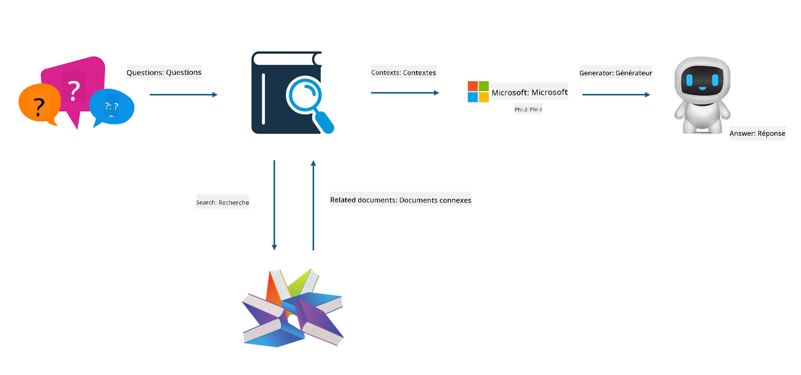

<!--
CO_OP_TRANSLATOR_METADATA:
{
  "original_hash": "743d7e9cb9c4e8ea642d77bee657a7fa",
  "translation_date": "2025-05-07T13:33:26+00:00",
  "source_file": "md/03.FineTuning/LetPhi3gotoIndustriy.md",
  "language_code": "fr"
}
-->
# **Faites de Phi-3 un expert du secteur**

Pour intégrer le modèle Phi-3 dans un secteur d’activité, il est nécessaire d’ajouter des données métier spécifiques à ce secteur au modèle Phi-3. Nous avons deux options différentes : la première est le RAG (Retrieval Augmented Generation) et la seconde est le Fine Tuning.

## **RAG vs Fine-Tuning**

### **Retrieval Augmented Generation**

Le RAG combine la recherche de données et la génération de texte. Les données structurées et non structurées de l’entreprise sont stockées dans une base de données vectorielle. Lors de la recherche de contenu pertinent, un résumé et des contenus liés sont retrouvés pour constituer un contexte, puis la capacité de complétion textuelle du LLM/SLM est utilisée pour générer le contenu.

### **Fine-tuning**

Le fine-tuning consiste à améliorer un modèle existant. Il ne nécessite pas de repartir de l’algorithme du modèle, mais les données doivent être accumulées en continu. Si vous souhaitez une terminologie et une expression linguistique plus précises dans les applications sectorielles, le fine-tuning est un meilleur choix. Cependant, si vos données changent fréquemment, le fine-tuning peut devenir complexe.

### **Comment choisir**

1. Si notre réponse nécessite l’introduction de données externes, le RAG est le meilleur choix

2. Si vous avez besoin d’une connaissance sectorielle stable et précise, le fine-tuning sera une bonne option. Le RAG privilégie la récupération de contenu pertinent, mais peut ne pas toujours saisir les subtilités spécialisées.

3. Le fine-tuning nécessite un jeu de données de haute qualité, et s’il ne concerne qu’un petit ensemble de données, l’impact sera limité. Le RAG est plus flexible.

4. Le fine-tuning est une boîte noire, une métaphysique, et il est difficile de comprendre son mécanisme interne. En revanche, le RAG facilite la traçabilité des sources de données, ce qui permet de corriger efficacement les hallucinations ou erreurs de contenu et d’offrir une meilleure transparence.

### **Scénarios**

1. Les secteurs verticaux nécessitant un vocabulaire et des expressions professionnelles spécifiques, ***Fine-tuning*** sera le meilleur choix

2. Pour un système de QA impliquant la synthèse de différents points de connaissance, ***RAG*** sera le meilleur choix

3. La combinaison de flux métier automatisés ***RAG + Fine-tuning*** est la meilleure option

## **Comment utiliser le RAG**

Une base de données vectorielle est une collection de données stockées sous forme mathématique. Les bases vectorielles facilitent la mémorisation des entrées précédentes par les modèles d’apprentissage automatique, permettant ainsi leur utilisation dans des cas comme la recherche, les recommandations et la génération de texte. Les données peuvent être identifiées selon des métriques de similarité plutôt que des correspondances exactes, ce qui permet aux modèles informatiques de comprendre le contexte des données.

La base de données vectorielle est la clé pour réaliser le RAG. Nous pouvons convertir les données en stockage vectoriel via des modèles vectoriels tels que text-embedding-3, jina-ai-embedding, etc.

Pour en savoir plus sur la création d’une application RAG, consultez [https://github.com/microsoft/Phi-3CookBook](https://github.com/microsoft/Phi-3CookBook?WT.mc_id=aiml-138114-kinfeylo)

## **Comment utiliser le Fine-tuning**

Les algorithmes couramment utilisés pour le fine-tuning sont Lora et QLora. Comment choisir ?
- [En savoir plus avec ce notebook d’exemple](../../../../code/04.Finetuning/Phi_3_Inference_Finetuning.ipynb)
- [Exemple de script Python FineTuning](../../../../code/04.Finetuning/FineTrainingScript.py)

### **Lora et QLora**

LoRA (Low-Rank Adaptation) et QLoRA (Quantized Low-Rank Adaptation) sont deux techniques utilisées pour le fine-tuning des grands modèles de langage (LLM) via le Parameter Efficient Fine Tuning (PEFT). Les techniques PEFT visent à entraîner les modèles plus efficacement que les méthodes traditionnelles.  
LoRA est une technique de fine-tuning autonome qui réduit l’empreinte mémoire en appliquant une approximation de faible rang à la matrice de mise à jour des poids. Elle offre des temps d’entraînement rapides tout en maintenant des performances proches des méthodes classiques de fine-tuning.

QLoRA est une version étendue de LoRA qui intègre des techniques de quantification pour réduire encore la consommation mémoire. QLoRA quantifie la précision des paramètres de poids dans le LLM pré-entraîné à une précision de 4 bits, ce qui est plus efficace en mémoire que LoRA. Cependant, l’entraînement avec QLoRA est environ 30 % plus lent qu’avec LoRA en raison des étapes supplémentaires de quantification et de déquantification.

QLoRA utilise LoRA en complément pour corriger les erreurs introduites par la quantification. QLoRA permet le fine-tuning de modèles massifs avec des milliards de paramètres sur des GPU relativement petits et facilement accessibles. Par exemple, QLoRA peut fine-tuner un modèle de 70 milliards de paramètres nécessitant 36 GPU avec seulement 2

**Avertissement** :  
Ce document a été traduit à l’aide du service de traduction automatique [Co-op Translator](https://github.com/Azure/co-op-translator). Bien que nous nous efforcions d’assurer l’exactitude, veuillez noter que les traductions automatisées peuvent contenir des erreurs ou des inexactitudes. Le document original dans sa langue d’origine doit être considéré comme la source faisant foi. Pour les informations critiques, il est recommandé de recourir à une traduction professionnelle réalisée par un humain. Nous déclinons toute responsabilité en cas de malentendus ou de mauvaises interprétations résultant de l’utilisation de cette traduction.