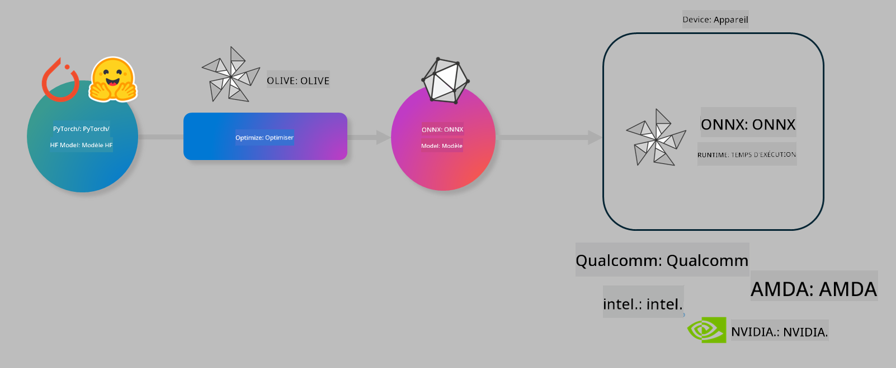

<!--
CO_OP_TRANSLATOR_METADATA:
{
  "original_hash": "6bbe47de3b974df7eea29dfeccf6032b",
  "translation_date": "2025-05-07T13:39:21+00:00",
  "source_file": "md/03.FineTuning/olive-lab/readme.md",
  "language_code": "fr"
}
-->
# Lab. Optimiser les modèles IA pour l'inférence sur appareil

## Introduction

> [!IMPORTANT]  
> Ce laboratoire nécessite un **GPU Nvidia A10 ou A100** avec les pilotes associés et le toolkit CUDA (version 12+) installés.

> [!NOTE]  
> Ce laboratoire de **35 minutes** vous offre une introduction pratique aux concepts clés de l’optimisation des modèles pour l’inférence sur appareil avec OLIVE.

## Objectifs d’apprentissage

À la fin de ce laboratoire, vous serez capable d’utiliser OLIVE pour :

- Quantifier un modèle IA avec la méthode de quantification AWQ.  
- Affiner un modèle IA pour une tâche spécifique.  
- Générer des adaptateurs LoRA (modèle affiné) pour une inférence efficace sur appareil avec ONNX Runtime.

### Qu’est-ce qu’Olive

Olive (*O*NNX *live*) est une boîte à outils d’optimisation de modèles avec une interface CLI associée, qui vous permet de déployer des modèles pour ONNX runtime +++https://onnxruntime.ai+++ avec qualité et performance.



L’entrée d’Olive est typiquement un modèle PyTorch ou Hugging Face et la sortie est un modèle ONNX optimisé, exécuté sur un appareil (cible de déploiement) utilisant ONNX runtime. Olive optimise le modèle pour l’accélérateur IA de la cible de déploiement (NPU, GPU, CPU) fourni par un fabricant matériel comme Qualcomm, AMD, Nvidia ou Intel.

Olive exécute un *workflow*, une séquence ordonnée de tâches individuelles d’optimisation appelées *passes* — par exemple : compression de modèle, capture de graphe, quantification, optimisation de graphe. Chaque passe dispose de paramètres ajustables pour obtenir les meilleurs indicateurs, comme la précision et la latence, évalués par l’évaluateur correspondant. Olive utilise une stratégie de recherche avec un algorithme qui ajuste automatiquement chaque passe individuellement ou un ensemble de passes simultanément.

#### Avantages d’Olive

- **Réduit la frustration et le temps** des expérimentations manuelles fastidieuses avec différentes techniques d’optimisation, compression et quantification. Définissez vos contraintes de qualité et performance, et laissez Olive trouver automatiquement le meilleur modèle.  
- **Plus de 40 composants intégrés** d’optimisation de modèles couvrant les techniques de pointe en quantification, compression, optimisation de graphe et affinage.  
- **CLI facile à utiliser** pour les tâches courantes d’optimisation de modèles, par exemple : olive quantize, olive auto-opt, olive finetune.  
- Emballage et déploiement de modèles intégrés.  
- Support de la génération de modèles pour **Multi LoRA serving**.  
- Construction de workflows via YAML/JSON pour orchestrer les tâches d’optimisation et de déploiement.  
- Intégration avec **Hugging Face** et **Azure AI**.  
- Mécanisme de **caching** intégré pour **réduire les coûts**.

## Instructions du laboratoire

> [!NOTE]  
> Veuillez vous assurer d’avoir provisionné votre Azure AI Hub et Projet, et configuré votre calcul A100 comme indiqué dans le Lab 1.

### Étape 0 : Connexion à votre calcul Azure AI

Connectez-vous au calcul Azure AI via la fonction remote de **VS Code**.

1. Ouvrez votre application de bureau **VS Code** :  
1. Ouvrez la **palette de commandes** avec **Shift+Ctrl+P**  
1. Dans la palette, cherchez **AzureML - remote: Connect to compute instance in New Window**.  
1. Suivez les instructions à l’écran pour vous connecter au calcul. Cela implique de sélectionner votre abonnement Azure, groupe de ressources, projet et nom du calcul configuré dans le Lab 1.  
1. Une fois connecté à votre nœud Azure ML Compute, cela s’affichera en bas à gauche de Visual Code `><Azure ML: Compute Name`

### Étape 1 : Cloner ce dépôt

Dans VS Code, ouvrez un nouveau terminal avec **Ctrl+J** et clonez ce dépôt :

Dans le terminal, vous devriez voir l’invite

```
azureuser@computername:~/cloudfiles/code$ 
```  
Cloner la solution

```bash
cd ~/localfiles
git clone https://github.com/microsoft/phi-3cookbook.git
```

### Étape 2 : Ouvrir le dossier dans VS Code

Pour ouvrir VS Code dans le dossier concerné, exécutez la commande suivante dans le terminal, ce qui ouvrira une nouvelle fenêtre :

```bash
code phi-3cookbook/code/04.Finetuning/Olive-lab
```

Sinon, vous pouvez ouvrir le dossier via **Fichier** > **Ouvrir un dossier**.

### Étape 3 : Dépendances

Ouvrez un terminal dans VS Code sur votre instance Azure AI Compute (raccourci : **Ctrl+J**) et exécutez les commandes suivantes pour installer les dépendances :

```bash
conda create -n olive-ai python=3.11 -y
conda activate olive-ai
pip install -r requirements.txt
az extension remove -n azure-cli-ml
az extension add -n ml
```

> [!NOTE]  
> L’installation de toutes les dépendances prendra environ 5 minutes.

Dans ce laboratoire, vous téléchargerez et enverrez des modèles vers le catalogue de modèles Azure AI. Pour y accéder, vous devez vous connecter à Azure avec :

```bash
az login
```

> [!NOTE]  
> Lors de la connexion, il vous sera demandé de sélectionner votre abonnement. Veillez à choisir celui fourni pour ce laboratoire.

### Étape 4 : Exécuter les commandes Olive

Ouvrez un terminal dans VS Code sur votre instance Azure AI Compute (raccourci : **Ctrl+J**) et assurez-vous que l’environnement conda `olive-ai` est activé :

```bash
conda activate olive-ai
```

Ensuite, exécutez les commandes Olive suivantes dans la ligne de commande.

1. **Inspecter les données :** Dans cet exemple, vous allez affiner le modèle Phi-3.5-Mini pour qu’il soit spécialisé dans les questions liées aux voyages. Le code ci-dessous affiche les premières entrées du jeu de données, au format JSON lines :

    ```bash
    head data/data_sample_travel.jsonl
    ```

1. **Quantifier le modèle :** Avant d’entraîner le modèle, vous le quantifiez avec la commande suivante qui utilise une technique appelée Active Aware Quantization (AWQ) +++https://arxiv.org/abs/2306.00978+++. AWQ quantifie les poids d’un modèle en tenant compte des activations produites lors de l’inférence. Cela signifie que la quantification prend en compte la distribution réelle des données dans les activations, ce qui permet de mieux préserver la précision du modèle comparé aux méthodes classiques de quantification des poids.

    ```bash
    olive quantize \
       --model_name_or_path microsoft/Phi-3.5-mini-instruct \
       --trust_remote_code \
       --algorithm awq \
       --output_path models/phi/awq \
       --log_level 1
    ```

    La quantification AWQ prend environ **8 minutes** et permet de **réduire la taille du modèle d’environ 7,5 Go à 2,5 Go**.

    Dans ce laboratoire, nous vous montrons comment importer des modèles depuis Hugging Face (par exemple : `microsoft/Phi-3.5-mini-instruct`). However, Olive also allows you to input models from the Azure AI catalog by updating the `model_name_or_path` argument to an Azure AI asset ID (for example:  `azureml://registries/azureml/models/Phi-3.5-mini-instruct/versions/4`). 

1. **Train the model:** Next, the `olive finetune` affîne le modèle quantifié. Quantifier le modèle *avant* l’affinage plutôt qu’après améliore la précision, car l’affinage compense une partie de la perte due à la quantification.

    ```bash
    olive finetune \
        --method lora \
        --model_name_or_path models/phi/awq \
        --data_files "data/data_sample_travel.jsonl" \
        --data_name "json" \
        --text_template "<|user|>\n{prompt}<|end|>\n<|assistant|>\n{response}<|end|>" \
        --max_steps 100 \
        --output_path ./models/phi/ft \
        --log_level 1
    ```

    L’affinage (avec 100 étapes) prend environ **6 minutes**.

1. **Optimiser :** Une fois le modèle entraîné, vous l’optimisez avec la commande Olive `auto-opt` command, which will capture the ONNX graph and automatically perform a number of optimizations to improve the model performance for CPU by compressing the model and doing fusions. It should be noted, that you can also optimize for other devices such as NPU or GPU by just updating the `--device` and `--provider`. Pour ce laboratoire, nous utiliserons le CPU.

    ```bash
    olive auto-opt \
       --model_name_or_path models/phi/ft/model \
       --adapter_path models/phi/ft/adapter \
       --device cpu \
       --provider CPUExecutionProvider \
       --use_ort_genai \
       --output_path models/phi/onnx-ao \
       --log_level 1
    ```

    L’optimisation prend environ **5 minutes**.

### Étape 5 : Test rapide d’inférence du modèle

Pour tester l’inférence du modèle, créez un fichier Python dans votre dossier nommé **app.py** et copiez-collez le code suivant :

```python
import onnxruntime_genai as og
import numpy as np

print("loading model and adapters...", end="", flush=True)
model = og.Model("models/phi/onnx-ao/model")
adapters = og.Adapters(model)
adapters.load("models/phi/onnx-ao/model/adapter_weights.onnx_adapter", "travel")
print("DONE!")

tokenizer = og.Tokenizer(model)
tokenizer_stream = tokenizer.create_stream()

params = og.GeneratorParams(model)
params.set_search_options(max_length=100, past_present_share_buffer=False)
user_input = "what is the best thing to see in chicago"
params.input_ids = tokenizer.encode(f"<|user|>\n{user_input}<|end|>\n<|assistant|>\n")

generator = og.Generator(model, params)

generator.set_active_adapter(adapters, "travel")

print(f"{user_input}")

while not generator.is_done():
    generator.compute_logits()
    generator.generate_next_token()

    new_token = generator.get_next_tokens()[0]
    print(tokenizer_stream.decode(new_token), end='', flush=True)

print("\n")
```

Exécutez le code avec :

```bash
python app.py
```

### Étape 6 : Télécharger le modèle sur Azure AI

Télécharger le modèle dans un dépôt Azure AI le rend partageable avec d’autres membres de votre équipe de développement et gère également le contrôle des versions. Pour télécharger le modèle, exécutez la commande suivante :

> [!NOTE]  
> Mettez à jour les `{}` ` placeholders with the name of your resource group and Azure AI Project Name. 

To find your resource group ` pour le groupe de ressources et le nom du projet Azure AI, puis lancez la commande :

```
az ml workspace show
```

Ou connectez-vous à +++ai.azure.com+++ et sélectionnez **centre de gestion** > **projet** > **aperçu**

Remplacez les `{}` par le nom de votre groupe de ressources et du projet Azure AI.

```bash
az ml model create \
    --name ft-for-travel \
    --version 1 \
    --path ./models/phi/onnx-ao \
    --resource-group {RESOURCE_GROUP_NAME} \
    --workspace-name {PROJECT_NAME}
```  
Vous pourrez ensuite voir votre modèle téléchargé et le déployer sur https://ml.azure.com/model/list

**Avertissement** :  
Ce document a été traduit à l’aide du service de traduction automatique [Co-op Translator](https://github.com/Azure/co-op-translator). Bien que nous nous efforçons d’assurer l’exactitude, veuillez noter que les traductions automatiques peuvent contenir des erreurs ou des inexactitudes. Le document original dans sa langue d’origine doit être considéré comme la source faisant foi. Pour les informations critiques, une traduction professionnelle réalisée par un humain est recommandée. Nous déclinons toute responsabilité en cas de malentendus ou de mauvaises interprétations résultant de l’utilisation de cette traduction.