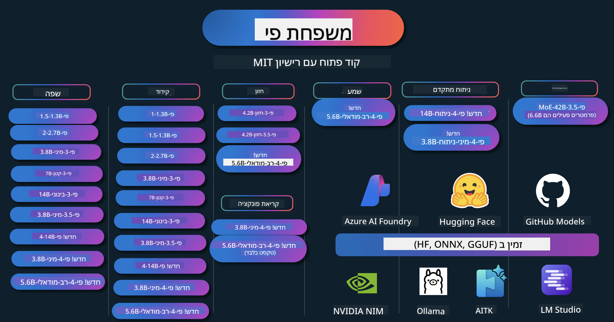

<!--
CO_OP_TRANSLATOR_METADATA:
{
  "original_hash": "1cab9282e04f2e1c388a38dca7763c16",
  "translation_date": "2025-05-09T04:02:49+00:00",
  "source_file": "README.md",
  "language_code": "he"
}
-->
# Phi Cookbook: דוגמאות מעשיות עם דגמי Phi של מיקרוסופט

  

  
  
  

  
  

Phi היא סדרת דגמי בינה מלאכותית בקוד פתוח שפותחו על ידי מיקרוסופט.

Phi כיום הוא מודל שפה קטן (SLM) החזק והיעיל ביותר מבחינת עלות, עם ביצועים מצוינים במגוון שפות, חשיבה, יצירת טקסט/שיחה, קידוד, תמונות, קול ותסריטים נוספים.

ניתן לפרוס את Phi בענן או במכשירים בקצה, וניתן לבנות בקלות יישומי בינה מלאכותית גנרטיבית עם כוח מחשוב מוגבל.

עקבו אחרי השלבים הבאים כדי להתחיל להשתמש במשאבים אלה:  
1. **פיצול המאגר (Fork the Repository)**: לחצו על   
2. **שכפול המאגר (Clone the Repository)**: `git clone https://github.com/microsoft/PhiCookBook.git`  
3. [**הצטרפו לקהילת ה-Discord של מיקרוסופט AI ופגשו מומחים ומפתחים נוספים**](https://discord.com/invite/ByRwuEEgH4?WT.mc_id=aiml-137032-kinfeylo)

## 🌐 תמיכה בריבוי שפות

### נתמך באמצעות GitHub Action (אוטומטי ותמיד מעודכן)

[צרפתית](../fr/README.md) | [ספרדית](../es/README.md) | [גרמנית](../de/README.md) | [רוסית](../ru/README.md) | [ערבית](../ar/README.md) | [פרסית (פארסי)](../fa/README.md) | [אורדו](../ur/README.md) | [סינית (מפושטת)](../zh/README.md) | [סינית (מסורתית, מקאו)](../mo/README.md) | [סינית (מסורתית, הונג קונג)](../hk/README.md) | [סינית (מסורתית, טייוואן)](../tw/README.md) | [יפנית](../ja/README.md) | [קוריאנית](../ko/README.md) | [הינדי](../hi/README.md)

### נתמך באמצעות CLI
## תוכן העניינים

- מבוא
- [ברוכים הבאים למשפחת Phi](./md/01.Introduction/01/01.PhiFamily.md)
  - [הגדרת הסביבה שלך](./md/01.Introduction/01/01.EnvironmentSetup.md)
  - [הבנת טכנולוגיות מפתח](./md/01.Introduction/01/01.Understandingtech.md)
  - [בטיחות AI עבור דגמי Phi](./md/01.Introduction/01/01.AISafety.md)
  - [תמיכה בחומרת Phi](./md/01.Introduction/01/01.Hardwaresupport.md)
  - [דגמי Phi וזמינות בפלטפורמות שונות](./md/01.Introduction/01/01.Edgeandcloud.md)
  - [שימוש ב-Guidance-ai ו-Phi](./md/01.Introduction/01/01.Guidance.md)
  - [דגמים ב-GitHub Marketplace](https://github.com/marketplace/models)
  - [קטלוג דגמי AI של Azure](https://ai.azure.com)

- אינפרנס Phi בסביבות שונות
    -  [Hugging face](./md/01.Introduction/02/01.HF.md)
    -  [דגמי GitHub](./md/01.Introduction/02/02.GitHubModel.md)
    -  [קטלוג דגמי Azure AI Foundry](./md/01.Introduction/02/03.AzureAIFoundry.md)
    -  [Ollama](./md/01.Introduction/02/04.Ollama.md)
    -  [ערכת כלים AI ב-VSCode (AITK)](./md/01.Introduction/02/05.AITK.md)
    -  [NVIDIA NIM](./md/01.Introduction/02/06.NVIDIA.md)

- אינפרנס משפחת Phi
    - [אינפרנס Phi ב-iOS](./md/01.Introduction/03/iOS_Inference.md)
    - [אינפרנס Phi באנדרואיד](./md/01.Introduction/03/Android_Inference.md)
    - [אינפרנס Phi ב-Jetson](./md/01.Introduction/03/Jetson_Inference.md)
    - [אינפרנס Phi במחשב AI](./md/01.Introduction/03/AIPC_Inference.md)
    - [אינפרנס Phi עם מסגרת Apple MLX](./md/01.Introduction/03/MLX_Inference.md)
    - [אינפרנס Phi בשרת מקומי](./md/01.Introduction/03/Local_Server_Inference.md)
    - [אינפרנס Phi בשרת מרוחק באמצעות AI Toolkit](./md/01.Introduction/03/Remote_Interence.md)
    - [אינפרנס Phi עם Rust](./md/01.Introduction/03/Rust_Inference.md)
    - [אינפרנס Phi–Vision במחשב מקומי](./md/01.Introduction/03/Vision_Inference.md)
    - [אינפרנס Phi עם Kaito AKS, מכולות Azure (תמיכה רשמית)](./md/01.Introduction/03/Kaito_Inference.md)
-  [כימות משפחת Phi](./md/01.Introduction/04/QuantifyingPhi.md)
    - [כימות Phi-3.5 / 4 באמצעות llama.cpp](./md/01.Introduction/04/UsingLlamacppQuantifyingPhi.md)
    - [כימות Phi-3.5 / 4 עם הרחבות AI גנרטיבי ל-onnxruntime](./md/01.Introduction/04/UsingORTGenAIQuantifyingPhi.md)
    - [כימות Phi-3.5 / 4 באמצעות Intel OpenVINO](./md/01.Introduction/04/UsingIntelOpenVINOQuantifyingPhi.md)
    - [כימות Phi-3.5 / 4 עם מסגרת Apple MLX](./md/01.Introduction/04/UsingAppleMLXQuantifyingPhi.md)

- הערכת Phi
- [Response AI](./md/01.Introduction/05/ResponsibleAI.md)
    - [Azure AI Foundry for Evaluation](./md/01.Introduction/05/AIFoundry.md)
    - [Using Promptflow for Evaluation](./md/01.Introduction/05/Promptflow.md)
 
- RAG עם Azure AI Search
    - [איך להשתמש ב-Phi-4-mini ו-Phi-4-multimodal(RAG) עם Azure AI Search](https://github.com/microsoft/PhiCookBook/blob/main/code/06.E2E/E2E_Phi-4-RAG-Azure-AI-Search.ipynb)

- דוגמאות לפיתוח אפליקציות Phi
  - אפליקציות טקסט וצ'אט
    - דוגמאות Phi-4 🆕
      - [📓] [צ'אט עם מודל Phi-4-mini ONNX](./md/02.Application/01.TextAndChat/Phi4/ChatWithPhi4ONNX/README.md)
      - [צ'אט עם מודל ONNX מקומי Phi-4 ב-.NET](../../md/04.HOL/dotnet/src/LabsPhi4-Chat-01OnnxRuntime)
      - [אפליקציית קונסול צ'אט .NET עם Phi-4 ONNX באמצעות Semantic Kernel](../../md/04.HOL/dotnet/src/LabsPhi4-Chat-02SK)
    - דוגמאות Phi-3 / 3.5
      - [צ'אטבוט מקומי בדפדפן עם Phi3, ONNX Runtime Web ו-WebGPU](https://github.com/microsoft/onnxruntime-inference-examples/tree/main/js/chat)
      - [צ'אט OpenVino](./md/02.Application/01.TextAndChat/Phi3/E2E_OpenVino_Chat.md)
      - [מודל מרובה - אינטראקטיבי Phi-3-mini ו-OpenAI Whisper](./md/02.Application/01.TextAndChat/Phi3/E2E_Phi-3-mini_with_whisper.md)
      - [MLFlow - בניית עטיפה ושימוש ב-Phi-3 עם MLFlow](./md//02.Application/01.TextAndChat/Phi3/E2E_Phi-3-MLflow.md)
      - [אופטימיזציית מודל - איך לאופטימיזציה למודל Phi-3-mini עבור ONNX Runtime Web עם Olive](https://github.com/microsoft/Olive/tree/main/examples/phi3)
      - [אפליקציית WinUI3 עם Phi-3 mini-4k-instruct-onnx](https://github.com/microsoft/Phi3-Chat-WinUI3-Sample/)
      - [דוגמת אפליקציית WinUI3 עם מודלים מרובי AI](https://github.com/microsoft/ai-powered-notes-winui3-sample)
      - [כיוונון מדויק ואינטגרציה של מודלים מותאמים אישית של Phi-3 עם Prompt flow](./md/02.Application/01.TextAndChat/Phi3/E2E_Phi-3-FineTuning_PromptFlow_Integration.md)
      - [כיוונון מדויק ואינטגרציה של מודלים מותאמים אישית של Phi-3 עם Prompt flow ב-Azure AI Foundry](./md/02.Application/01.TextAndChat/Phi3/E2E_Phi-3-FineTuning_PromptFlow_Integration_AIFoundry.md)
      - [הערכת מודל Phi-3 / Phi-3.5 מכוונן ב-Azure AI Foundry תוך התמקדות בעקרונות Responsible AI של מיקרוסופט](./md/02.Application/01.TextAndChat/Phi3/E2E_Phi-3-Evaluation_AIFoundry.md)
      - [📓] [דוגמת תחזית שפה Phi-3.5-mini-instruct (סינית/אנגלית)](../../md/02.Application/01.TextAndChat/Phi3/phi3-instruct-demo.ipynb)
      - [צ'אטבוט RAG עם Phi-3.5-Instruct WebGPU](./md/02.Application/01.TextAndChat/Phi3/WebGPUWithPhi35Readme.md)
      - [שימוש ב-GPU של Windows ליצירת פתרון Prompt flow עם Phi-3.5-Instruct ONNX](./md/02.Application/01.TextAndChat/Phi3/UsingPromptFlowWithONNX.md)
      - [שימוש ב-Microsoft Phi-3.5 tflite ליצירת אפליקציית אנדרואיד](./md/02.Application/01.TextAndChat/Phi3/UsingPhi35TFLiteCreateAndroidApp.md)
      - [דוגמת Q&A ב-.NET עם מודל ONNX מקומי Phi-3 באמצעות Microsoft.ML.OnnxRuntime](../../md/04.HOL/dotnet/src/LabsPhi301)
      - [אפליקציית צ'אט קונסול .NET עם Semantic Kernel ו-Phi-3](../../md/04.HOL/dotnet/src/LabsPhi302)

  - דוגמאות מבוססות קוד עם Azure AI Inference SDK 
    - דוגמאות Phi-4 🆕
      - [📓] [יצירת קוד פרויקט באמצעות Phi-4-multimodal](./md/02.Application/02.Code/Phi4/GenProjectCode/README.md)
    - דוגמאות Phi-3 / 3.5
      - [בנה צ'אט GitHub Copilot משלך ב-Visual Studio Code עם משפחת Microsoft Phi-3](./md/02.Application/02.Code/Phi3/VSCodeExt/README.md)
      - [צור סוכן צ'אט GitHub Copilot משלך ב-Visual Studio Code עם Phi-3.5 על ידי מודלים של GitHub](/md/02.Application/02.Code/Phi3/CreateVSCodeChatAgentWithGitHubModels.md)

  - דוגמאות לוגיקה מתקדמת
    - דוגמאות Phi-4 🆕
      - [📓] [דוגמאות לוגיקה Phi-4-mini או Phi-4](./md/02.Application/03.AdvancedReasoning/Phi4/AdvancedResoningPhi4mini/README.md)
      - [📓] [כיוונון מדויק של לוגיקה Phi-4-mini עם Microsoft Olive](../../md/02.Application/03.AdvancedReasoning/Phi4/AdvancedResoningPhi4mini/olive_ft_phi_4_reasoning_with_medicaldata.ipynb)
      - [📓] [כיוונון מדויק של לוגיקה Phi-4-mini עם Apple MLX](../../md/02.Application/03.AdvancedReasoning/Phi4/AdvancedResoningPhi4mini/mlx_ft_phi_4_reasoning_with_medicaldata.ipynb)
      - [📓] [לוגיקה Phi-4-mini עם מודלים של GitHub](../../md/02.Application/02.Code/Phi4r/github_models_inference.ipynb)
- [📓] [Phi-4-mini סיעור מוחות עם דגמי Azure AI Foundry](../../md/02.Application/02.Code/Phi4r/azure_models_inference.ipynb)
  - הדגמות
      - [הדגמות Phi-4-mini מתארחות ב-Hugging Face Spaces](https://huggingface.co/spaces/microsoft/phi-4-mini?WT.mc_id=aiml-137032-kinfeylo)
      - [הדגמות Phi-4-multimodal מתארחות ב-Hugging Face Spaces](https://huggingface.co/spaces/microsoft/phi-4-multimodal?WT.mc_id=aiml-137032-kinfeylo)
  - דוגמאות ראייה
    - דוגמאות Phi-4 🆕
      - [📓] [שימוש ב-Phi-4-multimodal לקריאת תמונות ויצירת קוד](./md/02.Application/04.Vision/Phi4/CreateFrontend/README.md) 
    - דוגמאות Phi-3 / 3.5
      -  [📓][Phi-3-vision - המרה מטקסט בתמונה לטקסט](../../md/02.Application/04.Vision/Phi3/E2E_Phi-3-vision-image-text-to-text-online-endpoint.ipynb)
      - [Phi-3-vision-ONNX](https://onnxruntime.ai/docs/genai/tutorials/phi3-v.html)
      - [📓][Phi-3-vision CLIP Embedding](../../md/02.Application/04.Vision/Phi3/E2E_Phi-3-vision-image-text-to-text-online-endpoint.ipynb)
      - [הדגמה: מיחזור Phi-3](https://github.com/jennifermarsman/PhiRecycling/)
      - [Phi-3-vision - עוזר שפה חזותית - עם Phi3-Vision ו-OpenVINO](https://docs.openvino.ai/nightly/notebooks/phi-3-vision-with-output.html)
      - [Phi-3 Vision Nvidia NIM](./md/02.Application/04.Vision/Phi3/E2E_Nvidia_NIM_Vision.md)
      - [Phi-3 Vision OpenVino](./md/02.Application/04.Vision/Phi3/E2E_OpenVino_Phi3Vision.md)
      - [📓][Phi-3.5 Vision דוגמת רב-מסגרת או רב-תמונה](../../md/02.Application/04.Vision/Phi3/phi3-vision-demo.ipynb)
      - [מודל ONNX מקומי של Phi-3 Vision באמצעות Microsoft.ML.OnnxRuntime .NET](../../md/04.HOL/dotnet/src/LabsPhi303)
      - [מודל ONNX מקומי מבוסס תפריט של Phi-3 Vision באמצעות Microsoft.ML.OnnxRuntime .NET](../../md/04.HOL/dotnet/src/LabsPhi304)

  - דוגמאות שמע
    - דוגמאות Phi-4 🆕
      - [📓] [שליפת תמלילי שמע באמצעות Phi-4-multimodal](./md/02.Application/05.Audio/Phi4/Transciption/README.md)
      - [📓] [דוגמת שמע Phi-4-multimodal](../../md/02.Application/05.Audio/Phi4/Siri/demo.ipynb)
      - [📓] [דוגמת תרגום דיבור Phi-4-multimodal](../../md/02.Application/05.Audio/Phi4/Translate/demo.ipynb)
      - [יישום קונסול .NET המשתמש ב-Phi-4-multimodal כדי לנתח קובץ שמע וליצור תמליל](../../md/04.HOL/dotnet/src/LabsPhi4-MultiModal-02Audio)

  - דוגמאות MOE
    - דוגמאות Phi-3 / 3.5
      - [📓] [דוגמת רשת מומחים מעורבת (MoEs) של Phi-3.5 במדיה חברתית](../../md/02.Application/06.MoE/Phi3/phi3_moe_demo.ipynb)
      - [📓] [בניית צינור RAG (Retrieval-Augmented Generation) עם NVIDIA NIM Phi-3 MOE, Azure AI Search ו-LlamaIndex](../../md/02.Application/06.MoE/Phi3/azure-ai-search-nvidia-rag.ipynb)
  - דוגמאות קריאת פונקציות
    - דוגמאות Phi-4 🆕
      -  [📓] [שימוש בקריאת פונקציות עם Phi-4-mini](./md/02.Application/07.FunctionCalling/Phi4/FunctionCallingBasic/README.md)
      -  [📓] [שימוש בקריאת פונקציות ליצירת סוכנים מרובים עם Phi-4-mini](../../md/02.Application/07.FunctionCalling/Phi4/Multiagents/Phi_4_mini_multiagent.ipynb)
      -  [📓] [שימוש בקריאת פונקציות עם Ollama](../../md/02.Application/07.FunctionCalling/Phi4/Ollama/ollama_functioncalling.ipynb)
  - דוגמאות מיקס מולטימודלי
    - דוגמאות Phi-4 🆕
      -  [📓] [שימוש ב-Phi-4-multimodal כעיתונאי טכנולוגיה](../../md/02.Application/08.Multimodel/Phi4/TechJournalist/phi_4_mm_audio_text_publish_news.ipynb)
      - [יישום קונסול .NET המשתמש ב-Phi-4-multimodal לניתוח תמונות](../../md/04.HOL/dotnet/src/LabsPhi4-MultiModal-01Images)

- דוגמאות כוונון עדין של Phi
  - [תרחישי כוונון עדין](./md/03.FineTuning/FineTuning_Scenarios.md)
  - [כוונון עדין מול RAG](./md/03.FineTuning/FineTuning_vs_RAG.md)
  - [כוונון עדין: לתת ל-Phi-3 להפוך למומחה תעשייתי](./md/03.FineTuning/LetPhi3gotoIndustriy.md)
  - [כוונון עדין של Phi-3 עם AI Toolkit ל-VS Code](./md/03.FineTuning/Finetuning_VSCodeaitoolkit.md)
  - [כוונון עדין של Phi-3 עם שירות Azure Machine Learning](./md/03.FineTuning/Introduce_AzureML.md)
- [כיוונון עדין של Phi-3 עם Lora](./md/03.FineTuning/FineTuning_Lora.md)
  - [כיוונון עדין של Phi-3 עם QLora](./md/03.FineTuning/FineTuning_Qlora.md)
  - [כיוונון עדין של Phi-3 עם Azure AI Foundry](./md/03.FineTuning/FineTuning_AIFoundry.md)
  - [כיוונון עדין של Phi-3 עם Azure ML CLI/SDK](./md/03.FineTuning/FineTuning_MLSDK.md)
  - [כיוונון עדין עם Microsoft Olive](./md/03.FineTuning/FineTuning_MicrosoftOlive.md)
  - [כיוונון עדין עם Microsoft Olive - מעבדה מעשית](./md/03.FineTuning/olive-lab/readme.md)
  - [כיוונון עדין של Phi-3-vision עם Weights and Bias](./md/03.FineTuning/FineTuning_Phi-3-visionWandB.md)
  - [כיוונון עדין של Phi-3 עם Apple MLX Framework](./md/03.FineTuning/FineTuning_MLX.md)
  - [כיוונון עדין של Phi-3-vision (תמיכה רשמית)](./md/03.FineTuning/FineTuning_Vision.md)
  - [כיוונון עדין של Phi-3 עם Kaito AKS, Azure Containers (תמיכה רשמית)](./md/03.FineTuning/FineTuning_Kaito.md)
  - [כיוונון עדין של Phi-3 ושל 3.5 Vision](https://github.com/2U1/Phi3-Vision-Finetune)

- מעבדה מעשית
  - [חקירת דגמים מתקדמים: LLMs, SLMs, פיתוח מקומי ועוד](https://github.com/microsoft/aitour-exploring-cutting-edge-models)
  - [שחרור הפוטנציאל של NLP: כיוונון עדין עם Microsoft Olive](https://github.com/azure/Ignite_FineTuning_workshop)

- מאמרים ומחקרים אקדמיים
  - [Textbooks Are All You Need II: דוח טכני על phi-1.5](https://arxiv.org/abs/2309.05463)
  - [דוח טכני על Phi-3: מודל שפה מתקדם במכשיר הנייד שלך](https://arxiv.org/abs/2404.14219)
  - [דוח טכני על Phi-4](https://arxiv.org/abs/2412.08905)
  - [דוח טכני על Phi-4-Mini: מודלים רב-תחומיים קומפקטיים וחזקים באמצעות Mixture-of-LoRAs](https://arxiv.org/abs/2503.01743)
  - [אופטימיזציה של מודלים קטנים לקריאות פונקציות ברכב](https://arxiv.org/abs/2501.02342)
  - [(WhyPHI) כיוונון עדין של PHI-3 למענה על שאלות רב-ברירתיות: מתודולוגיה, תוצאות ואתגרים](https://arxiv.org/abs/2501.01588)
  - [דוח טכני על Phi-4-Reasoning](https://www.microsoft.com/en-us/research/wp-content/uploads/2025/04/phi_4_reasoning.pdf)
  - [דוח טכני על Phi-4-mini-Reasoning](https://huggingface.co/microsoft/Phi-4-mini-reasoning/blob/main/Phi-4-Mini-Reasoning.pdf)

## שימוש בדגמי Phi

### Phi ב-Azure AI Foundry

ניתן ללמוד כיצד להשתמש ב-Microsoft Phi וכיצד לבנות פתרונות מקצה לקצה במכשירים שונים שלך. כדי לחוות את Phi בעצמך, התחל לשחק עם הדגמים ולהתאים את Phi לתרחישים שלך באמצעות [קטלוג הדגמים של Azure AI Foundry](https://aka.ms/phi3-azure-ai). ניתן ללמוד עוד ב-Getting Started עם [Azure AI Foundry](/md/02.QuickStart/AzureAIFoundry_QuickStart.md)

**אזור ניסויים**  
לכל דגם יש אזור ניסויים ייעודי לבדיקה [Azure AI Playground](https://aka.ms/try-phi3).

### Phi בדגמי GitHub

ניתן ללמוד כיצד להשתמש ב-Microsoft Phi וכיצד לבנות פתרונות מקצה לקצה במכשירים שונים שלך. כדי לחוות את Phi בעצמך, התחל לשחק עם הדגם ולהתאים את Phi לתרחישים שלך באמצעות [קטלוג הדגמים של GitHub](https://github.com/marketplace/models?WT.mc_id=aiml-137032-kinfeylo). ניתן ללמוד עוד ב-Getting Started עם [קטלוג דגמים של GitHub](/md/02.QuickStart/GitHubModel_QuickStart.md)

**אזור ניסויים**  
לכל דגם יש [אזור ניסויים ייעודי לבדיקה](/md/02.QuickStart/GitHubModel_QuickStart.md).

### Phi ב-Hugging Face

ניתן גם למצוא את הדגם ב-[Hugging Face](https://huggingface.co/microsoft)

**אזור ניסויים**  
[אזור ניסויים Hugging Chat](https://huggingface.co/chat/models/microsoft/Phi-3-mini-4k-instruct)

## AI אחראי

Microsoft מחויבת לסייע ללקוחותינו להשתמש במוצרי ה-AI שלנו באחריות, לשתף את הלקחים שלנו ולבנות שותפויות מבוססות אמון באמצעות כלים כמו Transparency Notes ו-Impact Assessments. משאבים רבים אלה זמינים ב-[https://aka.ms/RAI](https://aka.ms/RAI).  
הגישה של Microsoft ל-AI אחראי מבוססת על עקרונות ה-AI שלנו: הוגנות, אמינות ובטיחות, פרטיות ואבטחה, הכללה, שקיפות ואחריות.
מודלים רחבי היקף של שפה טבעית, תמונה ודיבור – כמו אלה שבדוגמה זו – עלולים להתנהג בדרכים שאינן הוגנות, לא אמינות או פוגעניות, דבר שעלול לגרום לנזקים. מומלץ לעיין ב-[Azure OpenAI service Transparency note](https://learn.microsoft.com/legal/cognitive-services/openai/transparency-note?tabs=text) כדי להתעדכן בסיכונים ובהגבלות.

הגישה המומלצת להפחתת סיכונים אלה היא לשלב במבנה האדריכלות שלכם מערכת בטיחות שיכולה לזהות ולמנוע התנהגות מזיקה. [Azure AI Content Safety](https://learn.microsoft.com/azure/ai-services/content-safety/overview) מספק שכבת הגנה עצמאית, המסוגלת לזהות תוכן מזיק שנוצר על ידי משתמשים או על ידי AI באפליקציות ושירותים. שירות Content Safety של Azure AI כולל APIs לטקסט ותמונה שמאפשרים לזהות חומר מזיק. בתוך Azure AI Foundry, שירות Content Safety מאפשר לכם לצפות, לחקור ולנסות דוגמאות קוד לזיהוי תוכן מזיק במגוון מודאליות. תיעוד [quickstart](https://learn.microsoft.com/azure/ai-services/content-safety/quickstart-text?tabs=visual-studio%2Clinux&pivots=programming-language-rest) הבא מנחה אתכם כיצד לבצע בקשות לשירות.

היבט נוסף שחשוב לקחת בחשבון הוא ביצועי האפליקציה הכוללים. באפליקציות רב-מודאליות ורב-מודליות, ביצועים משמעותם שהמערכת פועלת כפי שאתם והמשתמשים שלכם מצפים, כולל אי יצירת פלטים מזיקים. חשוב להעריך את ביצועי האפליקציה הכוללת באמצעות [Performance and Quality and Risk and Safety evaluators](https://learn.microsoft.com/azure/ai-studio/concepts/evaluation-metrics-built-in). בנוסף, קיימת לכם האפשרות ליצור ולהעריך באמצעות [custom evaluators](https://learn.microsoft.com/azure/ai-studio/how-to/develop/evaluate-sdk#custom-evaluators).

אתם יכולים להעריך את אפליקציית ה-AI שלכם בסביבת הפיתוח שלכם באמצעות [Azure AI Evaluation SDK](https://microsoft.github.io/promptflow/index.html). בין אם באמצעות מערך נתונים לבדיקה או יעד, יצירות האפליקציה הגנרטיבית שלכם נמדדות כמותית עם evaluators מובנים או evaluators מותאמים לבחירתכם. כדי להתחיל עם Azure AI Evaluation SDK להערכת המערכת שלכם, תוכלו לעקוב אחר [מדריך quickstart](https://learn.microsoft.com/azure/ai-studio/how-to/develop/flow-evaluate-sdk). לאחר ביצוע ריצת הערכה, תוכלו [להציג את התוצאות ב-Azure AI Foundry](https://learn.microsoft.com/azure/ai-studio/how-to/evaluate-flow-results).

## סימני מסחר

פרויקט זה עשוי לכלול סימני מסחר או לוגואים של פרויקטים, מוצרים או שירותים. השימוש המורשה בסימני המסחר או בלוגואים של Microsoft כפוף ל-[Microsoft's Trademark & Brand Guidelines](https://www.microsoft.com/legal/intellectualproperty/trademarks/usage/general) ויש לעמוד בהם. שימוש בסימני המסחר או בלוגואים של Microsoft בגרסאות מותאמות של פרויקט זה אסור שיגרום לבלבול או ירמוז על חסות Microsoft. כל שימוש בסימני מסחר או לוגואים של צד שלישי כפוף למדיניות של אותו צד שלישי.

**כתב ויתור**:  
מסמך זה תורגם באמצעות שירות תרגום מבוסס בינה מלאכותית [Co-op Translator](https://github.com/Azure/co-op-translator). למרות שאנו שואפים לדיוק, יש להיות מודעים לכך שתרגומים אוטומטיים עלולים להכיל שגיאות או אי-דיוקים. המסמך המקורי בשפת המקור שלו נחשב למקור הסמכותי. למידע קריטי מומלץ להשתמש בתרגום מקצועי על ידי אדם. איננו אחראים לכל אי הבנות או פרשנויות שגויות הנובעות משימוש בתרגום זה.