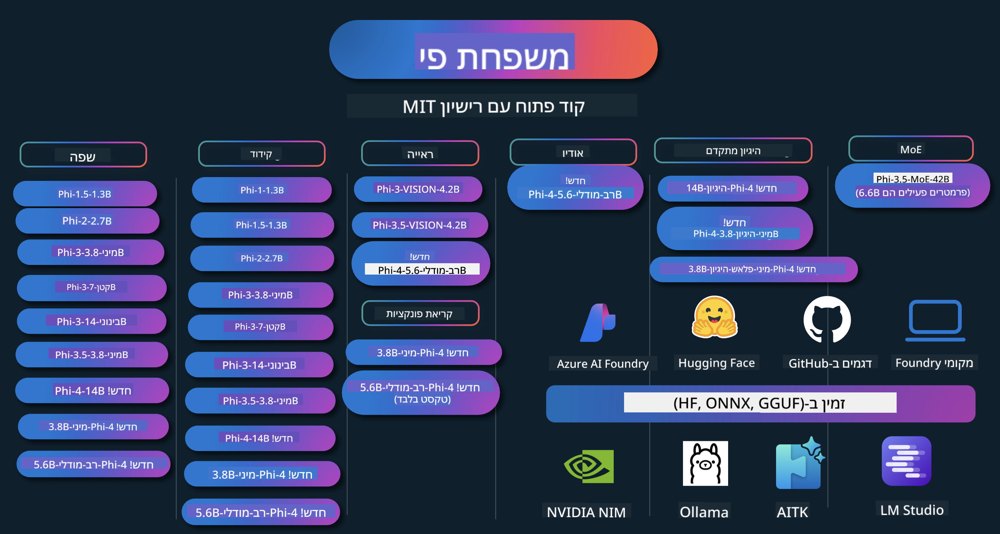

<!--
CO_OP_TRANSLATOR_METADATA:
{
  "original_hash": "ef3a50368712b1a7483d0def1f70c490",
  "translation_date": "2025-12-21T12:27:10+00:00",
  "source_file": "README.md",
  "language_code": "he"
}
-->
# מטבחון Phi: דוגמאות מעשיות עם דגמי Phi של Microsoft

Phi הוא סדרת דגמי AI בקוד פתוח שפותחה על ידי Microsoft. 

נכון לעכשיו, Phi הוא המודל לשפה קטן (SLM) החזק והחסכוני ביותר מבחינת עלות, עם מדדי ביצועים מעולים בריבוי שפות, בהיסקות, ביצירת טקסט/צ'אט, בקידוד, בעיבוד תמונות, אודיו וסצנרים נוספים. 

ניתן לפרוס את Phi בענן או על מכשירי edge, וניתן לבנות בקלות יישומי AI גנרטיביים גם עם כוח חישוב מוגבל.

עקוב אחר השלבים האלה כדי להתחיל להשתמש במשאבים אלה:
1. **צור fork של המאגר**: לחץ על 
2. **שכפל את המאגר**:   `git clone https://github.com/microsoft/PhiCookBook.git`
3. [**הצטרף לקהילת Discord של Microsoft AI ופגוש מומחים ומפתחים אחרים**](https://discord.com/invite/ByRwuEEgH4?WT.mc_id=aiml-137032-kinfeylo)

### 🌐 תמיכה בריבוי שפות

#### נתמך באמצעות GitHub Action (מאוטומטי ותמיד מעודכן)

<!-- CO-OP TRANSLATOR LANGUAGES TABLE START -->
[ערבית](../ar/README.md) | [בנגלית](../bn/README.md) | [בולגרית](../bg/README.md) | [בורמזית (מיאנמר)](../my/README.md) | [סינית (מפושטת)](../zh/README.md) | [סינית (מסורתית, הונג קונג)](../hk/README.md) | [סינית (מסורתית, מקאו)](../mo/README.md) | [סינית (מסורתית, טאיוואן)](../tw/README.md) | [קרואטית](../hr/README.md) | [צ'כית](../cs/README.md) | [דנית](../da/README.md) | [הולנדית](../nl/README.md) | [אסטונית](../et/README.md) | [פינית](../fi/README.md) | [צרפתית](../fr/README.md) | [גרמנית](../de/README.md) | [יוונית](../el/README.md) | [עברית](./README.md) | [הינדי](../hi/README.md) | [הונגרית](../hu/README.md) | [אינדונזית](../id/README.md) | [איטלקית](../it/README.md) | [יפנית](../ja/README.md) | [קאנדה](../kn/README.md) | [קוריאנית](../ko/README.md) | [ליטאית](../lt/README.md) | [מלאית](../ms/README.md) | [מלאיאלאם](../ml/README.md) | [מראתי](../mr/README.md) | [נפאלית](../ne/README.md) | [ניגריאן פידג'ין](../pcm/README.md) | [נורווגית](../no/README.md) | [פרסית (פרסי)](../fa/README.md) | [פולנית](../pl/README.md) | [פורטוגזית (ברזיל)](../br/README.md) | [פורטוגזית (פורטוגל)](../pt/README.md) | [פנג'אבית (גורמוכי)](../pa/README.md) | [רומנית](../ro/README.md) | [רוסית](../ru/README.md) | [סרבית (קירילית)](../sr/README.md) | [סלובקית](../sk/README.md) | [סלובנית](../sl/README.md) | [ספרדית](../es/README.md) | [סווהילית](../sw/README.md) | [שוודית](../sv/README.md) | [תגאלוג (פיליפינית)](../tl/README.md) | [טמילית](../ta/README.md) | [טלוגו](../te/README.md) | [תאית](../th/README.md) | [טורקית](../tr/README.md) | [אוקראינית](../uk/README.md) | [אורדו](../ur/README.md) | [וייטנאמית](../vi/README.md)
<!-- CO-OP TRANSLATOR LANGUAGES TABLE END -->

## תוכן העניינים

- הקדמה
  - [ברוכים הבאים למשפחת Phi](./md/01.Introduction/01/01.PhiFamily.md)
  - [הגדרת הסביבה שלך](./md/01.Introduction/01/01.EnvironmentSetup.md)
  - [הבנת טכנולוגיות מפתח](./md/01.Introduction/01/01.Understandingtech.md)
  - [בטיחות AI לדגמי Phi](./md/01.Introduction/01/01.AISafety.md)
  - [תמיכת חומרה ל-Phi](./md/01.Introduction/01/01.Hardwaresupport.md)
  - [דגמי Phi וזמינות בפלטפורמות השונות](./md/01.Introduction/01/01.Edgeandcloud.md)
  - [שימוש ב-Guidance-ai וב-Phi](./md/01.Introduction/01/01.Guidance.md)
  - [דגמים ב-GitHub Marketplace](https://github.com/marketplace/models)
  - [קטלוג דגמי Azure AI](https://ai.azure.com)

- ביצוע אינפרנס של Phi בסביבות שונות
    -  [Hugging Face](./md/01.Introduction/02/01.HF.md)
    -  [דגמי GitHub](./md/01.Introduction/02/02.GitHubModel.md)
    -  [קטלוג דגמים של Azure AI Foundry](./md/01.Introduction/02/03.AzureAIFoundry.md)
    -  [Ollama](./md/01.Introduction/02/04.Ollama.md)
    -  [AI Toolkit VSCode (AITK)](./md/01.Introduction/02/05.AITK.md)
    -  [NVIDIA NIM](./md/01.Introduction/02/06.NVIDIA.md)
    -  [Foundry מקומי](./md/01.Introduction/02/07.FoundryLocal.md)

- אינפרנס של משפחת Phi
    - [אינפרנס של Phi ב-iOS](./md/01.Introduction/03/iOS_Inference.md)
    - [אינפרנס של Phi ב-Android](./md/01.Introduction/03/Android_Inference.md)
    - [אינפרנס של Phi ב-Jetson](./md/01.Introduction/03/Jetson_Inference.md)
    - [אינפרנס של Phi ב-AI PC](./md/01.Introduction/03/AIPC_Inference.md)
    - [אינפרנס של Phi עם Apple MLX Framework](./md/01.Introduction/03/MLX_Inference.md)
    - [אינפרנס של Phi בשרת מקומי](./md/01.Introduction/03/Local_Server_Inference.md)
    - [אינפרנס של Phi בשרת מרוחק באמצעות AI Toolkit](./md/01.Introduction/03/Remote_Interence.md)
    - [אינפרנס של Phi עם Rust](./md/01.Introduction/03/Rust_Inference.md)
    - [אינפרנס חזותי של Phi מקומי](./md/01.Introduction/03/Vision_Inference.md)
    - [אינפרנס של Phi עם Kaito AKS, Azure Containers (תמיכה רשמית)](./md/01.Introduction/03/Kaito_Inference.md)
-  [כימות משפחת Phi](./md/01.Introduction/04/QuantifyingPhi.md)
    - [כימות Phi-3.5 / 4 באמצעות llama.cpp](./md/01.Introduction/04/UsingLlamacppQuantifyingPhi.md)
    - [כימות Phi-3.5 / 4 באמצעות הרחבות Generative AI ל-onnxruntime](./md/01.Introduction/04/UsingORTGenAIQuantifyingPhi.md)
    - [כימות Phi-3.5 / 4 באמצעות Intel OpenVINO](./md/01.Introduction/04/UsingIntelOpenVINOQuantifyingPhi.md)
    - [כימות Phi-3.5 / 4 באמצעות Apple MLX Framework](./md/01.Introduction/04/UsingAppleMLXQuantifyingPhi.md)

-  הערכת Phi
    - [אחריות ב-AI](./md/01.Introduction/05/ResponsibleAI.md)
    - [Azure AI Foundry להערכה](./md/01.Introduction/05/AIFoundry.md)
    - [שימוש ב-Promptflow להערכה](./md/01.Introduction/05/Promptflow.md)
 
- RAG עם Azure AI Search
    - [כיצד להשתמש ב-Phi-4-mini וב-Phi-4-multimodal(RAG) עם Azure AI Search](https://github.com/microsoft/PhiCookBook/blob/main/code/06.E2E/E2E_Phi-4-RAG-Azure-AI-Search.ipynb)

- דוגמאות לפיתוח יישומי Phi
  - יישומי טקסט וצ'אט
    - דוגמאות Phi-4 🆕
      - [📓] [שיחה עם דגם Phi-4-mini ONNX](./md/02.Application/01.TextAndChat/Phi4/ChatWithPhi4ONNX/README.md)
      - [שיחה עם דגם Phi-4 מקומי ONNX (.NET)](../../md/04.HOL/dotnet/src/LabsPhi4-Chat-01OnnxRuntime)
      - [אפליקציית קונסול .NET לשיחה עם Phi-4 ONNX באמצעות Semantic Kernel](../../md/04.HOL/dotnet/src/LabsPhi4-Chat-02SK)
    - דוגמאות Phi-3 / 3.5
      - [צ'אטבוט מקומי בדפדפן המשתמש ב-Phi3, ONNX Runtime Web ו-WebGPU](https://github.com/microsoft/onnxruntime-inference-examples/tree/main/js/chat)
      - [צ'אט OpenVINO](./md/02.Application/01.TextAndChat/Phi3/E2E_OpenVino_Chat.md)
      - [רב־דגמי - Phi-3-mini אינטראקטיבי ו-OpenAI Whisper](./md/02.Application/01.TextAndChat/Phi3/E2E_Phi-3-mini_with_whisper.md)
      - [MLFlow - בניית עטיפה ושימוש ב-Phi-3 עם MLFlow](./md//02.Application/01.TextAndChat/Phi3/E2E_Phi-3-MLflow.md)
      - [אופטימיזציה של מודל - כיצד לייעל את דגם Phi-3-min עבור ONNX Runtime Web באמצעות Olive](https://github.com/microsoft/Olive/tree/main/examples/phi3)
      - [אפליקציית WinUI3 עם Phi-3 mini-4k-instruct-onnx](https://github.com/microsoft/Phi3-Chat-WinUI3-Sample/)
      -[דוגמת אפליקציית WinUI3 לרשימות המופעלת על ידי מספר מודלים של בינה מלאכותית](https://github.com/microsoft/ai-powered-notes-winui3-sample)
      - [כיוונון עדין ושילוב של דגמי Phi-3 מותאמים אישית עם Prompt flow](./md/02.Application/01.TextAndChat/Phi3/E2E_Phi-3-FineTuning_PromptFlow_Integration.md)
      - [כיוונון עדין ושילוב של דגמי Phi-3 מותאמים אישית עם Prompt flow ב-Azure AI Foundry](./md/02.Application/01.TextAndChat/Phi3/E2E_Phi-3-FineTuning_PromptFlow_Integration_AIFoundry.md)
      - [להעריך את דגם Phi-3 / Phi-3.5 שעבר כיוונון עדין ב-Azure AI Foundry עם התמקדות בעקרונות ה-AI האחראי של מיקרוסופט](./md/02.Application/01.TextAndChat/Phi3/E2E_Phi-3-Evaluation_AIFoundry.md)
      - [📓] [דוגמת חיזוי שפה עבור Phi-3.5-mini-instruct (סינית/אנגלית)](./md/02.Application/01.TextAndChat/Phi3/phi3-instruct-demo.ipynb)
      - [צ'אטבוט RAG WebGPU של Phi-3.5-Instruct](./md/02.Application/01.TextAndChat/Phi3/WebGPUWithPhi35Readme.md)
      - [שימוש ב-GPU של Windows ליצירת פתרון Prompt flow עם Phi-3.5-Instruct ONNX](./md/02.Application/01.TextAndChat/Phi3/UsingPromptFlowWithONNX.md)
      - [שימוש ב-Microsoft Phi-3.5 tflite ליצירת אפליקציית Android](./md/02.Application/01.TextAndChat/Phi3/UsingPhi35TFLiteCreateAndroidApp.md)
      - [דוגמת שאלות ותשובות .NET שמשתמשת בדגם ONNX מקומי של Phi-3 באמצעות Microsoft.ML.OnnxRuntime](../../md/04.HOL/dotnet/src/LabsPhi301)
      - [אפליקציית שיחה בקונסול .NET עם Semantic Kernel ו-Phi-3](../../md/04.HOL/dotnet/src/LabsPhi302)

  - דוגמאות מבוססות קוד של Azure AI Inference SDK 
    - דוגמאות ל-Phi-4 🆕
      - [📓] [יצירת קוד פרויקט באמצעות Phi-4-multimodal](./md/02.Application/02.Code/Phi4/GenProjectCode/README.md)
    - דוגמאות ל-Phi-3 / 3.5
      - [בנה את צ'אט GitHub Copilot משלך ב-Visual Studio Code עם משפחת Microsoft Phi-3](./md/02.Application/02.Code/Phi3/VSCodeExt/README.md)
      - [צור סוכן Chat Copilot משלך ב-Visual Studio Code עם Phi-3.5 של GitHub Models](/md/02.Application/02.Code/Phi3/CreateVSCodeChatAgentWithGitHubModels.md)

  - דוגמאות להסקה מתקדמת
    - דוגמאות ל-Phi-4 🆕
      - [📓] [דוגמאות ל-Phi-4-mini-reasoning או ל-Phi-4-reasoning](./md/02.Application/03.AdvancedReasoning/Phi4/AdvancedResoningPhi4mini/README.md)
      - [📓] [כיוונון עדין של Phi-4-mini-reasoning עם Microsoft Olive](./md/02.Application/03.AdvancedReasoning/Phi4/AdvancedResoningPhi4mini/olive_ft_phi_4_reasoning_with_medicaldata.ipynb)
      - [📓] [כיוונון עדין של Phi-4-mini-reasoning עם Apple MLX](./md/02.Application/03.AdvancedReasoning/Phi4/AdvancedResoningPhi4mini/mlx_ft_phi_4_reasoning_with_medicaldata.ipynb)
      - [📓] [Phi-4-mini-reasoning עם GitHub Models](./md/02.Application/02.Code/Phi4r/github_models_inference.ipynb)
      - [📓] [Phi-4-mini-reasoning עם דגמי Azure AI Foundry](./md/02.Application/02.Code/Phi4r/azure_models_inference.ipynb)
  - הדגמות
      - [דמוים של Phi-4-mini מתארחים ב-Hugging Face Spaces](https://huggingface.co/spaces/microsoft/phi-4-mini?WT.mc_id=aiml-137032-kinfeylo)
      - [דמוים של Phi-4-multimodal המתארחים על Hugginge Face Spaces](https://huggingface.co/spaces/microsoft/phi-4-multimodal?WT.mc_id=aiml-137032-kinfeylo)
  - דוגמאות בתחום הראייה
    - דוגמאות ל-Phi-4 🆕
      - [📓] [השתמש ב-Phi-4-multimodal לקריאת תמונות וליצירת קוד](./md/02.Application/04.Vision/Phi4/CreateFrontend/README.md) 
    - דוגמאות ל-Phi-3 / 3.5
      -  [📓][Phi-3-vision- Phi-3-vision - המרה מתמונה לטקסט](./md/02.Application/04.Vision/Phi3/E2E_Phi-3-vision-image-text-to-text-online-endpoint.ipynb)
      - [Phi-3-vision-ONNX](https://onnxruntime.ai/docs/genai/tutorials/phi3-v.html)
      - [📓][הטמעת CLIP של Phi-3-vision](./md/02.Application/04.Vision/Phi3/E2E_Phi-3-vision-image-text-to-text-online-endpoint.ipynb)
      - [הדגמה: Phi-3 Recycling](https://github.com/jennifermarsman/PhiRecycling/)
      - [Phi-3-vision - עוזר שפה חזותי - עם Phi3-Vision ו-OpenVINO](https://docs.openvino.ai/nightly/notebooks/phi-3-vision-with-output.html)
      - [Phi-3 Vision Nvidia NIM](./md/02.Application/04.Vision/Phi3/E2E_Nvidia_NIM_Vision.md)
      - [Phi-3 Vision OpenVino](./md/02.Application/04.Vision/Phi3/E2E_OpenVino_Phi3Vision.md)
      - [📓][דוגמת Phi-3.5 Vision מרובת פריימים או מרובת תמונות](./md/02.Application/04.Vision/Phi3/phi3-vision-demo.ipynb)
      - [דגם מקומי ONNX של Phi-3 Vision באמצעות Microsoft.ML.OnnxRuntime ב-.NET](../../md/04.HOL/dotnet/src/LabsPhi303)
      - [דגם מקומי ONNX של Phi-3 Vision מבוסס תפריט באמצעות Microsoft.ML.OnnxRuntime ב-.NET](../../md/04.HOL/dotnet/src/LabsPhi304)

  - דוגמאות מתמטיקה
    -  דוגמאות ל-Phi-4-Mini-Flash-Reasoning-Instruct 🆕 [הדגמת מתמטיקה עם Phi-4-Mini-Flash-Reasoning-Instruct](./md/02.Application/09.Math/MathDemo.ipynb)

  - דוגמאות שמע
    - דוגמאות ל-Phi-4 🆕
      - [📓] [הפקת תמלילי שמע באמצעות Phi-4-multimodal](./md/02.Application/05.Audio/Phi4/Transciption/README.md)
      - [📓] [דוגמת שמע של Phi-4-multimodal](./md/02.Application/05.Audio/Phi4/Siri/demo.ipynb)
      - [📓] [דוגמת תרגום דיבור של Phi-4-multimodal](./md/02.Application/05.Audio/Phi4/Translate/demo.ipynb)
      - [.NET console application using Phi-4-multimodal Audio to analyze an audio file and generate transcript](../../md/04.HOL/dotnet/src/LabsPhi4-MultiModal-02Audio)

  - דוגמאות MOE
    - דוגמאות ל-Phi-3 / 3.5
      - [📓] [דוגמת מדיה חברתית של מודלים מסוג Phi-3.5 Mixture of Experts (MoEs)](./md/02.Application/06.MoE/Phi3/phi3_moe_demo.ipynb)
      - [📓] [בניית צינור Retrieval-Augmented Generation (RAG) עם NVIDIA NIM Phi-3 MOE, Azure AI Search ו-LlamaIndex](./md/02.Application/06.MoE/Phi3/azure-ai-search-nvidia-rag.ipynb)
      - 
  - דוגמאות ל-Function Calling
    - דוגמאות ל-Phi-4 🆕
      -  [📓] [שימוש ב-Function Calling עם Phi-4-mini](./md/02.Application/07.FunctionCalling/Phi4/FunctionCallingBasic/README.md)
      -  [📓] [שימוש ב-Function Calling ליצירת סוכנים מרובים עם Phi-4-mini](./md/02.Application/07.FunctionCalling/Phi4/Multiagents/Phi_4_mini_multiagent.ipynb)
      -  [📓] [שימוש ב-Function Calling עם Ollama](./md/02.Application/07.FunctionCalling/Phi4/Ollama/ollama_functioncalling.ipynb)
      -  [📓] [שימוש ב-Function Calling עם ONNX](../../md/02.Application/07.FunctionCalling/Phi4/ONNX/onnx_parallel_functioncalling_ipynb)
  - דוגמאות לערבוב מולטימודלי
    - דוגמאות ל-Phi-4 🆕
      -  [📓] [שימוש ב-Phi-4-multimodal כעיתונאי טכנולוגיה](./md/02.Application/08.Multimodel/Phi4/TechJournalist/phi_4_mm_audio_text_publish_news.ipynb)
      - [.NET console application using Phi-4-multimodal to analyze images](../../md/04.HOL/dotnet/src/LabsPhi4-MultiModal-01Images)

- כיוונון עדין לדגמי Phi
  - [תרחישי כיוונון עדין](./md/03.FineTuning/FineTuning_Scenarios.md)
  - [כיוונון עדין מול RAG](./md/03.FineTuning/FineTuning_vs_RAG.md)
  - [כיוונון עדין: להפוך את Phi-3 למומחה תעשייתי](./md/03.FineTuning/LetPhi3gotoIndustriy.md)
  - [כיוונון עדין של Phi-3 עם AI Toolkit עבור VS Code](./md/03.FineTuning/Finetuning_VSCodeaitoolkit.md)
  - [כיוונון עדין של Phi-3 עם Azure Machine Learning Service](./md/03.FineTuning/Introduce_AzureML.md)
  - [כיוונון עדין של Phi-3 עם Lora](./md/03.FineTuning/FineTuning_Lora.md)
  - [כיוונון עדין של Phi-3 עם QLora](./md/03.FineTuning/FineTuning_Qlora.md)
  - [כיוונון עדין של Phi-3 עם Azure AI Foundry](./md/03.FineTuning/FineTuning_AIFoundry.md)
  - [כיוונון עדין של Phi-3 עם Azure ML CLI/SDK](./md/03.FineTuning/FineTuning_MLSDK.md)
  - [כיוונון עדין עם Microsoft Olive](./md/03.FineTuning/FineTuning_MicrosoftOlive.md)
  - [כיוונון עדין עם Microsoft Olive - מעבדה מעשית](./md/03.FineTuning/olive-lab/readme.md)
  - [כיוונון עדין של Phi-3-vision עם Weights and Bias](./md/03.FineTuning/FineTuning_Phi-3-visionWandB.md)
  - [כיוונון עדין של Phi-3 עם מסגרת Apple MLX](./md/03.FineTuning/FineTuning_MLX.md)
  - [כיוונון עדין של Phi-3-vision (תמיכה רשמית)](./md/03.FineTuning/FineTuning_Vision.md)
  - [כיוונון עדין של Phi-3 עם Kaito AKS , Azure Containers(official Support)](./md/03.FineTuning/FineTuning_Kaito.md)
  - [כיוונון עדין של Phi-3 ו-Phi-3.5 Vision](https://github.com/2U1/Phi3-Vision-Finetune)

- מעבדה מעשית
  - [חקירת מודלים פורצי דרך: LLMs, SLMs, פיתוח מקומי ועוד](https://github.com/microsoft/aitour-exploring-cutting-edge-models)
  - [שחרור הפוטנציאל של NLP: כיוונון עדין עם Microsoft Olive](https://github.com/azure/Ignite_FineTuning_workshop)

- מאמרים אקדמיים ופרסומים
  - [Textbooks Are All You Need II: דו"ח טכני של phi-1.5](https://arxiv.org/abs/2309.05463)
  - [דוח טכני של Phi-3: מודל שפה בעל יכולת גבוהה שפועל מקומית על הטלפון שלך](https://arxiv.org/abs/2404.14219)
  - [דוח טכני של Phi-4](https://arxiv.org/abs/2412.08905)
  - [דוח טכני Phi-4-Mini: מודלי שפה מולטימודליים קומפקטיים אך רבי-עוצמה באמצעות Mixture-of-LoRAs](https://arxiv.org/abs/2503.01743)
  - [אופטימיזציה של מודלי שפה קטנים לקריאת פונקציות ברכב](https://arxiv.org/abs/2501.02342)
  - [(WhyPHI) כוונון עדין של PHI-3 למענה על שאלות רב-ברירתיות: מתודולוגיה, תוצאות ואתגרים](https://arxiv.org/abs/2501.01588)
  - [דוח טכני Phi-4-reasoning](https://www.microsoft.com/en-us/research/wp-content/uploads/2025/04/phi_4_reasoning.pdf)
  - [דוח טכני Phi-4-mini-reasoning](https://huggingface.co/microsoft/Phi-4-mini-reasoning/blob/main/Phi-4-Mini-Reasoning.pdf)

## Using Phi Models

### Phi on Azure AI Foundry

ניתן ללמוד כיצד להשתמש ב-Microsoft Phi וכיצד לבנות פתרונות E2E על גבי המכשירים החומרתיים השונים שלכם. כדי להתנסות ב-Phi בעצמכם, התחילו לשחק עם המודלים ולהתאים את Phi לתרחישים שלכם באמצעות [קטלוג המודלים של Azure AI Foundry](https://aka.ms/phi3-azure-ai) תוכלו ללמוד עוד ב-Getting Started עם [Azure AI Foundry](/md/02.QuickStart/AzureAIFoundry_QuickStart.md)

**סביבת ניסוי**
לכל מודל יש סביבת ניסוי ייעודית לבחינת המודל [Azure AI Playground](https://aka.ms/try-phi3).

### Phi on GitHub Models

ניתן ללמוד כיצד להשתמש ב-Microsoft Phi וכיצד לבנות פתרונות E2E על גבי המכשירים החומרתיים השונים שלכם. כדי להתנסות ב-Phi בעצמכם, התחילו לשחק עם המודל ולהתאים את Phi לתרחישים שלכם באמצעות [קטלוג המודלים של GitHub](https://github.com/marketplace/models?WT.mc_id=aiml-137032-kinfeylo) תוכלו ללמוד עוד ב-Getting Started עם [קטלוג המודלים של GitHub](/md/02.QuickStart/GitHubModel_QuickStart.md)

**סביבת ניסוי**
לכל מודל יש [סביבת ניסוי לבחינת המודל](/md/02.QuickStart/GitHubModel_QuickStart.md).

### Phi on Hugging Face

ניתן גם למצוא את המודל ב-[Hugging Face](https://huggingface.co/microsoft)

**סביבת ניסוי**
 [סביבת Hugging Chat](https://huggingface.co/chat/models/microsoft/Phi-3-mini-4k-instruct)

 ## 🎒 קורסים נוספים

הצוות שלנו מייצר קורסים נוספים! בדקו:

<!-- CO-OP TRANSLATOR OTHER COURSES START -->
### LangChain

---

### Azure / Edge / MCP / Agents

---
 
### Generative AI Series

[-9333EA?style=for-the-badge&labelColor=E5E7EB&color=9333EA)](https://github.com/microsoft/Generative-AI-for-beginners-dotnet?WT.mc_id=academic-105485-koreyst)
[-C084FC?style=for-the-badge&labelColor=E5E7EB&color=C084FC)](https://github.com/microsoft/generative-ai-for-beginners-java?WT.mc_id=academic-105485-koreyst)
[-E879F9?style=for-the-badge&labelColor=E5E7EB&color=E879F9)](https://github.com/microsoft/generative-ai-with-javascript?WT.mc_id=academic-105485-koreyst)

---
 
### למידה עיקרית

---
 
### סדרת Copilot

<!-- CO-OP TRANSLATOR OTHER COURSES END -->

## Responsible AI 

מיקרוסופט מחויבת לסייע ללקוחותינו להשתמש במוצרי ה-AI שלנו באופן אחראי, לשתף את הלקחים שלנו ולבנות שותפויות מבוססות אמון באמצעות כלי כמו Transparency Notes והערכות השפעה. משאבים רבים אלה ניתן למצוא ב-[https://aka.ms/RAI](https://aka.ms/RAI).
הגישת של מיקרוסופט ל-AI אחראי נשענת על עקרונות ה-AI שלנו: הגינות, אמינות ובטיחות, פרטיות וביטחון, הכללה, שקיפות ואחריות.

מודלים בקנה מידה גדול של שפה טבעית, תמונה ודיבור - כמו אלה שבדוגמה זו - עלולים להתנהג בצורה לא הוגנת, לא אמינה או פוגענית, דבר שעשוי לגרום לנזקים. אנא עיינו ב-[Azure OpenAI service Transparency note](https://learn.microsoft.com/legal/cognitive-services/openai/transparency-note?tabs=text) כדי להתעדכן בסיכונים ובהגבלות.

הגישה המומלצת לצמצום סיכונים אלה היא לכלול מערכת בטיחות בארכיטקטורה שלכם שיכולה לזהות ולמנוע התנהגויות מזיקות. [Azure AI Content Safety](https://learn.microsoft.com/azure/ai-services/content-safety/overview) מספק שכבת הגנה עצמאית, היכולה לזהות תוכן מזיק שנוצר על ידי משתמשים או בינה מלאכותית באפליקציות ושירותים. Azure AI Content Safety כוללת ממשקי API לטקסט ותמונה שמאפשרים לזהות חומר מזיק. בתוך Azure AI Foundry, שירות Content Safety מאפשר לכם לצפות, לחקור ולנסות קוד לדוגמה לזיהוי תוכן מזיק במולטימודליות שונות. [תיעוד ה-quickstart הבא](https://learn.microsoft.com/azure/ai-services/content-safety/quickstart-text?tabs=visual-studio%2Clinux&pivots=programming-language-rest) מדריך אתכם בביצוע בקשות לשירות.

היבט נוסף שיש לקחת בחשבון הוא הביצועים הכוללים של היישום. באפליקציות מולטימודליות ורב-מודליות, אנו מגדירים ביצועים כהתנהגות המערכת בהתאם לציפיותיכם ולציפיות המשתמשים, כולל אי-יצירת פלטים מזיקים. חשוב להעריך את הביצועים של היישום הכולל שלכם באמצעות [מדי ביצועים ואיכות וכן מעריכים של סיכונים ובטיחות](https://learn.microsoft.com/azure/ai-studio/concepts/evaluation-metrics-built-in). בנוסף, יש לכם את היכולת ליצור ולהעריך באמצעות [מעריכים מותאמים אישית](https://learn.microsoft.com/azure/ai-studio/how-to/develop/evaluate-sdk#custom-evaluators).

ניתן להעריך את יישום ה-AI שלכם בסביבת הפיתוח שלכם באמצעות [Azure AI Evaluation SDK](https://microsoft.github.io/promptflow/index.html). בהתבסס על סט נתונים לבחינה או על מטרה, התוצרים של אפליקציית ה-generative AI שלכם נמדדים באופן כמותי באמצעות מעריכים מובנים או מעריכים מותאמים שתבחרו. כדי להתחיל עם ה-Azure AI Evaluation SDK להערכת המערכת שלכם, תוכלו לעקוב אחר [מדריך ה-quickstart](https://learn.microsoft.com/azure/ai-studio/how-to/develop/flow-evaluate-sdk). לאחר שתבצעו ריצת הערכה, תוכלו [להציג את התוצאות ב-Azure AI Foundry](https://learn.microsoft.com/azure/ai-studio/how-to/evaluate-flow-results). 

## Trademarks
פרויקט זה עשוי להכיל סימני מסחר או לוגואים של פרויקטים, מוצרים, או שירותים. השימוש המורשה בסימני מסחר או בלוגואים של Microsoft כפוף ומחויב לעמוד ב-[הנחיות לשימוש בסימני מסחר ומותג של Microsoft](https://www.microsoft.com/legal/intellectualproperty/trademarks/usage/general).
שימוש בסימני מסחר או בלוגואים של Microsoft בגרסאות מותאמות של פרויקט זה לא צריך ליצור בלבול או לרמוז על חסות של Microsoft. כל שימוש בסימני מסחר או בלוגואים של צד שלישי כפוף למדיניות של אותו צד שלישי.

## קבלת עזרה

אם תיתקלו בקשיים או יש לכם שאלות לגבי בניית אפליקציות בינה מלאכותית, הצטרפו ל:

אם יש לכם משוב על המוצר או דיווחי שגיאות בזמן הבנייה, בקרו ב:

---

<!-- CO-OP TRANSLATOR DISCLAIMER START -->
**הצהרת אי-אחריות**:
מסמך זה תורגם באמצעות שירות תרגום מבוסס בינה מלאכותית [Co-op Translator](https://github.com/Azure/co-op-translator). למרות שאנו משתדלים לדייק, יש להבין כי תרגומים אוטומטיים עלולים להכיל שגיאות או אי־דיוקים. יש להתייחס למסמך המקורי בשפת המקור כגורם המוסמך. עבור מידע קריטי מומלץ תרגום מקצועי על ידי מתרגם אנושי. אנו לא נושאים באחריות לכל אי־הבנות או פרשנויות שגויות הנובעות מהשימוש בתרגום זה.
<!-- CO-OP TRANSLATOR DISCLAIMER END -->