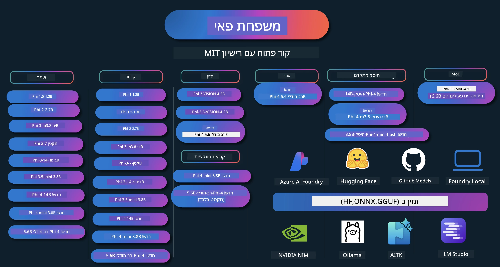

# ספר בישול Phi: דוגמאות מעשיות עם דגמי Phi של מיקרוסופט

[](https://codespaces.new/microsoft/phicookbook)
[](https://vscode.dev/redirect?url=vscode://ms-vscode-remote.remote-containers/cloneInVolume?url=https://github.com/microsoft/phicookbook)

[](https://GitHub.com/microsoft/phicookbook/graphs/contributors/?WT.mc_id=aiml-137032-kinfeylo)
[](https://GitHub.com/microsoft/phicookbook/issues/?WT.mc_id=aiml-137032-kinfeylo)
[](https://GitHub.com/microsoft/phicookbook/pulls/?WT.mc_id=aiml-137032-kinfeylo)
[](http://makeapullrequest.com?WT.mc_id=aiml-137032-kinfeylo)

[](https://GitHub.com/microsoft/phicookbook/watchers/?WT.mc_id=aiml-137032-kinfeylo)
[](https://GitHub.com/microsoft/phicookbook/network/?WT.mc_id=aiml-137032-kinfeylo)
[](https://GitHub.com/microsoft/phicookbook/stargazers/?WT.mc_id=aiml-137032-kinfeylo)

[](https://discord.com/invite/ByRwuEEgH4)

Phi היא סדרה של דגמי בינה מלאכותית בקוד פתוח שפותחה על ידי מיקרוסופט.

Phi כיום הוא הדגם הקטן ביותר בעל הביצועים הטובים ביותר והעלות-תועלת הגבוהה ביותר (SLM), עם מדדים טובים מאוד בשפות מרובות, היגיון, יצירת טקסט/שיחה, קידוד, תמונות, שמע ותסריטים נוספים.

ניתן לפרוס את Phi בענן או במכשירים קצה, וניתן לבנות יישומים מגנרטיביים של AI בקלות עם כוח חישוב מוגבל.

עקבו אחר הצעדים הבאים כדי להתחיל להשתמש במשאבים אלה:
1. **צור מזלג לרפוזיטורי**: לחץ על [](https://GitHub.com/microsoft/phicookbook/network/?WT.mc_id=aiml-137032-kinfeylo)
2. **שכפל את הרפוזיטורי**:   `git clone https://github.com/microsoft/PhiCookBook.git`
3. [**הצטרף לקהילת Discord של Microsoft AI ופגוש מומחים ומפתחים נוספים**](https://discord.com/invite/ByRwuEEgH4?WT.mc_id=aiml-137032-kinfeylo)



### 🌐 תמיכה ברב-לשוניות

#### נתמך באמצעות GitHub Action (ממוכן ותמיד מעודכן)

<!-- CO-OP TRANSLATOR LANGUAGES TABLE START -->
[ערבית](../ar/README.md) | [בנגלית](../bn/README.md) | [בולגרית](../bg/README.md) | [בורמזית (מיאנמר)](../my/README.md) | [סינית (מפושט)](../zh-CN/README.md) | [סינית (מסורתית, הונג קונג)](../zh-HK/README.md) | [סינית (מסורתית, מקאו)](../zh-MO/README.md) | [סינית (מסורתית, טאיוואן)](../zh-TW/README.md) | [קרואטית](../hr/README.md) | [צ'כית](../cs/README.md) | [דנית](../da/README.md) | [הולנדית](../nl/README.md) | [אסטונית](../et/README.md) | [פינית](../fi/README.md) | [צרפתית](../fr/README.md) | [גרמנית](../de/README.md) | [יוונית](../el/README.md) | [עברית](./README.md) | [הינדי](../hi/README.md) | [הונגרית](../hu/README.md) | [אינדונזית](../id/README.md) | [איטלקית](../it/README.md) | [יפנית](../ja/README.md) | [קאנדה](../kn/README.md) | [קוריאנית](../ko/README.md) | [ליטאית](../lt/README.md) | [מלאית](../ms/README.md) | [מאליאלאם](../ml/README.md) | [מרטהי](../mr/README.md) | [נפאלית](../ne/README.md) | [פידגין ניגרי](../pcm/README.md) | [נורווגית](../no/README.md) | [פרסית (פרסי)](../fa/README.md) | [פולנית](../pl/README.md) | [פורטוגזית (ברזיל)](../pt-BR/README.md) | [פורטוגזית (פורטוגל)](../pt-PT/README.md) | [פונג'אבית (גורמוכי)](../pa/README.md) | [רומנית](../ro/README.md) | [רוסית](../ru/README.md) | [סרבית (קירילית)](../sr/README.md) | [סלובקית](../sk/README.md) | [סלובנית](../sl/README.md) | [ספרדית](../es/README.md) | [סווהילי](../sw/README.md) | [שבדית](../sv/README.md) | [טגלוג (פיליפינית)](../tl/README.md) | [טמילית](../ta/README.md) | [טלווגו](../te/README.md) | [תאית](../th/README.md) | [טורקית](../tr/README.md) | [אוקראינית](../uk/README.md) | [אורדו](../ur/README.md) | [וייטנמית](../vi/README.md)

> **מעדיף לשכפל באופן מקומי?**
>
> מאגר זה כולל מעל 50 תרגומים לשפות שונות, מה שמגדיל משמעותית את גודל ההורדה. כדי לשכפל בלי תרגומים, השתמש ב-sparse checkout:
>
> **Bash / macOS / Linux:**
> ```bash
> git clone --filter=blob:none --sparse https://github.com/microsoft/PhiCookBook.git
> cd PhiCookBook
> git sparse-checkout set --no-cone '/*' '!translations' '!translated_images'
> ```
>
> **CMD (Windows):**
> ```cmd
> git clone --filter=blob:none --sparse https://github.com/microsoft/PhiCookBook.git
> cd PhiCookBook
> git sparse-checkout set --no-cone "/*" "!translations" "!translated_images"
> ```
>
> זה נותן לך כל מה שאתה צריך כדי להשלים את הקורס עם הורדה הרבה יותר מהירה.
<!-- CO-OP TRANSLATOR LANGUAGES TABLE END -->

## תוכן העניינים

- מבוא
  - [ברוכים הבאים למשפחת Phi](./md/01.Introduction/01/01.PhiFamily.md)
  - [הגדרת סביבת העבודה שלך](./md/01.Introduction/01/01.EnvironmentSetup.md)
  - [הבנת טכנולוגיות מפתח](./md/01.Introduction/01/01.Understandingtech.md)
  - [בטיחות בינה מלאכותית לדגמי Phi](./md/01.Introduction/01/01.AISafety.md)
  - [תמיכת חומרה ל-Phi](./md/01.Introduction/01/01.Hardwaresupport.md)
  - [דגמי Phi וזמינות בפלטפורמות שונות](./md/01.Introduction/01/01.Edgeandcloud.md)
  - [שימוש ב-Guidance-ai ו-Phi](./md/01.Introduction/01/01.Guidance.md)
  - [דגמי GitHub Marketplace](https://github.com/marketplace/models)
  - [קטלוג דגמים של Azure AI](https://ai.azure.com)

- אינפרנס Phi בסביבות שונות
    -  [Hugging face](./md/01.Introduction/02/01.HF.md)
    -  [דגמי GitHub](./md/01.Introduction/02/02.GitHubModel.md)
    -  [קטלוג דגמים של Microsoft Foundry](./md/01.Introduction/02/03.AzureAIFoundry.md)
    -  [Ollama](./md/01.Introduction/02/04.Ollama.md)
    -  [AI Toolkit VSCode (AITK)](./md/01.Introduction/02/05.AITK.md)
    -  [NVIDIA NIM](./md/01.Introduction/02/06.NVIDIA.md)
    -  [Foundry Local](./md/01.Introduction/02/07.FoundryLocal.md)

- אינפרנס ממשפחת Phi
    - [Inference Phi ב-iOS](./md/01.Introduction/03/iOS_Inference.md)
    - [Inference Phi באנדרואיד](./md/01.Introduction/03/Android_Inference.md)
    - [Inference Phi ב-Jetson](./md/01.Introduction/03/Jetson_Inference.md)
    - [Inference Phi במחשב AI](./md/01.Introduction/03/AIPC_Inference.md)
    - [Inference Phi עם מסגרת Apple MLX](./md/01.Introduction/03/MLX_Inference.md)
    - [Inference Phi בשרת מקומי](./md/01.Introduction/03/Local_Server_Inference.md)
    - [Inference Phi בשרת מרוחק בשימוש AI Toolkit](./md/01.Introduction/03/Remote_Interence.md)
    - [Inference Phi עם Rust](./md/01.Introduction/03/Rust_Inference.md)
    - [Inference Phi--Vision במחשב מקומי](./md/01.Introduction/03/Vision_Inference.md)
    - [Inference Phi עם Kaito AKS, Azure Containers (תמיכה רשמית)](./md/01.Introduction/03/Kaito_Inference.md)
-  [כימות משפחת Phi](./md/01.Introduction/04/QuantifyingPhi.md)
    - [כימות Phi-3.5 / 4 באמצעות llama.cpp](./md/01.Introduction/04/UsingLlamacppQuantifyingPhi.md)
    - [כימות Phi-3.5 / 4 באמצעות הרחבות AI גנרטיביות עבור onnxruntime](./md/01.Introduction/04/UsingORTGenAIQuantifyingPhi.md)
    - [כימות Phi-3.5 / 4 באמצעות Intel OpenVINO](./md/01.Introduction/04/UsingIntelOpenVINOQuantifyingPhi.md)
    - [כימות Phi-3.5 / 4 באמצעות מסגרת Apple MLX](./md/01.Introduction/04/UsingAppleMLXQuantifyingPhi.md)

-  הערכת Phi
    - [AI אחראי](./md/01.Introduction/05/ResponsibleAI.md)
    - [Microsoft Foundry להערכה](./md/01.Introduction/05/AIFoundry.md)
    - [שימוש ב-Promptflow להערכה](./md/01.Introduction/05/Promptflow.md)

- RAG עם חיפוש Azure AI
    - [כיצד להשתמש ב-Phi-4-mini ו-Phi-4-multimodal (RAG) עם חיפוש Azure AI](https://github.com/microsoft/PhiCookBook/blob/main/code/06.E2E/E2E_Phi-4-RAG-Azure-AI-Search.ipynb)

- דוגמאות לפיתוח יישומי Phi
  - יישומי טקסט ושיחה
    - דוגמאות Phi-4 🆕
      - [📓] [שיחה עם דגם Phi-4-mini ONNX](./md/02.Application/01.TextAndChat/Phi4/ChatWithPhi4ONNX/README.md)
      - [שיחה עם דגם מקומי Phi-4 ONNX .NET](../../md/04.HOL/dotnet/src/LabsPhi4-Chat-01OnnxRuntime)
      - [אפליקציית שיחה קונסול .NET עם Phi-4 ONNX באמצעות Semantic Kernel](../../md/04.HOL/dotnet/src/LabsPhi4-Chat-02SK)
    - דוגמאות Phi-3 / 3.5
      - [צ'אט בוט מקומי בדפדפן באמצעות Phi3, ONNX Runtime Web ו-WebGPU](https://github.com/microsoft/onnxruntime-inference-examples/tree/main/js/chat)
      - [שיחת OpenVino](./md/02.Application/01.TextAndChat/Phi3/E2E_OpenVino_Chat.md)
      - [רב דגם - אינטראקטיבי Phi-3-mini ו-OpenAI Whisper](./md/02.Application/01.TextAndChat/Phi3/E2E_Phi-3-mini_with_whisper.md)
      - [MLFlow - בניית עטיפה ושימוש ב-Phi-3 עם MLFlow](./md//02.Application/01.TextAndChat/Phi3/E2E_Phi-3-MLflow.md)
      - [אופטימיזציית דגם - כיצד לאופטימיז את דגם Phi-3-min עבור ONNX Runtime Web עם Olive](https://github.com/microsoft/Olive/tree/main/examples/phi3)
      - [אפליקציית WinUI3 עם Phi-3 mini-4k-instruct-onnx](https://github.com/microsoft/Phi3-Chat-WinUI3-Sample/)
      -[אפליקציית דוגמא לרשימות מופעלות בינה מלאכותית רב-דגם WinUI3](https://github.com/microsoft/ai-powered-notes-winui3-sample)
      - [כיוונון עדין ושילוב דגמי Phi-3 מותאמים עם זרימת פרומט](./md/02.Application/01.TextAndChat/Phi3/E2E_Phi-3-FineTuning_PromptFlow_Integration.md)
      - [כיוונון עדין ושילוב דגמי Phi-3 מותאמים עם זרימת פרומט ב-Microsoft Foundry](./md/02.Application/01.TextAndChat/Phi3/E2E_Phi-3-FineTuning_PromptFlow_Integration_AIFoundry.md)
      - [הערכת דגם Phi-3 / Phi-3.5 מכוונן עדין ב-Microsoft Foundry תוך התמקדות בעקרונות ה-AI האחראי של מיקרוסופט](./md/02.Application/01.TextAndChat/Phi3/E2E_Phi-3-Evaluation_AIFoundry.md)
      - [📓] [דוגמת חיזוי שפה Phi-3.5-mini-instruct (סינית/אנגלית)](./md/02.Application/01.TextAndChat/Phi3/phi3-instruct-demo.ipynb)
      - [Phi-3.5-Instruct WebGPU RAG Chatbot](./md/02.Application/01.TextAndChat/Phi3/WebGPUWithPhi35Readme.md)
      - [שימוש ב-GPU של Windows ליצירת פתרון זרימת פרומט עם Phi-3.5-Instruct ONNX](./md/02.Application/01.TextAndChat/Phi3/UsingPromptFlowWithONNX.md)
      - [שימוש ב-Microsoft Phi-3.5 tflite ליצירת אפליקציית אנדרואיד](./md/02.Application/01.TextAndChat/Phi3/UsingPhi35TFLiteCreateAndroidApp.md)
      - [דוגמת שאלות ותשובות .NET המשתמשת בדגם ONNX מקומי של Phi-3 באמצעות Microsoft.ML.OnnxRuntime](../../md/04.HOL/dotnet/src/LabsPhi301)
      - [אפליקציית שיחת קונסולה .NET עם Semantic Kernel ו-Phi-3](../../md/04.HOL/dotnet/src/LabsPhi302)

  - דוגמאות המבוססות על קוד SDK של Azure AI Inference  
    - דוגמאות Phi-4 🆕  
      - [📓] [יצירת קוד פרויקט באמצעות Phi-4-multimodal](./md/02.Application/02.Code/Phi4/GenProjectCode/README.md)
    - דוגמאות Phi-3 / 3.5  
      - [בניית שיחת GitHub Copilot משלך ב-Visual Studio Code עם משפחת Microsoft Phi-3](./md/02.Application/02.Code/Phi3/VSCodeExt/README.md)
      - [יצירת סוכן שיחת Visual Studio Code משלך עם Phi-3.5 על ידי דגמי GitHub](/md/02.Application/02.Code/Phi3/CreateVSCodeChatAgentWithGitHubModels.md)

  - דוגמאות הסקה מתקדמות  
    - דוגמאות Phi-4 🆕  
      - [📓] [דוגמאות יסוד למחשבה מתקדמת Phi-4-mini או Phi-4](./md/02.Application/03.AdvancedReasoning/Phi4/AdvancedResoningPhi4mini/README.md)
      - [📓] [כיוונון עדין של Phi-4-mini-reasoning עם Microsoft Olive](./md/02.Application/03.AdvancedReasoning/Phi4/AdvancedResoningPhi4mini/olive_ft_phi_4_reasoning_with_medicaldata.ipynb)
      - [📓] [כיוונון עדין של Phi-4-mini-reasoning עם Apple MLX](./md/02.Application/03.AdvancedReasoning/Phi4/AdvancedResoningPhi4mini/mlx_ft_phi_4_reasoning_with_medicaldata.ipynb)
      - [📓] [Phi-4-mini-reasoning עם דגמי GitHub](./md/02.Application/02.Code/Phi4r/github_models_inference.ipynb)
      - [📓] [Phi-4-mini-reasoning עם דגמי Microsoft Foundry](./md/02.Application/02.Code/Phi4r/azure_models_inference.ipynb)
  - הדגמות  
      - [דמו של Phi-4-mini מארחות ב-Hugging Face Spaces](https://huggingface.co/spaces/microsoft/phi-4-mini?WT.mc_id=aiml-137032-kinfeylo)
      - [דמו של Phi-4-multimodal מארחות ב-Hugging Face Spaces](https://huggingface.co/spaces/microsoft/phi-4-multimodal?WT.mc_id=aiml-137032-kinfeylo)
  - דוגמאות ראייה  
    - דוגמאות Phi-4 🆕  
      - [📓] [שימוש ב-Phi-4-multimodal לקריאת תמונות ויצירת קוד](./md/02.Application/04.Vision/Phi4/CreateFrontend/README.md) 
    - דוגמאות Phi-3 / 3.5  
      -  [📓][Phi-3-vision-Image טקסט לתמונה טקסט](./md/02.Application/04.Vision/Phi3/E2E_Phi-3-vision-image-text-to-text-online-endpoint.ipynb)
      - [Phi-3-vision-ONNX](https://onnxruntime.ai/docs/genai/tutorials/phi3-v.html)
      - [📓][Phi-3-vision CLIP Embedding](./md/02.Application/04.Vision/Phi3/E2E_Phi-3-vision-image-text-to-text-online-endpoint.ipynb)
      - [הדגמה: מחזור Phi-3](https://github.com/jennifermarsman/PhiRecycling/)
      - [עוזר שפה חזותית Phi-3-vision - עם Phi3-Vision ו-OpenVINO](https://docs.openvino.ai/nightly/notebooks/phi-3-vision-with-output.html)
      - [Phi-3 ראיה Nvidia NIM](./md/02.Application/04.Vision/Phi3/E2E_Nvidia_NIM_Vision.md)
      - [Phi-3 ראיה OpenVino](./md/02.Application/04.Vision/Phi3/E2E_OpenVino_Phi3Vision.md)
      - [📓][דוגמת Phi-3.5 ראיה רב-מסגרת או רב-תמונה](./md/02.Application/04.Vision/Phi3/phi3-vision-demo.ipynb)
      - [דגם ONNX מקומי של Phi-3 Vision באמצעות Microsoft.ML.OnnxRuntime .NET](../../md/04.HOL/dotnet/src/LabsPhi303)
      - [דגם ONNX מקומי מבוסס תפריט של Phi-3 Vision באמצעות Microsoft.ML.OnnxRuntime .NET](../../md/04.HOL/dotnet/src/LabsPhi304)

  - דוגמאות מתמטיקה  
    - דוגמאות Phi-4-Mini-Flash-Reasoning-Instruct 🆕 [הדגמת מתמטיקה עם Phi-4-Mini-Flash-Reasoning-Instruct](./md/02.Application/09.Math/MathDemo.ipynb)

  - דוגמאות שמע  
    - דוגמאות Phi-4 🆕  
      - [📓] [חלץ תמלילים של שמע באמצעות Phi-4-multimodal](./md/02.Application/05.Audio/Phi4/Transciption/README.md)
      - [📓] [דוגמת שמע Phi-4-multimodal](./md/02.Application/05.Audio/Phi4/Siri/demo.ipynb)
      - [📓] [דוגמת תרגום דיבור Phi-4-multimodal](./md/02.Application/05.Audio/Phi4/Translate/demo.ipynb)
      - [אפליקציית קונסולה .NET המשתמשת ב-Phi-4-multimodal שמע לניתוח קובץ שמע ויצירת תמליל](../../md/04.HOL/dotnet/src/LabsPhi4-MultiModal-02Audio)

  - דוגמאות MOE  
    - דוגמאות Phi-3 / 3.5  
      - [📓] [דוגמת דגמי תערובת מומחים Phi-3.5 (MoEs) ברשתות חברתיות](./md/02.Application/06.MoE/Phi3/phi3_moe_demo.ipynb)
      - [📓] [בניית צינור יצירת תוכן מוגבר Retrieval-Augmented Generation (RAG) עם NVIDIA NIM Phi-3 MOE, Azure AI Search ו-LlamaIndex](./md/02.Application/06.MoE/Phi3/azure-ai-search-nvidia-rag.ipynb)
      - 
  - דוגמאות קריאת פונקציות  
    - דוגמאות Phi-4 🆕  
      -  [📓] [שימוש בקריאת פונקציות עם Phi-4-mini](./md/02.Application/07.FunctionCalling/Phi4/FunctionCallingBasic/README.md)
      -  [📓] [שימוש בקריאת פונקציות ליצירת סוכנים מרובים עם Phi-4-mini](./md/02.Application/07.FunctionCalling/Phi4/Multiagents/Phi_4_mini_multiagent.ipynb)
      -  [📓] [שימוש בקריאת פונקציות עם Ollama](./md/02.Application/07.FunctionCalling/Phi4/Ollama/ollama_functioncalling.ipynb)
      -  [📓] [שימוש בקריאת פונקציות עם ONNX](./md/02.Application/07.FunctionCalling/Phi4/ONNX/onnx_parallel_functioncalling.ipynb)
  - דוגמאות מיקס רב-מודאלי  
    - דוגמאות Phi-4 🆕  
      -  [📓] [שימוש ב-Phi-4-multimodal כעיתונאי טכנולוגיה](./md/02.Application/08.Multimodel/Phi4/TechJournalist/phi_4_mm_audio_text_publish_news.ipynb)
      - [אפליקציית קונסולה .NET המשתמשת ב-Phi-4-multimodal לניתוח תמונות](../../md/04.HOL/dotnet/src/LabsPhi4-MultiModal-01Images)

- כיוונון עדין לדגמי Phi  
  - [תרחישי כיוונון עדין](./md/03.FineTuning/FineTuning_Scenarios.md)
  - [כיוונון עדין לעומת RAG](./md/03.FineTuning/FineTuning_vs_RAG.md)
  - [כיוונון עדין - הפוך את Phi-3 למומחה תעשייה](./md/03.FineTuning/LetPhi3gotoIndustriy.md)
  - [כיוונון עדין של Phi-3 עם ערכת כלים AI עבור VS Code](./md/03.FineTuning/Finetuning_VSCodeaitoolkit.md)
  - [כיוונון עדין של Phi-3 עם שירות Azure Machine Learning](./md/03.FineTuning/Introduce_AzureML.md)
  - [כיוונון עדין של Phi-3 עם לורה](./md/03.FineTuning/FineTuning_Lora.md)
  - [כיוונון עדין של Phi-3 עם QLora](./md/03.FineTuning/FineTuning_Qlora.md)
  - [כיוונון עדין של Phi-3 עם Microsoft Foundry](./md/03.FineTuning/FineTuning_AIFoundry.md)
  - [כיוונון עדין של Phi-3 עם Azure ML CLI/SDK](./md/03.FineTuning/FineTuning_MLSDK.md)
  - [כיוונון עדין עם Microsoft Olive](./md/03.FineTuning/FineTuning_MicrosoftOlive.md)
  - [כיוונון עדין עם המעבדה המעשית Microsoft Olive](./md/03.FineTuning/olive-lab/readme.md)
  - [כיוונון עדין של Phi-3-vision עם Weights and Bias](./md/03.FineTuning/FineTuning_Phi-3-visionWandB.md)
  - [כיוונון עדין של Phi-3 עם מסגרת Apple MLX](./md/03.FineTuning/FineTuning_MLX.md)
  - [כיוונון עדין של Phi-3-vision (תמיכה רשמית)](./md/03.FineTuning/FineTuning_Vision.md)
  - [כיוונון עדין של Phi-3 עם Kaito AKS, מכולות Azure (תמיכה רשמית)](./md/03.FineTuning/FineTuning_Kaito.md)
  - [כיוונון עדין של Phi-3 ו-Phi-3.5 Vision](https://github.com/2U1/Phi3-Vision-Finetune)

- מעבדה מעשית  
  - [חקירת דגמים מתקדמים: LLMs, SLMs, פיתוח מקומי ועוד](https://github.com/microsoft/aitour-exploring-cutting-edge-models)
  - [שחרור הפוטנציאל של NLP: כיוונון עדין עם Microsoft Olive](https://github.com/azure/Ignite_FineTuning_workshop)
- מאמרי מחקר אקדמיים ופרסומים  
  - [Textbooks Are All You Need II: phi-1.5 technical report](https://arxiv.org/abs/2309.05463)  
  - [Phi-3 Technical Report: A Highly Capable Language Model Locally on Your Phone](https://arxiv.org/abs/2404.14219)  
  - [Phi-4 Technical Report](https://arxiv.org/abs/2412.08905)  
  - [Phi-4-Mini Technical Report: Compact yet Powerful Multimodal Language Models via Mixture-of-LoRAs](https://arxiv.org/abs/2503.01743)  
  - [Optimizing Small Language Models for In-Vehicle Function-Calling](https://arxiv.org/abs/2501.02342)  
  - [(WhyPHI) Fine-Tuning PHI-3 for Multiple-Choice Question Answering: Methodology, Results, and Challenges](https://arxiv.org/abs/2501.01588)  
  - [Phi-4-reasoning Technical Report](https://www.microsoft.com/en-us/research/wp-content/uploads/2025/04/phi_4_reasoning.pdf)  
  - [Phi-4-mini-reasoning Technical Report](https://huggingface.co/microsoft/Phi-4-mini-reasoning/blob/main/Phi-4-Mini-Reasoning.pdf)  

## שימוש במודלים של Phi

### Phi ב-Microsoft Foundry

אתם יכולים ללמוד כיצד להשתמש ב-Microsoft Phi ואיך לבנות פתרונות מקצה לקצה במכשירים שונים שלכם. כדי להתנסות ב-Phi בעצמכם, התחילו לשחק עם המודלים ולהתאים את Phi לתרחישים שלכם באמצעות קטלוג המודלים של [Microsoft Foundry Azure AI Model Catalog](https://aka.ms/phi3-azure-ai). ניתן ללמוד עוד ב-Getting Started עם [Microsoft Foundry](/md/02.QuickStart/AzureAIFoundry_QuickStart.md)

**Playground**  
לכל מודל יש playground ייעודי לבחינת המודל ב-[Azure AI Playground](https://aka.ms/try-phi3).

### Phi במודלים ב-GitHub

אתם יכולים ללמוד איך להשתמש ב-Microsoft Phi ואיך לבנות פתרונות מקצה לקצה במכשירים שונים שלכם. כדי להתנסות ב-Phi בעצמכם, התחילו לשחק עם המודל ולהתאים את Phi לתרחישים שלכם באמצעות קטלוג המודלים ב-[GitHub Model Catalog](https://github.com/marketplace/models?WT.mc_id=aiml-137032-kinfeylo). ניתן ללמוד עוד ב-Getting Started עם [GitHub Model Catalog](/md/02.QuickStart/GitHubModel_QuickStart.md)

**Playground**  
לכל מודל יש [playground ייעודי לבחינת המודל](/md/02.QuickStart/GitHubModel_QuickStart.md).

### Phi ב-Hugging Face

ניתן גם למצוא את המודל ב-[Hugging Face](https://huggingface.co/microsoft)

**Playground**  
[Hugging Chat playground](https://huggingface.co/chat/models/microsoft/Phi-3-mini-4k-instruct)

## 🎒 קורסים נוספים

הצוות שלנו מפיק קורסים נוספים! בדקו:

<!-- CO-OP TRANSLATOR OTHER COURSES START -->
### LangChain  
[](https://aka.ms/langchain4j-for-beginners)  
[](https://aka.ms/langchainjs-for-beginners?WT.mc_id=m365-94501-dwahlin)  
[](https://github.com/microsoft/langchain-for-beginners?WT.mc_id=m365-94501-dwahlin)  
---

### Azure / Edge / MCP / Agents  
[](https://github.com/microsoft/AZD-for-beginners?WT.mc_id=academic-105485-koreyst)  
[](https://github.com/microsoft/edgeai-for-beginners?WT.mc_id=academic-105485-koreyst)  
[](https://github.com/microsoft/mcp-for-beginners?WT.mc_id=academic-105485-koreyst)  
[](https://github.com/microsoft/ai-agents-for-beginners?WT.mc_id=academic-105485-koreyst)  

---

### סדרת AI גנרטיבי  
[](https://github.com/microsoft/generative-ai-for-beginners?WT.mc_id=academic-105485-koreyst)  
[-9333EA?style=for-the-badge&labelColor=E5E7EB&color=9333EA)](https://github.com/microsoft/Generative-AI-for-beginners-dotnet?WT.mc_id=academic-105485-koreyst)  
[-C084FC?style=for-the-badge&labelColor=E5E7EB&color=C084FC)](https://github.com/microsoft/generative-ai-for-beginners-java?WT.mc_id=academic-105485-koreyst)  
[-E879F9?style=for-the-badge&labelColor=E5E7EB&color=E879F9)](https://github.com/microsoft/generative-ai-with-javascript?WT.mc_id=academic-105485-koreyst)  

---

### למידה בסיסית  
[](https://aka.ms/ml-beginners?WT.mc_id=academic-105485-koreyst)  
[](https://aka.ms/datascience-beginners?WT.mc_id=academic-105485-koreyst)  
[](https://aka.ms/ai-beginners?WT.mc_id=academic-105485-koreyst)  
[](https://github.com/microsoft/Security-101?WT.mc_id=academic-96948-sayoung)  
[](https://aka.ms/webdev-beginners?WT.mc_id=academic-105485-koreyst)  
[](https://aka.ms/iot-beginners?WT.mc_id=academic-105485-koreyst)  
[](https://github.com/microsoft/xr-development-for-beginners?WT.mc_id=academic-105485-koreyst)  

---

### סדרת Copilot  
[](https://aka.ms/GitHubCopilotAI?WT.mc_id=academic-105485-koreyst)  
[](https://github.com/microsoft/mastering-github-copilot-for-dotnet-csharp-developers?WT.mc_id=academic-105485-koreyst)  
[](https://github.com/microsoft/CopilotAdventures?WT.mc_id=academic-105485-koreyst)  
<!-- CO-OP TRANSLATOR OTHER COURSES END -->

## AI אחראי

מייקרוסופט מחויבת לסייע ללקוחותיה להשתמש במוצרי ה-AI שלנו באחריות, לשתף את התובנות שלנו ולבנות שותפויות מבוססות אמון באמצעות כלים כמו הערות שקיפות והערכות השפעה. משאבים רבים ניתן למצוא ב-[https://aka.ms/RAI](https://aka.ms/RAI).  
הגישה של מייקרוסופט ל-AI אחראי מבוססת על עקרונות ה-AI שלנו: הוגנות, אמינות ובטיחות, פרטיות ואבטחה, כלילתנות, שקיפות ואחריותיות.

מודלים נרחבים של שפה טבעית, תמונה ודיבור - כמו אלה שבדוגמה זו - עלולים לפעול באופן לא הוגן, לא אמין או פוגעני, ולגרום נזקים. נא להתייעץ עם [הערת השקיפות של שירות Azure OpenAI](https://learn.microsoft.com/legal/cognitive-services/openai/transparency-note?tabs=text) כדי להיות מודעים לסיכונים ומגבלות.

הגישה המומלצת למזעור סיכונים אלה היא לכלול מערכת בטיחות בארכיטקטורה שלכם שיכולה לזהות ולמנוע התנהגות מזיקה. [Azure AI Content Safety](https://learn.microsoft.com/azure/ai-services/content-safety/overview) מספק שכבת הגנה עצמאית, המסוגלת לזהות תכנים מזיקים שנוצרים על ידי משתמשים או ב-AI באפליקציות ושירותים. שירות Content Safety של Azure AI כולל APIs לטקסט ותמונה המאפשרים לזהות חומר מזיק. בתוך Microsoft Foundry, שירות Content Safety מאפשר לכם לצפות, לחקור ולנסות דוגמאות קוד לזיהוי תכנים מזיקים במודאליות שונות. התיעוד הבא של [הדרכה מהירה](https://learn.microsoft.com/azure/ai-services/content-safety/quickstart-text?tabs=visual-studio%2Clinux&pivots=programming-language-rest) ינחה אתכם כיצד לבצע בקשות לשירות.
היבט נוסף שיש לקחת בחשבון הוא ביצועי האפליקציה הכוללים. עם אפליקציות מולטי-מודל ומולטי-מודלים, אנו מתייחסים לביצועים כמשמעות שהמערכת מתפקדת כפי שאתה והמשתמשים שלך מצפים, כולל אי-יצירת פלטים מזיקים. חשוב להעריך את ביצועי האפליקציה הכוללת שלך באמצעות [Performance and Quality and Risk and Safety evaluators](https://learn.microsoft.com/azure/ai-studio/concepts/evaluation-metrics-built-in). יש לך גם את האפשרות ליצור ולהעריך עם [custom evaluators](https://learn.microsoft.com/azure/ai-studio/how-to/develop/evaluate-sdk#custom-evaluators).

אתה יכול להעריך את אפליקציית ה-AI שלך בסביבת הפיתוח שלך באמצעות [Azure AI Evaluation SDK](https://microsoft.github.io/promptflow/index.html). בהתחשב במאגר נתונים לבחינה או מטרה, יצירות האיי-איי הגנרטיביות שלך נמדדות כמותית עם מעריכי ביצועים מובנים או מעריכי ביצועים מותאמים לבחירתך. כדי להתחיל עם azure ai evaluation sdk להערכת המערכת שלך, אתה יכול לעקוב אחר [quickstart guide](https://learn.microsoft.com/azure/ai-studio/how-to/develop/flow-evaluate-sdk). לאחר שתבצע ריצת הערכה, תוכל [visualize the results in Microsoft Foundry](https://learn.microsoft.com/azure/ai-studio/how-to/evaluate-flow-results).

## סימני מסחר

פרויקט זה עשוי להכיל סימני מסחר או לוגואים של פרויקטים, מוצרים או שירותים. שימוש מורשה בסימני מסחר או לוגואים של מיקרוסופט כפוף וצריך לעמוד ב[Microsoft's Trademark & Brand Guidelines](https://www.microsoft.com/legal/intellectualproperty/trademarks/usage/general). שימוש בסימני מסחר או לוגואים של מיקרוסופט בגרסאות ששונו של פרויקט זה לא אמור לגרום לבלבול או לרמוז על חסות של מיקרוסופט. כל שימוש בסימני מסחר או לוגואים של צד שלישי כפוף למדיניות של אותם צדדים שלישיים.

## קבלת עזרה

אם נתקעת או יש לך שאלות לגבי בניית יישומי AI, הצטרף ל:

[](https://aka.ms/foundry/discord)

אם יש לך משוב על מוצר או שגיאות במהלך הבנייה, בקר ב:

[](https://aka.ms/foundry/forum)

---

<!-- CO-OP TRANSLATOR DISCLAIMER START -->
**כתב ויתור**:  
מסמך זה תורגם באמצעות שירות תרגום מבוסס בינה מלאכותית [Co-op Translator](https://github.com/Azure/co-op-translator). למרות שאנו שואפים לדיוק, יש לקחת בחשבון כי תרגומים אוטומטיים עשויים להכיל טעויות או אי דיוקים. המסמך המקורי בשפת המקור נחשב כמקור המוסמך. למידע קריטי מומלץ להשתמש בתרגום מקצועי על ידי אדם. אנו לא אחראים להבדלים, אי הבנות או פרשנויות שגויות הנובעים משימוש בתרגום זה.
<!-- CO-OP TRANSLATOR DISCLAIMER END -->