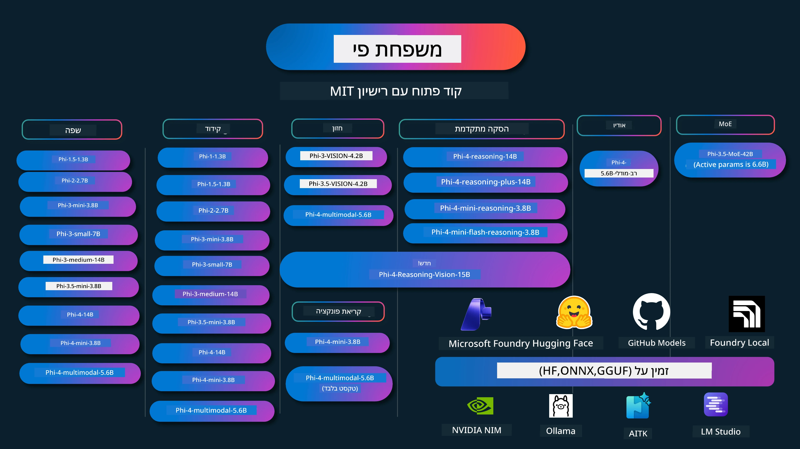

# ספר המתכונים Phi: דוגמאות מעשיות עם דגמי Phi של מיקרוסופט

[](https://codespaces.new/microsoft/phicookbook)
[](https://vscode.dev/redirect?url=vscode://ms-vscode-remote.remote-containers/cloneInVolume?url=https://github.com/microsoft/phicookbook)

[](https://GitHub.com/microsoft/phicookbook/graphs/contributors/?WT.mc_id=aiml-137032-kinfeylo)
[](https://GitHub.com/microsoft/phicookbook/issues/?WT.mc_id=aiml-137032-kinfeylo)
[](https://GitHub.com/microsoft/phicookbook/pulls/?WT.mc_id=aiml-137032-kinfeylo)
[](http://makeapullrequest.com?WT.mc_id=aiml-137032-kinfeylo)

[](https://GitHub.com/microsoft/phicookbook/watchers/?WT.mc_id=aiml-137032-kinfeylo)
[](https://GitHub.com/microsoft/phicookbook/network/?WT.mc_id=aiml-137032-kinfeylo)
[](https://GitHub.com/microsoft/phicookbook/stargazers/?WT.mc_id=aiml-137032-kinfeylo)

[](https://discord.com/invite/ByRwuEEgH4)

Phi היא סדרת דגמי בינה מלאכותית בקוד פתוח שפותחה על ידי מיקרוסופט.

Phi היא כיום דגם שפה קטן (SLM) החזק והיעיל ביותר מבחינת עלות, עם ביצועים מאוד טובים במבחנים בשפות מרובות, היסקות, יצירת טקסט/צ'אט, קידוד, תמונות, שמע ותסריטים נוספים.

ניתן לפרוס את Phi בענן או במכשירי קצה, וניתן בקלות לבנות יישומי בינה מלאכותית יצירתית עם יכולת חישוב מוגבלת.

עקבו אחר הצעדים הללו כדי להתחיל להשתמש במשאבים אלו:
1. **פצלו את המאגר**: לחצו על [](https://GitHub.com/microsoft/phicookbook/network/?WT.mc_id=aiml-137032-kinfeylo)
2. **שכפלו את המאגר**: `git clone https://github.com/microsoft/PhiCookBook.git`
3. [**הצטרפו לקהילת Discord של מיקרוסופט AI ופגשו מומחים ומפתחים נוספים**](https://discord.com/invite/ByRwuEEgH4?WT.mc_id=aiml-137032-kinfeylo)



### 🌐 תמיכה בריבוי שפות

#### נתמך באמצעות פעולה ב-GitHub (מאוד עדכני ואוטומטי)

<!-- CO-OP TRANSLATOR LANGUAGES TABLE START -->
[ערבית](../ar/README.md) | [בנגלית](../bn/README.md) | [בולגרית](../bg/README.md) | [בורמזית (מיאנמר)](../my/README.md) | [סינית (מפושטת)](../zh-CN/README.md) | [סינית (מסורתית, הונג קונג)](../zh-HK/README.md) | [סינית (מסורתית, מאקאו)](../zh-MO/README.md) | [סינית (מסורתית, טייוואן)](../zh-TW/README.md) | [קרואטית](../hr/README.md) | [צ'כית](../cs/README.md) | [דנית](../da/README.md) | [הולנדית](../nl/README.md) | [אסטונית](../et/README.md) | [פינית](../fi/README.md) | [צרפתית](../fr/README.md) | [גרמנית](../de/README.md) | [יוונית](../el/README.md) | [עברית](./README.md) | [הודית (הינדית)](../hi/README.md) | [הונגרית](../hu/README.md) | [אינדונזית](../id/README.md) | [איטלקית](../it/README.md) | [יפנית](../ja/README.md) | [קנדה](../kn/README.md) | [חמרית](../km/README.md) | [קוריאנית](../ko/README.md) | [ליטאית](../lt/README.md) | [מלאית](../ms/README.md) | [מלאיאלאם](../ml/README.md) | [מרטהית](../mr/README.md) | [נפאלית](../ne/README.md) | [פידג'ין ניגרי](../pcm/README.md) | [נורווגית](../no/README.md) | [פרסית (פארסי)](../fa/README.md) | [פולנית](../pl/README.md) | [פורטוגזית (ברזיל)](../pt-BR/README.md) | [פורטוגזית (פורטוגל)](../pt-PT/README.md) | [פונג'בית (ג'רמוקי)](../pa/README.md) | [רומנית](../ro/README.md) | [רוסית](../ru/README.md) | [סרבית (קירילית)](../sr/README.md) | [סלובקית](../sk/README.md) | [סלובנית](../sl/README.md) | [ספרדית](../es/README.md) | [סוואהילי](../sw/README.md) | [שוודית](../sv/README.md) | [טגלוג (פיליפינית)](../tl/README.md) | [טמילית](../ta/README.md) | [טלאוגו](../te/README.md) | [תאית](../th/README.md) | [טורקית](../tr/README.md) | [אוקראינית](../uk/README.md) | [אורדו](../ur/README.md) | [וייטנאמית](../vi/README.md)

> **מעדיפים לשכפל מקומית?**
>
> מאגר זה כולל למעלה מ-50 תרגומים לשפות שמגדילים משמעותית את גודל ההורדה. כדי לשכפל ללא תרגומים, השתמשו בבדיקת sparse:
>
> **Bash / macOS / Linux:**
> ```bash
> git clone --filter=blob:none --sparse https://github.com/microsoft/PhiCookBook.git
> cd PhiCookBook
> git sparse-checkout set --no-cone '/*' '!translations' '!translated_images'
> ```
>
> **CMD (Windows):**
> ```cmd
> git clone --filter=blob:none --sparse https://github.com/microsoft/PhiCookBook.git
> cd PhiCookBook
> git sparse-checkout set --no-cone "/*" "!translations" "!translated_images"
> ```
>
> זה נותן לכם את כל מה שצריך כדי להשלים את הקורס עם הורדה הרבה יותר מהירה.
<!-- CO-OP TRANSLATOR LANGUAGES TABLE END -->

## תוכן העניינים

- הקדמה
  - [ברוכים הבאים למשפחת Phi](./md/01.Introduction/01/01.PhiFamily.md)
  - [הגדרת הסביבה שלך](./md/01.Introduction/01/01.EnvironmentSetup.md)
  - [הבנת טכנולוגיות מפתח](./md/01.Introduction/01/01.Understandingtech.md)
  - [בטיחות AI עבור דגמי Phi](./md/01.Introduction/01/01.AISafety.md)
  - [תמיכה בחומרה של Phi](./md/01.Introduction/01/01.Hardwaresupport.md)
  - [דגמי Phi וזמינות בפלטפורמות שונות](./md/01.Introduction/01/01.Edgeandcloud.md)
  - [שימוש ב-Guidance-ai ו-Phi](./md/01.Introduction/01/01.Guidance.md)
  - [דגמים ב-GitHub Marketplace](https://github.com/marketplace/models)
  - [קטלוג דגמי Azure AI](https://ai.azure.com)

- הסקת מידע עם Phi בסביבות שונות
    -  [Hugging face](./md/01.Introduction/02/01.HF.md)
    -  [דגמים ב-GitHub](./md/01.Introduction/02/02.GitHubModel.md)
    -  [קטלוג דגמי Microsoft Foundry](./md/01.Introduction/02/03.AzureAIFoundry.md)
    -  [Ollama](./md/01.Introduction/02/04.Ollama.md)
    -  [כלי AI ב-VSCode (AITK)](./md/01.Introduction/02/05.AITK.md)
    -  [NVIDIA NIM](./md/01.Introduction/02/06.NVIDIA.md)
    -  [Foundry מקומי](./md/01.Introduction/02/07.FoundryLocal.md)

- משפחת ההסקה Phi
    - [הסקת Phi באייפון](./md/01.Introduction/03/iOS_Inference.md)
    - [הסקת Phi במערכת אנדרואיד](./md/01.Introduction/03/Android_Inference.md)
    - [הסקת Phi ב-Jetson](./md/01.Introduction/03/Jetson_Inference.md)
    - [הסקת Phi במחשב AI](./md/01.Introduction/03/AIPC_Inference.md)
    - [הסקת Phi עם מסגרת Apple MLX](./md/01.Introduction/03/MLX_Inference.md)
    - [הסקת Phi בשרת מקומי](./md/01.Introduction/03/Local_Server_Inference.md)
    - [הסקת Phi בשרת מרוחק באמצעות כלי AI](./md/01.Introduction/03/Remote_Interence.md)
    - [הסקת Phi עם Rust](./md/01.Introduction/03/Rust_Inference.md)
    - [הסקת Phi--ראייה מקומית](./md/01.Introduction/03/Vision_Inference.md)
    - [הסקת Phi עם Kaito AKS, מיכלי Azure (תמיכה רשמית)](./md/01.Introduction/03/Kaito_Inference.md)
-  [כימות משפחת Phi](./md/01.Introduction/04/QuantifyingPhi.md)
    - [כימות Phi-3.5 / 4 באמצעות llama.cpp](./md/01.Introduction/04/UsingLlamacppQuantifyingPhi.md)
    - [כימות Phi-3.5 / 4 באמצעות הרחבות Generative AI ל-onnxruntime](./md/01.Introduction/04/UsingORTGenAIQuantifyingPhi.md)
    - [כימות Phi-3.5 / 4 באמצעות Intel OpenVINO](./md/01.Introduction/04/UsingIntelOpenVINOQuantifyingPhi.md)
    - [כימות Phi-3.5 / 4 באמצעות מסגרת Apple MLX](./md/01.Introduction/04/UsingAppleMLXQuantifyingPhi.md)

-  הערכת Phi
    - [AI שאפתני](./md/01.Introduction/05/ResponsibleAI.md)
    - [Microsoft Foundry להערכה](./md/01.Introduction/05/AIFoundry.md)
    - [שימוש ב-Promptflow להערכה](./md/01.Introduction/05/Promptflow.md)
 
- RAG עם Azure AI Search
    - [כיצד להשתמש ב-Phi-4-mini וב-Phi-4-multimodal(RAG) עם Azure AI Search](https://github.com/microsoft/PhiCookBook/blob/main/code/06.E2E/E2E_Phi-4-RAG-Azure-AI-Search.ipynb)
    - [RAG היברידי מקומי ללא ענן עם SQLite FTS5 ו-Phi-4-mini](https://github.com/microsoft/PhiCookBook/blob/main/code/06.E2E/E2E_Phi-4-mini_Local_Hybrid_RAG_SQLite_FTS5.ipynb)

- דוגמאות לפיתוח יישומי Phi
  - יישומי טקסט וצ'אט
    - דוגמאות Phi-4
      - [📓] [צ'אט עם דגם Phi-4-mini ONNX](./md/02.Application/01.TextAndChat/Phi4/ChatWithPhi4ONNX/README.md)
      - [צ'אט עם דגם Phi-4 ONNX מקומי ב-.NET](../../md/04.HOL/dotnet/src/LabsPhi4-Chat-01OnnxRuntime)
      - [יישום קונסולה ב-.NET לצ'אט עם Phi-4 ONNX באמצעות Sementic Kernel](../../md/04.HOL/dotnet/src/LabsPhi4-Chat-02SK)

    - Phi-3 / 3.5 דוגמאות
      - [צ'אטבוט מקומי בדפדפן באמצעות Phi3, ONNX Runtime Web ו-WebGPU](https://github.com/microsoft/onnxruntime-inference-examples/tree/main/js/chat)
      - [OpenVino צ'אט](./md/02.Application/01.TextAndChat/Phi3/E2E_OpenVino_Chat.md)
      - [רב-דגם - Phi-3-mini אינטראקטיבי ו-OpenAI Whisper](./md/02.Application/01.TextAndChat/Phi3/E2E_Phi-3-mini_with_whisper.md)
      - [MLFlow - בניית מעטפת ושימוש ב-Phi-3 עם MLFlow](./md//02.Application/01.TextAndChat/Phi3/E2E_Phi-3-MLflow.md)
      - [אופטימיזציית מודל - איך לאופטימיזציה למודל Phi-3-min עבור ONNX Runtime Web באמצעות Olive](https://github.com/microsoft/Olive/tree/main/examples/phi3)
      - [אפליקציית WinUI3 עם Phi-3 mini-4k-instruct-onnx](https://github.com/microsoft/Phi3-Chat-WinUI3-Sample/)
      -[אפליקציית הערות עם AI מבוסס דגם רב WinUI3](https://github.com/microsoft/ai-powered-notes-winui3-sample)
      - [כיוונון מדויק ושילוב דגמי Phi-3 מותאמים עם Prompt flow](./md/02.Application/01.TextAndChat/Phi3/E2E_Phi-3-FineTuning_PromptFlow_Integration.md)
      - [כיוונון מדויק ושילוב דגמי Phi-3 מותאמים עם Prompt flow ב-Microsoft Foundry](./md/02.Application/01.TextAndChat/Phi3/E2E_Phi-3-FineTuning_PromptFlow_Integration_AIFoundry.md)
      - [הערכת מודל Phi-3 / Phi-3.5 מכוונן ב-Microsoft Foundry תוך התמקדות בעקרונות ה-AI האחראי של מיקרוסופט](./md/02.Application/01.TextAndChat/Phi3/E2E_Phi-3-Evaluation_AIFoundry.md)
      - [📓] [דוגמת ניבוי שפה Phi-3.5-mini-instruct (סינית/אנגלית)](./md/02.Application/01.TextAndChat/Phi3/phi3-instruct-demo.ipynb)
      - [צ'אטבוט RAG עם Phi-3.5-Instruct WebGPU](./md/02.Application/01.TextAndChat/Phi3/WebGPUWithPhi35Readme.md)
      - [שימוש ב-GPU של Windows ליצירת פתרון Prompt flow עם Phi-3.5-Instruct ONNX](./md/02.Application/01.TextAndChat/Phi3/UsingPromptFlowWithONNX.md)
      - [שימוש ב-Phi-3.5 tflite של Microsoft ליצירת אפליקציית אנדרואיד](./md/02.Application/01.TextAndChat/Phi3/UsingPhi35TFLiteCreateAndroidApp.md)
      - [דוגמת שאלות ותשובות ב-.NET המשתמשת במודל ONNX Phi-3 מקומי באמצעות Microsoft.ML.OnnxRuntime](../../md/04.HOL/dotnet/src/LabsPhi301)
      - [אפליקציית שורת פקודה .NET עם Semantic Kernel ו-Phi-3](../../md/04.HOL/dotnet/src/LabsPhi302)

  - דוגמאות קוד מבוססות Azure AI Inference SDK
    - דוגמאות Phi-4
      - [📓] [יצירת קוד לפרויקט באמצעות Phi-4-multimodal](./md/02.Application/02.Code/Phi4/GenProjectCode/README.md)
    - דוגמאות Phi-3 / 3.5
      - [בנה את עצמך צ'אט GitHub Copilot עבור Visual Studio Code עם משפחת Microsoft Phi-3](./md/02.Application/02.Code/Phi3/VSCodeExt/README.md)
      - [צור סוכן צ'אט Copilot עבור Visual Studio Code עם Phi-3.5 על ידי דגמי GitHub](/md/02.Application/02.Code/Phi3/CreateVSCodeChatAgentWithGitHubModels.md)

  - דוגמאות חשיבה מתקדמת
    - דוגמאות Phi-4
      - [📓] [דוגמאות חשיבה Phi-4-mini או Phi-4](./md/02.Application/03.AdvancedReasoning/Phi4/AdvancedResoningPhi4mini/README.md)
      - [📓] [כיוונון מדויק לחשיבת Phi-4-mini באמצעות Microsoft Olive](./md/02.Application/03.AdvancedReasoning/Phi4/AdvancedResoningPhi4mini/olive_ft_phi_4_reasoning_with_medicaldata.ipynb)
      - [📓] [כיוונון מדויק לחשיבת Phi-4-mini באמצעות Apple MLX](./md/02.Application/03.AdvancedReasoning/Phi4/AdvancedResoningPhi4mini/mlx_ft_phi_4_reasoning_with_medicaldata.ipynb)
      - [📓] [חשיבת Phi-4-mini עם דגמי GitHub](./md/02.Application/02.Code/Phi4r/github_models_inference.ipynb)
      - [📓] [חשיבת Phi-4-mini עם דגמי Microsoft Foundry](./md/02.Application/02.Code/Phi4r/azure_models_inference.ipynb)
  - הדגמות
      - [הדגמות Phi-4-mini מאוחסנות ב-Hugging Face Spaces](https://huggingface.co/spaces/microsoft/phi-4-mini?WT.mc_id=aiml-137032-kinfeylo)
      - [הדגמות Phi-4-multimodal מאוחסנות ב-Hugging Face Spaces](https://huggingface.co/spaces/microsoft/phi-4-multimodal?WT.mc_id=aiml-137032-kinfeylo)
  - דוגמאות הראייה
    - דוגמאות Phi-4
      - [📓] [שימוש ב-Phi-4-multimodal לקריאת תמונות וליצירת קוד](./md/02.Application/04.Vision/Phi4/CreateFrontend/README.md)
    - דוגמאות Phi-3 / 3.5
      -  [📓][טקסט מתמונה לטקסט Phi-3-vision](./md/02.Application/04.Vision/Phi3/E2E_Phi-3-vision-image-text-to-text-online-endpoint.ipynb)
      - [Phi-3-vision-ONNX](https://onnxruntime.ai/docs/genai/tutorials/phi3-v.html)
      - [📓][הטמעת CLIP של Phi-3-vision](./md/02.Application/04.Vision/Phi3/E2E_Phi-3-vision-image-text-to-text-online-endpoint.ipynb)
      - [הדגמה: מיחזור Phi-3](https://github.com/jennifermarsman/PhiRecycling/)
      - [עוזר שפה חזותית Phi-3-vision עם Phi3-Vision ו-OpenVINO](https://docs.openvino.ai/nightly/notebooks/phi-3-vision-with-output.html)
      - [Phi-3 Vision Nvidia NIM](./md/02.Application/04.Vision/Phi3/E2E_Nvidia_NIM_Vision.md)
      - [Phi-3 Vision OpenVino](./md/02.Application/04.Vision/Phi3/E2E_OpenVino_Phi3Vision.md)
      - [📓][דוגמת מרובים של Φhi-3.5 Vision או תמונות מרובות](./md/02.Application/04.Vision/Phi3/phi3-vision-demo.ipynb)
      - [מודל ONNX מקומי של Phi-3 Vision באמצעות Microsoft.ML.OnnxRuntime .NET](../../md/04.HOL/dotnet/src/LabsPhi303)
      - [מודל ONNX מקומי של Phi-3 Vision מבוסס תפריט באמצעות Microsoft.ML.OnnxRuntime .NET](../../md/04.HOL/dotnet/src/LabsPhi304)

  - דוגמאות חשיבה והראייה
    - Phi-4-Reasoning-Vision-15B
      - [📓] [שימוש ב-Phi-4-Reasoning-Vision-15B לזיהוי הליכה מסוכנת על כביש](./md/02.Application/10.ReasoningVision/Phi_4_reasoning_vision_15b_Jaywalking.ipynb)
      - [📓] [שימוש ב-Phi-4-Reasoning-Vision-15B במתמטיקה](./md/02.Application/10.ReasoningVision/Phi_4_reasoning_vision_15b_Math.ipynb)
      - [📓] [שימוש ב-Phi-4-Reasoning-Vision-15B לזיהוי ממשק משתמש (UI)](./md/02.Application/10.ReasoningVision/Phi_4_reasoning_vision_15b_ui.ipynb)

  - דוגמאות מתמטיקה
    - דוגמאות Phi-4-Mini-Flash-Reasoning-Instruct  [הדגמת מתמטיקה עם Phi-4-Mini-Flash-Reasoning-Instruct](./md/02.Application/09.Math/MathDemo.ipynb)

  - דוגמאות אודיו
    - דוגמאות Phi-4
      - [📓] [חילוץ תמלולים של אודיו באמצעות Phi-4-multimodal](./md/02.Application/05.Audio/Phi4/Transciption/README.md)
      - [📓] [דוגמת אודיו Phi-4-multimodal](./md/02.Application/05.Audio/Phi4/Siri/demo.ipynb)
      - [📓] [דוגמת תרגום דיבור Phi-4-multimodal](./md/02.Application/05.Audio/Phi4/Translate/demo.ipynb)
      - [אפליקציית קונסול .NET המשתמשת ב-Phi-4-multimodal לניתוח קובץ אודיו ויצירת תמלול](../../md/04.HOL/dotnet/src/LabsPhi4-MultiModal-02Audio)

  - דוגמאות MOE
    - דוגמאות Phi-3 / 3.5
      - [📓] [דוגמאות דגמי מומחים מעורבים (MoEs) של Phi-3.5 לסושיאל מדיה](./md/02.Application/06.MoE/Phi3/phi3_moe_demo.ipynb)
      - [📓] [בניית צינור הפקה עם אוגמנטציה לשחזור (RAG) באמצעות NVIDIA NIM Phi-3 MOE, Azure AI Search, ו-LlamaIndex](./md/02.Application/06.MoE/Phi3/azure-ai-search-nvidia-rag.ipynb)
      - 
  - דוגמאות קריאת פונקציות
    - דוגמאות Phi-4 🆕
      -  [📓] [שימוש בקריאת פונקציות עם Phi-4-mini](./md/02.Application/07.FunctionCalling/Phi4/FunctionCallingBasic/README.md)
      -  [📓] [שימוש בקריאת פונקציות ליצירת סוכני ריבוי עם Phi-4-mini](./md/02.Application/07.FunctionCalling/Phi4/Multiagents/Phi_4_mini_multiagent.ipynb)
      -  [📓] [שימוש בקריאת פונקציות עם Ollama](./md/02.Application/07.FunctionCalling/Phi4/Ollama/ollama_functioncalling.ipynb)
      -  [📓] [שימוש בקריאת פונקציות עם ONNX](./md/02.Application/07.FunctionCalling/Phi4/ONNX/onnx_parallel_functioncalling.ipynb)
  - דוגמאות מיזוג מולטימודאלי
    - דוגמאות Phi-4 🆕
      -  [📓] [שימוש ב-Phi-4-multimodal כעיתונאי טכנולוגיה](./md/02.Application/08.Multimodel/Phi4/TechJournalist/phi_4_mm_audio_text_publish_news.ipynb)
      - [אפליקציית קונסול .NET המשתמשת ב-Phi-4-multimodal לניתוח תמונות](../../md/04.HOL/dotnet/src/LabsPhi4-MultiModal-01Images)

- כיוונון מדויק לדגמי Phi
  - [תרחישי כיוונון מדויק](./md/03.FineTuning/FineTuning_Scenarios.md)
  - [כיוונון מדויק לעומת RAG](./md/03.FineTuning/FineTuning_vs_RAG.md)
  - [כיוונון מדויק: הפוך את Phi-3 למומחה תעשייתי](./md/03.FineTuning/LetPhi3gotoIndustriy.md)
  - [כיוונון מדויק ל-Phi-3 עם כלי AI עבור VS Code](./md/03.FineTuning/Finetuning_VSCodeaitoolkit.md)
  - [כיוונון מדויק ל-Phi-3 עם Azure Machine Learning Service](./md/03.FineTuning/Introduce_AzureML.md)
  - [כיוונון מדויק ל-Phi-3 עם Lora](./md/03.FineTuning/FineTuning_Lora.md)
  - [כיוונון מדויק ל-Phi-3 עם QLora](./md/03.FineTuning/FineTuning_Qlora.md)
  - [כיוונון מדויק ל-Phi-3 עם Microsoft Foundry](./md/03.FineTuning/FineTuning_AIFoundry.md)
  - [כיוונון מדויק ל-Phi-3 עם Azure ML CLI/SDK](./md/03.FineTuning/FineTuning_MLSDK.md)
  - [כיוונון מדויק עם Microsoft Olive](./md/03.FineTuning/FineTuning_MicrosoftOlive.md)
  - [כיוונון מדויק עם Microsoft Olive במחברת מעשית](./md/03.FineTuning/olive-lab/readme.md)
  - [כיוונון מדויק ל-Phi-3-vision עם Weights and Bias](./md/03.FineTuning/FineTuning_Phi-3-visionWandB.md)

  - [כיוונון עדין של Phi-3 עם מסגרת Apple MLX](./md/03.FineTuning/FineTuning_MLX.md)
  - [כיוונון עדין של Phi-3-vision (תמיכה רשמית)](./md/03.FineTuning/FineTuning_Vision.md)
  - [כיוונון עדין של Phi-3 עם Kaito AKS, מכולות Azure (תמיכה רשמית)](./md/03.FineTuning/FineTuning_Kaito.md)
  - [כיוונון עדין של Phi-3 ו-Phi-3.5 Vision](https://github.com/2U1/Phi3-Vision-Finetune)

- מעבדת עשה-זאת-בעצמך
  - [חקירת מודלים פורצי דרך: LLM, SLM, פיתוח מקומי ועוד](https://github.com/microsoft/aitour-exploring-cutting-edge-models)
  - [שחרור הפוטנציאל של NLP: כיוונון עדין עם Microsoft Olive](https://github.com/azure/Ignite_FineTuning_workshop)

- מאמרים אקדמיים ופרסומים
  - [Textbooks Are All You Need II: דו"ח טכני של phi-1.5](https://arxiv.org/abs/2309.05463)
  - [דו"ח טכני של Phi-3: מודל שפה מתקדם במיוחד במכשירך](https://arxiv.org/abs/2404.14219)
  - [דו"ח טכני של Phi-4](https://arxiv.org/abs/2412.08905)
  - [דו"ח טכני של Phi-4-Mini: מודלים רב-ממדיים קומפקטיים אך רבי עוצמה באמצעות תערובת LoRAs](https://arxiv.org/abs/2503.01743)
  - [אופטימיזציה של מודלים קטנים לקריאה פונקציונלית ברכב](https://arxiv.org/abs/2501.02342)
  - [(WhyPHI) כיוונון עדין של PHI-3 למענה על שאלות רב-ברירתיות: מתודולוגיה, תוצאות, ואתגרים](https://arxiv.org/abs/2501.01588)
  - [דו"ח טכני של Phi-4- reasoning](https://www.microsoft.com/en-us/research/wp-content/uploads/2025/04/phi_4_reasoning.pdf)
  - [דו"ח טכני של Phi-4-mini-reasoning](https://huggingface.co/microsoft/Phi-4-mini-reasoning/blob/main/Phi-4-Mini-Reasoning.pdf)

## שימוש במודלי Phi

### Phi על Microsoft Foundry

תוכלו ללמוד כיצד להשתמש ב-Phi של מיקרוסופט וכיצד לבנות פתרונות מקצה לקצה במכשירי החומרה השונים שלכם. כדי להתנסות ב-Phi בעצמכם, התחילו לשחק עם המודלים ולהתאים אותם לתרחישים שלכם באמצעות [Microsoft Foundry Azure AI Model Catalog](https://aka.ms/phi3-azure-ai) תוכלו ללמוד עוד ב-התחלת עבודה עם [Microsoft Foundry](/md/02.QuickStart/AzureAIFoundry_QuickStart.md)

**מגרש משחקים**
לכל מודל יש מגרש משחקים ייעודי לבחינת המודל [Azure AI Playground](https://aka.ms/try-phi3).

### Phi על מודלים ב-GitHub

תוכלו ללמוד כיצד להשתמש ב-Phi של מיקרוסופט וכיצד לבנות פתרונות מקצה לקצה במכשירי החומרה השונים שלכם. כדי להתנסות ב-Phi בעצמכם, התחילו לשחק עם המודל ולהתאים את Phi לתרחישים שלכם באמצעות [GitHub Model Catalog](https://github.com/marketplace/models?WT.mc_id=aiml-137032-kinfeylo) תוכלו ללמוד עוד ב-התחלת עבודה עם [GitHub Model Catalog](/md/02.QuickStart/GitHubModel_QuickStart.md)

**מגרש משחקים**
לכל מודל יש [מגרש משחקים ייעודי לבדיקת המודל](/md/02.QuickStart/GitHubModel_QuickStart.md).

### Phi על Hugging Face

תוכלו למצוא גם את המודל ב-[Hugging Face](https://huggingface.co/microsoft)

**מגרש משחקים**
 [Hugging Chat playground](https://huggingface.co/chat/models/microsoft/Phi-3-mini-4k-instruct)

 ## 🎒 קורסים נוספים

הצוות שלנו מפיק קורסים נוספים! בדקו:

<!-- CO-OP TRANSLATOR OTHER COURSES START -->
### LangChain
[](https://aka.ms/langchain4j-for-beginners)
[](https://aka.ms/langchainjs-for-beginners?WT.mc_id=m365-94501-dwahlin)
[](https://github.com/microsoft/langchain-for-beginners?WT.mc_id=m365-94501-dwahlin)
---

### Azure / Edge / MCP / סוכנים
[](https://github.com/microsoft/AZD-for-beginners?WT.mc_id=academic-105485-koreyst)
[](https://github.com/microsoft/edgeai-for-beginners?WT.mc_id=academic-105485-koreyst)
[](https://github.com/microsoft/mcp-for-beginners?WT.mc_id=academic-105485-koreyst)
[](https://github.com/microsoft/ai-agents-for-beginners?WT.mc_id=academic-105485-koreyst)

---
 
### סדרת AI גנרטיבי
[](https://github.com/microsoft/generative-ai-for-beginners?WT.mc_id=academic-105485-koreyst)
[-9333EA?style=for-the-badge&labelColor=E5E7EB&color=9333EA)](https://github.com/microsoft/Generative-AI-for-beginners-dotnet?WT.mc_id=academic-105485-koreyst)
[-C084FC?style=for-the-badge&labelColor=E5E7EB&color=C084FC)](https://github.com/microsoft/generative-ai-for-beginners-java?WT.mc_id=academic-105485-koreyst)
[-E879F9?style=for-the-badge&labelColor=E5E7EB&color=E879F9)](https://github.com/microsoft/generative-ai-with-javascript?WT.mc_id=academic-105485-koreyst)

---
 
### למידה בסיסית
[](https://aka.ms/ml-beginners?WT.mc_id=academic-105485-koreyst)
[](https://aka.ms/datascience-beginners?WT.mc_id=academic-105485-koreyst)
[](https://aka.ms/ai-beginners?WT.mc_id=academic-105485-koreyst)
[](https://github.com/microsoft/Security-101?WT.mc_id=academic-96948-sayoung)
[](https://aka.ms/webdev-beginners?WT.mc_id=academic-105485-koreyst)
[](https://aka.ms/iot-beginners?WT.mc_id=academic-105485-koreyst)
[](https://github.com/microsoft/xr-development-for-beginners?WT.mc_id=academic-105485-koreyst)

---
 
### סדרת קופיילוט
[](https://aka.ms/GitHubCopilotAI?WT.mc_id=academic-105485-koreyst)
[](https://github.com/microsoft/mastering-github-copilot-for-dotnet-csharp-developers?WT.mc_id=academic-105485-koreyst)
[](https://github.com/microsoft/CopilotAdventures?WT.mc_id=academic-105485-koreyst)
<!-- CO-OP TRANSLATOR OTHER COURSES END -->

## AI אחראית

מיקרוסופט מחויבת לסייע ללקוחותיה להשתמש במוצרי ה-AI שלנו באחריות, לשתף את הלקחים שלנו ולבנות שותפויות מבוססות אמון באמצעות כלים כמו הערות שקיפות והערכות השפעה. משאבים רבים אלו זמינים ב-[https://aka.ms/RAI](https://aka.ms/RAI).
הגישה של מיקרוסופט ל-AI אחראית מבוססת על עקרונות ה-AI שלנו: הוגנות, אמינות ובטיחות, פרטיות וביטחון, הכללה, שקיפות ואחריות.

מודלים להיקף רחב של שפה טבעית, תמונה ודיבור - כמו אלו שבדוגמה זו - עלולים להתנהג בצורה לא הוגנת, לא אמינה או פוגענית, ולגרום נזקים. אנא עיינו ב-[הערת השקיפות של שירות Azure OpenAI](https://learn.microsoft.com/legal/cognitive-services/openai/transparency-note?tabs=text) כדי להתעדכן בסיכונים והמגבלות.


הגישה המומלצת לצמצום סיכונים אלה היא לכלול מערכת בטיחות בארכיטקטורה שלך שיכולה לזהות ולמנוע התנהגות מזיקה. [Azure AI Content Safety](https://learn.microsoft.com/azure/ai-services/content-safety/overview) מספק שכבת הגנה עצמאית, היכולה לזהות תוכן מזיק שנוצר על ידי משתמשים ו-AI באפליקציות ושירותים. Azure AI Content Safety כוללת ממשקי API לטקסט ותמונה שמאפשרים לך לזהות חומר מזיק. בתוך Microsoft Foundry, שירות Content Safety מאפשר לך לצפות, לחקור ולנסות קוד לדוגמה לזיהוי תוכן מזיק במגוון מודאליות. המסמך [quickstart documentation](https://learn.microsoft.com/azure/ai-services/content-safety/quickstart-text?tabs=visual-studio%2Clinux&pivots=programming-language-rest) הבא מדריך אותך כיצד לבצע בקשות לשירות.

היבט נוסף שיש לקחת בחשבון הוא ביצועי האפליקציה הכוללים. עם אפליקציות רב-מודאליות ורב-מודליות, אנו מתייחסים לביצועים כהתנהגות המערכת כפי שאתה והמשתמשים שלך מצפים, כולל אי יצירת תוצאות מזיקות. חשוב להעריך את ביצועי האפליקציה הכוללת שלך באמצעות [Performance and Quality and Risk and Safety evaluators](https://learn.microsoft.com/azure/ai-studio/concepts/evaluation-metrics-built-in). יש לך גם את היכולת ליצור ולהעריך עם [custom evaluators](https://learn.microsoft.com/azure/ai-studio/how-to/develop/evaluate-sdk#custom-evaluators).

תוכל להעריך את אפליקציית ה-AI שלך בסביבת הפיתוח שלך באמצעות [Azure AI Evaluation SDK](https://microsoft.github.io/promptflow/index.html). בהתבסס על מערך נתונים לבחינה או יעד, יצירות ה-AI הגנרטיביות שלך נמדדות כמותית בעזרת מעריכי ביצועים מובנים או מעריכים מותאמים אישית לפי בחירתך. כדי להתחיל עם Azure AI Evaluation SDK להערכת המערכת שלך, תוכל לעקוב אחר [quickstart guide](https://learn.microsoft.com/azure/ai-studio/how-to/develop/flow-evaluate-sdk). לאחר ביצוע ריצת הערכה, תוכל [להציג את התוצאות ב-Microsoft Foundry](https://learn.microsoft.com/azure/ai-studio/how-to/evaluate-flow-results). 

## סמני מסחר

פרויקט זה עשוי להכיל סמני מסחר או לוגואים של פרויקטים, מוצרים או שירותים. שימוש מורשה בסמני המסחר או בלוגואים של מיקרוסופט כפוף ומחויב לעמוד ב-[Microsoft's Trademark & Brand Guidelines](https://www.microsoft.com/legal/intellectualproperty/trademarks/usage/general).
שימוש בסמני מסחר או לוגואים של מיקרוסופט בגרסאות שתוקנו של פרויקט זה אסור שיגרום לבלבול או יכוון לרמז על חסות של מיקרוסופט. כל שימוש בסמני מסחר או לוגואים של צדדים שלישיים כפוף למדיניות של אותם צדדים שלישיים.

## קבלת עזרה

אם נתקעת או יש לך שאלות בנוגע לבניית אפליקציות AI, הצטרף ל:

[](https://aka.ms/foundry/discord)

אם יש לך משוב על המוצר או שגיאות בזמן הבנייה, בקר ב:

[](https://aka.ms/foundry/forum)

---

<!-- CO-OP TRANSLATOR DISCLAIMER START -->
**כתב ויתור**:
מסמך זה תורגם באמצעות שירות תרגום אוטומטי [Co-op Translator](https://github.com/Azure/co-op-translator). למרות שאנו שואפים לדיוק, יש לקחת בחשבון שתרגומים אוטומטיים עלולים להכיל שגיאות או אי-דיוקים. יש להחשיב את המסמך המקורי בשפתו הטבעית כמקור הסמכות. למידע קריטי מומלץ להשתמש בתרגום מקצועי על ידי מתרגם אדם. אנו לא אחראים לכל אי-הבנה או פירוש שגוי הנובע מהשימוש בתרגום זה.
<!-- CO-OP TRANSLATOR DISCLAIMER END -->