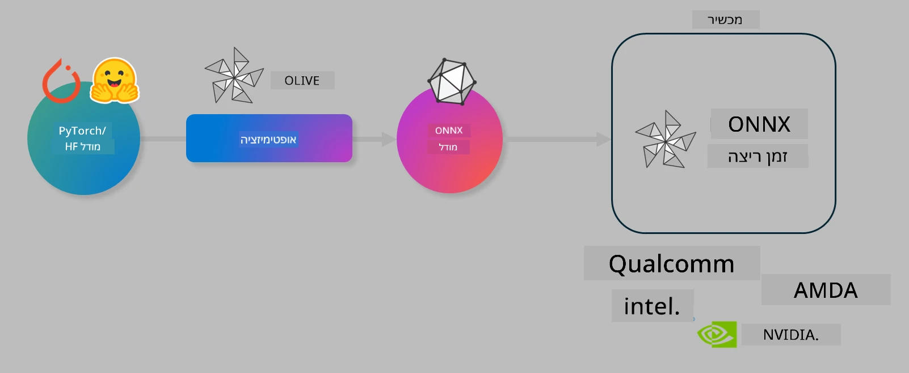

<!--
CO_OP_TRANSLATOR_METADATA:
{
  "original_hash": "6bbe47de3b974df7eea29dfeccf6032b",
  "translation_date": "2025-07-16T15:55:13+00:00",
  "source_file": "code/03.Finetuning/olive-lab/readme.md",
  "language_code": "he"
}
-->
# מעבדה. אופטימיזציה של מודלים מבוססי AI להרצה במכשיר

## מבוא

> [!IMPORTANT]  
> מעבדה זו דורשת **כרטיס מסך Nvidia A10 או A100** עם דרייברים וכלי CUDA (גרסה 12 ומעלה) מותקנים.

> [!NOTE]  
> זוהי מעבדה של **35 דקות** שתעניק לכם היכרות מעשית עם המושגים המרכזיים באופטימיזציה של מודלים להרצה במכשיר באמצעות OLIVE.

## מטרות הלמידה

בסיום המעבדה תוכלו להשתמש ב-OLIVE כדי:

- לבצע כימות (Quantize) של מודל AI באמצעות שיטת הכימות AWQ.  
- לכוונן מודל AI למשימה ספציפית.  
- ליצור מתאמי LoRA (מודל מכוונן) להרצה יעילה במכשיר באמצעות ONNX Runtime.

### מה זה Olive

Olive (*O*NNX *live*) הוא כלי לאופטימיזציה של מודלים עם ממשק שורת פקודה (CLI) שמאפשר לכם לשגר מודלים להרצה ב-ONNX runtime +++https://onnxruntime.ai+++ עם איכות וביצועים גבוהים.



הקלט ל-Olive הוא בדרך כלל מודל PyTorch או Hugging Face, והפלט הוא מודל ONNX מותאם שמורץ על מכשיר (יעד פריסה) שמריץ את ONNX runtime. Olive תבצע אופטימיזציה למודל בהתאם למאיץ ה-AI של יעד הפריסה (NPU, GPU, CPU) המסופק על ידי ספק חומרה כמו Qualcomm, AMD, Nvidia או Intel.

Olive מריצה *זרימת עבודה* (workflow), שהיא רצף מסודר של משימות אופטימיזציה של מודלים הנקראות *passes* – דוגמאות ל-passes הן: דחיסת מודל, לכידת גרף, כימות, אופטימיזציית גרף. לכל pass יש סט פרמטרים שניתן לכוונן כדי להשיג את המדדים הטובים ביותר, למשל דיוק וזמן תגובה, שמוערכים על ידי מעריך ייעודי. Olive משתמשת באסטרטגיית חיפוש שמפעילה אלגוריתם לחיפוש אוטומטי של הפרמטרים בכל pass בנפרד או בקבוצה.

#### יתרונות Olive

- **הפחתת תסכול וזמן** בניסויים ידניים של טכניקות שונות לאופטימיזציית גרף, דחיסה וכימות. הגדירו את דרישות האיכות והביצועים ותנו ל-Olive למצוא אוטומטית את המודל הטוב ביותר עבורכם.  
- **מעל 40 רכיבי אופטימיזציה מובנים** המכסים טכניקות מתקדמות בכימות, דחיסה, אופטימיזציית גרף וכיוונון עדין.  
- **ממשק שורת פקודה נוח לשימוש** למשימות אופטימיזציה נפוצות, למשל olive quantize, olive auto-opt, olive finetune.  
- אריזת מודלים ופריסה מובנים.  
- תמיכה ביצירת מודלים ל-**Multi LoRA serving**.  
- בניית זרימות עבודה באמצעות YAML/JSON לתזמור משימות אופטימיזציה ופריסה.  
- אינטגרציה עם **Hugging Face** ו-**Azure AI**.  
- מנגנון **מטמון** מובנה לחיסכון בעלויות.

## הוראות המעבדה

> [!NOTE]  
> ודאו כי הקמתם את Azure AI Hub והפרויקט שלכם והגדרתם את מחשוב A100 בהתאם למעבדה 1.

### שלב 0: התחברו למחשוב Azure AI שלכם

התחברו למחשוב Azure AI באמצעות תכונת ה-remote ב-**VS Code**.

1. פתחו את אפליקציית **VS Code** במחשב שלכם.  
2. פתחו את **command palette** באמצעות **Shift+Ctrl+P**.  
3. חפשו ב-command palette את **AzureML - remote: Connect to compute instance in New Window**.  
4. עקבו אחר ההוראות שעל המסך כדי להתחבר למחשוב. תצטרכו לבחור את המנוי שלכם ב-Azure, קבוצת המשאבים, הפרויקט ושם המחשוב שהגדרתם במעבדה 1.  
5. לאחר ההתחברות, שם מחשוב Azure ML יוצג בפינה השמאלית התחתונה של Visual Code כ-`><Azure ML: Compute Name`.

### שלב 1: שכפלו את המאגר הזה

ב-VS Code, פתחו טרמינל חדש עם **Ctrl+J** ושכפלו את המאגר:

בטרמינל תראו את ההנחיה

```
azureuser@computername:~/cloudfiles/code$ 
```  
שכפלו את הפתרון

```bash
cd ~/localfiles
git clone https://github.com/microsoft/phi-3cookbook.git
```

### שלב 2: פתחו את התיקייה ב-VS Code

כדי לפתוח את VS Code בתיקייה הרלוונטית, הריצו את הפקודה הבאה בטרמינל, שתפתח חלון חדש:

```bash
code phi-3cookbook/code/04.Finetuning/Olive-lab
```

אפשרות נוספת היא לפתוח את התיקייה דרך **File** > **Open Folder**.

### שלב 3: התקנת תלותים

פתחו חלון טרמינל ב-VS Code במחשב Azure AI שלכם (טיפ: **Ctrl+J**) והריצו את הפקודות הבאות להתקנת התלותים:

```bash
conda create -n olive-ai python=3.11 -y
conda activate olive-ai
pip install -r requirements.txt
az extension remove -n azure-cli-ml
az extension add -n ml
```

> [!NOTE]  
> ההתקנה תיקח כ-5 דקות.

במעבדה זו תורידו ותעלו מודלים לקטלוג המודלים של Azure AI. כדי לגשת לקטלוג, תצטרכו להתחבר ל-Azure באמצעות:

```bash
az login
```

> [!NOTE]  
> בעת ההתחברות תתבקשו לבחור את המנוי שלכם. ודאו שאתם בוחרים את המנוי שהוקצה למעבדה זו.

### שלב 4: הרצת פקודות Olive

פתחו טרמינל ב-VS Code במחשב Azure AI שלכם (טיפ: **Ctrl+J**) וודאו שסביבת conda בשם `olive-ai` מופעלת:

```bash
conda activate olive-ai
```

לאחר מכן, הריצו את פקודות Olive הבאות בשורת הפקודה.

1. **בדיקת הנתונים:** בדוגמה זו תכווננו את מודל Phi-3.5-Mini כך שיתמחה במענה על שאלות הקשורות לנסיעות. הקוד הבא מציג את הרשומות הראשונות של מערך הנתונים, שנמצא בפורמט JSON lines:

    ```bash
    head data/data_sample_travel.jsonl
    ```

1. **כימות המודל:** לפני אימון המודל, תחילה מבצעים כימות באמצעות הפקודה הבאה שמשתמשת בטכניקה הנקראת Active Aware Quantization (AWQ) +++https://arxiv.org/abs/2306.00978+++. AWQ מכמת את המשקלים של המודל תוך התחשבות באקטיבציות המופקות במהלך ההסקה. משמעות הדבר היא שתהליך הכימות לוקח בחשבון את התפלגות הנתונים בפועל באקטיבציות, מה שמוביל לשימור טוב יותר של הדיוק לעומת שיטות כימות משקלות מסורתיות.

    ```bash
    olive quantize \
       --model_name_or_path microsoft/Phi-3.5-mini-instruct \
       --trust_remote_code \
       --algorithm awq \
       --output_path models/phi/awq \
       --log_level 1
    ```

    תהליך הכימות AWQ לוקח כ-**8 דקות**, ויקטין את גודל המודל מ~7.5GB לכ~2.5GB.

    במעבדה זו אנו מראים כיצד להזין מודלים מ-Hugging Face (למשל: `microsoft/Phi-3.5-mini-instruct`). עם זאת, Olive מאפשרת גם להזין מודלים מקטלוג Azure AI על ידי עדכון הפרמטר `model_name_or_path` ל-ID של נכס ב-Azure AI (למשל: `azureml://registries/azureml/models/Phi-3.5-mini-instruct/versions/4`).

1. **אימון המודל:** לאחר מכן, הפקודה `olive finetune` מכווננת את המודל המכוים. כימות המודל *לפני* האימון במקום לאחריו משפר את הדיוק כי תהליך האימון משחזר חלק מהאובדן שנגרם בכימות.

    ```bash
    olive finetune \
        --method lora \
        --model_name_or_path models/phi/awq \
        --data_files "data/data_sample_travel.jsonl" \
        --data_name "json" \
        --text_template "<|user|>\n{prompt}<|end|>\n<|assistant|>\n{response}<|end|>" \
        --max_steps 100 \
        --output_path ./models/phi/ft \
        --log_level 1
    ```

    האימון לוקח כ-**6 דקות** (עם 100 צעדים).

1. **אופטימיזציה:** לאחר שהמודל אומן, כעת מבצעים אופטימיזציה באמצעות פקודת `auto-opt` של Olive, שתלכוד את גרף ה-ONNX ותבצע אוטומטית מספר אופטימיזציות לשיפור ביצועי המודל ב-CPU על ידי דחיסה וביצוע מיזוגים. יש לציין שניתן גם לאופטימיזציה למכשירים אחרים כמו NPU או GPU על ידי עדכון הפרמטרים `--device` ו-`--provider` – אך למטרות המעבדה נשתמש ב-CPU.

    ```bash
    olive auto-opt \
       --model_name_or_path models/phi/ft/model \
       --adapter_path models/phi/ft/adapter \
       --device cpu \
       --provider CPUExecutionProvider \
       --use_ort_genai \
       --output_path models/phi/onnx-ao \
       --log_level 1
    ```

    האופטימיזציה תיקח כ-**5 דקות**.

### שלב 5: בדיקת הסקה מהירה של המודל

כדי לבדוק את ההסקה מהמודל, צרו קובץ Python בתיקייה שלכם בשם **app.py** והדביקו את הקוד הבא:

```python
import onnxruntime_genai as og
import numpy as np

print("loading model and adapters...", end="", flush=True)
model = og.Model("models/phi/onnx-ao/model")
adapters = og.Adapters(model)
adapters.load("models/phi/onnx-ao/model/adapter_weights.onnx_adapter", "travel")
print("DONE!")

tokenizer = og.Tokenizer(model)
tokenizer_stream = tokenizer.create_stream()

params = og.GeneratorParams(model)
params.set_search_options(max_length=100, past_present_share_buffer=False)
user_input = "what is the best thing to see in chicago"
params.input_ids = tokenizer.encode(f"<|user|>\n{user_input}<|end|>\n<|assistant|>\n")

generator = og.Generator(model, params)

generator.set_active_adapter(adapters, "travel")

print(f"{user_input}")

while not generator.is_done():
    generator.compute_logits()
    generator.generate_next_token()

    new_token = generator.get_next_tokens()[0]
    print(tokenizer_stream.decode(new_token), end='', flush=True)

print("\n")
```

הריצו את הקוד באמצעות:

```bash
python app.py
```

### שלב 6: העלאת המודל ל-Azure AI

העלאת המודל למאגר מודלים של Azure AI מאפשרת לשתף את המודל עם חברי צוות הפיתוח ומנהלת גם בקרת גרסאות של המודל. כדי להעלות את המודל, הריצו את הפקודה הבאה:

> [!NOTE]  
> עדכנו את המילויים `{}` עם שם קבוצת המשאבים ושם פרויקט Azure AI שלכם.

כדי למצוא את שם קבוצת המשאבים `"resourceGroup"` ושם פרויקט Azure AI, הריצו את הפקודה הבאה:

```
az ml workspace show
```

או דרך +++ai.azure.com+++ ובחירת **management center** > **project** > **overview**

עדכנו את המילויים `{}` עם שם קבוצת המשאבים ושם פרויקט Azure AI שלכם.

```bash
az ml model create \
    --name ft-for-travel \
    --version 1 \
    --path ./models/phi/onnx-ao \
    --resource-group {RESOURCE_GROUP_NAME} \
    --workspace-name {PROJECT_NAME}
```  
לאחר מכן תוכלו לראות את המודל שהעליתם ולפרוס אותו בכתובת https://ml.azure.com/model/list

**כתב ויתור**:  
מסמך זה תורגם באמצעות שירות תרגום מבוסס בינה מלאכותית [Co-op Translator](https://github.com/Azure/co-op-translator). למרות שאנו שואפים לדיוק, יש לקחת בחשבון כי תרגומים אוטומטיים עלולים להכיל שגיאות או אי-דיוקים. המסמך המקורי בשפת המקור שלו נחשב למקור הסמכותי. למידע קריטי מומלץ להשתמש בתרגום מקצועי על ידי מתרגם אנושי. אנו לא נושאים באחריות לכל אי-הבנה או פרשנות שגויה הנובעת משימוש בתרגום זה.