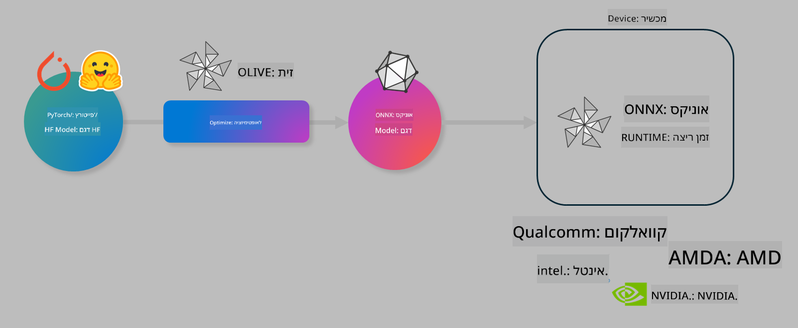

<!--
CO_OP_TRANSLATOR_METADATA:
{
  "original_hash": "6bbe47de3b974df7eea29dfeccf6032b",
  "translation_date": "2025-05-09T04:40:00+00:00",
  "source_file": "code/04.Finetuning/olive-lab/readme.md",
  "language_code": "he"
}
-->
# מעבדה. אופטימיזציה של מודלים מבוססי AI להרצה במכשיר

## מבוא

> [!IMPORTANT]  
> מעבדה זו דורשת **כרטיס גרפי Nvidia A10 או A100** עם דרייברים וכלי CUDA (גרסה 12 ומעלה) מותקנים.

> [!NOTE]  
> זוהי מעבדה של **35 דקות** שתעניק לכם היכרות מעשית עם המושגים המרכזיים לאופטימיזציה של מודלים להרצה במכשיר באמצעות OLIVE.

## מטרות הלמידה

בסיום המעבדה תוכלו להשתמש ב-OLIVE כדי:

- לכמת מודל AI באמצעות שיטת הכימות AWQ.  
- לכוונן מודל AI למשימה ספציפית.  
- ליצור מתאמי LoRA (מודל מכוונן) להרצה יעילה במכשיר באמצעות ONNX Runtime.

### מה זה Olive

Olive (*O*NNX *live*) הוא כלי לאופטימיזציה של מודלים עם ממשק שורת פקודה שמאפשר לשלוח מודלים להרצה ב-ONNX runtime +++https://onnxruntime.ai+++ באיכות ובביצועים גבוהים.



הקלט ל-Olive הוא בדרך כלל מודל PyTorch או Hugging Face, והפלט הוא מודל ONNX מותאם שמורץ על מכשיר (יעד פריסה) שרץ על ONNX runtime. Olive מבצע אופטימיזציה של המודל בהתאם למאיץ AI (NPU, GPU, CPU) של יעד הפריסה, המסופק על ידי ספק חומרה כגון Qualcomm, AMD, Nvidia או Intel.

Olive מבצע *זרימת עבודה* שהיא סדרת משימות אופטימיזציה של המודל, הנקראות *passes* - לדוגמה: דחיסת מודל, לכידת גרף, כימות, אופטימיזציית גרף. לכל pass יש פרמטרים שניתן לכוונן כדי להשיג את המדדים הטובים ביותר, כגון דיוק ושהייה, הנמדדים על ידי מעריך מתאים. Olive משתמש באסטרטגיית חיפוש שמשתמשת באלגוריתם חיפוש לכוונון אוטומטי של כל pass בנפרד או קבוצת passes יחד.

#### יתרונות Olive

- **מקטין תסכול וזמן** של ניסויים ידניים בניסיונות עם טכניקות שונות לאופטימיזציית גרף, דחיסה וכימות. הגדירו את דרישות האיכות והביצועים ותנו ל-Olive למצוא עבורכם את המודל הטוב ביותר באופן אוטומטי.  
- **מעל 40 רכיבים מובנים לאופטימיזציית מודלים** המכסים טכניקות מתקדמות בכימות, דחיסה, אופטימיזציית גרף וכיוונון עדין.  
- **ממשק שורת פקודה קל לשימוש** למשימות אופטימיזציה נפוצות. לדוגמה: olive quantize, olive auto-opt, olive finetune.  
- אריזת מודלים ופריסה מובנים.  
- תמיכה ביצירת מודלים ל-**Multi LoRA serving**.  
- בניית זרימות עבודה באמצעות YAML/JSON לתיאום משימות אופטימיזציה ופריסה.  
- אינטגרציה עם **Hugging Face** ו-**Azure AI**.  
- מנגנון **מטמון** מובנה ל**חיסכון בעלויות**.

## הוראות למעבדה

> [!NOTE]  
> ודאו שהקמתם את Azure AI Hub והפרויקט שלכם והגדרתם את מחשוב A100 בהתאם למעבדה 1.

### שלב 0: התחברות למחשוב Azure AI

תתחברו למחשוב Azure AI באמצעות תכונת ה-remote ב-**VS Code**.

1. פתחו את אפליקציית **VS Code** במחשב שלכם:  
1. פתחו את **command palette** עם **Shift+Ctrl+P**  
1. חפשו ב-command palette את **AzureML - remote: Connect to compute instance in New Window**.  
1. עקבו אחרי ההוראות על המסך כדי להתחבר למחשב. זה יכלול בחירת מנוי Azure, Resource Group, פרויקט ושם המחשב שהגדרתם במעבדה 1.  
1. לאחר ההתחברות למחשב Azure ML שלכם, זה יוצג בפינה השמאלית התחתונה של Visual Code `><Azure ML: Compute Name`

### שלב 1: שכפול המאגר (Clone)

ב-VS Code תוכלו לפתוח טרמינל חדש עם **Ctrl+J** ולשכפל את המאגר:

בתוך הטרמינל תראו את ההנחיה

```
azureuser@computername:~/cloudfiles/code$ 
```  
שכפל את הפתרון

```bash
cd ~/localfiles
git clone https://github.com/microsoft/phi-3cookbook.git
```

### שלב 2: פתיחת תיקייה ב-VS Code

כדי לפתוח את VS Code בתיקייה הרלוונטית הריצו בטרמינל את הפקודה הבאה שתפתח חלון חדש:

```bash
code phi-3cookbook/code/04.Finetuning/Olive-lab
```

כחלופה, ניתן לפתוח את התיקייה דרך **File** > **Open Folder**.

### שלב 3: תלותיות

פתחו טרמינל ב-VS Code במחשב Azure AI שלכם (טיפ: **Ctrl+J**) והריצו את הפקודות הבאות להתקנת התלויות:

```bash
conda create -n olive-ai python=3.11 -y
conda activate olive-ai
pip install -r requirements.txt
az extension remove -n azure-cli-ml
az extension add -n ml
```

> [!NOTE]  
> ההתקנה תיקח כ-5 דקות.

במעבדה זו תורידו ותעלו מודלים לקטלוג המודלים של Azure AI. כדי לגשת לקטלוג המודלים תצטרכו להתחבר ל-Azure באמצעות:

```bash
az login
```

> [!NOTE]  
> בעת ההתחברות תתבקשו לבחור מנוי. ודאו שאתם בוחרים את המנוי שהוקצה למעבדה זו.

### שלב 4: הרצת פקודות Olive

פתחו טרמינל ב-VS Code במחשב Azure AI שלכם (טיפ: **Ctrl+J**) וודאו שסביבת ה-conda `olive-ai` פעילה:

```bash
conda activate olive-ai
```

לאחר מכן הריצו את פקודות Olive הבאות בשורת הפקודה.

1. **בדיקת הנתונים:** בדוגמה זו תכוונו את מודל Phi-3.5-Mini כך שיהיה מיומן במענה לשאלות הקשורות לנסיעות. הקוד למטה מציג את הרשומות הראשונות של מערך הנתונים בפורמט JSON lines:  
   
    ```bash
    head data/data_sample_travel.jsonl
    ```  
1. **כימות המודל:** לפני האימון, תחילה מבצעים כימות באמצעות הפקודה הבאה שמשתמשת בטכניקה שנקראת Active Aware Quantization (AWQ) +++https://arxiv.org/abs/2306.00978+++. AWQ מכמת את משקלות המודל תוך התחשבות באקטיבציות המופקות במהלך ההסקה. כלומר, תהליך הכימות מתחשב בהתפלגות הנתונים בפועל באקטיבציות, מה שמאפשר שמירה טובה יותר על הדיוק לעומת שיטות כימות משקלות מסורתיות.  
   
    ```bash
    olive quantize \
       --model_name_or_path microsoft/Phi-3.5-mini-instruct \
       --trust_remote_code \
       --algorithm awq \
       --output_path models/phi/awq \
       --log_level 1
    ```  
   
    הכימות עם AWQ לוקח **כ-8 דקות** ומקטין את גודל המודל מ-~7.5GB ל-~2.5GB.  
   
   במעבדה זו מראים כיצד להזין מודלים מ-Hugging Face (לדוגמה: `microsoft/Phi-3.5-mini-instruct`). However, Olive also allows you to input models from the Azure AI catalog by updating the `model_name_or_path` argument to an Azure AI asset ID (for example:  `azureml://registries/azureml/models/Phi-3.5-mini-instruct/versions/4`). 

1. **Train the model:** Next, the `olive finetune` פקודת finetune מכווננת את המודל המכוים. כימות המודל *לפני* כיוונון עדין ולא אחריו משפר את הדיוק כי תהליך הכיוונון מפצה על אובדן שנגרם בכימות.  
   
    ```bash
    olive finetune \
        --method lora \
        --model_name_or_path models/phi/awq \
        --data_files "data/data_sample_travel.jsonl" \
        --data_name "json" \
        --text_template "<|user|>\n{prompt}<|end|>\n<|assistant|>\n{response}<|end|>" \
        --max_steps 100 \
        --output_path ./models/phi/ft \
        --log_level 1
    ```  
   
    הכיוונון העדין לוקח **כ-6 דקות** (עם 100 צעדים).

1. **אופטימיזציה:** לאחר האימון, כעת מבצעים אופטימיזציה למודל באמצעות פקודת Olive `auto-opt` command, which will capture the ONNX graph and automatically perform a number of optimizations to improve the model performance for CPU by compressing the model and doing fusions. It should be noted, that you can also optimize for other devices such as NPU or GPU by just updating the `--device` and `--provider` - אך לצרכי המעבדה נשתמש ב-CPU.

    ```bash
    olive auto-opt \
       --model_name_or_path models/phi/ft/model \
       --adapter_path models/phi/ft/adapter \
       --device cpu \
       --provider CPUExecutionProvider \
       --use_ort_genai \
       --output_path models/phi/onnx-ao \
       --log_level 1
    ```  
   
    האופטימיזציה לוקחת **כ-5 דקות**.

### שלב 5: בדיקת הסקה מהירה למודל

כדי לבדוק את ההסקה של המודל, צרו קובץ Python בתיקייה בשם **app.py** והדביקו את הקוד הבא:

```python
import onnxruntime_genai as og
import numpy as np

print("loading model and adapters...", end="", flush=True)
model = og.Model("models/phi/onnx-ao/model")
adapters = og.Adapters(model)
adapters.load("models/phi/onnx-ao/model/adapter_weights.onnx_adapter", "travel")
print("DONE!")

tokenizer = og.Tokenizer(model)
tokenizer_stream = tokenizer.create_stream()

params = og.GeneratorParams(model)
params.set_search_options(max_length=100, past_present_share_buffer=False)
user_input = "what is the best thing to see in chicago"
params.input_ids = tokenizer.encode(f"<|user|>\n{user_input}<|end|>\n<|assistant|>\n")

generator = og.Generator(model, params)

generator.set_active_adapter(adapters, "travel")

print(f"{user_input}")

while not generator.is_done():
    generator.compute_logits()
    generator.generate_next_token()

    new_token = generator.get_next_tokens()[0]
    print(tokenizer_stream.decode(new_token), end='', flush=True)

print("\n")
```

הריצו את הקוד באמצעות:

```bash
python app.py
```

### שלב 6: העלאת המודל ל-Azure AI

העלאת המודל למאגר מודלים של Azure AI מאפשרת שיתוף עם חברי צוות פיתוח נוספים ומנהלת גרסאות למודל. כדי להעלות את המודל הריצו את הפקודה הבאה:

> [!NOTE]  
> עדכנו את `{}` placeholders with the name of your resource group and Azure AI Project Name. 

To find your resource group `"resourceGroup"` ושם הפרויקט ב-Azure AI, והריצו את הפקודה הבאה

```
az ml workspace show
```

או דרך +++ai.azure.com+++ ובחירה ב**management center** > **project** > **overview**

עדכנו את המילויים `{}` בשם קבוצת המשאבים שלכם ובשם פרויקט Azure AI.

```bash
az ml model create \
    --name ft-for-travel \
    --version 1 \
    --path ./models/phi/onnx-ao \
    --resource-group {RESOURCE_GROUP_NAME} \
    --workspace-name {PROJECT_NAME}
```  
ניתן לאחר מכן לראות את המודל שהועלה ולפרוס אותו בכתובת https://ml.azure.com/model/list

**כתב ויתור**:  
מסמך זה תורגם באמצעות שירות תרגום מבוסס בינה מלאכותית [Co-op Translator](https://github.com/Azure/co-op-translator). למרות שאנו שואפים לדיוק, יש לקחת בחשבון כי תרגומים אוטומטיים עלולים להכיל שגיאות או אי-דיוקים. המסמך המקורי בשפת המקור שלו נחשב למקור הסמכותי. למידע קריטי מומלץ להשתמש בתרגום מקצועי אנושי. אנו לא אחראים לכל אי-הבנה או פרשנות שגויה הנובעות משימוש בתרגום זה.