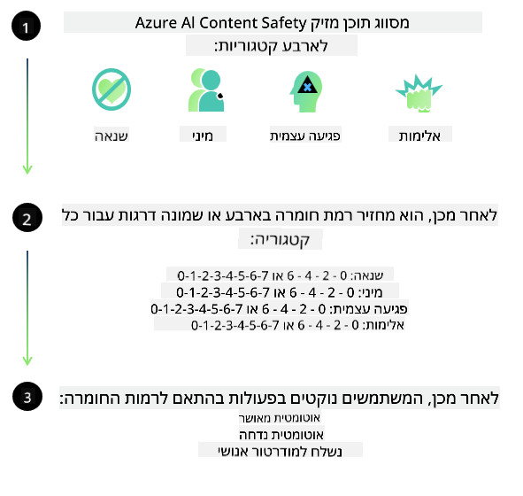

<!--
CO_OP_TRANSLATOR_METADATA:
{
  "original_hash": "c8273672cc57df2be675407a1383aaf0",
  "translation_date": "2025-07-16T17:50:21+00:00",
  "source_file": "md/01.Introduction/01/01.AISafety.md",
  "language_code": "he"
}
-->
# בטיחות בינה מלאכותית עבור דגמי Phi  
משפחת דגמי Phi פותחה בהתאם ל[תקן הבינה המלאכותית האחראית של Microsoft](https://query.prod.cms.rt.microsoft.com/cms/api/am/binary/RE5cmFl), שהוא סט דרישות ארגוני המבוסס על ששת העקרונות הבאים: אחריות, שקיפות, הוגנות, אמינות ובטיחות, פרטיות ואבטחה, וכלליות, שמרכיבים את [עקרונות הבינה המלאכותית האחראית של Microsoft](https://www.microsoft.com/ai/responsible-ai).

כמו בדגמי Phi הקודמים, אומצה גישה רב-ממדית להערכת בטיחות ולאימון לאחר האימון, עם צעדים נוספים שננקטו כדי להתחשב ביכולות רב-לשוניות של הגרסה הזו. הגישה שלנו לאימון והערכת בטיחות, הכוללת בדיקות בשפות שונות וקטגוריות סיכון, מתוארת ב[מאמר הבטיחות לאחר האימון של Phi](https://arxiv.org/abs/2407.13833). למרות שדגמי Phi נהנים מגישה זו, מפתחים צריכים ליישם את שיטות העבודה הטובות ביותר של בינה מלאכותית אחראית, כולל מיפוי, מדידה והפחתת סיכונים הקשורים למקרה השימוש הספציפי שלהם ולהקשר התרבותי והלשוני.

## שיטות עבודה מומלצות  

כמו דגמים אחרים, משפחת דגמי Phi עלולה להתנהג בדרכים לא הוגנות, לא אמינות או פוגעניות.

כמה מההתנהגויות המגבילות של SLM ו-LLM שכדאי להיות מודעים להן כוללות:

- **איכות השירות:** דגמי Phi מאומנים בעיקר על טקסט באנגלית. שפות אחרות מעבר לאנגלית יחוו ביצועים נמוכים יותר. ניבים של השפה האנגלית עם ייצוג נמוך יותר בנתוני האימון עלולים להציג ביצועים גרועים יותר מאנגלית אמריקאית סטנדרטית.  
- **ייצוג נזקים והנצחת סטריאוטיפים:** דגמים אלה עלולים לייצג יתר או חסר קבוצות אנשים, למחוק ייצוג של קבוצות מסוימות, או לחזק סטריאוטיפים משפילים או שליליים. למרות האימון לאחר האימון לשיפור הבטיחות, מגבלות אלו עשויות להישאר עקב רמות ייצוג שונות של קבוצות שונות או עקב שכיחות דוגמאות לסטריאוטיפים שליליים בנתוני האימון המשקפים דפוסים חברתיים והטיות מהעולם האמיתי.  
- **תוכן לא הולם או פוגעני:** דגמים אלה עלולים לייצר סוגים אחרים של תוכן לא הולם או פוגעני, מה שעשוי להפוך אותם לבלתי מתאימים לפריסה בהקשרים רגישים ללא אמצעי הפחתה נוספים המותאמים למקרה השימוש.  
- **אמינות המידע:** דגמי שפה עלולים לייצר תוכן לא הגיוני או להמציא תוכן שנשמע סביר אך אינו מדויק או מיושן.  
- **טווח מוגבל לקוד:** רוב נתוני האימון של Phi-3 מבוססים על Python ומשתמשים בחבילות נפוצות כמו "typing, math, random, collections, datetime, itertools". אם הדגם מייצר סקריפטים ב-Python שמשתמשים בחבילות אחרות או סקריפטים בשפות אחרות, אנו ממליצים בחום למשתמשים לבדוק ידנית את כל השימושים ב-API.

מפתחים צריכים ליישם את שיטות העבודה הטובות ביותר של בינה מלאכותית אחראית ואחראים לוודא שמקרה השימוש הספציפי שלהם עומד בחוקים ותקנות רלוונטיים (כגון פרטיות, סחר וכו').

## שיקולים בבינה מלאכותית אחראית  

כמו דגמי שפה אחרים, דגמי סדרת Phi עלולים להתנהג בדרכים לא הוגנות, לא אמינות או פוגעניות. כמה מההתנהגויות המגבילות שכדאי להיות מודעים להן כוללות:

**איכות השירות:** דגמי Phi מאומנים בעיקר על טקסט באנגלית. שפות אחרות מעבר לאנגלית יחוו ביצועים נמוכים יותר. ניבים של השפה האנגלית עם ייצוג נמוך יותר בנתוני האימון עלולים להציג ביצועים גרועים יותר מאנגלית אמריקאית סטנדרטית.

**ייצוג נזקים והנצחת סטריאוטיפים:** דגמים אלה עלולים לייצג יתר או חסר קבוצות אנשים, למחוק ייצוג של קבוצות מסוימות, או לחזק סטריאוטיפים משפילים או שליליים. למרות האימון לאחר האימון לשיפור הבטיחות, מגבלות אלו עשויות להישאר עקב רמות ייצוג שונות של קבוצות שונות או עקב שכיחות דוגמאות לסטריאוטיפים שליליים בנתוני האימון המשקפים דפוסים חברתיים והטיות מהעולם האמיתי.

**תוכן לא הולם או פוגעני:** דגמים אלה עלולים לייצר סוגים אחרים של תוכן לא הולם או פוגעני, מה שעשוי להפוך אותם לבלתי מתאימים לפריסה בהקשרים רגישים ללא אמצעי הפחתה נוספים המותאמים למקרה השימוש.  
אמינות המידע: דגמי שפה עלולים לייצר תוכן לא הגיוני או להמציא תוכן שנשמע סביר אך אינו מדויק או מיושן.

**טווח מוגבל לקוד:** רוב נתוני האימון של Phi-3 מבוססים על Python ומשתמשים בחבילות נפוצות כמו "typing, math, random, collections, datetime, itertools". אם הדגם מייצר סקריפטים ב-Python שמשתמשים בחבילות אחרות או סקריפטים בשפות אחרות, אנו ממליצים בחום למשתמשים לבדוק ידנית את כל השימושים ב-API.

מפתחים צריכים ליישם את שיטות העבודה הטובות ביותר של בינה מלאכותית אחראית ואחראים לוודא שמקרה השימוש הספציפי שלהם עומד בחוקים ותקנות רלוונטיים (כגון פרטיות, סחר וכו'). תחומים חשובים לשיקול כוללים:

**הקצאה:** דגמים עשויים שלא להתאים לתרחישים שיכולים להשפיע באופן משמעותי על מעמד משפטי או על הקצאת משאבים או הזדמנויות בחיים (למשל: דיור, תעסוקה, אשראי וכו') ללא הערכות נוספות וטכניקות הפחתת הטיות נוספות.

**תרחישים בסיכון גבוה:** מפתחים צריכים להעריך את ההתאמה של השימוש בדגמים בתרחישים בסיכון גבוה שבהם פלטים לא הוגנים, לא אמינים או פוגעניים עלולים להיות יקרים מאוד או לגרום נזק. זה כולל מתן ייעוץ בתחומים רגישים או מומחים שבהם דיוק ואמינות הם קריטיים (למשל: ייעוץ משפטי או רפואי). יש ליישם אמצעי הגנה נוספים ברמת היישום בהתאם להקשר הפריסה.

**מידע שגוי:** דגמים עלולים לייצר מידע לא מדויק. מפתחים צריכים לפעול לפי שיטות עבודה שקופות ולהודיע למשתמשי הקצה שהם מתקשרים עם מערכת בינה מלאכותית. ברמת היישום, מפתחים יכולים לבנות מנגנוני משוב וצינורות שיאפשרו עיגון תגובות במידע הקשרי ומותאם למקרה השימוש, טכניקה הידועה בשם Retrieval Augmented Generation (RAG).

**יצירת תוכן מזיק:** מפתחים צריכים להעריך את הפלטים בהתאם להקשר ולהשתמש בממיינים בטיחות זמינים או בפתרונות מותאמים למקרה השימוש שלהם.

**שימוש לרעה:** צורות אחרות של שימוש לרעה כגון הונאה, ספאם או יצירת תוכנות זדוניות עשויות להיות אפשריות, ומפתחים צריכים לוודא שהיישומים שלהם אינם מפרים חוקים ותקנות רלוונטיים.

### כיוונון עדין ובטיחות תוכן בינה מלאכותית  

לאחר כיוונון עדין של דגם, אנו ממליצים בחום לנצל את אמצעי [Azure AI Content Safety](https://learn.microsoft.com/azure/ai-services/content-safety/overview) כדי לנטר את התוכן שנוצר על ידי הדגמים, לזהות ולחסום סיכונים, איומים ובעיות איכות פוטנציאליות.

[Azure AI Content Safety](https://learn.microsoft.com/azure/ai-services/content-safety/overview) תומך בתוכן טקסט ותמונה. ניתן לפרוס אותו בענן, במכולות מנותקות, ועל מכשירים בקצה או משובצים.

## סקירה כללית של Azure AI Content Safety  

Azure AI Content Safety אינו פתרון אחיד לכולם; ניתן להתאימו כך שיתאים למדיניות הספציפית של עסקים. בנוסף, דגמיו הרב-לשוניים מאפשרים לו להבין מספר שפות בו-זמנית.

- **Azure AI Content Safety**  
- **Microsoft Developer**  
- **5 סרטונים**

שירות Azure AI Content Safety מזהה תוכן מזיק שנוצר על ידי משתמשים או בינה מלאכותית באפליקציות ושירותים. הוא כולל API לטקסט ותמונה המאפשרים לזהות חומר מזיק או לא הולם.

[AI Content Safety Playlist](https://www.youtube.com/playlist?list=PLlrxD0HtieHjaQ9bJjyp1T7FeCbmVcPkQ)

**כתב ויתור**:  
מסמך זה תורגם באמצעות שירות תרגום מבוסס בינה מלאכותית [Co-op Translator](https://github.com/Azure/co-op-translator). למרות שאנו שואפים לדיוק, יש לקחת בחשבון כי תרגומים אוטומטיים עלולים להכיל שגיאות או אי-דיוקים. המסמך המקורי בשפת המקור שלו נחשב למקור הסמכותי. למידע קריטי מומלץ להשתמש בתרגום מקצועי על ידי מתרגם אנושי. אנו לא נושאים באחריות לכל אי-הבנה או פרשנות שגויה הנובעת משימוש בתרגום זה.