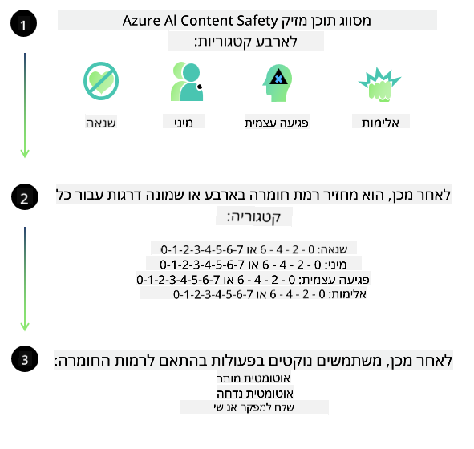
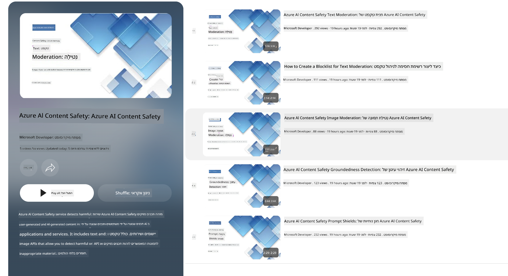

<!--
CO_OP_TRANSLATOR_METADATA:
{
  "original_hash": "c8273672cc57df2be675407a1383aaf0",
  "translation_date": "2025-05-09T06:08:32+00:00",
  "source_file": "md/01.Introduction/01/01.AISafety.md",
  "language_code": "he"
}
-->
# בטיחות AI עבור דגמי Phi  
משפחת דגמי Phi פותחה בהתאם ל[Microsoft Responsible AI Standard](https://query.prod.cms.rt.microsoft.com/cms/api/am/binary/RE5cmFl), שהיא מערכת דרישות כלל-חברתית המבוססת על ששת העקרונות הבאים: אחריות, שקיפות, הוגנות, אמינות ובטיחות, פרטיות ואבטחה, וכלילתיות, שמרכיבים את [עקרונות ה-AI האחראי של Microsoft](https://www.microsoft.com/ai/responsible-ai).  

כמו בדגמי Phi הקודמים, אומצה גישה רב-ממדית להערכת בטיחות ולאימון בטיחות לאחר האימון, עם אמצעים נוספים שננקטו כדי להתחשב ביכולות רב-לשוניות של השחרור הזה. הגישה שלנו לאימון והערכות בטיחות, הכוללת בדיקות במספר שפות וקטגוריות סיכון, מתוארת ב[מאמר לאחר האימון לבטיחות של Phi](https://arxiv.org/abs/2407.13833). למרות שדגמי Phi נהנים מגישה זו, מפתחים צריכים ליישם את שיטות העבודה הטובות ביותר של AI אחראי, כולל מיפוי, מדידה והפחתת סיכונים הקשורים למקרה השימוש הספציפי שלהם והקשר תרבותי ולשוני.  

## שיטות עבודה מומלצות  

כמו דגמים אחרים, משפחת דגמי Phi עלולה להתנהג בדרכים שאינן הוגנות, לא אמינות או פוגעניות.  

חלק מההתנהגויות המגבילות של SLM ו-LLM שכדאי להיות מודעים אליהן כוללות:  

- **איכות השירות:** דגמי Phi מאומנים בעיקר על טקסט באנגלית. שפות אחרות מהאנגלית יחוו ביצועים גרועים יותר. זני אנגלית עם ייצוג נמוך יותר בנתוני האימון עשויים להציג ביצועים גרועים יותר מאנגלית אמריקאית סטנדרטית.  
- **ייצוג נזקים והנצחת סטריאוטיפים:** דגמים אלו עלולים לייצג יתר או חסר קבוצות אנשים, למחוק ייצוג של קבוצות מסוימות, או לחזק סטריאוטיפים משפילים או שליליים. למרות האימון לאחר הבטיחות, מגבלות אלו עדיין עשויות להתקיים עקב רמות שונות של ייצוג קבוצות שונות או שכיחות דוגמאות לסטריאוטיפים שליליים בנתוני האימון המשקפים דפוסים חברתיים והטיות בעולם האמיתי.  
- **תוכן בלתי הולם או פוגעני:** דגמים אלו עשויים לייצר סוגים אחרים של תוכן בלתי הולם או פוגעני, מה שעלול להפוך את השימוש בהם לבלתי מתאים בהקשרים רגישים ללא אמצעי הפחתה נוספים המותאמים למקרה השימוש.  
- **אמינות המידע:** דגמי שפה עלולים לייצר תוכן לא הגיוני או להמציא תוכן שנשמע סביר אך אינו מדויק או מיושן.  
- **טווח מוגבל לקוד:** רוב נתוני האימון של Phi-3 מבוססים על Python ומשתמשים בחבילות נפוצות כמו "typing, math, random, collections, datetime, itertools". אם הדגם מייצר סקריפטים ב-Python המשתמשים בחבילות אחרות או סקריפטים בשפות אחרות, אנו ממליצים בחום שהמשתמשים יאמתו ידנית את כל השימושים ב-API.  

מפתחים צריכים ליישם את שיטות העבודה הטובות ביותר של AI אחראי ואחראים לוודא שמקרה השימוש הספציפי עומד בחוקים ותקנות רלוונטיים (כגון פרטיות, סחר וכו').  

## שיקולים ב-AI אחראי  

כמו דגמי שפה אחרים, דגמי סדרת Phi עלולים להתנהג בדרכים שאינן הוגנות, לא אמינות או פוגעניות. חלק מההתנהגויות המגבילות שכדאי להיות מודעים אליהן כוללות:  

**איכות השירות:** דגמי Phi מאומנים בעיקר על טקסט באנגלית. שפות אחרות מהאנגלית יחוו ביצועים גרועים יותר. זני אנגלית עם ייצוג נמוך יותר בנתוני האימון עשויים להציג ביצועים גרועים יותר מאנגלית אמריקאית סטנדרטית.  

**ייצוג נזקים והנצחת סטריאוטיפים:** דגמים אלו עלולים לייצג יתר או חסר קבוצות אנשים, למחוק ייצוג של קבוצות מסוימות, או לחזק סטריאוטיפים משפילים או שליליים. למרות האימון לאחר הבטיחות, מגבלות אלו עדיין עשויות להתקיים עקב רמות שונות של ייצוג קבוצות שונות או שכיחות דוגמאות לסטריאוטיפים שליליים בנתוני האימון המשקפים דפוסים חברתיים והטיות בעולם האמיתי.  

**תוכן בלתי הולם או פוגעני:** דגמים אלו עשויים לייצר סוגים אחרים של תוכן בלתי הולם או פוגעני, מה שעלול להפוך את השימוש בהם לבלתי מתאים בהקשרים רגישים ללא אמצעי הפחתה נוספים המותאמים למקרה השימוש.  
אמינות המידע: דגמי שפה עלולים לייצר תוכן לא הגיוני או להמציא תוכן שנשמע סביר אך אינו מדויק או מיושן.  

**טווח מוגבל לקוד:** רוב נתוני האימון של Phi-3 מבוססים על Python ומשתמשים בחבילות נפוצות כמו "typing, math, random, collections, datetime, itertools". אם הדגם מייצר סקריפטים ב-Python המשתמשים בחבילות אחרות או סקריפטים בשפות אחרות, אנו ממליצים בחום שהמשתמשים יאמתו ידנית את כל השימושים ב-API.  

מפתחים צריכים ליישם את שיטות העבודה הטובות ביותר של AI אחראי ואחראים לוודא שמקרה השימוש הספציפי עומד בחוקים ותקנות רלוונטיים (כגון פרטיות, סחר וכו'). תחומים חשובים לשיקול כוללים:  

**הקצאה:** דגמים עשויים שלא להתאים לתרחישים שעשויים להשפיע משמעותית על מעמד משפטי או על הקצאת משאבים או הזדמנויות בחיים (למשל: דיור, תעסוקה, אשראי וכו') ללא הערכות נוספות וטכניקות הפחתת הטיות נוספות.  

**תרחישים בסיכון גבוה:** מפתחים צריכים להעריך את ההתאמה לשימוש בדגמים בתרחישים בסיכון גבוה שבהם פלטים לא הוגנים, לא אמינים או פוגעניים עלולים להיות יקרים מאוד או לגרום נזק. זה כולל מתן ייעוץ בתחומים רגישים או מומחים שבהם דיוק ואמינות קריטיים (למשל: ייעוץ משפטי או רפואי). יש ליישם אמצעי הגנה נוספים ברמת היישום בהתאם להקשר הפריסה.  

**מידע שגוי:** דגמים עלולים לייצר מידע לא מדויק. מפתחים צריכים לעקוב אחר שיטות עבודה טובות של שקיפות ולהודיע למשתמשי הקצה שהם מתקשרים עם מערכת AI. ברמת היישום, מפתחים יכולים לבנות מנגנוני משוב וצינורות שיאפשרו עיגון תגובות במידע ספציפי למקרה השימוש ובהקשר, טכניקה הידועה בשם Retrieval Augmented Generation (RAG).  

**ייצור תוכן מזיק:** מפתחים צריכים להעריך את הפלטים בהתאם להקשר שלהם ולהשתמש בממיינים בטיחות זמינים או פתרונות מותאמים למקרה השימוש שלהם.  

**שימוש לרעה:** צורות אחרות של שימוש לרעה כמו הונאה, ספאם או הפצת תוכנות זדוניות עשויות להיות אפשריות, ומפתחים צריכים לוודא שהיישומים שלהם אינם מפרים חוקים ותקנות רלוונטיים.  

### כיוונון עדין ובטיחות תוכן AI  

לאחר כיוונון עדין של דגם, אנו ממליצים בחום לנצל את אמצעי [Azure AI Content Safety](https://learn.microsoft.com/azure/ai-services/content-safety/overview) כדי לנטר את התוכן שהדגמים מייצרים, לזהות ולחסום סיכונים, איומים ובעיות איכות פוטנציאליות.  

  

[Azure AI Content Safety](https://learn.microsoft.com/azure/ai-services/content-safety/overview) תומך בתוכן טקסט ותמונה. ניתן לפרוס אותו בענן, במכולות מנותקות, ובמכשירים קצה/משובצים.  

## סקירה כללית של Azure AI Content Safety  

Azure AI Content Safety אינה פתרון אחיד לכולם; ניתן להתאים אותה למדיניות הספציפית של עסקים. בנוסף, דגמיה הרב-לשוניים מאפשרים לה להבין מספר שפות בו זמנית.  

  

- **Azure AI Content Safety**  
- **Microsoft Developer**  
- **5 סרטונים**  

שירות Azure AI Content Safety מזהה תוכן מזיק שנוצר על ידי משתמשים ו-AI ביישומים ושירותים. הוא כולל API לטקסט ולתמונה שמאפשרים לזהות חומר מזיק או בלתי הולם.  

[AI Content Safety Playlist](https://www.youtube.com/playlist?list=PLlrxD0HtieHjaQ9bJjyp1T7FeCbmVcPkQ)

**כתב ויתור**:  
מסמך זה תורגם באמצעות שירות תרגום מבוסס בינה מלאכותית [Co-op Translator](https://github.com/Azure/co-op-translator). למרות שאנו שואפים לדיוק, יש לקחת בחשבון כי תרגומים אוטומטיים עלולים להכיל שגיאות או אי-דיוקים. המסמך המקורי בשפתו המקורית נחשב למקור הסמכותי. למידע קריטי מומלץ להשתמש בתרגום מקצועי על ידי אדם. אנו לא נושאים באחריות לכל אי-הבנה או פרשנות שגויה הנובעת משימוש בתרגום זה.