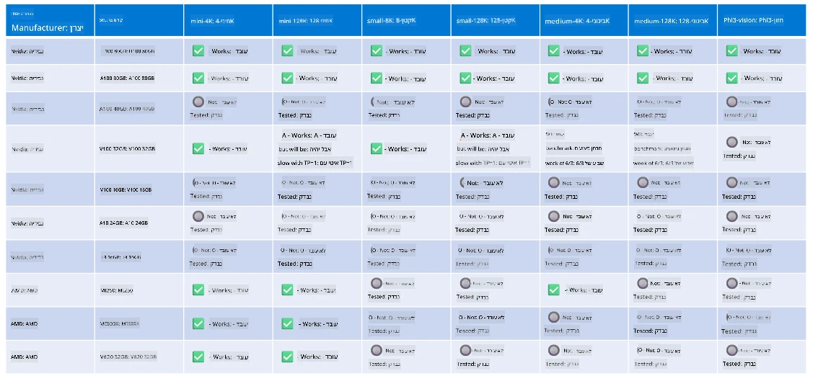

# תמיכה בחומרת Phi

Microsoft Phi מותאמת במיוחד ל-ONNX Runtime ותומכת ב-Windows DirectML. היא פועלת היטב על מגוון סוגי חומרה, כולל GPUs, CPUs ואפילו מכשירים ניידים.

## חומרת המכשיר  
החומרה הנתמכת כוללת במיוחד:

- GPU SKU: RTX 4090 (DirectML)  
- GPU SKU: 1 A100 80GB (CUDA)  
- CPU SKU: Standard F64s v2 (64 vCPUs, 128 GiB זיכרון)  

## Mobile SKU

- אנדרואיד - Samsung Galaxy S21  
- Apple iPhone 14 ומעלה עם מעבד A16/A17  

## מפרט חומרת Phi

- תצורה מינימלית נדרשת.  
- Windows: GPU התומך ב-DirectX 12 וזיכרון RAM משולב של לפחות 4GB  

CUDA: כרטיס NVIDIA עם Compute Capability >= 7.02  



## הרצת onnxruntime על מספר GPUs

כרגע, דגמי Phi ONNX הזמינים מיועדים ל-GPU יחיד בלבד. קיימת אפשרות לתמוך בריבוי GPUs עבור דגם Phi, אך ORT עם 2 GPUs לא מבטיח שתקבל ביצועים טובים יותר לעומת שתי מופעים של ort. לפרטים נוספים ראו [ONNX Runtime](https://onnxruntime.ai/).

ב-Build 2024 צוות GenAI ONNX [הודיע](https://youtu.be/WLW4SE8M9i8?si=EtG04UwDvcjunyfC) כי הם אפשרו ריבוי מופעים במקום ריבוי GPUs לדגמי Phi.

כעת ניתן להריץ מופע אחד של onnxruntime או onnxruntime-genai עם משתנה הסביבה CUDA_VISIBLE_DEVICES כך:

```Python
CUDA_VISIBLE_DEVICES=0 python infer.py
CUDA_VISIBLE_DEVICES=1 python infer.py
```

אל תהססו לחקור את Phi לעומק ב-[Azure AI Foundry](https://ai.azure.com)

**כתב ויתור**:  
מסמך זה תורגם באמצעות שירות תרגום מבוסס בינה מלאכותית [Co-op Translator](https://github.com/Azure/co-op-translator). למרות שאנו שואפים לדיוק, יש לקחת בחשבון כי תרגומים אוטומטיים עלולים להכיל שגיאות או אי-דיוקים. המסמך המקורי בשפת המקור שלו נחשב למקור הסמכותי. למידע קריטי מומלץ להשתמש בתרגום מקצועי על ידי מתרגם אנושי. אנו לא נושאים באחריות לכל אי-הבנה או פרשנות שגויה הנובעת משימוש בתרגום זה.