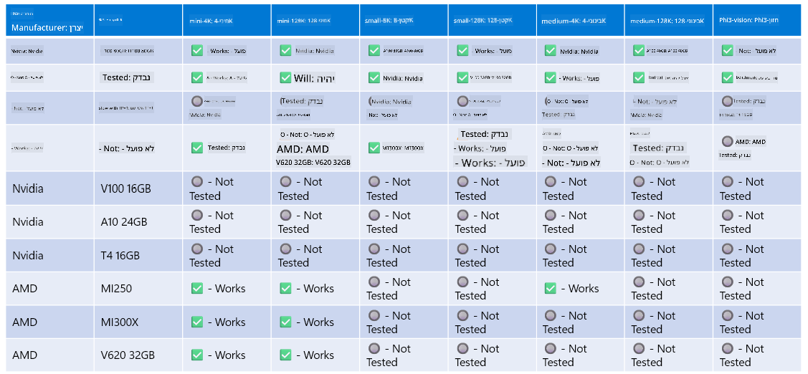

<!--
CO_OP_TRANSLATOR_METADATA:
{
  "original_hash": "8cdc17ce0f10535da30b53d23fe1a795",
  "translation_date": "2025-05-09T07:51:21+00:00",
  "source_file": "md/01.Introduction/01/01.Hardwaresupport.md",
  "language_code": "he"
}
-->
# תמיכה בחומרה של Phi

Microsoft Phi מותאם ל-ONNX Runtime ותומך ב-Windows DirectML. הוא פועל היטב על מגוון סוגי חומרה, כולל GPUs, CPUs ואפילו מכשירים ניידים.

## חומרת המכשיר  
החומרה הנתמכת כוללת במיוחד:

- GPU SKU: RTX 4090 (DirectML)  
- GPU SKU: 1 A100 80GB (CUDA)  
- CPU SKU: Standard F64s v2 (64 vCPUs, 128 GiB זיכרון)  

## SKU למובייל

- אנדרואיד - Samsung Galaxy S21  
- Apple iPhone 14 או גבוה יותר עם מעבד A16/A17  

## מפרט חומרה של Phi

- דרישת קונפיגורציה מינימלית.  
- Windows: GPU תומך DirectX 12 וזיכרון משולב של לפחות 4GB  

CUDA: NVIDIA GPU עם Compute Capability >= 7.02  



## הרצת onnxruntime על מספר GPUs

כיום, דגמי Phi ל-ONNX זמינים רק עבור GPU אחד. אפשר לתמוך בריבוי GPUs לדגם Phi, אך ORT עם 2 GPUs לא מבטיח ביצועים טובים יותר לעומת 2 מופעים של ORT. לקבלת העדכונים האחרונים, ראו [ONNX Runtime](https://onnxruntime.ai/).

ב-Build 2024 צוות GenAI ONNX [הודיע](https://youtu.be/WLW4SE8M9i8?si=EtG04UwDvcjunyfC) שהם אפשרו שימוש במופעים מרובים במקום ריבוי GPUs לדגמי Phi.

כעת זה מאפשר להריץ מופע אחד של onnxruntime או onnxruntime-genai עם משתנה הסביבה CUDA_VISIBLE_DEVICES בצורה הבאה.

```Python
CUDA_VISIBLE_DEVICES=0 python infer.py
CUDA_VISIBLE_DEVICES=1 python infer.py
```

אתם מוזמנים להמשיך לחקור את Phi ב-[Azure AI Foundry](https://ai.azure.com)

**כתב ויתור**:  
מסמך זה תורגם באמצעות שירות תרגום מבוסס בינה מלאכותית [Co-op Translator](https://github.com/Azure/co-op-translator). למרות שאנו שואפים לדיוק, יש לקחת בחשבון כי תרגומים אוטומטיים עלולים להכיל שגיאות או אי-דיוקים. המסמך המקורי בשפת המקור שלו הוא המקור המוסמך. למידע קריטי מומלץ להשתמש בתרגום מקצועי על ידי אדם. איננו אחראים לכל אי-הבנה או פרשנות שגויה הנובעים משימוש בתרגום זה.