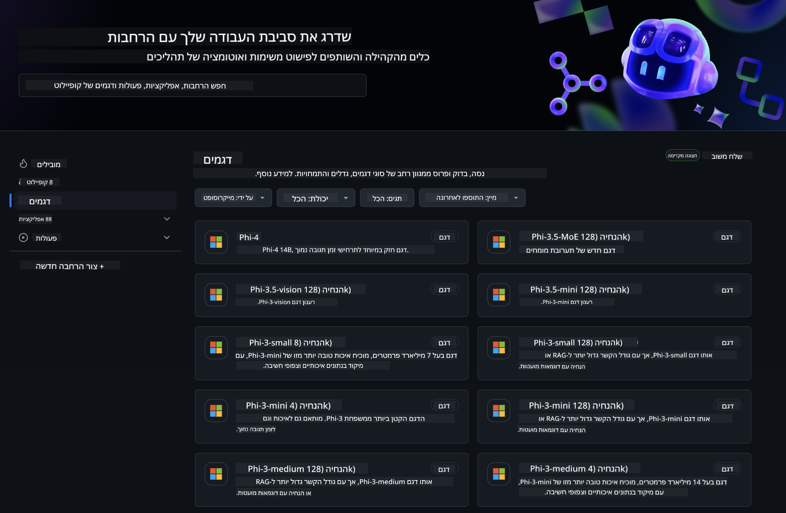
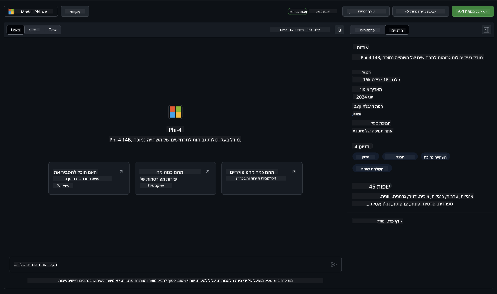
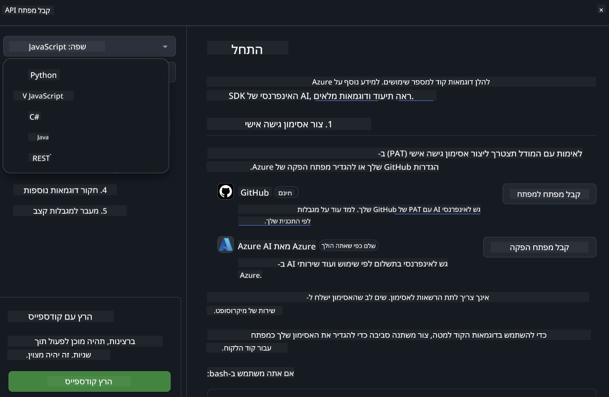
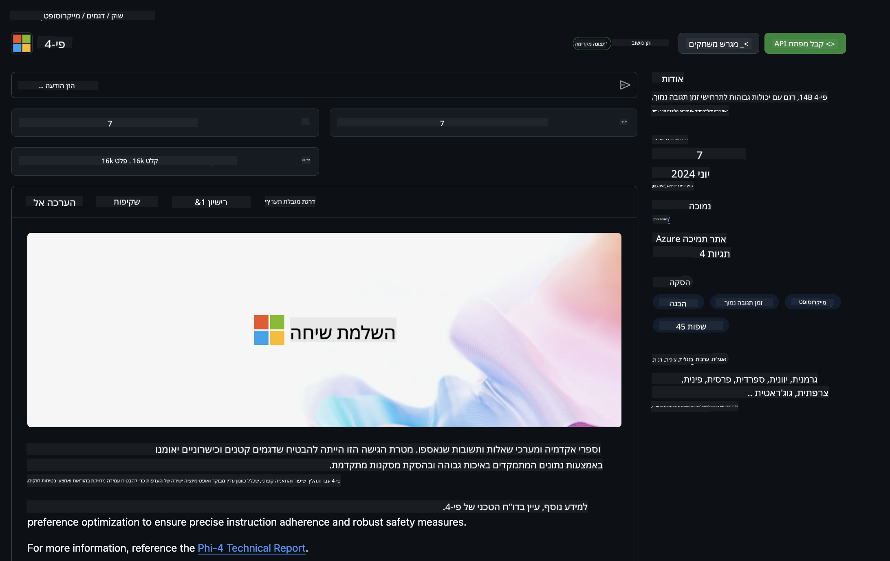

<!--
CO_OP_TRANSLATOR_METADATA:
{
  "original_hash": "fb67a08b9fc911a10ed58081fadef416",
  "translation_date": "2025-05-09T08:54:17+00:00",
  "source_file": "md/01.Introduction/02/02.GitHubModel.md",
  "language_code": "he"
}
-->
## משפחת Phi במודלים של GitHub

ברוכים הבאים ל-[GitHub Models](https://github.com/marketplace/models)! הכל מוכן ומחכה שתחקור מודלים של AI המארחים ב-Azure AI.



למידע נוסף על המודלים הזמינים ב-GitHub Models, עיין ב-[GitHub Model Marketplace](https://github.com/marketplace/models)

## מודלים זמינים

לכל מודל יש אזור משחק ייעודי וקוד לדוגמה



### משפחת Phi בקטלוג מודלים של GitHub

- [Phi-4](https://github.com/marketplace/models/azureml/Phi-4)

- [Phi-3.5-MoE instruct (128k)](https://github.com/marketplace/models/azureml/Phi-3-5-MoE-instruct)

- [Phi-3.5-vision instruct (128k)](https://github.com/marketplace/models/azureml/Phi-3-5-vision-instruct)

- [Phi-3.5-mini instruct (128k)](https://github.com/marketplace/models/azureml/Phi-3-5-mini-instruct)

- [Phi-3-Medium-128k-Instruct](https://github.com/marketplace/models/azureml/Phi-3-medium-128k-instruct)

- [Phi-3-medium-4k-instruct](https://github.com/marketplace/models/azureml/Phi-3-medium-4k-instruct)

- [Phi-3-mini-128k-instruct](https://github.com/marketplace/models/azureml/Phi-3-mini-128k-instruct)

- [Phi-3-mini-4k-instruct](https://github.com/marketplace/models/azureml/Phi-3-mini-4k-instruct)

- [Phi-3-small-128k-instruct](https://github.com/marketplace/models/azureml/Phi-3-small-128k-instruct)

- [Phi-3-small-8k-instruct](https://github.com/marketplace/models/azureml/Phi-3-small-8k-instruct)

## התחלה מהירה

יש כמה דוגמאות בסיסיות שמוכנות להפעלה. תוכל למצוא אותן בתיקיית הדוגמאות. אם תרצה לעבור ישר לשפה המועדפת עליך, תוכל למצוא את הדוגמאות בשפות הבאות:

- Python  
- JavaScript  
- C#  
- Java  
- cURL  

קיים גם סביבה ייעודית ב-Codespaces להרצת הדוגמאות והמודלים.



## קוד לדוגמה

להלן קטעי קוד לדוגמא למספר מקרים שימושיים. למידע נוסף על Azure AI Inference SDK, עיין בתיעוד המלא ובדוגמאות.

## הגדרה

1. צור טוקן גישה אישי  
אין צורך להעניק הרשאות לטוקן. שים לב שהטוקן ישלח לשירות של Microsoft.

כדי להשתמש בקטעי הקוד למטה, צור משתנה סביבה שבו הטוקן שלך ישמש כמפתח לקוד הלקוח.

אם אתה משתמש ב-bash:  
```
export GITHUB_TOKEN="<your-github-token-goes-here>"
```  
אם אתה ב-powershell:  

```
$Env:GITHUB_TOKEN="<your-github-token-goes-here>"
```  

אם אתה משתמש ב-Windows command prompt:  

```
set GITHUB_TOKEN=<your-github-token-goes-here>
```  

## דוגמת Python

### התקנת תלותים  
התקן את Azure AI Inference SDK באמצעות pip (נדרש: Python >=3.8):  

```
pip install azure-ai-inference
```  
### הפעלת דוגמת קוד בסיסית

דוגמה זו מדגימה קריאה בסיסית ל-API של השלמת שיחה. היא משתמשת בנקודת הקצה של מודל ה-AI של GitHub ובטוקן ה-GitHub שלך. הקריאה היא סינכרונית.

```python
import os
from azure.ai.inference import ChatCompletionsClient
from azure.ai.inference.models import SystemMessage, UserMessage
from azure.core.credentials import AzureKeyCredential

endpoint = "https://models.inference.ai.azure.com"
model_name = "Phi-4"
token = os.environ["GITHUB_TOKEN"]

client = ChatCompletionsClient(
    endpoint=endpoint,
    credential=AzureKeyCredential(token),
)

response = client.complete(
    messages=[
        UserMessage(content="I have $20,000 in my savings account, where I receive a 4% profit per year and payments twice a year. Can you please tell me how long it will take for me to become a millionaire? Also, can you please explain the math step by step as if you were explaining it to an uneducated person?"),
    ],
    temperature=0.4,
    top_p=1.0,
    max_tokens=2048,
    model=model_name
)

print(response.choices[0].message.content)
```

### הפעלת שיחה רב-סבבית

דוגמה זו מדגימה שיחה רב-סבבית עם API השלמת השיחה. כשמשתמשים במודל לאפליקציית שיחה, יש לנהל את היסטוריית השיחה ולשלוח את ההודעות האחרונות למודל.

```
import os
from azure.ai.inference import ChatCompletionsClient
from azure.ai.inference.models import AssistantMessage, SystemMessage, UserMessage
from azure.core.credentials import AzureKeyCredential

token = os.environ["GITHUB_TOKEN"]
endpoint = "https://models.inference.ai.azure.com"
# Replace Model_Name
model_name = "Phi-4"

client = ChatCompletionsClient(
    endpoint=endpoint,
    credential=AzureKeyCredential(token),
)

messages = [
    SystemMessage(content="You are a helpful assistant."),
    UserMessage(content="What is the capital of France?"),
    AssistantMessage(content="The capital of France is Paris."),
    UserMessage(content="What about Spain?"),
]

response = client.complete(messages=messages, model=model_name)

print(response.choices[0].message.content)
```

### זרימת פלט

כדי לשפר את חווית המשתמש, תרצה להזרים את תגובת המודל כך שהטוקן הראשון יופיע מוקדם ותמנע המתנה לתגובות ארוכות.

```
import os
from azure.ai.inference import ChatCompletionsClient
from azure.ai.inference.models import SystemMessage, UserMessage
from azure.core.credentials import AzureKeyCredential

token = os.environ["GITHUB_TOKEN"]
endpoint = "https://models.inference.ai.azure.com"
# Replace Model_Name
model_name = "Phi-4"

client = ChatCompletionsClient(
    endpoint=endpoint,
    credential=AzureKeyCredential(token),
)

response = client.complete(
    stream=True,
    messages=[
        SystemMessage(content="You are a helpful assistant."),
        UserMessage(content="Give me 5 good reasons why I should exercise every day."),
    ],
    model=model_name,
)

for update in response:
    if update.choices:
        print(update.choices[0].delta.content or "", end="")

client.close()
```

## שימוש חופשי ומגבלות קצב למודלים של GitHub



[מגבלות הקצב של אזור המשחק והשימוש החופשי ב-API](https://docs.github.com/en/github-models/prototyping-with-ai-models#rate-limits) נועדו לעזור לך להתנסות עם מודלים ולפתח אבטיפוס לאפליקציית AI שלך. לשימוש מעבר למגבלות אלו, ולהבאת האפליקציה שלך לקנה מידה, יש לספק משאבים מחשבון Azure, ולאמת את עצמך משם במקום מטוקן הגישה האישי של GitHub שלך. אין צורך לשנות דבר בקוד שלך. השתמש בקישור זה כדי לגלות כיצד לעבור את מגבלות השכבה החינמית ב-Azure AI.

### גילויים

זכור שכאשר אתה עובד עם מודל, אתה מתנסה ב-AI ולכן טעויות בתוכן הן אפשריות.

התכונה כפופה למגבלות שונות (כולל בקשות לדקה, בקשות ליום, טוקנים לבקשה ובקשות מקבילות) ואינה מיועדת לשימוש במקרים פרודקשן.

GitHub Models משתמש ב-Azure AI Content Safety. סינונים אלו לא ניתנים לכיבוי כחלק מחוויית GitHub Models. אם תבחר להשתמש במודלים דרך שירות בתשלום, אנא הגדר את מסנני התוכן שלך בהתאם לדרישותיך.

שירות זה כפוף לתנאי Pre-release של GitHub.

**כתב ויתור**:  
מסמך זה תורגם באמצעות שירות תרגום מבוסס בינה מלאכותית [Co-op Translator](https://github.com/Azure/co-op-translator). למרות שאנו שואפים לדיוק, יש לקחת בחשבון כי תרגומים אוטומטיים עלולים להכיל שגיאות או אי-דיוקים. המסמך המקורי בשפת המקור שלו צריך להיחשב כמקור הסמכותי. עבור מידע קריטי, מומלץ להשתמש בתרגום מקצועי על ידי אדם. אנו לא נושאים באחריות לכל אי-הבנה או פרשנות שגויה הנובעת משימוש בתרגום זה.