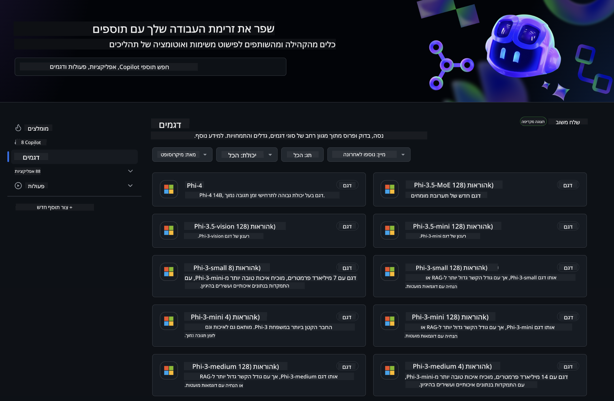
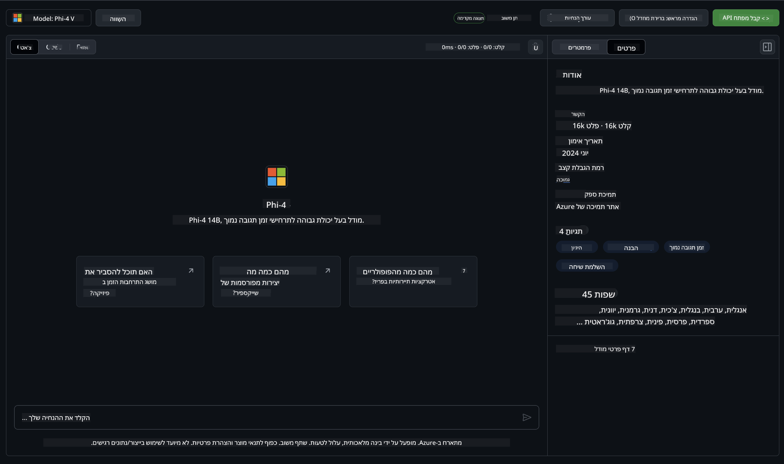
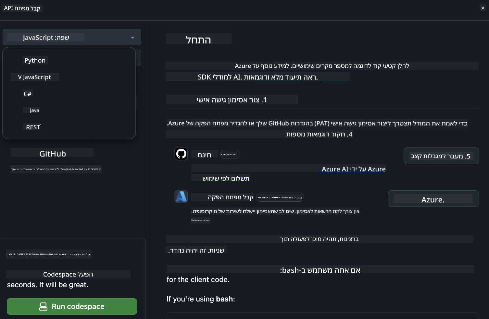
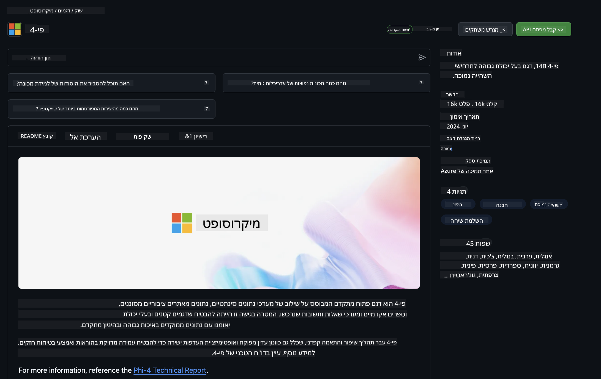

<!--
CO_OP_TRANSLATOR_METADATA:
{
  "original_hash": "fb67a08b9fc911a10ed58081fadef416",
  "translation_date": "2025-07-16T19:02:34+00:00",
  "source_file": "md/01.Introduction/02/02.GitHubModel.md",
  "language_code": "he"
}
-->
## משפחת Phi במודלים של GitHub

ברוכים הבאים ל-[GitHub Models](https://github.com/marketplace/models)! הכל מוכן ומזומן בשבילכם לחקור מודלים של בינה מלאכותית המתארחים ב-Azure AI.



למידע נוסף על המודלים הזמינים ב-GitHub Models, עיינו ב-[GitHub Model Marketplace](https://github.com/marketplace/models)

## מודלים זמינים

לכל מודל יש סביבת ניסוי ייעודית וקוד דוגמה



### משפחת Phi בקטלוג המודלים של GitHub

- [Phi-4](https://github.com/marketplace/models/azureml/Phi-4)

- [Phi-3.5-MoE instruct (128k)](https://github.com/marketplace/models/azureml/Phi-3-5-MoE-instruct)

- [Phi-3.5-vision instruct (128k)](https://github.com/marketplace/models/azureml/Phi-3-5-vision-instruct)

- [Phi-3.5-mini instruct (128k)](https://github.com/marketplace/models/azureml/Phi-3-5-mini-instruct)

- [Phi-3-Medium-128k-Instruct](https://github.com/marketplace/models/azureml/Phi-3-medium-128k-instruct)

- [Phi-3-medium-4k-instruct](https://github.com/marketplace/models/azureml/Phi-3-medium-4k-instruct)

- [Phi-3-mini-128k-instruct](https://github.com/marketplace/models/azureml/Phi-3-mini-128k-instruct)

- [Phi-3-mini-4k-instruct](https://github.com/marketplace/models/azureml/Phi-3-mini-4k-instruct)

- [Phi-3-small-128k-instruct](https://github.com/marketplace/models/azureml/Phi-3-small-128k-instruct)

- [Phi-3-small-8k-instruct](https://github.com/marketplace/models/azureml/Phi-3-small-8k-instruct)

## התחלה

יש כמה דוגמאות בסיסיות שמוכנות להרצה. תוכלו למצוא אותן בתיקיית הדוגמאות. אם תרצו לעבור ישר לשפת התכנות המועדפת עליכם, הדוגמאות זמינות בשפות הבאות:

- Python  
- JavaScript  
- C#  
- Java  
- cURL  

קיימת גם סביבת Codespaces ייעודית להרצת הדוגמאות והמודלים.



## קוד לדוגמה

להלן קטעי קוד לדוגמא למספר מקרים שימוש. למידע נוסף על Azure AI Inference SDK, ראו את התיעוד המלא והדוגמאות.

## הגדרה

1. צרו personal access token  
אין צורך להעניק הרשאות לטוקן. שימו לב שהטוקן יישלח לשירות של Microsoft.

כדי להשתמש בקטעי הקוד למטה, הגדירו משתנה סביבה עם הטוקן שלכם כמפתח עבור קוד הלקוח.

אם אתם משתמשים ב-bash:  
```
export GITHUB_TOKEN="<your-github-token-goes-here>"
```  
אם אתם ב-powershell:  

```
$Env:GITHUB_TOKEN="<your-github-token-goes-here>"
```  

אם אתם ב-Windows command prompt:  

```
set GITHUB_TOKEN=<your-github-token-goes-here>
```  

## דוגמת Python

### התקנת תלותים  
התקינו את Azure AI Inference SDK באמצעות pip (נדרש: Python >=3.8):

```
pip install azure-ai-inference
```  
### הרצת דוגמה בסיסית

דוגמה זו מדגימה קריאה בסיסית ל-API של השלמת שיחה. היא משתמשת בנקודת הקצה של מודל ה-AI של GitHub ובטוקן שלכם. הקריאה היא סינכרונית.

```python
import os
from azure.ai.inference import ChatCompletionsClient
from azure.ai.inference.models import SystemMessage, UserMessage
from azure.core.credentials import AzureKeyCredential

endpoint = "https://models.inference.ai.azure.com"
model_name = "Phi-4"
token = os.environ["GITHUB_TOKEN"]

client = ChatCompletionsClient(
    endpoint=endpoint,
    credential=AzureKeyCredential(token),
)

response = client.complete(
    messages=[
        UserMessage(content="I have $20,000 in my savings account, where I receive a 4% profit per year and payments twice a year. Can you please tell me how long it will take for me to become a millionaire? Also, can you please explain the math step by step as if you were explaining it to an uneducated person?"),
    ],
    temperature=0.4,
    top_p=1.0,
    max_tokens=2048,
    model=model_name
)

print(response.choices[0].message.content)
```

### הרצת שיחה מרובת סבבים

דוגמה זו מדגימה שיחה מרובת סבבים עם API השלמת השיחה. כשמשתמשים במודל ליישום שיחה, יש לנהל את היסטוריית השיחה ולשלוח למודל את ההודעות האחרונות.

```
import os
from azure.ai.inference import ChatCompletionsClient
from azure.ai.inference.models import AssistantMessage, SystemMessage, UserMessage
from azure.core.credentials import AzureKeyCredential

token = os.environ["GITHUB_TOKEN"]
endpoint = "https://models.inference.ai.azure.com"
# Replace Model_Name
model_name = "Phi-4"

client = ChatCompletionsClient(
    endpoint=endpoint,
    credential=AzureKeyCredential(token),
)

messages = [
    SystemMessage(content="You are a helpful assistant."),
    UserMessage(content="What is the capital of France?"),
    AssistantMessage(content="The capital of France is Paris."),
    UserMessage(content="What about Spain?"),
]

response = client.complete(messages=messages, model=model_name)

print(response.choices[0].message.content)
```

### זרימת פלט

כדי לשפר את חוויית המשתמש, רצוי להזרים את תגובת המודל כך שהטוקן הראשון יופיע מוקדם ולא תצטרכו להמתין לתגובות ארוכות.

```
import os
from azure.ai.inference import ChatCompletionsClient
from azure.ai.inference.models import SystemMessage, UserMessage
from azure.core.credentials import AzureKeyCredential

token = os.environ["GITHUB_TOKEN"]
endpoint = "https://models.inference.ai.azure.com"
# Replace Model_Name
model_name = "Phi-4"

client = ChatCompletionsClient(
    endpoint=endpoint,
    credential=AzureKeyCredential(token),
)

response = client.complete(
    stream=True,
    messages=[
        SystemMessage(content="You are a helpful assistant."),
        UserMessage(content="Give me 5 good reasons why I should exercise every day."),
    ],
    model=model_name,
)

for update in response:
    if update.choices:
        print(update.choices[0].delta.content or "", end="")

client.close()
```

## שימוש חינמי ומגבלות קצב למודלים של GitHub



[מגבלות הקצב לסביבת הניסוי והשימוש החינמי ב-API](https://docs.github.com/en/github-models/prototyping-with-ai-models#rate-limits) נועדו לאפשר לכם להתנסות במודלים ולפתח אב-טיפוס של יישום ה-AI שלכם. לשימוש מעבר למגבלות אלו, ולהרחבת היישום, יש לספק משאבים מחשבון Azure ולאמת דרכו במקום להשתמש ב-personal access token של GitHub. אין צורך לשנות דבר בקוד שלכם. השתמשו בקישור זה כדי ללמוד כיצד לעבור את מגבלות השכבה החינמית ב-Azure AI.

### גילויים

זכרו שכאשר אתם מתקשרים עם מודל, אתם מתנסים בבינה מלאכותית ולכן ייתכנו טעויות בתוכן.

התכונה כפופה למגבלות שונות (כולל בקשות לדקה, בקשות ליום, טוקנים לבקשה ובקשות מקבילות) ואינה מיועדת לשימוש במקרים פרודקשן.

GitHub Models משתמש ב-Azure AI Content Safety. מסננים אלו אינם ניתנים לכיבוי כחלק מחוויית GitHub Models. אם תבחרו להשתמש במודלים דרך שירות בתשלום, אנא הגדירו את מסנני התוכן בהתאם לצרכים שלכם.

שירות זה כפוף לתנאי Pre-release של GitHub.

**כתב ויתור**:  
מסמך זה תורגם באמצעות שירות תרגום מבוסס בינה מלאכותית [Co-op Translator](https://github.com/Azure/co-op-translator). למרות שאנו שואפים לדיוק, יש לקחת בחשבון כי תרגומים אוטומטיים עלולים להכיל שגיאות או אי-דיוקים. המסמך המקורי בשפת המקור שלו נחשב למקור הסמכותי. למידע קריטי מומלץ להשתמש בתרגום מקצועי על ידי אדם. אנו לא נושאים באחריות לכל אי-הבנה או פרשנות שגויה הנובעת משימוש בתרגום זה.