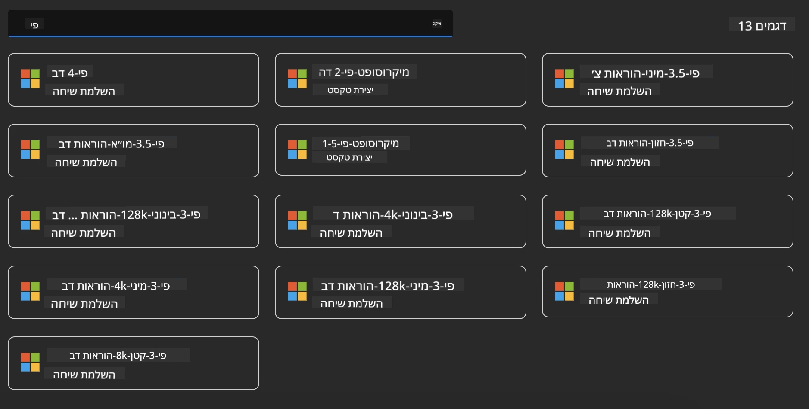
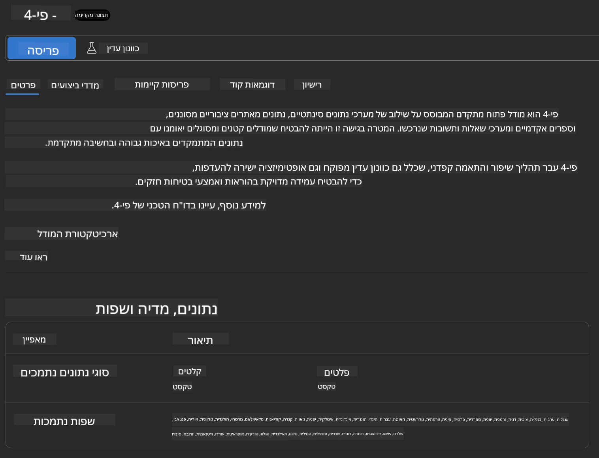
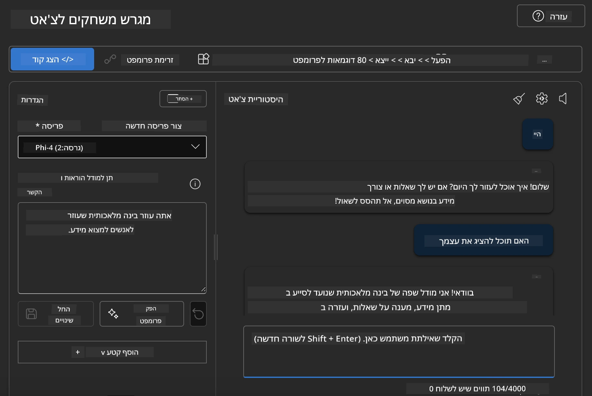

<!--
CO_OP_TRANSLATOR_METADATA:
{
  "original_hash": "3ae21dc5554e888defbe57946ee995ee",
  "translation_date": "2025-07-16T19:10:09+00:00",
  "source_file": "md/01.Introduction/02/03.AzureAIFoundry.md",
  "language_code": "he"
}
-->
## משפחת Phi ב-Azure AI Foundry

[Azure AI Foundry](https://ai.azure.com) היא פלטפורמה אמינה שמאפשרת למפתחים לקדם חדשנות ולעצב את העתיד עם בינה מלאכותית בצורה בטוחה, מאובטחת ואחראית.

[Azure AI Foundry](https://ai.azure.com) מיועדת למפתחים כדי:

- לבנות יישומי בינה מלאכותית גנרטיביים על פלטפורמה ברמת ארגון.
- לחקור, לבנות, לבדוק ולפרוס באמצעות כלים מתקדמים של בינה מלאכותית ודגמי למידת מכונה, המבוססים על עקרונות בינה מלאכותית אחראית.
- לשתף פעולה עם צוות לאורך כל מחזור חיי פיתוח היישום.

עם Azure AI Foundry, תוכלו לחקור מגוון רחב של דגמים, שירותים ויכולות, ולהתחיל לבנות יישומי בינה מלאכותית שמתאימים בצורה הטובה ביותר למטרות שלכם. פלטפורמת Azure AI Foundry מאפשרת גמישות בקנה מידה להמרת הוכחות מושג ליישומים מלאים בקלות. ניטור מתמשך ושיפור תומכים בהצלחה לטווח הארוך.


בנוסף לשימוש בשירות Azure AOAI ב-Azure AI Foundry, ניתן גם להשתמש בדגמים של צד שלישי בקטלוג הדגמים של Azure AI Foundry. זו בחירה טובה אם אתם רוצים להשתמש ב-Azure AI Foundry כפלטפורמת פתרונות הבינה המלאכותית שלכם.

ניתן לפרוס במהירות דגמי Phi Family דרך קטלוג הדגמים ב-Azure AI Foundry

[Microsoft Phi Models in Azure AI Foundry Models](https://ai.azure.com/explore/models/?selectedCollection=phi)



### **פריסת Phi-4 ב-Azure AI Foundry**



### **בדיקת Phi-4 ב-Azure AI Foundry Playground**



### **הרצת קוד Python לקריאה ל-Azure AI Foundry Phi-4**

```python

import os  
import base64
from openai import AzureOpenAI  
from azure.identity import DefaultAzureCredential, get_bearer_token_provider  
        
endpoint = os.getenv("ENDPOINT_URL", "Your Azure AOAI Service Endpoint")  
deployment = os.getenv("DEPLOYMENT_NAME", "Phi-4")  
      
token_provider = get_bearer_token_provider(  
    DefaultAzureCredential(),  
    "https://cognitiveservices.azure.com/.default"  
)  
  
client = AzureOpenAI(  
    azure_endpoint=endpoint,  
    azure_ad_token_provider=token_provider,  
    api_version="2024-05-01-preview",  
)  
  

chat_prompt = [
    {
        "role": "system",
        "content": "You are an AI assistant that helps people find information."
    },
    {
        "role": "user",
        "content": "can you introduce yourself"
    }
] 
    
# Include speech result if speech is enabled  
messages = chat_prompt 

completion = client.chat.completions.create(  
    model=deployment,  
    messages=messages,
    max_tokens=800,  
    temperature=0.7,  
    top_p=0.95,  
    frequency_penalty=0,  
    presence_penalty=0,
    stop=None,  
    stream=False  
)  
  
print(completion.to_json())  

```

**כתב ויתור**:  
מסמך זה תורגם באמצעות שירות תרגום מבוסס בינה מלאכותית [Co-op Translator](https://github.com/Azure/co-op-translator). למרות שאנו שואפים לדיוק, יש לקחת בחשבון כי תרגומים אוטומטיים עלולים להכיל שגיאות או אי-דיוקים. המסמך המקורי בשפת המקור שלו נחשב למקור הסמכותי. למידע קריטי מומלץ להשתמש בתרגום מקצועי על ידי מתרגם אנושי. אנו לא נושאים באחריות לכל אי-הבנה או פרשנות שגויה הנובעת משימוש בתרגום זה.