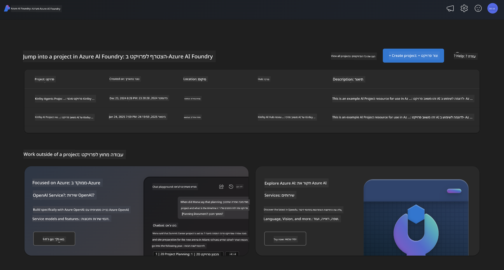
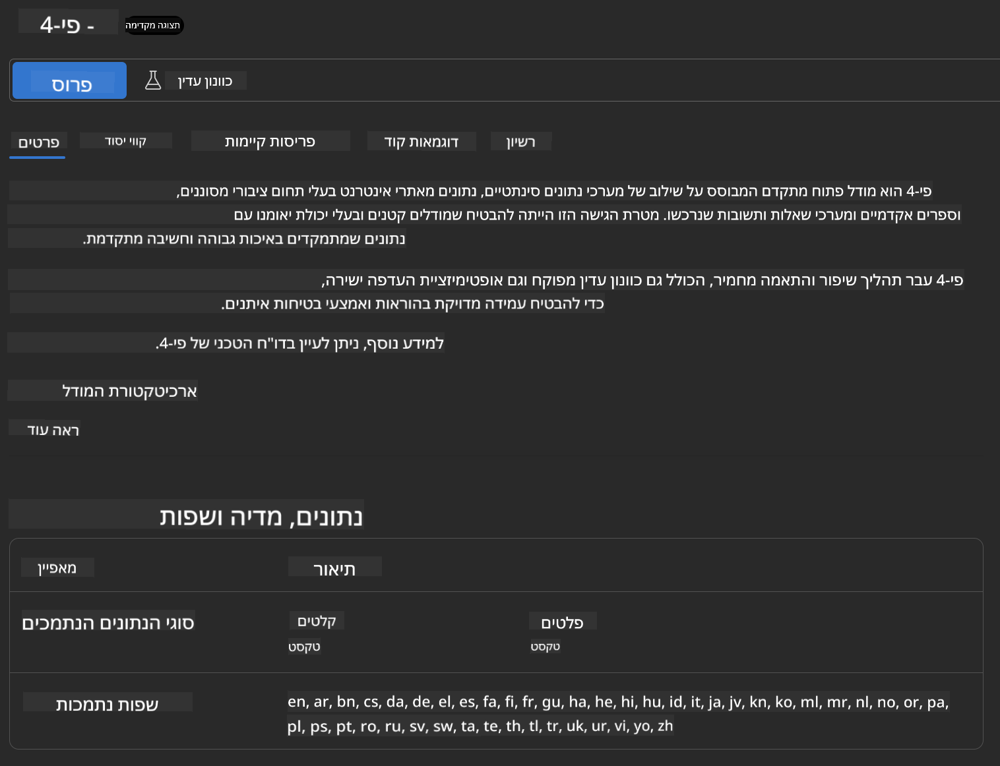
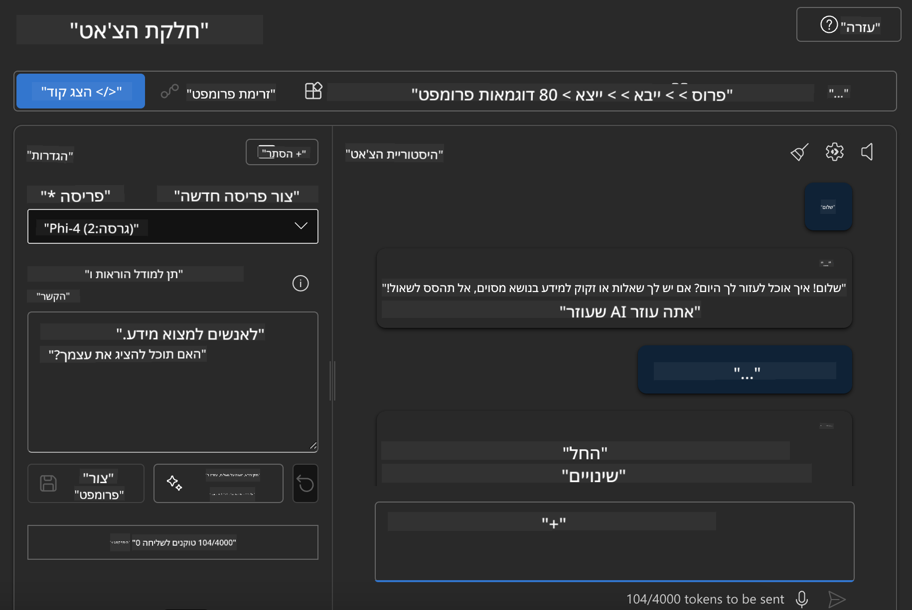

<!--
CO_OP_TRANSLATOR_METADATA:
{
  "original_hash": "3ae21dc5554e888defbe57946ee995ee",
  "translation_date": "2025-05-09T09:07:08+00:00",
  "source_file": "md/01.Introduction/02/03.AzureAIFoundry.md",
  "language_code": "he"
}
-->
## משפחת Phi ב-Azure AI Foundry

[Azure AI Foundry](https://ai.azure.com) היא פלטפורמה אמינה שמעצימה מפתחים לקדם חדשנות ולעצב את העתיד עם בינה מלאכותית בצורה בטוחה, מאובטחת ואחראית.

[Azure AI Foundry](https://ai.azure.com) מיועדת למפתחים כדי:

- לבנות יישומי בינה מלאכותית גנרטיבית על פלטפורמה ברמת ארגון.
- לחקור, לבנות, לבדוק ולפרוס תוך שימוש בכלי AI מתקדמים ודגמי ML, המבוססים על עקרונות בינה מלאכותית אחראית.
- לשתף פעולה עם צוות לאורך כל מחזור חיי פיתוח היישום.

עם Azure AI Foundry, ניתן לחקור מגוון רחב של דגמים, שירותים ויכולות, ולהתחיל לבנות יישומי AI שמתאימים בצורה הטובה ביותר למטרות שלך. פלטפורמת Azure AI Foundry מאפשרת גמישות בקנה מידה להמרת הוכחות-קונספט ליישומי ייצור מלאים בקלות. ניטור מתמשך ושיפור תומכים בהצלחה ארוכת טווח.



בנוסף לשימוש ב-Azure AOAI Service בתוך Azure AI Foundry, ניתן גם להשתמש בדגמים של צד שלישי ב-Model Catalog של Azure AI Foundry. זו בחירה טובה אם רוצים להשתמש ב-Azure AI Foundry כפלטפורמת פתרון AI.

ניתן לפרוס במהירות דגמי משפחת Phi דרך Model Catalog ב-Azure AI Foundry

[Microsoft Phi Models in Azure AI Foundry Models](https://ai.azure.com/explore/models/?selectedCollection=phi)


### **פריסת Phi-4 ב-Azure AI Foundry**



### **בדיקת Phi-4 ב-Azure AI Foundry Playground**



### **הרצת קוד Python לקריאה ל-Azure AI Foundry Phi-4**

```python

import os  
import base64
from openai import AzureOpenAI  
from azure.identity import DefaultAzureCredential, get_bearer_token_provider  
        
endpoint = os.getenv("ENDPOINT_URL", "Your Azure AOAI Service Endpoint")  
deployment = os.getenv("DEPLOYMENT_NAME", "Phi-4")  
      
token_provider = get_bearer_token_provider(  
    DefaultAzureCredential(),  
    "https://cognitiveservices.azure.com/.default"  
)  
  
client = AzureOpenAI(  
    azure_endpoint=endpoint,  
    azure_ad_token_provider=token_provider,  
    api_version="2024-05-01-preview",  
)  
  

chat_prompt = [
    {
        "role": "system",
        "content": "You are an AI assistant that helps people find information."
    },
    {
        "role": "user",
        "content": "can you introduce yourself"
    }
] 
    
# Include speech result if speech is enabled  
messages = chat_prompt 

completion = client.chat.completions.create(  
    model=deployment,  
    messages=messages,
    max_tokens=800,  
    temperature=0.7,  
    top_p=0.95,  
    frequency_penalty=0,  
    presence_penalty=0,
    stop=None,  
    stream=False  
)  
  
print(completion.to_json())  

```

**כתב ויתור**:  
מסמך זה תורגם באמצעות שירות תרגום מבוסס בינה מלאכותית [Co-op Translator](https://github.com/Azure/co-op-translator). למרות שאנו שואפים לדיוק, יש לקחת בחשבון כי תרגומים אוטומטיים עלולים להכיל שגיאות או אי דיוקים. יש להתייחס למסמך המקורי בשפתו המקורית כמקור הסמכותי. למידע קריטי מומלץ להשתמש בתרגום מקצועי של אדם. איננו אחראים לכל אי הבנה או פרשנות שגויה הנובעים משימוש בתרגום זה.