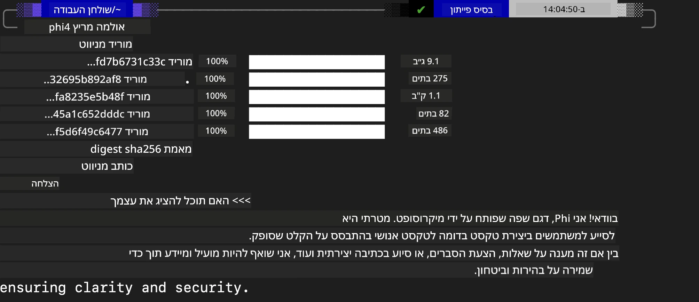
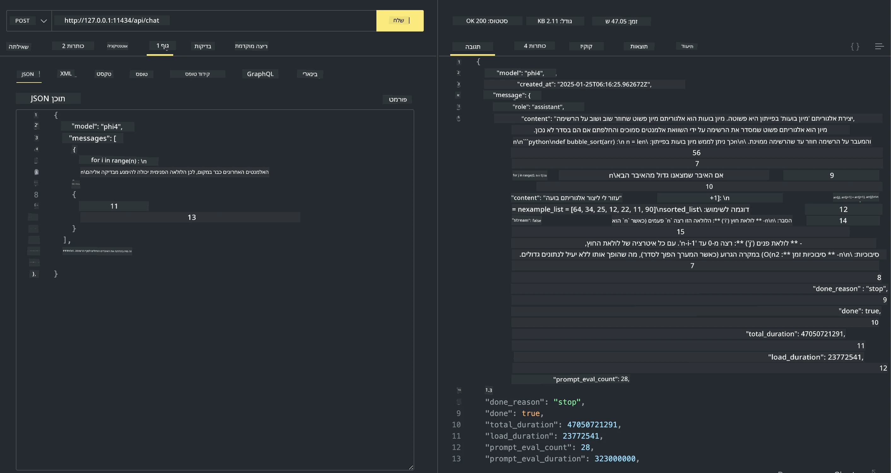

## משפחת Phi ב-Ollama


[Ollama](https://ollama.com) מאפשרת ליותר אנשים לפרוס ישירות LLM או SLM בקוד פתוח בעזרת סקריפטים פשוטים, ויכולה גם לבנות APIs כדי לסייע בתרחישי שימוש מקומיים של Copilot.

## **1. התקנה**

Ollama תומכת בהפעלה על Windows, macOS ו-Linux. ניתן להתקין את Ollama דרך הקישור ([https://ollama.com/download](https://ollama.com/download)). לאחר התקנה מוצלחת, ניתן להשתמש ישירות בסקריפט של Ollama כדי לקרוא ל-Phi-3 דרך חלון טרמינל. ניתן לראות את כל [הספריות הזמינות ב-Ollama](https://ollama.com/library). אם תפתח מאגר זה ב-Codespace, יהיו בו כבר Ollama מותקן.

```bash

ollama run phi4

```

> [!NOTE]
> המודל יורד תחילה כשמריצים אותו לראשונה. כמובן, ניתן גם לציין ישירות את דגם Phi-4 שהורדתם. אנו משתמשים ב-WSL כדוגמה להרצת הפקודה. לאחר שהמודל יורד בהצלחה, תוכלו לקיים אינטראקציה ישירות בטרמינל.



## **2. קריאה ל-API של phi-4 מתוך Ollama**

אם ברצונך לקרוא ל-API של Phi-4 שנוצר על-ידי Ollama, ניתן להשתמש בפקודה הזו בטרמינל כדי להפעיל את שרת Ollama.

```bash

ollama serve

```

> [!NOTE]
> אם אתה מריץ MacOS או Linux, שים לב שאולי תיתקל בשגיאה הבאה **"Error: listen tcp 127.0.0.1:11434: bind: address already in use"**. ייתכן שתקבל שגיאה זו כאשר מריצים את הפקודה. ניתן להתעלם משגיאה זו, כיוון שבדרך כלל היא מצביעה שהשרת כבר רץ, או שתוכל לעצור ולהפעיל מחדש את Ollama:

**macOS**

```bash

brew services restart ollama

```

**Linux**

```bash

sudo systemctl stop ollama

```

Ollama תומכת בשני API: generate ו-chat. ניתן לקרוא ל-API של המודל שסופק על-ידי Ollama לפי הצורך, על-ידי שליחת בקשות לשירות המקומי שרץ על פורט 11434.

**Chat**

```bash

curl http://127.0.0.1:11434/api/chat -d '{
  "model": "phi3",
  "messages": [
    {
      "role": "system",
      "content": "Your are a python developer."
    },
    {
      "role": "user",
      "content": "Help me generate a bubble algorithm"
    }
  ],
  "stream": false
  
}'
```

זוהי התוצאה ב-Postman



## משאבים נוספים

עיין ברשימת המודלים הזמינים ב-Ollama ב-[הספרייה שלהם](https://ollama.com/library).

משוך את המודל שלך משרת Ollama באמצעות הפקודה הזו

```bash
ollama pull phi4
```

הרץ את המודל באמצעות פקודה זו

```bash
ollama run phi4
```

***הערה:*** בקר בקישור [https://github.com/ollama/ollama/blob/main/docs/api.md](https://github.com/ollama/ollama/blob/main/docs/api.md) כדי ללמוד עוד

## קריאה ל-Ollama מ-Python

ניתן להשתמש ב-`requests` או `urllib3` כדי לבצע בקשות לנקודות הקצה של השרת המקומי שנמצאו למעלה. עם זאת, דרך פופולרית להשתמש ב-Ollama ב-Python היא באמצעות ה-SDK של [openai](https://pypi.org/project/openai/), מאחר ש-Ollama מספק נקודות קצה תואמות OpenAI גם כן.

להלן דוגמה עבור phi3-mini:

```python
import openai

client = openai.OpenAI(
    base_url="http://localhost:11434/v1",
    api_key="nokeyneeded",
)

response = client.chat.completions.create(
    model="phi4",
    temperature=0.7,
    n=1,
    messages=[
        {"role": "system", "content": "You are a helpful assistant."},
        {"role": "user", "content": "Write a haiku about a hungry cat"},
    ],
)

print("Response:")
print(response.choices[0].message.content)
```

## קריאה ל-Ollama מ-JavaScript 

```javascript
// דוגמה לסיכום קובץ עם Phi-4
script({
    model: "ollama:phi4",
    title: "Summarize with Phi-4",
    system: ["system"],
})

// דוגמה לסיכום
const file = def("FILE", env.files)
$`Summarize ${file} in a single paragraph.`
```

## קריאה ל-Ollama מ-C#

צור אפליקציית Console ב-C# חדשה והוסף את חבילת NuGet הבאה:

```bash
dotnet add package Microsoft.SemanticKernel --version 1.34.0
```

לאחר מכן החלף קוד זה בקובץ `Program.cs`

```csharp
using Microsoft.SemanticKernel;
using Microsoft.SemanticKernel.ChatCompletion;

// add chat completion service using the local ollama server endpoint
#pragma warning disable SKEXP0001, SKEXP0003, SKEXP0010, SKEXP0011, SKEXP0050, SKEXP0052
builder.AddOpenAIChatCompletion(
    modelId: "phi4",
    endpoint: new Uri("http://localhost:11434/"),
    apiKey: "non required");

// invoke a simple prompt to the chat service
string prompt = "Write a joke about kittens";
var response = await kernel.InvokePromptAsync(prompt);
Console.WriteLine(response.GetValue<string>());
```

הרץ את האפליקציה עם הפקודה:

```bash
dotnet run
```

---

<!-- CO-OP TRANSLATOR DISCLAIMER START -->
הצהרת אי-אחריות:
מסמך זה תורגם באמצעות שירות תרגום מבוסס בינה מלאכותית [Co-op Translator](https://github.com/Azure/co-op-translator). למרות שאנו שואפים לדיוק, יש לשים לב כי תרגומים אוטומטיים עלולים להכיל שגיאות או אי‑דיוקים. יש להתייחס למסמך המקורי בשפתו כמקור הסמכות. עבור מידע קריטי מומלץ לבצע תרגום מקצועי באמצעות מתרגם אנושי. איננו אחראים לכל אי‑הבנה או פרשנות שגויה הנובעת משימוש בתרגום זה.
<!-- CO-OP TRANSLATOR DISCLAIMER END -->