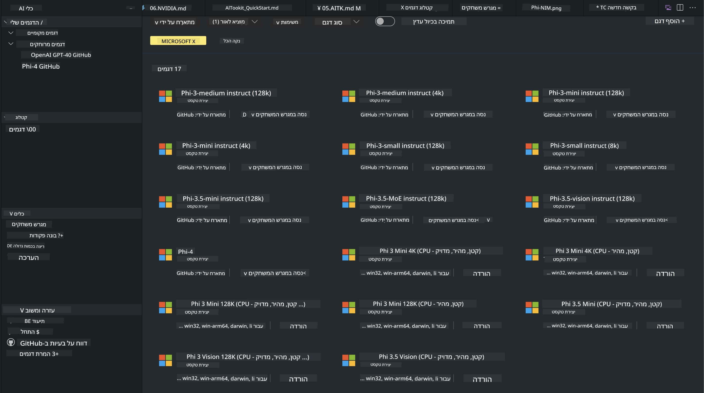
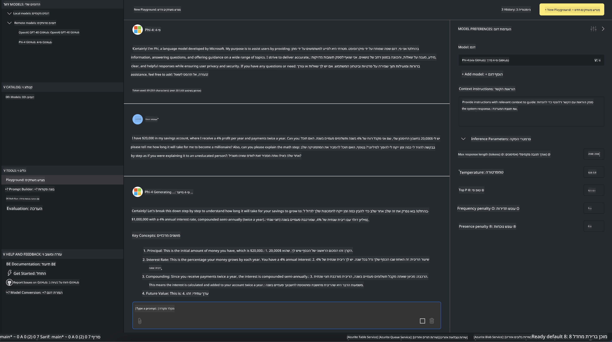

<!--
CO_OP_TRANSLATOR_METADATA:
{
  "original_hash": "4951d458c0b60c02cd1e751b40903877",
  "translation_date": "2025-07-16T19:28:02+00:00",
  "source_file": "md/01.Introduction/02/05.AITK.md",
  "language_code": "he"
}
-->
# משפחת Phi ב-AITK

[AI Toolkit for VS Code](https://marketplace.visualstudio.com/items?itemName=ms-windows-ai-studio.windows-ai-studio) מפשטת את פיתוח אפליקציות AI גנרטיביות על ידי איחוד כלים ומודלים מתקדמים לפיתוח AI מתוך Azure AI Foundry Catalog וקטלוגים נוספים כמו Hugging Face. תוכלו לגלוש בקטלוג המודלים של AI המופעל על ידי GitHub Models ו-Azure AI Foundry Model Catalogs, להוריד אותם למחשב המקומי או מרחוק, לכוונן, לבדוק ולהשתמש בהם באפליקציה שלכם.

AI Toolkit Preview ירוץ באופן מקומי. האינפרנס המקומי או הכוונון המדויק תלוי במודל שבחרתם, ייתכן ותצטרכו GPU כמו NVIDIA CUDA GPU. ניתן גם להריץ את GitHub Models ישירות עם AITK.

## התחלה

[למידע נוסף על התקנת Windows subsystem for Linux](https://learn.microsoft.com/windows/wsl/install?WT.mc_id=aiml-137032-kinfeylo)

ו-[שינוי הפצת הלינוקס ברירת המחדל](https://learn.microsoft.com/windows/wsl/install#change-the-default-linux-distribution-installed).

[מאגר GitHub של AI Toolkit](https://github.com/microsoft/vscode-ai-toolkit/)

- Windows, Linux, macOS

- עבור כוונון מדויק ב-Windows ו-Linux, תזדקקו ל-Nvidia GPU. בנוסף, **Windows** דורש subsystem for Linux עם הפצת Ubuntu 18.4 ומעלה. [למידע נוסף על התקנת Windows subsystem for Linux](https://learn.microsoft.com/windows/wsl/install) ו-[שינוי הפצת ברירת המחדל](https://learn.microsoft.com/windows/wsl/install#change-the-default-linux-distribution-installed).

### התקנת AI Toolkit

AI Toolkit מגיע כהרחבה של [Visual Studio Code](https://code.visualstudio.com/docs/setup/additional-components#_vs-code-extensions), לכן יש להתקין קודם [VS Code](https://code.visualstudio.com/docs/setup/windows?WT.mc_id=aiml-137032-kinfeylo) ולהוריד את AI Toolkit מ-[VS Marketplace](https://marketplace.visualstudio.com/items?itemName=ms-windows-ai-studio.windows-ai-studio).  
[AI Toolkit זמין ב-Visual Studio Marketplace](https://marketplace.visualstudio.com/items?itemName=ms-windows-ai-studio.windows-ai-studio) וניתן להתקין אותו כמו כל הרחבה אחרת של VS Code.

אם אינכם מכירים את תהליך התקנת ההרחבות ב-VS Code, עקבו אחר השלבים הבאים:

### התחברות

1. בסרגל הפעילות ב-VS Code בחרו ב-**Extensions**  
1. בשורת החיפוש של ההרחבות הקלידו "AI Toolkit"  
1. בחרו ב-"AI Toolkit for Visual Studio code"  
1. לחצו על **Install**

כעת אתם מוכנים להשתמש בהרחבה!

תתבקשו להתחבר ל-GitHub, אנא לחצו על "Allow" כדי להמשיך. תועברו לדף ההתחברות של GitHub.

התחברו ופעלו לפי השלבים. לאחר השלמת התהליך בהצלחה, תועברו חזרה ל-VS Code.

לאחר התקנת ההרחבה תראו את סמל AI Toolkit מופיע בסרגל הפעילות.

בואו נחקור את הפעולות הזמינות!

### פעולות זמינות

סרגל הצד הראשי של AI Toolkit מאורגן ל-

- **Models**  
- **Resources**  
- **Playground**  
- **Fine-tuning**  
- **Evaluation**

זמינים תחת סעיף Resources. כדי להתחיל בחרו ב-**Model Catalog**.

### הורדת מודל מהקטלוג

כשתפעילו את AI Toolkit מסרגל הצד של VS Code, תוכלו לבחור באפשרויות הבאות:



- מצאו מודל נתמך ב-**Model Catalog** והורידו אותו למחשב המקומי  
- בדקו את האינפרנס של המודל ב-**Model Playground**  
- כווננו את המודל באופן מקומי או מרחוק ב-**Model Fine-tuning**  
- פרסמו מודלים מכווננים לענן דרך פלטת הפקודות של AI Toolkit  
- הערכת מודלים

> [!NOTE]
>
> **GPU לעומת CPU**  
>
> תבחינו שכרטיסי המודל מציגים את גודל המודל, הפלטפורמה וסוג המאיץ (CPU, GPU). לביצועים מיטביים על **מכשירי Windows עם לפחות GPU אחד**, בחרו בגרסאות מודל המיועדות רק ל-Windows.  
>
> זה מבטיח שהמודל מותאם למאיץ DirectML.  
>
> שמות המודלים הם בפורמט  
>
> - `{model_name}-{accelerator}-{quantization}-{format}`.  
>
>כדי לבדוק אם יש לכם GPU במכשיר Windows, פתחו את **Task Manager** ואז בחרו בלשונית **Performance**. אם יש לכם GPU, הם יופיעו תחת שמות כמו "GPU 0" או "GPU 1".

### הרצת המודל ב-playground

לאחר שכל הפרמטרים הוגדרו, לחצו על **Generate Project**.

כשהמודל יורד, בחרו ב-**Load in Playground** בכרטיס המודל בקטלוג:

- התחילו את הורדת המודל  
- התקינו את כל התלויות והדרישות  
- צרו סביבת עבודה ב-VS Code



### שימוש ב-REST API באפליקציה שלכם

AI Toolkit מגיע עם שרת REST API מקומי **בפורט 5272** המשתמש ב-[פורמט השלמות הצ'אט של OpenAI](https://platform.openai.com/docs/api-reference/chat/create).

זה מאפשר לכם לבדוק את האפליקציה שלכם באופן מקומי מבלי להסתמך על שירות AI בענן. לדוגמה, קובץ JSON הבא מראה כיצד להגדיר את גוף הבקשה:

```json
{
    "model": "Phi-4",
    "messages": [
        {
            "role": "user",
            "content": "what is the golden ratio?"
        }
    ],
    "temperature": 0.7,
    "top_p": 1,
    "top_k": 10,
    "max_tokens": 100,
    "stream": true
}
```

ניתן לבדוק את REST API באמצעות (למשל) [Postman](https://www.postman.com/) או כלי CURL (Client URL):

```bash
curl -vX POST http://127.0.0.1:5272/v1/chat/completions -H 'Content-Type: application/json' -d @body.json
```

### שימוש בספריית הלקוח OpenAI בפייתון

```python
from openai import OpenAI

client = OpenAI(
    base_url="http://127.0.0.1:5272/v1/", 
    api_key="x" # required for the API but not used
)

chat_completion = client.chat.completions.create(
    messages=[
        {
            "role": "user",
            "content": "what is the golden ratio?",
        }
    ],
    model="Phi-4",
)

print(chat_completion.choices[0].message.content)
```

### שימוש בספריית הלקוח Azure OpenAI ל-.NET

הוסיפו את [ספריית הלקוח Azure OpenAI ל-.NET](https://www.nuget.org/packages/Azure.AI.OpenAI/) לפרויקט שלכם באמצעות NuGet:

```bash
dotnet add {project_name} package Azure.AI.OpenAI --version 1.0.0-beta.17
```

הוסיפו קובץ C# בשם **OverridePolicy.cs** לפרויקט והדביקו את הקוד הבא:

```csharp
// OverridePolicy.cs
using Azure.Core.Pipeline;
using Azure.Core;

internal partial class OverrideRequestUriPolicy(Uri overrideUri)
    : HttpPipelineSynchronousPolicy
{
    private readonly Uri _overrideUri = overrideUri;

    public override void OnSendingRequest(HttpMessage message)
    {
        message.Request.Uri.Reset(_overrideUri);
    }
}
```

לאחר מכן, הדביקו את הקוד הבא בקובץ **Program.cs** שלכם:

```csharp
// Program.cs
using Azure.AI.OpenAI;

Uri localhostUri = new("http://localhost:5272/v1/chat/completions");

OpenAIClientOptions clientOptions = new();
clientOptions.AddPolicy(
    new OverrideRequestUriPolicy(localhostUri),
    Azure.Core.HttpPipelinePosition.BeforeTransport);
OpenAIClient client = new(openAIApiKey: "unused", clientOptions);

ChatCompletionsOptions options = new()
{
    DeploymentName = "Phi-4",
    Messages =
    {
        new ChatRequestSystemMessage("You are a helpful assistant. Be brief and succinct."),
        new ChatRequestUserMessage("What is the golden ratio?"),
    }
};

StreamingResponse<StreamingChatCompletionsUpdate> streamingChatResponse
    = await client.GetChatCompletionsStreamingAsync(options);

await foreach (StreamingChatCompletionsUpdate chatChunk in streamingChatResponse)
{
    Console.Write(chatChunk.ContentUpdate);
}
```


## כוונון מדויק עם AI Toolkit

- התחילו בגילוי מודלים ו-playground.  
- כוונון מדויק ואינפרנס באמצעות משאבי מחשוב מקומיים.  
- כוונון ואינפרנס מרחוק באמצעות משאבי Azure.

[כוונון מדויק עם AI Toolkit](../../03.FineTuning/Finetuning_VSCodeaitoolkit.md)

## משאבי שאלות ותשובות ל-AI Toolkit

אנא עיינו ב-[דף השאלות והתשובות שלנו](https://github.com/microsoft/vscode-ai-toolkit/blob/main/archive/QA.md) עבור הבעיות הנפוצות ביותר ופתרונן.

**כתב ויתור**:  
מסמך זה תורגם באמצעות שירות תרגום מבוסס בינה מלאכותית [Co-op Translator](https://github.com/Azure/co-op-translator). למרות שאנו שואפים לדיוק, יש לקחת בחשבון כי תרגומים אוטומטיים עלולים להכיל שגיאות או אי-דיוקים. יש להתייחס למסמך המקורי בשפתו המקורית כמקור הסמכותי. למידע קריטי מומלץ להשתמש בתרגום מקצועי על ידי מתרגם אנושי. אנו לא נושאים באחריות לכל אי-הבנה או פרשנות שגויה הנובעת משימוש בתרגום זה.