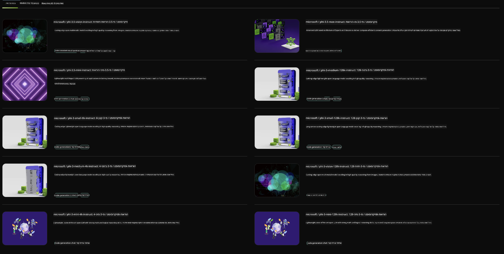

<!--
CO_OP_TRANSLATOR_METADATA:
{
  "original_hash": "7b08e277df2a9307f861ae54bc30c772",
  "translation_date": "2025-05-09T09:57:27+00:00",
  "source_file": "md/01.Introduction/02/06.NVIDIA.md",
  "language_code": "he"
}
-->
## משפחת Phi ב-NVIDIA NIM

NVIDIA NIM היא סט של מיקרו-שירותים קלים לשימוש שנועדו להאיץ את פריסת מודלי בינה מלאכותית גנרטיביים בענן, במרכזי נתונים ובתחנות עבודה. ה-NIMs מסווגים לפי משפחת מודלים ועל בסיס כל מודל בנפרד. לדוגמה, NVIDIA NIM עבור מודלים גדולים של שפה (LLMs) מביא את עוצמתם של מודלים מתקדמים אלה ליישומי ארגונים, ומספק יכולות עיבוד והבנת שפה טבעית שאין להן תחרות.

NIM מקל על צוותי IT ו-DevOps לארח בעצמם מודלים גדולים של שפה (LLMs) בסביבות מנוהלות משלהם, תוך מתן ממשקי API סטנדרטיים בתעשייה למפתחים, שמאפשרים להם לבנות עוזרים חכמים, צ'אטבוטים ועוזרי AI רבי עוצמה שיכולים לשנות את העסק שלהם. תוך שימוש בהאצה מהפכנית של GPU מבית NVIDIA ופריסה סקלאבילית, NIM מציע את הנתיב המהיר ביותר להסקת מסקנות עם ביצועים שאין להם מתחרים.

אתם יכולים להשתמש ב-NVIDIA NIM להסקת מסקנות ממודלי משפחת Phi



### **דוגמאות - Phi-3-Vision ב-NVIDIA NIM**

דמיינו שיש לכם תמונה (`demo.png`) ואתם רוצים לייצר קוד פייתון שמעבד את התמונה ושומר גרסה חדשה שלה (`phi-3-vision.jpg`).

הקוד שלמעלה מאוטומט את התהליך על ידי:

1. הקמת הסביבה והגדרות הנחוצות.
2. יצירת פרומפט שמנחה את המודל לייצר את קוד הפייתון הדרוש.
3. שליחת הפרומפט למודל ואיסוף הקוד שנוצר.
4. חילוץ והרצת הקוד שנוצר.
5. הצגת התמונות המקורית והמעובדת.

גישה זו מנצלת את עוצמת הבינה המלאכותית לאוטומציה של משימות עיבוד תמונה, מה שהופך את ההגעה למטרות שלכם לקלה ומהירה יותר.

[פתרון קוד לדוגמה](../../../../../code/06.E2E/E2E_Nvidia_NIM_Phi3_Vision.ipynb)

בואו נפרק את כל הקוד שלב אחר שלב:

1. **התקנת חבילה דרושה**:  
    ```python
    !pip install langchain_nvidia_ai_endpoints -U
    ```  
    הפקודה הזו מתקינה את החבילה `langchain_nvidia_ai_endpoints` ומוודאת שזו הגרסה העדכנית ביותר.

2. **ייבוא מודולים נחוצים**:  
    ```python
    from langchain_nvidia_ai_endpoints import ChatNVIDIA
    import getpass
    import os
    import base64
    ```  
    הייבוא הזה מביא את המודולים הנחוצים לאינטראקציה עם נקודות הקצה של NVIDIA AI, לניהול סיסמאות בצורה מאובטחת, לאינטראקציה עם מערכת ההפעלה, ולקידוד/פענוח נתונים בפורמט base64.

3. **הגדרת מפתח API**:  
    ```python
    if not os.getenv("NVIDIA_API_KEY"):
        os.environ["NVIDIA_API_KEY"] = getpass.getpass("Enter your NVIDIA API key: ")
    ```  
    הקוד בודק אם משתנה הסביבה `NVIDIA_API_KEY` מוגדר. אם לא, הוא מבקש מהמשתמש להזין את מפתח ה-API שלו בצורה מאובטחת.

4. **הגדרת המודל ונתיב התמונה**:  
    ```python
    model = 'microsoft/phi-3-vision-128k-instruct'
    chat = ChatNVIDIA(model=model)
    img_path = './imgs/demo.png'
    ```  
    כאן מגדירים את המודל שישמש, יוצרים מופע של `ChatNVIDIA` עם המודל שצויין, ומגדירים את הנתיב לקובץ התמונה.

5. **יצירת פרומפט טקסטואלי**:  
    ```python
    text = "Please create Python code for image, and use plt to save the new picture under imgs/ and name it phi-3-vision.jpg."
    ```  
    הגדרה של פרומפט טקסטואלי שמנחה את המודל לייצר קוד פייתון לעיבוד תמונה.

6. **קידוד התמונה ב-base64**:  
    ```python
    with open(img_path, "rb") as f:
        image_b64 = base64.b64encode(f.read()).decode()
    image = f''
    ```  
    הקוד קורא את קובץ התמונה, מקודד אותו ב-base64, ויוצר תגית HTML של תמונה עם הנתונים המקודדים.

7. **שילוב הטקסט והתמונה בפרומפט**:  
    ```python
    prompt = f"{text} {image}"
    ```  
    שילוב של הפרומפט הטקסטואלי ותגית התמונה HTML למחרוזת אחת.

8. **יצירת הקוד באמצעות ChatNVIDIA**:  
    ```python
    code = ""
    for chunk in chat.stream(prompt):
        print(chunk.content, end="")
        code += chunk.content
    ```  
    הקוד שולח את הפרומפט למופע `ChatNVIDIA` model and collects the generated code in chunks, printing and appending each chunk to the `code`.

9. **חילוץ קוד פייתון מהתוכן שנוצר**:  
    ```python
    begin = code.index('```python') + 9  
    code = code[begin:]  
    end = code.index('```')
    code = code[:end]
    ```  
    חילוץ הקוד בפייתון מתוך התוכן שנוצר על ידי הסרת העיצוב במארקדאון.

10. **הרצת הקוד שנוצר**:  
    ```python
    import subprocess
    result = subprocess.run(["python", "-c", code], capture_output=True)
    ```  
    הרצת הקוד שנחלץ בתהליך נפרד ותפיסת הפלט שלו.

11. **הצגת התמונות**:  
    ```python
    from IPython.display import Image, display
    display(Image(filename='./imgs/phi-3-vision.jpg'))
    display(Image(filename='./imgs/demo.png'))
    ```  
    שורות אלו מציגות את התמונות באמצעות המודול `IPython.display`.

**כתב ויתור**:  
מסמך זה תורגם באמצעות שירות תרגום מבוסס בינה מלאכותית [Co-op Translator](https://github.com/Azure/co-op-translator). למרות שאנו שואפים לדיוק, יש לקחת בחשבון כי תרגומים אוטומטיים עלולים להכיל שגיאות או אי-דיוקים. יש להתייחס למסמך המקורי בשפת המקור כמקור הסמכותי. למידע קריטי מומלץ להשתמש בתרגום מקצועי על ידי מתרגם אנושי. אנו לא נישא באחריות לכל אי-הבנה או פרשנות שגויה הנובעת משימוש בתרגום זה.