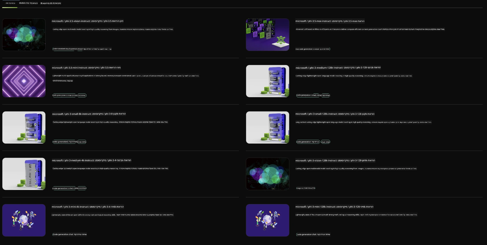

<!--
CO_OP_TRANSLATOR_METADATA:
{
  "original_hash": "7b08e277df2a9307f861ae54bc30c772",
  "translation_date": "2025-07-16T19:38:05+00:00",
  "source_file": "md/01.Introduction/02/06.NVIDIA.md",
  "language_code": "he"
}
-->
## משפחת Phi ב-NVIDIA NIM

NVIDIA NIM היא מערכת של מיקרו-שירותים קלים לשימוש, שנועדו להאיץ את פריסת מודלים של בינה מלאכותית גנרטיבית בענן, במרכזי נתונים ובתחנות עבודה. ה-NIMs מסווגים לפי משפחת מודלים ועל בסיס כל מודל בנפרד. לדוגמה, NVIDIA NIM למודלים גדולים של שפה (LLMs) מביא את כוחם של מודלים מתקדמים אלה ליישומים ארגוניים, ומספק יכולות עיבוד והבנת שפה טבעית שאין להן מתחרים.

NIM מקל על צוותי IT ו-DevOps לארח בעצמם מודלים גדולים של שפה (LLMs) בסביבות מנוהלות משלהם, תוך מתן ממשקי API סטנדרטיים בתעשייה למפתחים, שמאפשרים להם לבנות עוזרים חכמים, צ'אטבוטים וקופיילוטים רבי עוצמה שיכולים לשנות את העסק שלהם. באמצעות האצת GPU מתקדמת של NVIDIA ופריסה סקלאבילית, NIM מציע את הדרך המהירה ביותר להסקת מסקנות עם ביצועים שאין להם תחרות.

ניתן להשתמש ב-NVIDIA NIM כדי לבצע הסקה על מודלים ממשפחת Phi



### **דוגמאות - Phi-3-Vision ב-NVIDIA NIM**

דמיינו שיש לכם תמונה (`demo.png`) ואתם רוצים ליצור קוד פייתון שמעבד את התמונה ושומר גרסה חדשה שלה (`phi-3-vision.jpg`).

הקוד שלמעלה מאוטומט את התהליך על ידי:

1. הגדרת הסביבה והקונפיגורציות הנדרשות.
2. יצירת פרומפט שמנחה את המודל לייצר את קוד הפייתון הדרוש.
3. שליחת הפרומפט למודל ואיסוף הקוד שנוצר.
4. חילוץ והרצת הקוד שנוצר.
5. הצגת התמונה המקורית והתמונה המעובדת.

גישה זו מנצלת את כוח הבינה המלאכותית לאוטומציה של משימות עיבוד תמונה, מה שהופך את התהליך לקל ומהיר יותר להשגת המטרות שלכם.

[פתרון קוד לדוגמה](../../../../../code/06.E2E/E2E_Nvidia_NIM_Phi3_Vision.ipynb)

בואו נפרק את כל הקוד שלב אחר שלב:

1. **התקנת החבילה הנדרשת**:
    ```python
    !pip install langchain_nvidia_ai_endpoints -U
    ```
    פקודה זו מתקינה את החבילה `langchain_nvidia_ai_endpoints`, ומוודאת שזו הגרסה העדכנית ביותר.

2. **ייבוא המודולים הנחוצים**:
    ```python
    from langchain_nvidia_ai_endpoints import ChatNVIDIA
    import getpass
    import os
    import base64
    ```
    הייבוא הזה מביא את המודולים הדרושים לאינטראקציה עם נקודות הקצה של NVIDIA AI, לטיפול מאובטח בסיסמאות, לאינטראקציה עם מערכת ההפעלה, ולקידוד/פענוח נתונים בפורמט base64.

3. **הגדרת מפתח ה-API**:
    ```python
    if not os.getenv("NVIDIA_API_KEY"):
        os.environ["NVIDIA_API_KEY"] = getpass.getpass("Enter your NVIDIA API key: ")
    ```
    הקוד בודק אם משתנה הסביבה `NVIDIA_API_KEY` מוגדר. אם לא, הוא מבקש מהמשתמש להזין את מפתח ה-API בצורה מאובטחת.

4. **הגדרת המודל ונתיב התמונה**:
    ```python
    model = 'microsoft/phi-3-vision-128k-instruct'
    chat = ChatNVIDIA(model=model)
    img_path = './imgs/demo.png'
    ```
    כאן מוגדר המודל לשימוש, נוצר מופע של `ChatNVIDIA` עם המודל שצויין, ומוגדר נתיב לקובץ התמונה.

5. **יצירת פרומפט טקסטואלי**:
    ```python
    text = "Please create Python code for image, and use plt to save the new picture under imgs/ and name it phi-3-vision.jpg."
    ```
    מוגדר פרומפט טקסטואלי שמנחה את המודל לייצר קוד פייתון לעיבוד תמונה.

6. **קידוד התמונה ב-base64**:
    ```python
    with open(img_path, "rb") as f:
        image_b64 = base64.b64encode(f.read()).decode()
    image = f''
    ```
    הקוד קורא את קובץ התמונה, מקודד אותה ב-base64, ויוצר תגית HTML של תמונה עם הנתונים המקודדים.

7. **שילוב הטקסט והתמונה בפרומפט אחד**:
    ```python
    prompt = f"{text} {image}"
    ```
    כאן מחברים את הפרומפט הטקסטואלי ותגית ה-HTML של התמונה למחרוזת אחת.

8. **יצירת הקוד באמצעות ChatNVIDIA**:
    ```python
    code = ""
    for chunk in chat.stream(prompt):
        print(chunk.content, end="")
        code += chunk.content
    ```
    הקוד שולח את הפרומפט למודל `ChatNVIDIA` ואוסף את הקוד שנוצר בחלקים, מדפיס ומוסיף כל חלק למחרוזת `code`.

9. **חילוץ קוד הפייתון מהתוכן שנוצר**:
    ```python
    begin = code.index('```python') + 9
    code = code[begin:]
    end = code.index('```')
    code = code[:end]
    ```
    כאן מחלצים את קוד הפייתון האמיתי מתוך התוכן שנוצר על ידי הסרת הפורמט של markdown.

10. **הרצת הקוד שנוצר**:
    ```python
    import subprocess
    result = subprocess.run(["python", "-c", code], capture_output=True)
    ```
    הקוד מריץ את קוד הפייתון שחולץ כתהליך משנה ותופס את הפלט שלו.

11. **הצגת התמונות**:
    ```python
    from IPython.display import Image, display
    display(Image(filename='./imgs/phi-3-vision.jpg'))
    display(Image(filename='./imgs/demo.png'))
    ```
    שורות אלו מציגות את התמונות באמצעות המודול `IPython.display`.

**כתב ויתור**:  
מסמך זה תורגם באמצעות שירות תרגום מבוסס בינה מלאכותית [Co-op Translator](https://github.com/Azure/co-op-translator). למרות שאנו שואפים לדיוק, יש לקחת בחשבון כי תרגומים אוטומטיים עלולים להכיל שגיאות או אי-דיוקים. המסמך המקורי בשפת המקור שלו נחשב למקור הסמכותי. למידע קריטי מומלץ להשתמש בתרגום מקצועי על ידי אדם. אנו לא נושאים באחריות לכל אי-הבנה או פרשנות שגויה הנובעת משימוש בתרגום זה.