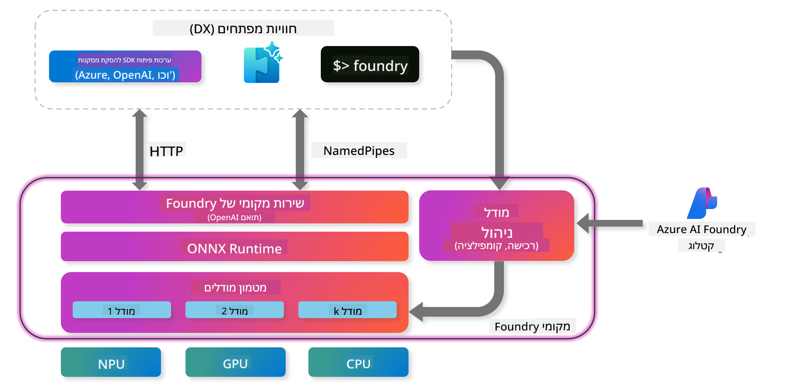
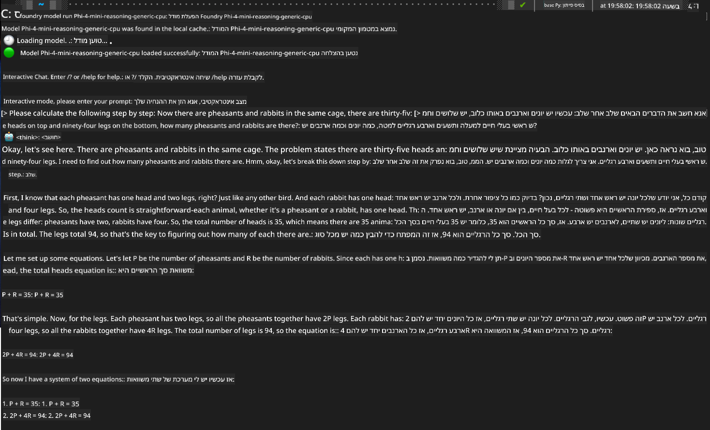

<!--
CO_OP_TRANSLATOR_METADATA:
{
  "original_hash": "52973a5680a65a810aa80b7036afd31f",
  "translation_date": "2025-07-16T19:48:34+00:00",
  "source_file": "md/01.Introduction/02/07.FoundryLocal.md",
  "language_code": "he"
}
-->
## התחלה עם דגמי Phi-Family ב-Foundry Local

### מבוא ל-Foundry Local

Foundry Local היא פתרון חזק להרצת AI במכשיר שמביא יכולות AI ברמת ארגונית ישירות לחומרה המקומית שלך. מדריך זה ילווה אותך בהגדרה ושימוש בדגמי Phi-Family עם Foundry Local, ויאפשר לך שליטה מלאה על עומסי העבודה של ה-AI תוך שמירה על פרטיות והפחתת עלויות.

Foundry Local מספקת יתרונות של ביצועים, פרטיות, התאמה אישית וחיסכון בעלויות על ידי הרצת דגמי AI באופן מקומי במכשיר שלך. היא משתלבת בצורה חלקה עם תהליכי העבודה והיישומים הקיימים שלך דרך CLI אינטואיטיבי, SDK ו-REST API.



### למה לבחור ב-Foundry Local?

הבנת היתרונות של Foundry Local תעזור לך לקבל החלטות מושכלות לגבי אסטרטגיית הפריסה של ה-AI שלך:

- **הרצה במכשיר:** הפעל דגמים באופן מקומי על החומרה שלך, מה שמפחית עלויות ושומר על כל הנתונים במכשיר שלך.

- **התאמת דגמים:** בחר מתוך דגמים מוכנים מראש או השתמש בדגם שלך כדי לענות על דרישות ומקרי שימוש ספציפיים.

- **יעילות בעלויות:** ביטול עלויות שירותי ענן חוזרות על ידי שימוש בחומרה הקיימת שלך, מה שהופך את ה-AI לנגיש יותר.

- **אינטגרציה חלקה:** התחבר ליישומים שלך דרך SDK, נקודות קצה API או CLI, עם אפשרות להרחבה ל-Azure AI Foundry ככל שהצרכים שלך גדלים.

> **[!NOTE] התחלה:** מדריך זה מתמקד בשימוש ב-Foundry Local דרך ממשקי CLI ו-SDK. תלמד את שתי הגישות כדי לעזור לך לבחור את השיטה הטובה ביותר למקרה השימוש שלך.

## חלק 1: הגדרת Foundry Local CLI

### שלב 1: התקנה

Foundry Local CLI הוא שער הכניסה שלך לניהול והרצת דגמי AI באופן מקומי. נתחיל בהתקנתו במערכת שלך.

**פלטפורמות נתמכות:** Windows ו-macOS

להוראות התקנה מפורטות, עיין ב-[התיעוד הרשמי של Foundry Local](https://github.com/microsoft/Foundry-Local/blob/main/README.md).

### שלב 2: חקר הדגמים הזמינים

לאחר שהתקנת את Foundry Local CLI, תוכל לגלות אילו דגמים זמינים למקרה השימוש שלך. הפקודה הזו תציג את כל הדגמים הנתמכים:


```bash
foundry model list
```

### שלב 3: הבנת דגמי Phi Family

משפחת Phi מציעה מגוון דגמים מותאמים למקרי שימוש שונים ותצורות חומרה מגוונות. הנה דגמי Phi הזמינים ב-Foundry Local:

**דגמי Phi זמינים:** 

- **phi-3.5-mini** - דגם קומפקטי למשימות בסיסיות
- **phi-3-mini-128k** - גרסת הקשר מורחבת לשיחות ארוכות יותר
- **phi-3-mini-4k** - דגם הקשר סטנדרטי לשימוש כללי
- **phi-4** - דגם מתקדם עם יכולות משופרות
- **phi-4-mini** - גרסה קלה של Phi-4
- **phi-4-mini-reasoning** - מיועד למשימות חשיבה מורכבות

> **[!IMPORTANT] תאימות חומרה:** כל דגם ניתן להגדיר עבור האצת חומרה שונה (CPU, GPU) בהתאם ליכולות המערכת שלך.

### שלב 4: הרצת דגם Phi ראשון

נתחיל עם דוגמה מעשית. נריץ את דגם `phi-4-mini-reasoning`, שמתמחה בפתרון בעיות מורכבות שלב אחר שלב.


**פקודה להרצת הדגם:**

```bash
foundry model run Phi-4-mini-reasoning-generic-cpu
```

> **[!NOTE] הגדרה ראשונית:** בעת הרצת דגם בפעם הראשונה, Foundry Local יוריד אותו אוטומטית למכשיר המקומי שלך. זמן ההורדה משתנה בהתאם למהירות הרשת שלך, לכן יש להמתין בסבלנות במהלך ההגדרה הראשונית.

### שלב 5: בדיקת הדגם עם בעיה אמיתית

כעת נבדוק את הדגם עם בעיית לוגיקה קלאסית כדי לראות כיצד הוא מבצע חשיבה שלב אחר שלב:

**דוגמת בעיה:**

```txt
Please calculate the following step by step: Now there are pheasants and rabbits in the same cage, there are thirty-five heads on top and ninety-four legs on the bottom, how many pheasants and rabbits are there?
```

**התנהגות צפויה:** הדגם אמור לפרק את הבעיה לשלבים לוגיים, תוך שימוש בעובדה שלפזאנטים יש 2 רגליים ולארנבים יש 4 רגליים כדי לפתור את מערכת המשוואות.

**תוצאות:**



## חלק 2: בניית יישומים עם Foundry Local SDK

### למה להשתמש ב-SDK?

בעוד ש-CLI מתאים לבדיקות ואינטראקציות מהירות, ה-SDK מאפשר לך לשלב את Foundry Local ביישומים שלך בצורה תכנותית. זה פותח אפשרויות ל:

- בניית יישומים מותאמים עם יכולות AI
- יצירת תהליכים אוטומטיים
- שילוב יכולות AI במערכות קיימות
- פיתוח צ'אטבוטים וכלים אינטראקטיביים

### שפות תכנות נתמכות

Foundry Local מספקת תמיכה ב-SDK למספר שפות תכנות כדי להתאים להעדפות הפיתוח שלך:

**📦 SDKs זמינים:**

- **C# (.NET):** [תיעוד ודוגמאות SDK](https://github.com/microsoft/Foundry-Local/tree/main/sdk/cs)
- **Python:** [תיעוד ודוגמאות SDK](https://github.com/microsoft/Foundry-Local/tree/main/sdk/python)
- **JavaScript:** [תיעוד ודוגמאות SDK](https://github.com/microsoft/Foundry-Local/tree/main/sdk/js)
- **Rust:** [תיעוד ודוגמאות SDK](https://github.com/microsoft/Foundry-Local/tree/main/sdk/rust)

### צעדים הבאים

1. **בחר את ה-SDK המועדף עליך** בהתאם לסביבת הפיתוח שלך  
2. **עקוב אחרי התיעוד הספציפי ל-SDK** להנחיות יישום מפורטות  
3. **התחל עם דוגמאות פשוטות** לפני בניית יישומים מורכבים  
4. **חקור את קוד הדוגמה** שמסופק בכל מאגר SDK

## סיכום

כעת למדת כיצד:
- ✅ להתקין ולהגדיר את Foundry Local CLI  
- ✅ לגלות ולהריץ דגמי Phi Family  
- ✅ לבדוק דגמים עם בעיות מהחיים האמיתיים  
- ✅ להבין את אפשרויות ה-SDK לפיתוח יישומים  

Foundry Local מספקת בסיס חזק להבאת יכולות AI ישירות לסביבה המקומית שלך, ומעניקה לך שליטה על ביצועים, פרטיות ועלויות, תוך שמירה על גמישות להרחבה לענן בעת הצורך.

**כתב ויתור**:  
מסמך זה תורגם באמצעות שירות תרגום מבוסס בינה מלאכותית [Co-op Translator](https://github.com/Azure/co-op-translator). למרות שאנו שואפים לדיוק, יש לקחת בחשבון כי תרגומים אוטומטיים עלולים להכיל שגיאות או אי-דיוקים. המסמך המקורי בשפת המקור שלו נחשב למקור הסמכותי. למידע קריטי מומלץ להשתמש בתרגום מקצועי על ידי מתרגם אנושי. אנו לא נושאים באחריות לכל אי-הבנה או פרשנות שגויה הנובעת משימוש בתרגום זה.