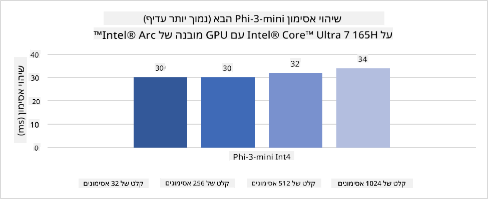
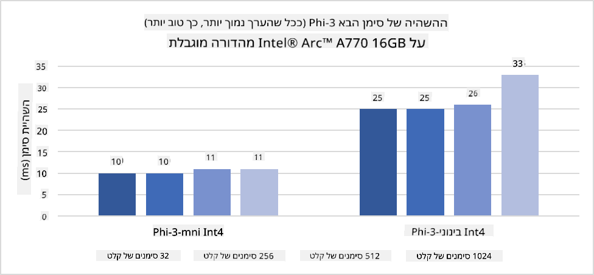
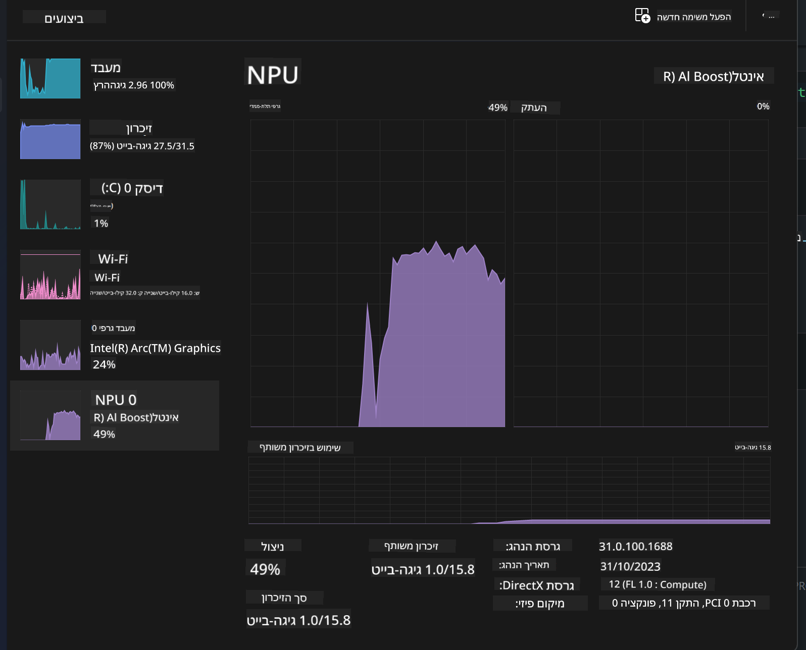
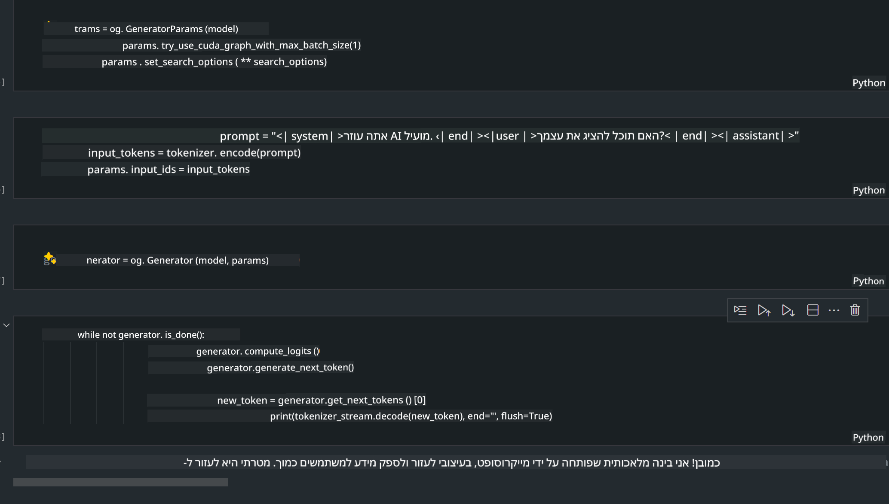
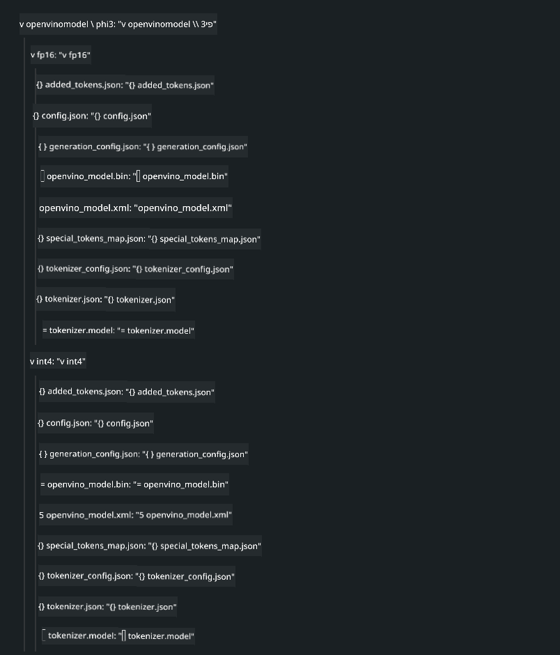
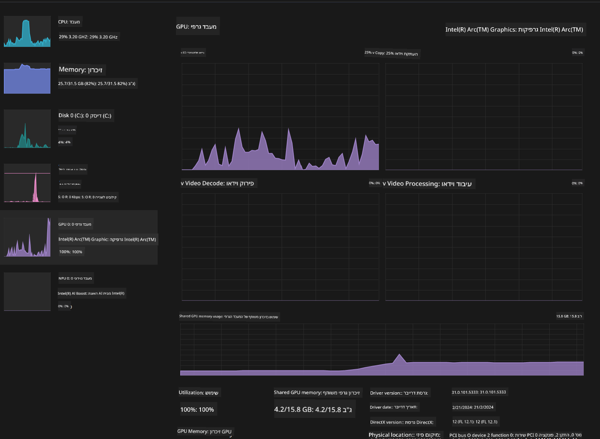

<!--
CO_OP_TRANSLATOR_METADATA:
{
  "original_hash": "e08ce816e23ad813244a09ca34ebb8ac",
  "translation_date": "2025-05-09T10:25:54+00:00",
  "source_file": "md/01.Introduction/03/AIPC_Inference.md",
  "language_code": "he"
}
-->
# **הסקת מסקנות Phi-3 במחשב AI**

עם התקדמות ה-AI הגנרטיבי ושיפור יכולות החומרה במכשירי קצה, מספר הולך וגדל של מודלים גנרטיביים של AI יכולים כעת להשתלב במכשירי Bring Your Own Device (BYOD) של המשתמשים. מחשבי AI הם בין המודלים האלה. החל מ-2024, אינטל, AMD וקוואלקום שיתפו פעולה עם יצרני מחשבים כדי להציג מחשבי AI שמאפשרים פריסת מודלים גנרטיביים מקומיים דרך שינויים בחומרה. בדיון זה נתמקד במחשבי AI של אינטל ונבחן כיצד לפרוס את Phi-3 על מחשב AI של אינטל.

### מה זה NPU

NPU (יחידת עיבוד עצבית) הוא מעבד ייעודי או יחידת עיבוד בתוך SoC גדול יותר, שנועדה במיוחד להאצת פעולות רשתות עצביות ומשימות AI. בניגוד ל-CPU ו-GPU כלליים, NPU מותאמים לחישוב מקבילי מונחה נתונים, מה שהופך אותם ליעילים במיוחד בעיבוד כמויות עצומות של נתוני מולטימדיה כמו וידאו ותמונות ועיבוד נתונים לרשתות עצביות. הם מיומנים במיוחד במשימות הקשורות ל-AI, כגון זיהוי דיבור, טשטוש רקע בשיחות וידאו ותהליכי עריכת תמונות או וידאו כמו זיהוי אובייקטים.

## NPU מול GPU

בעוד שרבים מעומסי העבודה של AI ולמידת מכונה רצים על GPUs, יש הבדל משמעותי בין GPUs ל-NPUs. GPUs ידועים ביכולות החישוב המקביליות שלהם, אך לא כל ה-GPUs יעילים באותה מידה מעבר לעיבוד גרפי. NPUs, לעומת זאת, נבנו במיוחד לחישובים מורכבים המעורבים בפעולות רשתות עצביות, מה שהופך אותם ליעילים מאוד במשימות AI.

לסיכום, NPUs הם המומחים המתמטיים שמאיצים את חישובי ה-AI, והם ממלאים תפקיד מרכזי בעידן המתפתח של מחשבי AI!

***דוגמה זו מבוססת על מעבד Intel Core Ultra העדכני ביותר של אינטל***

## **1. שימוש ב-NPU להרצת מודל Phi-3**

מכשיר Intel® NPU הוא מאיץ הסקה של AI המשולב עם מעבדי Intel ללקוחות, החל מדור Intel® Core™ Ultra של מעבדים (שידוע בעבר כ-Meteor Lake). הוא מאפשר ביצוע חסכוני באנרגיה של משימות רשתות עצביות מלאכותיות.





**ספריית האצת Intel NPU**

ספריית האצת Intel NPU [https://github.com/intel/intel-npu-acceleration-library](https://github.com/intel/intel-npu-acceleration-library) היא ספריית Python שנועדה להגביר את היעילות של האפליקציות שלך על ידי ניצול כוח יחידת העיבוד העצבית של אינטל (NPU) לביצוע חישובים מהירים על חומרה תואמת.

דוגמה ל-Phi-3-mini במחשב AI המופעל על ידי מעבדי Intel® Core™ Ultra.


התקנת ספריית Python עם pip

```bash

   pip install intel-npu-acceleration-library

```

***הערה*** הפרויקט עדיין בפיתוח, אך דגם ההתייחסות כבר מאוד שלם.

### **הרצת Phi-3 עם ספריית האצת Intel NPU**

באמצעות האצת Intel NPU, ספרייה זו אינה משפיעה על תהליך ההצפנה המסורתי. כל שעליך לעשות הוא להשתמש בספרייה זו כדי לכמת את מודל Phi-3 המקורי, כגון FP16, INT8, INT4, כמו 

```python
from transformers import AutoTokenizer, pipeline,TextStreamer
from intel_npu_acceleration_library import NPUModelForCausalLM, int4
from intel_npu_acceleration_library.compiler import CompilerConfig
import warnings

model_id = "microsoft/Phi-3-mini-4k-instruct"

compiler_conf = CompilerConfig(dtype=int4)
model = NPUModelForCausalLM.from_pretrained(
    model_id, use_cache=True, config=compiler_conf, attn_implementation="sdpa"
).eval()

tokenizer = AutoTokenizer.from_pretrained(model_id)

text_streamer = TextStreamer(tokenizer, skip_prompt=True)
```

לאחר שהכימות מצליח, המשך בהפעלה לקריאת ה-NPU להריץ את מודל Phi-3.

```python
generation_args = {
   "max_new_tokens": 1024,
   "return_full_text": False,
   "temperature": 0.3,
   "do_sample": False,
   "streamer": text_streamer,
}

pipe = pipeline(
   "text-generation",
   model=model,
   tokenizer=tokenizer,
)

query = "<|system|>You are a helpful AI assistant.<|end|><|user|>Can you introduce yourself?<|end|><|assistant|>"

with warnings.catch_warnings():
    warnings.simplefilter("ignore")
    pipe(query, **generation_args)
```

בעת ביצוע הקוד, ניתן לצפות במצב הריצה של ה-NPU דרך מנהל המשימות



***דוגמאות*** : [AIPC_NPU_DEMO.ipynb](../../../../../code/03.Inference/AIPC/AIPC_NPU_DEMO.ipynb)

## **2. שימוש ב-DirectML + ONNX Runtime להרצת מודל Phi-3**

### **מה זה DirectML**

[DirectML](https://github.com/microsoft/DirectML) היא ספריית DirectX 12 מואצת חומרה לביצוע למידת מכונה במהירות גבוהה. DirectML מספק האצת GPU למשימות למידת מכונה נפוצות במגוון רחב של חומרות ודרייברים נתמכים, כולל כל ה-GPUs התומכים ב-DirectX 12 מיצרנים כמו AMD, אינטל, NVIDIA וקוואלקום.

כאשר משמשת עצמאית, ממשק ה-API של DirectML הוא ספריית DirectX 12 ברמת נמוכה ומתאימה ליישומים בעלי ביצועים גבוהים וזמני השהייה נמוכים כמו מסגרות עבודה, משחקים ויישומים בזמן אמת אחרים. האינטגרציה החלקה של DirectML עם Direct3D 12 וכן העומס הנמוך והתאימות בין חומרות הופכים את DirectML לאידיאלית להאצת למידת מכונה כאשר נדרשים ביצועים גבוהים ואמינות ותחזיות תוצאות עקביות בין חומרות.

***הערה***: DirectML העדכנית כבר תומכת ב-NPU(https://devblogs.microsoft.com/directx/introducing-neural-processor-unit-npu-support-in-directml-developer-preview/)

### DirectML ו-CUDA מבחינת יכולות וביצועים:

**DirectML** היא ספריית למידת מכונה שפותחה על ידי מיקרוסופט. היא מיועדת להאיץ עומסי עבודה של למידת מכונה במכשירי Windows, כולל מחשבים נייחים, ניידים ומכשירי קצה.
- מבוססת DX12: DirectML בנויה מעל DirectX 12 (DX12), המספק תמיכה רחבה בחומרה עבור GPUs, כולל NVIDIA ו-AMD.
- תמיכה רחבה יותר: מכיוון שהיא משתמשת ב-DX12, DirectML יכולה לפעול עם כל GPU התומך ב-DX12, אפילו GPUs משולבים.
- עיבוד תמונה: DirectML מעבדת תמונות ונתונים אחרים באמצעות רשתות עצביות, מה שהופך אותה מתאימה למשימות כמו זיהוי תמונה, זיהוי אובייקטים ועוד.
- קלות התקנה: התקנת DirectML פשוטה ואינה דורשת SDKs או ספריות ספציפיות מיצרני GPU.
- ביצועים: במקרים מסוימים, DirectML מבצעת היטב ויכולה להיות מהירה יותר מ-CUDA, במיוחד לעומסי עבודה מסוימים.
- מגבלות: עם זאת, יש מקרים שבהם DirectML עשויה להיות איטית יותר, במיוחד עבור גדלי אצווה גדולים בפורמט float16.

**CUDA** היא פלטפורמת החישוב המקבילית ומודל התכנות של NVIDIA. היא מאפשרת למפתחים לנצל את כוח ה-GPUs של NVIDIA לחישובים כלליים, כולל למידת מכונה וסימולציות מדעיות.
- ספציפית ל-NVIDIA: CUDA משולבת באופן הדוק עם GPUs של NVIDIA ומיועדת במיוחד להם.
- אופטימיזציה גבוהה: מספקת ביצועים מצוינים למשימות מואצות GPU, במיוחד בשימוש עם GPUs של NVIDIA.
- שימוש נרחב: רבים מהמסגרות והספריות של למידת מכונה (כגון TensorFlow ו-PyTorch) תומכות ב-CUDA.
- התאמה אישית: מפתחים יכולים לכוונן הגדרות CUDA למשימות ספציפיות, מה שיכול להוביל לביצועים מיטביים.
- מגבלות: עם זאת, התלות של CUDA בחומרת NVIDIA יכולה להיות מגבלה אם רוצים תאימות רחבה יותר בין GPUs שונים.

### בחירה בין DirectML ל-CUDA

הבחירה בין DirectML ל-CUDA תלויה במקרה השימוש הספציפי שלך, בזמינות החומרה ובהעדפותיך. אם אתה מחפש תאימות רחבה יותר וקלות התקנה, DirectML עשויה להיות בחירה טובה. עם זאת, אם יש לך GPUs של NVIDIA ואתה זקוק לביצועים אופטימליים, CUDA נשארת מתמודדת חזקה. לסיכום, לשתיהן יש יתרונות וחסרונות, לכן שקול את הדרישות והחומרה הזמינה בעת קבלת החלטה.

### **AI גנרטיבי עם ONNX Runtime**

בעידן ה-AI, ניידות המודלים חשובה מאוד. ONNX Runtime מאפשרת פריסה קלה של מודלים מאומנים למכשירים שונים. מפתחים אינם צריכים להתמקד במסגרת ההסקה ומשתמשים ב-API אחיד להשלמת הסקת המודלים. בעידן ה-AI הגנרטיבי, ONNX Runtime ביצעה גם אופטימיזציית קוד (https://onnxruntime.ai/docs/genai/). דרך ONNX Runtime המותאמת, ניתן לבצע הסקה של מודל AI גנרטיבי מכווץ על גבי תחנות קצה שונות. ב-Generative AI עם ONNX Runtime, ניתן לבצע הסקת מודל AI דרך API ב-Python, C#, C / C++. כמובן, פריסה על iPhone יכולה לנצל את API של Generative AI עם ONNX Runtime ב-C++.

[קוד לדוגמה](https://github.com/Azure-Samples/Phi-3MiniSamples/tree/main/onnx)

***קומפילציה של ספריית Generative AI עם ONNX Runtime***

```bash

winget install --id=Kitware.CMake  -e

git clone https://github.com/microsoft/onnxruntime.git

cd .\onnxruntime\

./build.bat --build_shared_lib --skip_tests --parallel --use_dml --config Release

cd ../

git clone https://github.com/microsoft/onnxruntime-genai.git

cd .\onnxruntime-genai\

mkdir ort

cd ort

mkdir include

mkdir lib

copy ..\onnxruntime\include\onnxruntime\core\providers\dml\dml_provider_factory.h ort\include

copy ..\onnxruntime\include\onnxruntime\core\session\onnxruntime_c_api.h ort\include

copy ..\onnxruntime\build\Windows\Release\Release\*.dll ort\lib

copy ..\onnxruntime\build\Windows\Release\Release\onnxruntime.lib ort\lib

python build.py --use_dml


```

**התקנת הספרייה**

```bash

pip install .\onnxruntime_genai_directml-0.3.0.dev0-cp310-cp310-win_amd64.whl

```

זהו תוצאת הריצה



***דוגמאות*** : [AIPC_DirectML_DEMO.ipynb](../../../../../code/03.Inference/AIPC/AIPC_DirectML_DEMO.ipynb)

## **3. שימוש ב-Intel OpenVino להרצת מודל Phi-3**

### **מה זה OpenVINO**

[OpenVINO](https://github.com/openvinotoolkit/openvino) הוא ערכת כלים בקוד פתוח לאופטימיזציה ופריסה של מודלים ללמידה עמוקה. הוא מספק ביצועים משופרים ללמידה עמוקה עבור מודלים של ראייה, שמע ושפה ממסגרות פופולריות כמו TensorFlow, PyTorch ועוד. התחל עם OpenVINO. OpenVINO יכול לשמש גם בשילוב עם CPU ו-GPU להרצת מודל Phi3.

***הערה***: נכון לעכשיו, OpenVINO אינו תומך ב-NPU.

### **התקנת ספריית OpenVINO**

```bash

 pip install git+https://github.com/huggingface/optimum-intel.git

 pip install git+https://github.com/openvinotoolkit/nncf.git

 pip install openvino-nightly

```

### **הרצת Phi-3 עם OpenVINO**

כמו ב-NPU, OpenVINO משלים את קריאת מודלי ה-AI הגנרטיביים על ידי הרצת מודלים כמותיים. יש לכמת את מודל Phi-3 תחילה ולהשלים את כימות המודל דרך שורת הפקודה באמצעות optimum-cli

**INT4**

```bash

optimum-cli export openvino --model "microsoft/Phi-3-mini-4k-instruct" --task text-generation-with-past --weight-format int4 --group-size 128 --ratio 0.6  --sym  --trust-remote-code ./openvinomodel/phi3/int4

```

**FP16**

```bash

optimum-cli export openvino --model "microsoft/Phi-3-mini-4k-instruct" --task text-generation-with-past --weight-format fp16 --trust-remote-code ./openvinomodel/phi3/fp16

```

הפורמט שהומר, כך נראה



טען את נתיבי המודל (model_dir), הקונפיגורציות הרלוונטיות (ov_config = {"PERFORMANCE_HINT": "LATENCY", "NUM_STREAMS": "1", "CACHE_DIR": ""}), והתקני חומרה מואצים (GPU.0) דרך OVModelForCausalLM

```python

ov_model = OVModelForCausalLM.from_pretrained(
     model_dir,
     device='GPU.0',
     ov_config=ov_config,
     config=AutoConfig.from_pretrained(model_dir, trust_remote_code=True),
     trust_remote_code=True,
)

```

בעת ביצוע הקוד, ניתן לצפות במצב הריצה של ה-GPU דרך מנהל המשימות



***דוגמאות*** : [AIPC_OpenVino_Demo.ipynb](../../../../../code/03.Inference/AIPC/AIPC_OpenVino_Demo.ipynb)

### ***הערה*** : שלוש השיטות לעיל כל אחת בעלת יתרונותיה, אך מומלץ להשתמש בהאצת NPU להסקת מחשב AI.

**כתב ויתור**:  
מסמך זה תורגם באמצעות שירות תרגום מבוסס בינה מלאכותית [Co-op Translator](https://github.com/Azure/co-op-translator). למרות שאנו שואפים לדיוק, יש לקחת בחשבון כי תרגומים אוטומטיים עלולים להכיל שגיאות או אי דיוקים. המסמך המקורי בשפת המקור שלו הוא המקור המוסמך והמהימן. למידע קריטי מומלץ להיעזר בתרגום מקצועי על ידי מתרגם אנושי. אנו לא נושאים באחריות לכל אי הבנה או פרשנות שגויה הנובעת משימוש בתרגום זה.