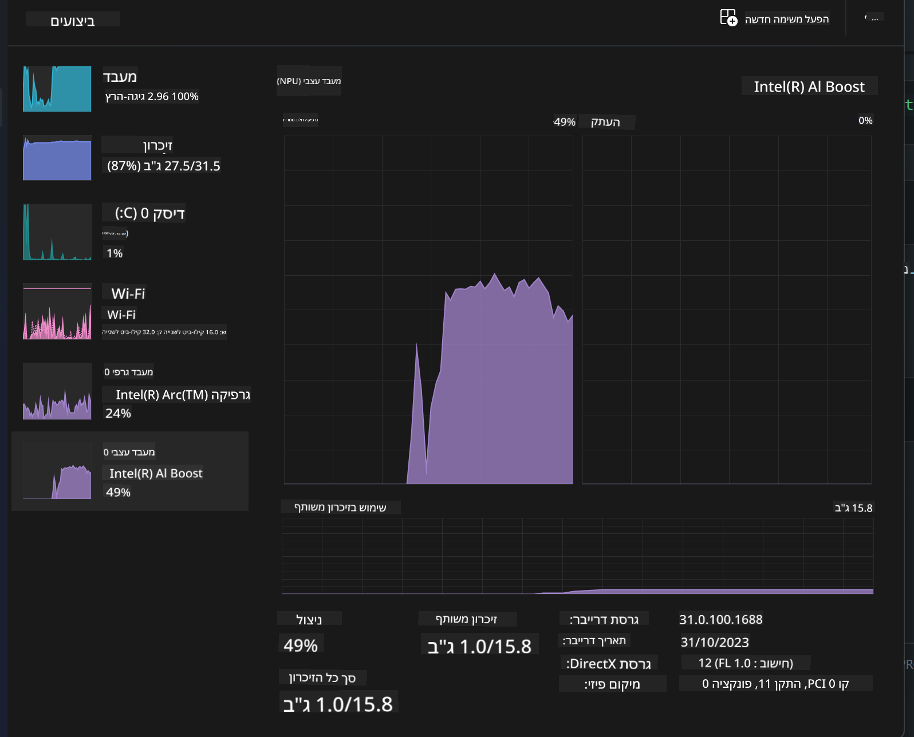
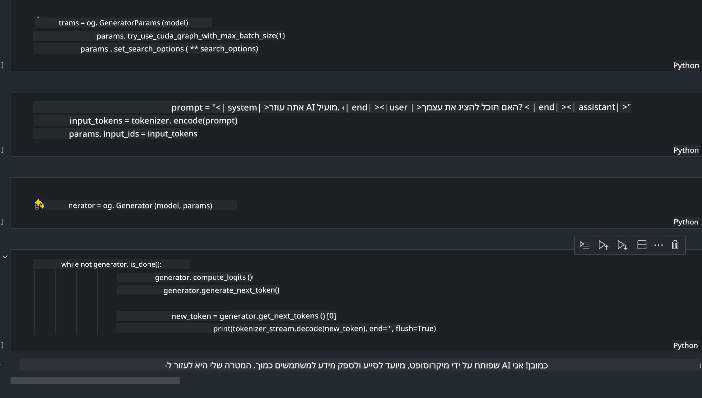

<!--
CO_OP_TRANSLATOR_METADATA:
{
  "original_hash": "e08ce816e23ad813244a09ca34ebb8ac",
  "translation_date": "2025-07-16T20:04:07+00:00",
  "source_file": "md/01.Introduction/03/AIPC_Inference.md",
  "language_code": "he"
}
-->
# **הסקת Phi-3 במחשב AI**

עם התקדמות ה-AI הגנרטיבי ושיפור יכולות החומרה במכשירי קצה, מספר הולך וגדל של מודלים גנרטיביים ניתן לשלב במכשירי Bring Your Own Device (BYOD) של המשתמשים. מחשבי AI הם בין המודלים הללו. החל מ-2024, אינטל, AMD וקוואלקום שיתפו פעולה עם יצרני מחשבים כדי להציג מחשבי AI שמאפשרים פריסת מודלים גנרטיביים מקומיים באמצעות שינויים בחומרה. בדיון זה נתמקד במחשבי AI של אינטל ונבחן כיצד לפרוס את Phi-3 על מחשב AI של אינטל.

### מהו NPU

NPU (יחידת עיבוד עצבית) הוא מעבד ייעודי או יחידת עיבוד בתוך SoC גדול יותר, המיועדת במיוחד להאצת פעולות רשתות עצביות ומשימות AI. בניגוד ל-CPU ו-GPU כלליים, ה-NPU מותאם לחישוב מקבילי מונחה נתונים, מה שהופך אותו ליעיל במיוחד בעיבוד כמויות עצומות של מדיה כמו וידאו ותמונות, וכן בעיבוד נתונים עבור רשתות עצביות. הוא מיומן במיוחד במשימות הקשורות ל-AI, כמו זיהוי דיבור, טשטוש רקע בשיחות וידאו, ותהליכי עריכת תמונות או וידאו כמו זיהוי עצמים.

## NPU מול GPU

בעוד שרוב משימות ה-AI ולמידת המכונה מתבצעות על GPUs, יש הבדל מהותי בין GPUs ל-NPUs.  
ה-GPUs ידועים ביכולות החישוב המקבילי שלהם, אך לא כל ה-GPUs יעילים באותה מידה מעבר לעיבוד גרפי. לעומת זאת, ה-NPUs בנויים במיוחד לחישובים מורכבים הכרוכים בפעולות רשתות עצביות, מה שהופך אותם ליעילים מאוד במשימות AI.

לסיכום, ה-NPUs הם המומחים המתמטיים שמאיצים את חישובי ה-AI, והם ממלאים תפקיד מרכזי בעידן המתהווה של מחשבי AI!

***דוגמה זו מבוססת על המעבד Intel Core Ultra העדכני ביותר של אינטל***

## **1. שימוש ב-NPU להרצת מודל Phi-3**

מכשיר Intel® NPU הוא מאיץ הסקה של AI המשולב עם מעבדי הלקוח של אינטל, החל מדור מעבדי Intel® Core™ Ultra (שנקרא בעבר Meteor Lake). הוא מאפשר ביצוע חסכוני באנרגיה של משימות רשתות עצביות מלאכותיות.


**ספריית האצת Intel NPU**

ספריית האצת Intel NPU [https://github.com/intel/intel-npu-acceleration-library](https://github.com/intel/intel-npu-acceleration-library) היא ספריית Python שנועדה לשפר את יעילות היישומים שלך על ידי ניצול כוח ה-NPU של אינטל לביצוע חישובים מהירים על חומרה תואמת.

דוגמה ל-Phi-3-mini על מחשב AI המופעל על ידי מעבדי Intel® Core™ Ultra.


התקנת ספריית Python באמצעות pip

```bash

   pip install intel-npu-acceleration-library

```

***הערה*** הפרויקט עדיין בפיתוח, אך מודל הייחוס כבר מאוד שלם.

### **הרצת Phi-3 עם ספריית האצת Intel NPU**

בשימוש בהאצת Intel NPU, ספרייה זו אינה משפיעה על תהליך הקידוד המסורתי. כל שעליך לעשות הוא להשתמש בספרייה זו כדי לכמת את מודל Phi-3 המקורי, לדוגמה FP16, INT8, INT4, כמו

```python
from transformers import AutoTokenizer, pipeline,TextStreamer
from intel_npu_acceleration_library import NPUModelForCausalLM, int4
from intel_npu_acceleration_library.compiler import CompilerConfig
import warnings

model_id = "microsoft/Phi-3-mini-4k-instruct"

compiler_conf = CompilerConfig(dtype=int4)
model = NPUModelForCausalLM.from_pretrained(
    model_id, use_cache=True, config=compiler_conf, attn_implementation="sdpa"
).eval()

tokenizer = AutoTokenizer.from_pretrained(model_id)

text_streamer = TextStreamer(tokenizer, skip_prompt=True)
```

לאחר שהכימות מצליח, ממשיכים להריץ את הקריאה ל-NPU כדי להפעיל את מודל Phi-3.

```python
generation_args = {
   "max_new_tokens": 1024,
   "return_full_text": False,
   "temperature": 0.3,
   "do_sample": False,
   "streamer": text_streamer,
}

pipe = pipeline(
   "text-generation",
   model=model,
   tokenizer=tokenizer,
)

query = "<|system|>You are a helpful AI assistant.<|end|><|user|>Can you introduce yourself?<|end|><|assistant|>"

with warnings.catch_warnings():
    warnings.simplefilter("ignore")
    pipe(query, **generation_args)
```

בעת הרצת הקוד, ניתן לצפות במצב הריצה של ה-NPU דרך מנהל המשימות



***דוגמאות*** : [AIPC_NPU_DEMO.ipynb](../../../../../code/03.Inference/AIPC/AIPC_NPU_DEMO.ipynb)

## **2. שימוש ב-DirectML + ONNX Runtime להרצת מודל Phi-3**

### **מהו DirectML**

[DirectML](https://github.com/microsoft/DirectML) היא ספריית DirectX 12 מואצת חומרה לביצועים גבוהים ללמידת מכונה. DirectML מספק האצת GPU למשימות למידת מכונה נפוצות על מגוון רחב של חומרות ודרייברים נתמכים, כולל כל GPUs התומכים ב-DirectX 12 מיצרנים כמו AMD, אינטל, NVIDIA וקוואלקום.

כאשר משתמשים בו באופן עצמאי, ממשק ה-API של DirectML הוא ספריית DirectX 12 ברמת נמוכה ומתאים ליישומים בעלי ביצועים גבוהים ועיכוב נמוך כמו מסגרות עבודה, משחקים ויישומים בזמן אמת אחרים. האינטגרציה החלקה של DirectML עם Direct3D 12, יחד עם העומס הנמוך וההתאמה לחומרה, הופכים את DirectML לאידיאלי להאצת למידת מכונה כאשר נדרשים ביצועים גבוהים ואמינות ותוצאות צפויות על פני חומרות שונות.

***הערה*** : DirectML העדכני כבר תומך ב-NPU (https://devblogs.microsoft.com/directx/introducing-neural-processor-unit-npu-support-in-directml-developer-preview/)

### DirectML ו-CUDA מבחינת יכולות וביצועים:

**DirectML** היא ספריית למידת מכונה שפותחה על ידי מיקרוסופט. היא מיועדת להאיץ משימות למידת מכונה במכשירי Windows, כולל מחשבים נייחים, ניידים ומכשירי קצה.  
- מבוססת DX12: DirectML בנויה על DirectX 12 (DX12), המספקת תמיכה רחבה בחומרה על פני GPUs, כולל NVIDIA ו-AMD.  
- תמיכה רחבה: מכיוון שהיא משתמשת ב-DX12, DirectML יכולה לפעול עם כל GPU התומך ב-DX12, אפילו GPUs משולבים.  
- עיבוד תמונה: DirectML מעבדת תמונות ונתונים אחרים באמצעות רשתות עצביות, מה שהופך אותה מתאימה למשימות כמו זיהוי תמונה, זיהוי עצמים ועוד.  
- קלות התקנה: התקנת DirectML פשוטה ואינה דורשת SDKs או ספריות ספציפיות מיצרני GPU.  
- ביצועים: במקרים מסוימים, DirectML מבצעת טוב ויכולה להיות מהירה יותר מ-CUDA, במיוחד במשימות מסוימות.  
- מגבלות: עם זאת, יש מקרים שבהם DirectML עשויה להיות איטית יותר, במיוחד עבור גדלי אצווה גדולים בפורמט float16.

**CUDA** היא פלטפורמת חישוב מקבילי ומודל תכנות של NVIDIA. היא מאפשרת למפתחים לנצל את כוח ה-GPU של NVIDIA לחישובים כלליים, כולל למידת מכונה וסימולציות מדעיות.  
- ייעודית ל-NVIDIA: CUDA משולבת היטב עם GPUs של NVIDIA ומיועדת במיוחד עבורם.  
- אופטימיזציה גבוהה: מספקת ביצועים מצוינים למשימות מואצות GPU, במיוחד עם GPUs של NVIDIA.  
- שימוש נרחב: מסגרות למידת מכונה וספריות רבות (כמו TensorFlow ו-PyTorch) תומכות ב-CUDA.  
- התאמה אישית: מפתחים יכולים לכוונן את הגדרות CUDA למשימות ספציפיות, מה שמוביל לביצועים מיטביים.  
- מגבלות: עם זאת, התלות בחומרת NVIDIA מגבילה את התאימות למכשירים אחרים.

### בחירה בין DirectML ל-CUDA

הבחירה בין DirectML ל-CUDA תלויה במקרי השימוש הספציפיים שלך, בזמינות החומרה ובהעדפותיך.  
אם אתה מחפש תאימות רחבה וקלות התקנה, DirectML עשויה להיות בחירה טובה. עם זאת, אם יש לך GPUs של NVIDIA ואתה זקוק לביצועים אופטימליים, CUDA נשארת מתחרה חזקה. לסיכום, לשתיהן יש יתרונות וחסרונות, לכן שקול את הדרישות והחומרה הזמינה לפני קבלת החלטה.

### **AI גנרטיבי עם ONNX Runtime**

בעידן ה-AI, ניידות המודלים חשובה מאוד. ONNX Runtime מאפשרת פריסה קלה של מודלים מאומנים במכשירים שונים. מפתחים אינם צריכים להתמקד במסגרת ההסקה ומשתמשים ב-API אחיד להשלמת ההסקה. בעידן ה-AI הגנרטיבי, ONNX Runtime גם ביצעה אופטימיזציה של קוד (https://onnxruntime.ai/docs/genai/). באמצעות ONNX Runtime המותאם, ניתן לבצע הסקה של מודל AI גנרטיבי מכווץ במכשירים שונים. ב-Generative AI עם ONNX Runtime, ניתן לבצע הסקה של מודל AI דרך API בשפות Python, C#, C / C++. כמובן, פריסה על iPhone יכולה לנצל את API של Generative AI עם ONNX Runtime ב-C++.

[קוד לדוגמה](https://github.com/Azure-Samples/Phi-3MiniSamples/tree/main/onnx)

***קומפילציה של ספריית Generative AI עם ONNX Runtime***

```bash

winget install --id=Kitware.CMake  -e

git clone https://github.com/microsoft/onnxruntime.git

cd .\onnxruntime\

./build.bat --build_shared_lib --skip_tests --parallel --use_dml --config Release

cd ../

git clone https://github.com/microsoft/onnxruntime-genai.git

cd .\onnxruntime-genai\

mkdir ort

cd ort

mkdir include

mkdir lib

copy ..\onnxruntime\include\onnxruntime\core\providers\dml\dml_provider_factory.h ort\include

copy ..\onnxruntime\include\onnxruntime\core\session\onnxruntime_c_api.h ort\include

copy ..\onnxruntime\build\Windows\Release\Release\*.dll ort\lib

copy ..\onnxruntime\build\Windows\Release\Release\onnxruntime.lib ort\lib

python build.py --use_dml


```

**התקנת הספרייה**

```bash

pip install .\onnxruntime_genai_directml-0.3.0.dev0-cp310-cp310-win_amd64.whl

```

זהו תוצאת הריצה



***דוגמאות*** : [AIPC_DirectML_DEMO.ipynb](../../../../../code/03.Inference/AIPC/AIPC_DirectML_DEMO.ipynb)

## **3. שימוש ב-Intel OpenVino להרצת מודל Phi-3**

### **מהו OpenVINO**

[OpenVINO](https://github.com/openvinotoolkit/openvino) הוא ערכת כלים בקוד פתוח לאופטימיזציה ופריסה של מודלים ללמידה עמוקה. הוא מספק ביצועים משופרים ללמידה עמוקה עבור מודלים של ראייה, שמע ושפה ממסגרות פופולריות כמו TensorFlow, PyTorch ועוד. התחל עם OpenVINO. ניתן גם להשתמש ב-OpenVINO בשילוב עם CPU ו-GPU להרצת מודל Phi-3.

***הערה***: נכון לעכשיו, OpenVINO אינו תומך ב-NPU.

### **התקנת ספריית OpenVINO**

```bash

 pip install git+https://github.com/huggingface/optimum-intel.git

 pip install git+https://github.com/openvinotoolkit/nncf.git

 pip install openvino-nightly

```

### **הרצת Phi-3 עם OpenVINO**

כמו ב-NPU, OpenVINO משלים את הקריאה למודלים גנרטיביים על ידי הרצת מודלים כמותיים. יש לכמת את מודל Phi-3 תחילה ולהשלים את הכימות דרך שורת הפקודה באמצעות optimum-cli

**INT4**

```bash

optimum-cli export openvino --model "microsoft/Phi-3-mini-4k-instruct" --task text-generation-with-past --weight-format int4 --group-size 128 --ratio 0.6  --sym  --trust-remote-code ./openvinomodel/phi3/int4

```

**FP16**

```bash

optimum-cli export openvino --model "microsoft/Phi-3-mini-4k-instruct" --task text-generation-with-past --weight-format fp16 --trust-remote-code ./openvinomodel/phi3/fp16

```

הפורמט שהומר, כך נראה


טוענים נתיבי מודל (model_dir), קונפיגורציות קשורות (ov_config = {"PERFORMANCE_HINT": "LATENCY", "NUM_STREAMS": "1", "CACHE_DIR": ""}), ומכשירי חומרה מואצים (GPU.0) דרך OVModelForCausalLM

```python

ov_model = OVModelForCausalLM.from_pretrained(
     model_dir,
     device='GPU.0',
     ov_config=ov_config,
     config=AutoConfig.from_pretrained(model_dir, trust_remote_code=True),
     trust_remote_code=True,
)

```

בעת הרצת הקוד, ניתן לצפות במצב הריצה של ה-GPU דרך מנהל המשימות


***דוגמאות*** : [AIPC_OpenVino_Demo.ipynb](../../../../../code/03.Inference/AIPC/AIPC_OpenVino_Demo.ipynb)

### ***הערה*** : שלוש השיטות שלמעלה כל אחת בעלת יתרונות משלה, אך מומלץ להשתמש בהאצת NPU להסקת מחשב AI.

**כתב ויתור**:  
מסמך זה תורגם באמצעות שירות תרגום מבוסס בינה מלאכותית [Co-op Translator](https://github.com/Azure/co-op-translator). למרות שאנו שואפים לדיוק, יש לקחת בחשבון כי תרגומים אוטומטיים עלולים להכיל שגיאות או אי-דיוקים. המסמך המקורי בשפת המקור שלו נחשב למקור הסמכותי. למידע קריטי מומלץ להשתמש בתרגום מקצועי על ידי מתרגם אנושי. אנו לא נושאים באחריות לכל אי-הבנה או פרשנות שגויה הנובעת משימוש בתרגום זה.